*Readers are requested to refer to the article [COFFEE FOREST SYMBIOSIS](http://ecofriendlycoffee.org/coffee-forest-symbiosis/) and [BIODIVERSITY IN RELATION TO COFFEE PLANTATIONS](http://ecofriendlycoffee.org/biodiversity-in-relation-to-coffee-plantations/) for a better understanding of the present article.*

Indian coffee farms are situated at high altitudes and are shade-grown under a diversified selection of forest trees. One look at these coffee forests and hidden inside the canopy of a three tiered shade system is the famous school of life comprising of birds, animals, insects and man. Inside these unique coffee forests, one can witness an incredible variety of rare, exotic, native and endangered species of flora and fauna. The dense coffee forests often conceal a wide variety of song birds too.

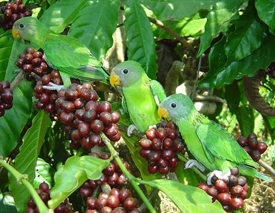

The peaceful and pristine environs of the coffee mountain is a riot of green and bird lovers can be surprised to come dangerously close to birds like partridges, pea cocks, jungle fowl, quails and a host of other bird species. One can see the spectacular array of birds in their natural surroundings, even though they are in the wild. From an outsider’s perspective, a visit to shade grown coffee plantations is like a journey into a forest ecosystem.

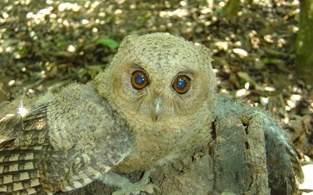

Indian coffee forests stretching forth thousands of miles are perfect bird sanctuaries because they provide a safe haven for all forms of life. These coffee forests radiate a wide variety of birds in different shapes, sizes, colors, habits and instincts. Each species is present in select numbers and occupy almost every conceivable niche.

The coffee mountain has many geographical and environmental zones; comprising of coffee forests, valleys, grasslands, meadows, scrub, marshes, ponds, lakes and rivers. Birds echo a rhythm and the arrival of the seasons. Bird migration, nesting, Courtship, shedding and renewing plumage are excellent indicators of the arrival of seasons.

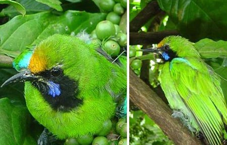

### INDIGENOUS KNOWLEDGE and BIRD PROTECTION

Birds receive immeasurable assistance from the proactive caring of Indian coffee farmers. Due to the reverence, adulation and protection that coffee farmers have bestowed on the coffee forests, it has resulted in the survival of hundreds of native & endangered bird and animal species. The Indian tradition teaches us that all forms of life, human, animals, birds, and plants are so closely linked, that disturbance in one gives rise to imbalance in the others.

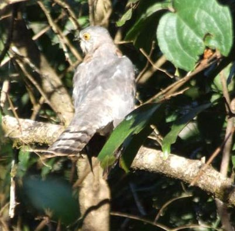

In Indian mythology, birds assumed a sense of sacredness and this tradition was carried forward by the coffee farmers by providing nesting grounds as well as providing a safe haven for birds. In coffee country, some bird species are often linked to the Sun, a sign of life and purity. The bond between coffee farmers and birds is more complex than anticipated. Coffee farmers have a scared belief that if bird and animal life vanishes, then the pest population will reach its zenith resulting in significant losses of coffee and allied crops.

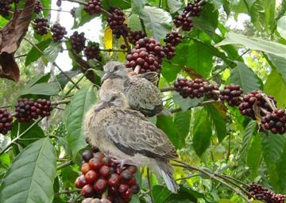

### BIRD BIO DIVERSITY INSIDE COFFEE FORESTS

The world contains around 10,000 species of birds. India is blessed with 1300 of them. About 450 species have been observed in the State of Karnataka.

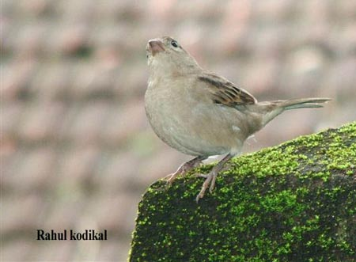

Birds are divided into the following basic groups, depending on whether they remain in their breeding grounds throughout the year or leave for the winter.

### RESIDENT BIRDS

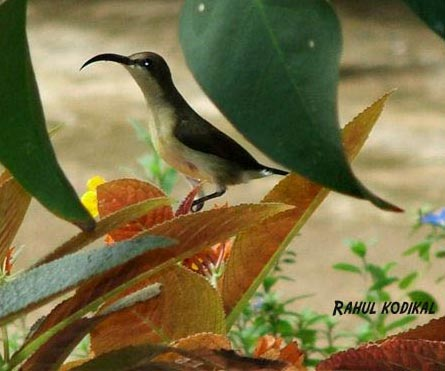

Bird species that stay close to the general area of their nesting grounds.

### MIGRATORY BIRDS

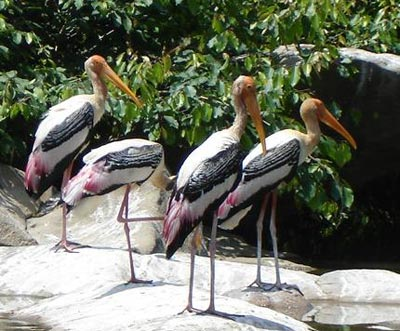

Bird species that leave their nesting grounds each year in the autumn or late summer fly to warmer quarters for the winter and return again in spring. The primary reason for bird migration is the short supply of food.

### TRANSIENT MIGRANTS OR DISPERSIVE BIRDS

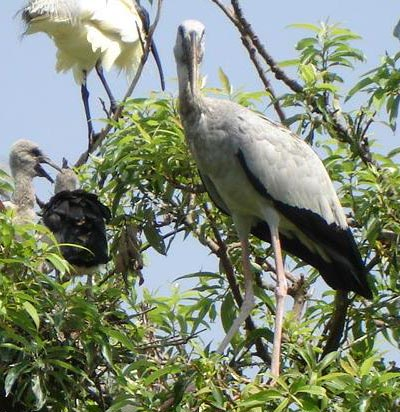

These bird species travel hundreds of kilometers, in all directions from their nesting grounds after the breeding season, depending on the weather and food supply.

### EVOLUTION AS A KEY PLAYER

Millions of years of gradual evolution have helped the bird community to adapt, change and survive the sudden and drastic man made changes on planet Earth. However, there is one spectacular, unspoilt haven and undisturbed habitat in the form of [COFFEE FORESTS](http://ecofriendlycoffee.org/coffee-forest-symbiosis/) left for the proliferation and spread of birds. Shade grown coffee plantations are ideal bird sanctuaries, where birds of different species occupy every available niche inside the coffee forests.

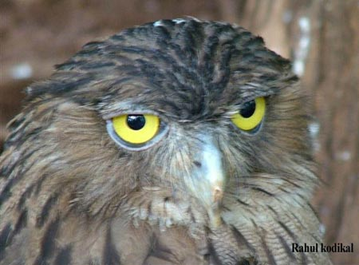

One needs to understand that the coffee mountains are a range of mountains with elevations ranging from 500 meters from main sea level (MSL) to 1500 meters MSL. These dramatic changes in altitude not only regulate the supply of food, but also brings about a temperature differential, thereby avoiding the overcrowding of birds. Also bird species suited for only that particular altitude can occupy a particular ecological niche.

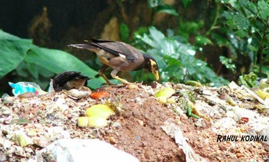

Birds inside the coffee forests have certainly developed a way of life, unique to the topographies of the coffee mountain. The same species of birds exhibit one particular color at a particular altitude and a different color at a higher altitude to blend, camouflage and regulate their metabolism. According to Dr.Salim Ali (The Book Of Indian Birds, 1979), the senses of sight and hearing are most highly developed in birds; that of taste is comparatively poor, while smell is practically absent. In rapid accommodation of the eye, the bird surpasses all other creatures. The focus can be altered from a distant object to a near one almost instantaneously; as an American Naturalist puts it *in a fraction of time the eye can change itself from a telescope to a microscope*.

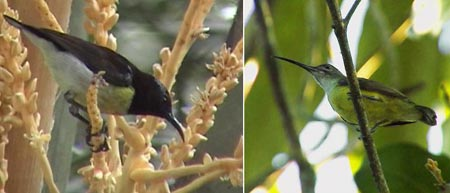

### FEEDING HABITS

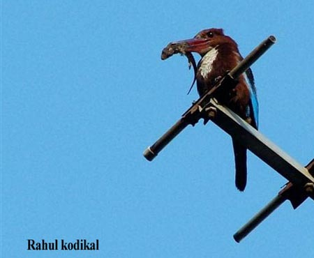

Evolution has also programmed the avian brain to respond to sudden and crucial changes in the weather patterns. By way of shaping different sizes of beaks which are useful in capturing various insects, animals and fish. Some birds are gifted with unusually long legs and necks, and others have beaks with a variety of shapes-spoon like, spear like, dagger like, etc.

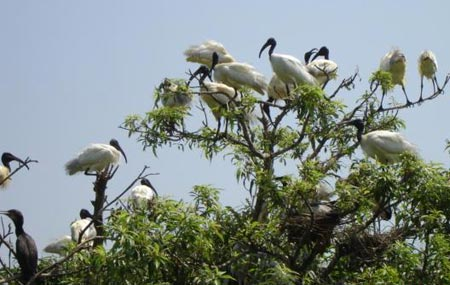

Various bird species have evolved specialized techniques and beaks to cater to their enormous feeding demands. Many species share the same feeding grounds without getting in each others ways. At times the source of food may be a particular tree where in some species favor the top of the tree, others closer to the bottom and some others search for food inside the barks. Some birds simply stamp the ground with their feet to scare up food.

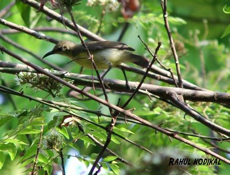

### BIRD NAVIGATION

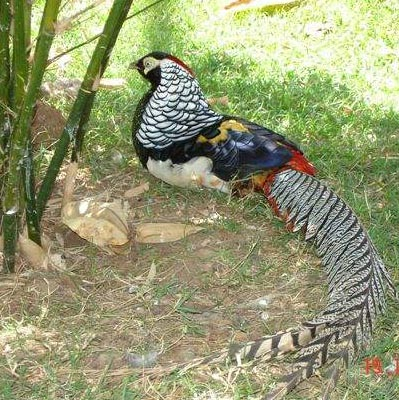

During the course of evolution, birds have adapted to extremes of climate and have survived in extreme temperatures. Each bird species has developed a migratory compass to nest and breed in a particular place. The bird’s innate sensory compass acts as a passport in determining its flight path in reaching new destinations. Some theories point out that birds navigate in the right direction because of the profound influence of the earth’s magnetic field. Another theory doing the rounds is the one that believes birds navigate by means of light, or rather by the position of the sun, as the position of the moon and stars.

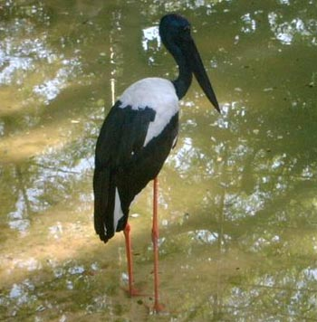

### BREEDING and NESTING

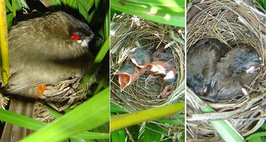

Each species of birds has a characteristic manner of courtship. In some it is fairly inconspicuous, in others noticeable and in a few species quite silent. During the breeding season each pair of birds owns and defends their respective nests from intruders. Nesting territories vary in size, even among birds of the same species, depending on the abundance of food and the extent of competition for territories.

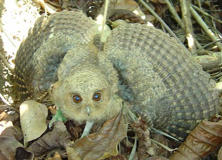

Nests are of different types:

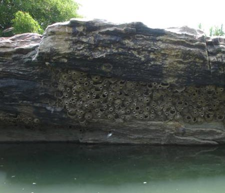

Simple holes in low lying embankments; nests made of twigs, nests inside tree holes, nests built entirely of mud, nests in excavated tunnels in rock surfaces, pendant nests and leaf nests.

### CONSERVATION EFFORTS

### LOSS OF FOREST HABITAT

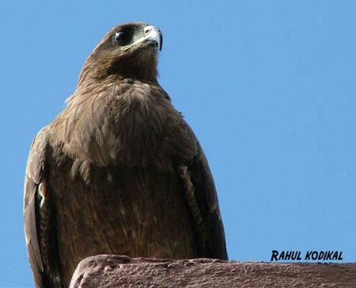

The main threat to birds inside the coffee forests is not due to poaching or hunting, but due to the large scale destruction of coffee forests. The recent past has resulted in too much degradation of natural resources.

### LOSS OF WETLAND SYSTEMS

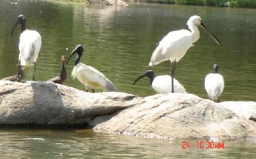

Wet lands which were an essential component of the coffee forest ecology are rapidly disappearing due to conversion of wet lands into coffee plantations. Most importantly, paddy fields were essential in the migratory cycle of many birds. The remaining Rice fields have been converted for growing cash rich crops like ginger and turmeric which give far higher returns than rice.

### LOSS OF MARSHY and AQUATIC HABITATS

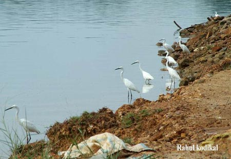

Most of these habitats are drained and planted with perennial crops like areca nut.

PESTICIDE and RESIDUAL TOXICITY

The problem with these cash rich crops like ginger, turmeric, hybrid rice is that they are heavily laced with pesticides and insecticides and only respond to heavy dozes of chemicals there by killing insects and crustaceans . Insects and other aquatic animals are primary sources of food for migratory and resident birds. These destructive tendencies not only results in a poor supply of food, but also results in bio magnification of poisons in the food chain of birds.

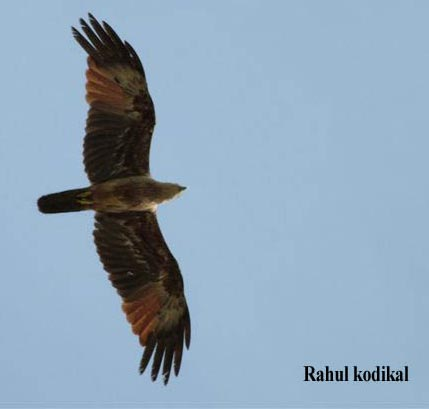

Many of the carcinogenic chemicals (ENDOSULFAN) banned in the west are freely distributed to the coffee farmers. Application of these chemicals results in the pollution of streams, lakes and ponds. Finally, it gets absorbed into the bird food chain, there by killing these birds.

### PREDATORS

Domestic animals like cats and dogs can severely affect the native population of birds by disturbing their nests and capturing their young ones.

### COMPETITION FROM MIGRATORY BIRD SPECIES

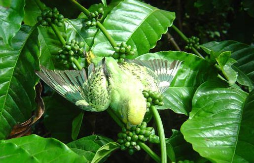

Due to competition for space, especially during the scarce availability of food, migratory birds put undue pressure on the native species resulting in the decline of the native bird population.

### BIRD SPECIES AS PETS

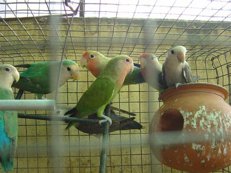

Many exotic bird species and native bird species are captured not for meat purposes but as show pieces inside affluent house holds. As a result many exotic bird species have declined during the last two decades.

### BIRD FLU

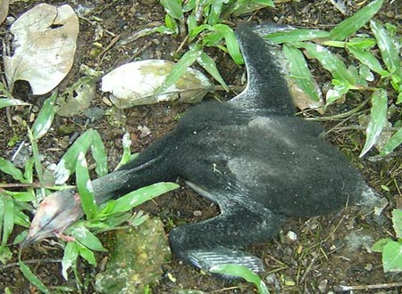

Avian diseases have no borders. Microorganisms, like bacteria, fungus, viruses can wipe out entire bird populations irrespective of the size of Country or the technology they hold. After all, the air has no boundaries & birds can freely fly from one continent to the other.

### EXTERNAL THREATS

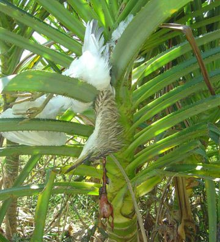

External threats like sudden rise or drop in temperatures, volcanic eruptions, oil spills, global warming can wipe out globally available species. Prof. R.E.Amritkar & Prof. G. Rangarajan (2006 ) have proved that when an external threat acts on the species, the species populations “synchronize ;” that is in different locations they move up and down in step with one another first before becoming extinct. The researchers further prove that if species population in one location is driven to extinction, then so will populations in other locations. This is why a species cannot survive in an isolated location and shows why it becomes extinct globally.

### WHY IS BIRD BIODIVERSITY IMPORTANT?

### ADVANTAGES OF BIRDS INSIDE COFFEE FORESTS

From the scientific view point the presence and flight patterns of birds

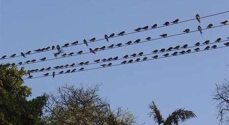

-   Have helped the coffee farmers in deciphering the onset of monsoon.
-   Keeping in check the pest population.
-   Keeping in check the incidence of diseases.
-   Predicting drought patterns ( GLOBAL WARMING )
-   Act as bioindicators in signaling pollution and toxicity levels both in the atmosphere as well as in the ground.
-   Dispersal of seeds.
-   Favoring the build up of predators.

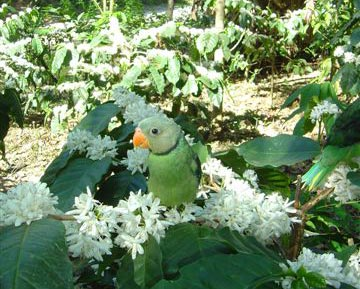

-   Balancing the energy flows inside the eco friendly coffee cube.
-   Signaling the water table levels.
-   Destroyer of vermin
-   As scavengers
-   Promoting eco tourism

### WASTE RECYCLING:

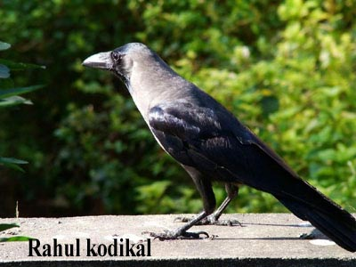

Scavengers fill an important ecological role in the disposal of biological wastes in an eco friendly manner. By clearing the environment of any putrefying matter, scavengers help in disposing of potential health hazards. Scavengers have evolved powerful digestive enzymes and stomach acids which can effectively act on any decaying food.

### BIRD BIODIVERSITY and SUSTAINABLE DEVELOPMENT

Our research points out that there is enough reason to believe that birds CONTINUE TO ENHANCE THE ECO FRIENDLINESS OF COFFEE FARMS. The relationship between the coffee farmer and the birds has been mutually satisfying. Bird biodiversity inside the coffee mountain provides the raw material that enables the coffee farmers to sense the subtle changes taking place inside their ecological zone.

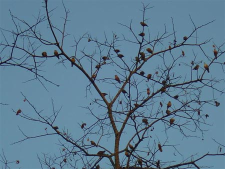

The presence of a particular species of birds at a particular time of the year, together with their flying pattern clearly indicates the subtle changes in the weather patterns. Similarly, the absence of a particular species of migratory birds helps the coffee farmer predict rise or fall in day time temperatures essential for irrigation. Birds touch us in unexpected ways. The nesting of a particular bird species at a given location tells us if that area has a high water table or not.

A very few select coffee farmers, even to day ,harvest only the berries from trees from the top canopy and leave the bottom branches full of fruits for birds to eat. This way they ensure that the bird droppings would directly fall on to the floor of the forest and enhance the organic matter content of the soils.

An important distinction that needs to be drawn is that throughout India (7th largest Country in the world in terms of area and size) there are only three States growing more than 90% of the shade grown coffee and even in these states it is only a handful of districts that that are capable of growing coffee, simply because coffee and forests are indispensable OBLIGATE SYMBIONTS in fulfilling each others needs.

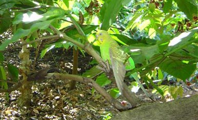

Coffee farmers, birds and animals have perfectly understood each others needs and have also complimented each other. Coffee farmers have great respect for the intellect of birds. Scientists who often scoffed at the idea of birds having thinking brains have now understood that even though the size of the birds brain are small, they can add, recognize shapes, colors and make precision moves. Their communication skills are highly advanced and organized.

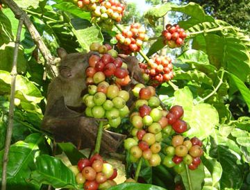

### BIRD LIFE INTERNATIONAL

[Bird Life International](http://www.birdlife.org) is the leading authority on the conservation of the world’s birds. Through its Global Species Programme, Birdlife has collated, assessed and published information on the world’s threatened birds for over 25 years.

Birdlife collates information from a global network of experts and collaborating organizations and from publications and unpublished sources to assess each species’ extinction risk, using the categories and criteria of the IUCN Red List.

The following data has been taken from [BIRD LIFE INTERNATIONAL](http://www.birdlife.org/worldwide/news/threat-amazon%E2%80%99s-birds-greater-ever-red-list-update-reveals)

Birds on the IUCN Red List:

The IUCN Red List of threatened species is widely considered to be the most objective and authoritative system for classifying species in terms of the risk of extinction. Information on a taxon’s population size, population trends and range size are applied to standard quantitative criteria to determine its IUCN Red List Category (Extinct, Extinct in the Wild, Critically Endangered, Endangered, Vulnerable, Near Threatened or Least Concern). Species for which there is insufficient information to apply the criteria are assessed as Data Deficient. Additional information on ecology and habitat preferences, threats and conservation action are also collated and assessed as part of Red List process. Over 38,000 species have been assessed for the Red List, of which more than 15,000 are considered threatened with extinction (Critically Endangered, Endangered or Vulnerable).

Birdlife International is the official Red List Authority for birds for the IUCN Red List, supplying the categories and associated detailed documentation for all the world’s birds to the IUCN Red List each year.

### How many birds are threatened with extinction?

In the latest assessment in 2006, 1,210 species are considered threatened with extinction (i.e. in the categories of Critically Endangered, Endangered, Vulnerable and Extinct in the Wild). This represents 12.3% of the total of 9,799 extant bird species in the world. An additional 795 species are considered Near Threatened, giving a total of 2,005 species that are urgent priorities for conservation action.

Of the threatened species, 181 species are considered critically endangered and are therefore at extremely high risk of extinction in the wild.

### How many birds have gone extinct?

A total of 135 species are documented as having gone extinct since 1500. A further four species are now extinct in the wild and survive only in captive populations. Although extinctions have been better documented in birds than any other group of organisms, these totals are likely to be underestimates because extinction is difficult to document. A number of other species currently categorized as Critically Endangered have probably gone extinct too, but cannot be designated as such until we are certain. Fifteen such species are categorized as Critically Endangered (Possibly Extinct). Thus, a total of 154 species may have been lost in the last 500 years.

Extinctions are continuing: 17 species were lost in the last quarter of the 20th century, and two species have been lost since 2000. The last known individual of Spix’s Macaw Cyanopsitta spixii (classified as Critical: Possibly Extinct in the Wild) disappeared in Brazil towards the end of 2000, and the last two known individuals of Hawaiian Crow Corvus hawaiiensis (classified as Extinct in the Wild) disappeared in June 2002. Po’ouli Melamposops phaeosoma, also from the Hawaiian Islands, looks set to become the next addition to this list: the last two known individuals have not been seen for many months.

### Are things getting better or worse?

The Red List Index for the world’s birds shows that there has been a steady and continuing deterioration in the threat status (relative projected extinction risk) of the world’s birds since 1988, when the first complete global assessment was carried out. This means that, overall, bird species are continuing to slip closer to extinction, with any conservation successes being outweighed by the number of species deteriorating in status.

Declines have been particularly severe for birds in the Indo-Malayan realm (owing to intensified deforestation in the lowlands of Sumatra and Borneo) and for the world’s albatrosses and petrels (owing to significant mortality as bycatch in commercial longline fisheries).

For more information on these results, see Bird Life’s work on Monitoring and Indicators.

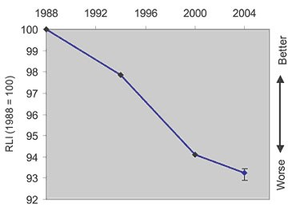

RLI for the world’s birds

### Where are threatened birds found?

Globally Threatened Birds occur worldwide: nearly all countries (220 or 92%) support one or more, and some countries are exceptionally important. Brazil and Indonesia support 119 globally Threatened Birds each. Small islands hold disproportionately high numbers of Globally Threatened Birds, supporting over half of threatened species. Threatened seabirds are found throughout the world’s oceans, with particular concentrations in the Tasman Sea and the south-western Pacific around New Zealand. Forest is by far the most important habitat for Globally Threatened Birds, supporting 76% of species. Shrub lands, grasslands and inland wetlands are also important, supporting 225, 14% and 11% of Globally Threatened Birds, while the marine environment supports a higher than expected proportion. Among forest types, tropical and subtropical lowland and montane moist forest are the most important, supporting 40% and 30% of Globally Threatened Birds respectively.

### [What’s new (2006?)](http://web.archive.org/web/20131012065054/http://www.birdlife.org/action/science/species/global_species_programme/whats_new.html)

During 2005-2006, the status of over 80 species was actively reviewed and discussed in the globally Threatened Bird discussion forums on Bird Life’s website, resulting in the IUCN Red List category being revised for a number of these. In addition, a number of taxonomic changes were incorporated. In total, 150 species have changed category. The table below gives the totals in each IUCN Red List category since 2000. The relatively small net changes to the totals mask the fact that 226 species moved between categories in 2000-2004, 99 species in 2004-2005 and 150 in 2005-2006 (see below). These include category revisions owing to improved knowledge and taxonomic changes, as well as genuine changes in status. Therefore, it is difficult to interpret the changes in absolute totals. Instead, it is better to examine trends in the Red List Index, which shows graphically the net changes to the overall projected extinction risk of the world’s birds from 1988 to 2004, and will be updated again with the next complete assessment of all the world’s bird species in 2008.

### TABLE: LIST OF THREATENED and EXTINCT BIRD SPECIES.

Category

2000

2004

2005

2006

Extinct

128

129

131

135

Extinct in the Wild

3

4

4

4

Critically Endangered  
(incl. Possibly Extinct)

182(n/a)

179(18)

179(17)

181(15)

Endangered

321

345

350

351

Vulnerable

680

689

679

674

Total threatened

1,186

1,217

1,212

1,210

Near Threatened  
(incl. Conservation Dependent in 2000)

730

773

788

795

Least Concern

7,755

7,720

7,697

7,720

Data Deficient

79

78

78

74

Total

9,878

9,917

9,906

9,934

### CONCLUSION

A coffee forest with their green environs provides the right habitat for the proliferation of different species of birds. The coffee forest ecology houses a unique ecosystem with a range of flora and fauna based on sustainability as well as mutual interdependence. An impressive array of bird life, native, migrant and exotic makes coffee forests one of the best places for protecting bird life. For over 200 years coffee farmers and birds have lived harmoniously.

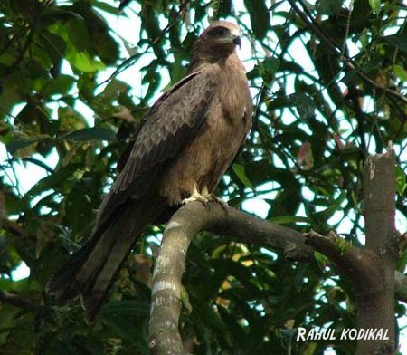

The danger today is that the fragile coffee mountains which are home to hundreds of varied and endangered bird species are themselves under threat due to massive deforestation and logging. Therefore our most immediate practical concern must be to stop the logging.

Due to the world wide slump in coffee prices, the coffee forests are on the edge of an environmental breakdown. Coffee forests are increasingly being cut as a means of livelihood. Due to the depleted forest cover, many bird species which nest on trees are deprived of their habitat. Others are unable to adapt themselves to the new conditions and are migrating. If this destruction goes unchecked, it will result in the extinction of a few species of endangered flora and fauna, resulting in the break down of food chains and food webs.

Also, coffee forests are lost to increasing urbanization and environmental pollution.

Now is the time in giving Indian coffee its rightful place as ECOFRIENDLY and BIRD FRIENDLY. The General Agreement on Trade & Tariffs ( GATT ) should keep an open mind & discuss the idea of categorizing Indian coffees into a separate GREEN BOX such that all Indian coffee farmers will get a fair price for their coffee for supporting the concept of ECOLOGICAL SUSTAINABILITY ( both flora and fauna ). The conservation and strategy should be funded by the International Coffee Organization (I.C.O.)

There are new problems that birds need to solve due to man continued dominance. Dr.Salim Ali reports that until a few years ago egret-farming for the sake of the valuable plumes was a profitable cottage Industry. The dainty decomposed breeding plumes of the white egrets- “AIGRETTES” WERE LARGELY EXPORTED TO Europe for ladies head dresses, tippets, muffs, and for other ornamental purposes. Due to the Wild Birds and Animals Protection Act, the birds are now protected. Another beautiful bird that is targeted by traders is the PEACOCK. The feathers are sold in the open market for decorating households.

Birds provide excellent opportunities to study aspects of behavior and evolution. Birds have the ability to adapt to so many different types of habitat. However, one question that man has not been able to answer is whether birds can survive the changes humans are making to the world.

### JUNGLE FOWL

These very sharp and agile birds are the ancestors of the domestic fowl. The cock has a longer tail and is more colorful than the female. Seen singly or in pairs. Basically it is a ground bird and a low level flyer. They scratch the grounds for food and have strong feet with knife blade nails on their inner toes which they slash each other in combat.

DIET: Grains, vegetable shoots, insects and small reptiles.

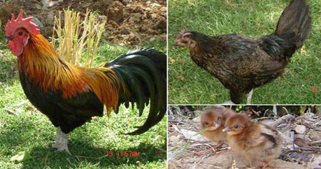

### HOOPOE

These birds are very colorful with a pair of smart wings with black and white zebra markings. The Hoopoe eats insects that live in the ground and that is why it keeps walking quickly digging the earth with its long curved beak. The Hoopoe has a pretty crest on its head, which is usually kept neatly folded back. They male digs out a nest in tree cavities. The female lays 6-7 eggs which she alone incubates. Both parents feed their offspring in the following manner. One nestling awaits the adult’s arrival at the entrance hole and as soon as it receives its ration, the one behind pushes to the front, till all are fed.

DIET: Insects, larvae, cattle droppings, locusts, spiders, and fly.

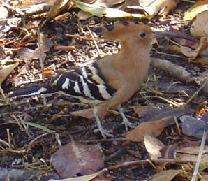

### OWL

Owls are the only birds that drop the upper lid when blinking is very territorial in nature. Found singly or in pairs in open wooded forests. They hunt in the evening and rest in a dark tree hollow during the day. The large eyes of the owls are primarily binocular. Designed for hunting at dusk and in the dark. Owls are gifted with quick reflexes due to the flexible vertebrae. They can turn their heads more than half circle in either direction. Their radar like ears helps them detect the sound patterns of their prey from a great distance. The female lays a clutch of 4 to 6 eggs. The male tends to choose the site and build the foundation. At times the birds will use the nest from the previous years, but only if the brood was successfully hatched here.

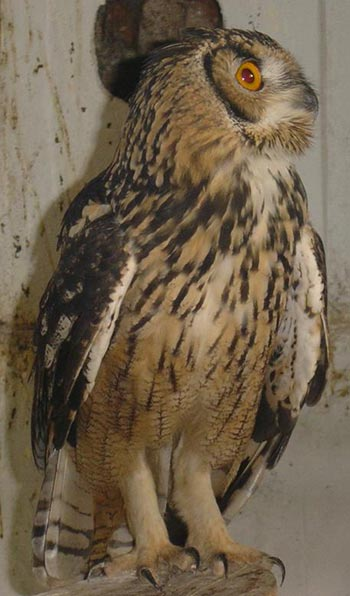

### EAGLES/ HAWKS

These huge birds of prey are superbly designed for their predatory task. Their beaks are hook shaped for tearing flesh. They are seen in pairs and generally swoop down on their prey. The female lays a clutch of 2 eggs and is incubated by the female for 45 days. The male takes the responsibility of hunting food for the young ones.

FOOD: Amphibians, reptiles, rabbits, chicken and large insects.

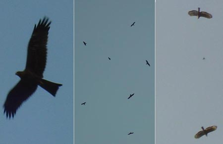

### PHEASANT

These birds are gifted with brilliantly colored feathers with a number of plumage variations. The female lays 8-10 eggs which she incubates all by herself. The chickens begin to fly at the age of 2 weeks. The Pheasant is generally found in light woods, field groves, thickets beside water and grass lands. Pheasants are rarely seen inside coffee plantations. The hen lays 8 to 15 eggs which she incubates alone, generally for a period of 24 to 25 days.

DIET: Seeds, berries, tender shoots, fruits, insects, worms and mollusks.

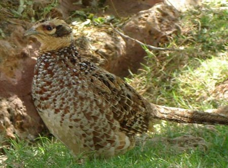

### CRANE

A few species of cranes are migratory in nature. These birds leave their breeding grounds in September to October, returning again between the middle of March and April. Their habitats are mainly marshy areas with lakes, large ponds and swampy areas. The female lays 2-3 eggs which she and her partner take turns incubating.

DIET: Seeds, grains, green plant parts, insects, mollusks and vertebrates.

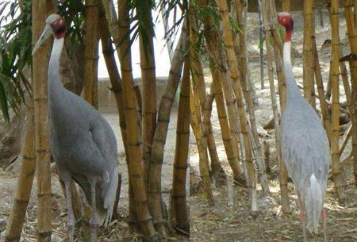

### CATTLE EGRET

These birds sometimes ride on the back of buffaloes and cows and eat the insects that fly up. Larger egrets with their enormous wing span need to flap their wings only about twice a second, in contrast to the 80 wing beats per second of the tiniest humming birds. Commonly observed near ponds and rivers and marshes. They breed in colonies, often with cormorants and herons. The male and female have similar plumage. The nest is placed in bushes or in tree tops. Over 25 pairs may crowd on a single tree. The male and female show a great degree of cooperation in building the nest together. The female lays 2-3 eggs which she and her partner take turns incubating. The chicks are fed by both parents, who fly in search of food as far as 20 km from the nest site.

DIET: Small fish, amphibians, worms, crustaceans & insects.

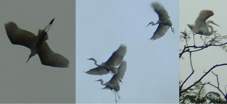

### CORMORANT

These birds are web footed and are expert fishers and can dive to great depths. They catch fish and swim to the surface before swallowing it. The female lays three to five eggs and both partners take time to incubate the eggs. The chickens do not open their eyes until three days after hatching. Males and female have similar plumage.

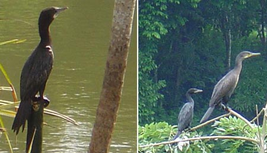

### PAINTED STORK

These are large migratory birds with heavy yellow bills. These white birds have splashes of pink color on their wings and look as if one had painted them.

DIET: Rats, bats, mice, sparrows, amphibians and insects.

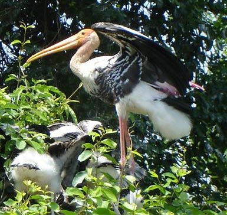

### GREATER RACKET TAILED DRONGO

Have metallic black feathers with a backward curving crest on the forehead. The bird can be easily identified because of the two long wires like feathers with a tuft at one end.

DIET: Moths & large winged insects.

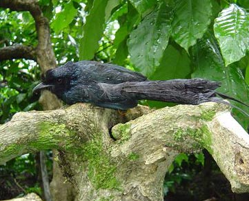

### WHISTLING TEELS

These migratory ducks from Europe arrive in flocks of two to three dozen, in early November. They inhabit inland stretches of water bordered with thick vegetation. They live in peaceful coexistence with the local storks. They are known to hunt cooperatively.

DIET: Vegetable matter, animal food, seeds, plant parts, small invertebrates.

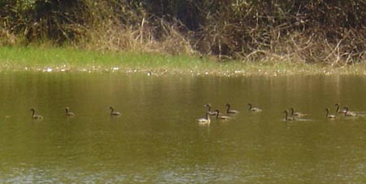

### BEE EATER

Pairs or small flocks are commonly observed on exposed branches or electric lines. Is a common winter visitor. Birds are very gregarious, agile and catch insects in flight and return to the same perch. Even though the bee eater is light and graceful in flight, it is awkward and clumsy on land. Their head & upper back is bright chest nut colored. Though, they are good at flying, the bee eater’s nest right under the ground. They build a home by digging out a tunnel on the side of an earth cutting. The female lays 5 to 6 eggs. The male & female make small egg chambers at the end of the tunnel where the eggs can stay safely while the parents are out hunting. Both the male and female take turns in incubating the eggs and both feed the young.

DIET: Hymenopterous insects such as wasps, bumblebees and bees. Flying beetles, dragonfly and cicadas.

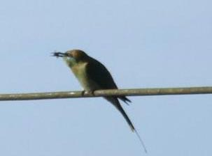

### PURPLE SUN BIRD

Small bird with typical long curved beak. Males have iridescent greenish crown, yellow breast fading into white towards belly. In females it is less conspicuous.

DIET: Nectar, insects and spiders.

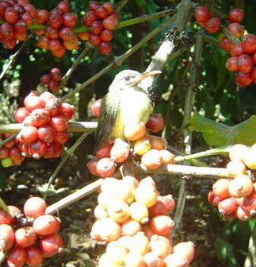

### BROWN HEADED BARBET: KUTTOO, KUTROO

The bird is the size of a myna. A heavily billed arboreal grass green bird with brownish neck and breast streaked with white. Found singly on trees.

DIET: Fruits, berries and insects.

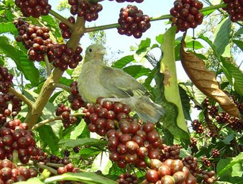

### HORNBILL

A heavily billed arboreal bird with black neck, back and wings, with white tips to the flight feathers and white under parts. Long tail and outer feathers all white. Always seen in pairs.

DIET: Mainly frugivorous, but also eats lizards, mice and small birds.

### PEACOCK

Is one of the most common ornamental birds found inside the coffee forests? The Indian blue pea cock is the male member of one of the three peafowl species of the pheasant family. The males are resplendent while the peahens are dull brown in color. The female usually lays up to 5 eggs. The feathered tail is almost 1.5 meters long. It is not capable of flying great distances or heights. The bird has an iridescent plumage making it visible against any back ground. The shimmering play of colors in a peacock’s feather is caused by refraction and refraction of light from layers of nano structures in the barbules or fiber like elements in the feathers that help to keep the true color, brown from showing through. The pea cock is the National bird of India.

A very important point that coffee farmers should note is that if the pea-cock population increases, it is a sure sign to indicate that the forest is loosing its vigor.

DIET: It’s omnivorous and the diet mainly consists of fresh seeds, insects and snakes.

### PARAKEET

Different species of parrots are commonly observed inside the coffee mountain. The most common species are the one’s where the males have a bluish red head with maroon red shoulder-patch and the female has a grayish head with yellow collar round the neck. Parrots nest in holes in tree trunks.

DIET: Food, seeds and fruits.

### REFERENCES

[Eco-Friendly Indian Coffee: A Profile](http://ecofriendlycoffee.org/eco-friendly-indian-coffee-a-profile/)

[Invisible Communications in Coffee Plantations](http://ecofriendlycoffee.org/invisible-communications-in-coffee-plantations/)

[Coffee Plantations A Multidisciplinary Approach](http://ecofriendlycoffee.org/coffee-plantations-a-multidisciplinary-approach/)

[Global Warming in Coffee Plantations](http://ecofriendlycoffee.org/global-warming-in-coffee-plantations/)

[Biodiversity In Relation To Coffee Plantations](http://ecofriendlycoffee.org/biodiversity-in-relation-to-coffee-plantations/)

[Coffee Forest Symbiosis](http://ecofriendlycoffee.org/coffee-forest-symbiosis/)

[Significance of Microbial Interactions Within Coffee Plantations](http://ecofriendlycoffee.org/significance-of-microbial-interactions-within-coffee-plantations/)

[Role of Antibiotics in Coffee Plantation Ecology](http://ecofriendlycoffee.org/role-of-antibiotics-in-coffee-plantation-ecology/)

[The Ecodynamic Coffee Cube 3](http://ecofriendlycoffee.org/the-ecodynamic-coffee-cube-3/)

[www.kolkatabirds.com/south/bandipur1.htm](https://web.archive.org/web/20170618220023/http://www.kolkatabirds.com:80/south/bandipur1.htm)

[Federal Sustainable Development Strategy](http://www.agr.gc.ca/eng/about-us/planning-and-reporting/sustainable-development/?id=1175526032952)

[www.indiawildliferesorts.com/wildlife-sanctuaries/assan-bird-sanctuary.html](http://www.indiawildliferesorts.com/wildlife-sanctuaries/assan-bird-sanctuary.html)

[www.birds.cornell.edu/AllAboutBirds/conservation/planning/threats/document\_view](http://web.archive.org/web/20150412012854/http://www.birds.cornell.edu:80/AllAboutBirds/conservation/planning/threats/document_view)

www.bdi.org/PublicKnowledge.htm

www.arkive.org/species/GES/birds/

[Table 1: Numbers of threatened species by major groups of organisms (1996–2004)](http://web.archive.org/web/20080914173057/http://www.iucnredlist.org:80/info/tables/table1)

[www.birdlifeforums.org/Globally%20Threatened%20Bird%20Forums/?14@158.lGxdajqpc0a.0@](http://www.birdlifeforums.org/Globally%20Threatened%20Bird%20Forums/?14@158.lGxdajqpc0a.0@)

[Summary Statistics for Globally Threatened Species](http://web.archive.org/web/20080914173052/http://www.iucnredlist.org:80/info/stats)

[www.birdlife.org/action/science/species/global\_species\_programme/red\_list.html](http://www.birdlife.org/worldwide/news/threat-amazon%E2%80%99s-birds-greater-ever-red-list-update-reveals)

[WWF India – Forests Conservation](http://web.archive.org/web/20061206203612/http://wwfindia.org:80/about_wwf/what_we_do/forests_conservation/index.cfm)

[www.birdlife.org/action/science/species/global\_species\_programme/gtb\_forums.html](http://web.archive.org/web/20131014153201/http://www.birdlife.org/action/science/species/global_species_programme/gtb_forums.html)

[www.birdlife.org/action/science/species/global\_species\_programme/whats\_new.html](http://web.archive.org/web/20131012065054/http://www.birdlife.org/action/science/species/global_species_programme/whats_new.html)

Anonymous. 1992. The Illustrated Encyclopedia of Birds. Published by Treasure Press. London SW3 6RB.

Anonymous.2000. Important Bird Areas of Europe: Priority Sites for Conservation 2 Volume Set. Edited by MF Heath, MI Evans, DG Hoccom, AJ Payne and NB Peet. Edition-2. 1600 pages. Bird Life International

Anonymous. 2000. Raptor Watch: A Global Directory of Raptor Migration Sites

Edited by Jorje I Zalles and Keith L Bildstein Series: BIRDLIFE CONSERVATION SERIES 9, 419 pages, BirdLife International.

Salim Ali. 1949. Indian Hill Birds. Oxford University Press. India.

Salim Ali & D.S. Ripley. 1996. A pictorial guide to the birds of the Indian Subcontinent. Bombay Natural History Society. Centenary Publication. Oxford University Press. India.

Salim Ali. 1996. The Book of Indian Birds. Salim Ali centenary edition. Bombay Natural History Society. Oxford University Press. India.

Bikram Grewal., Sunjoy Monga & Gillian Wright. 1973. Birds of India, Bangladesh, Nepal, Pakistan & Sri Lanka. Published by the guidebook Company Limited, Hong Kong in conjunction with Gulmohur Press Pvt. Limited. New Delhi.

Chapman. J.L. & M.J. Reiss.1997. Ecology. Principles and applications. Cambridge University Press.

Anonymous. 1983. The wonder of Birds. National Geographic Society, Washington. D.C.

Peter Farb & the editors of Life. 1963. Ecology. Life Nature Library.

N.J. Majumdar. 1999. Some Indian Birds. Children’s Book Trust, New Delhi.

Karnataka Forest Department. 2005. Field guide to 100 birds of Coorg, with particular reference to Bramagiri, Pushpagiri and Talacauvery Wildlife Sanctuaries.

### ACKNOWLEDGEMENT

The authors wish to acknowledge and specially thank **Mr. Allen J Pais**, Coffee Planter, “PROVIDENCE ESTATE”, Siddapur, Coorg, Kodagu for his incredible advice and true friendship. Allen has devoted his precious time in photographing birds in and around coffee forests. His deep faith and encouragement has kept the fire burning within us. (allenjpais@yahoo.com)

Our warm and respectful thanks to **Rev. Sr. Dr. Prem D’souza** (Vice – Principal & Head of the Department of Zoology ), St. Agnes College, Bendur, Mangalore-575003, South Kanara for providing us complete access to the St. Agnes college Library. She was also generous enough in facilitating our observation of specimens in the Department of Zoology.

**Rahul Kodikal** ( Kamala Nivas, Nagabana Road, Marnami Katte, Mangalore 575 001 ) is a friend of nature and spends a considerable time in observing wild life. He was generous in giving us bird slides which have been duly acknowledged. ( RahulKodikal@yahoo.com )