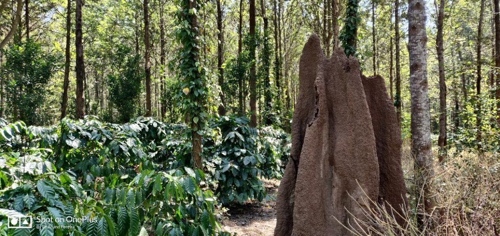

The Coffee ecosystem is characterized with a number of species of ants and their precise role in maintaining a sound ecological balance in helping coffee Agroforestry is poorly understood The urgent need to write this article is based on our understanding that each species of ants plays an important ecological role in the coffee ecosystem and those benefits are poorly understood due to lack of research data.

In recent years, shade-grown eco-friendly Indian coffee Plantations are increasingly shifting towards sun-loving coffee. Due to unremunerative prices, below the cost of production, and also due to unsustainable yields, planters have no option but to open up the shade, especially in Robusta coffee plantations. This practice has pushed up yields per hectare, though not significantly. Short term gains are clearly visible but in the long term, the coffee ecosystem has had to deal with increased pest and disease incidence. In such a scenario, ecosystem restoration plays an increasingly important role as a consequence to widespread land degradation.

There is abundant scientific literature available worldwide on how ant communities respond predictably to environmental stress and disturbance. Ant communities have been extensively used to assess a range of restored habitat types. Ants are important components of terrestrial food webs and play a major role in ecosystem processes. Research indicates that due to their sensitive and rapid response to environmental changes, they are a suitable indicator group for monitoring both biotic and abiotic stresses. Ant community composition can thus inform whether the trajectory of restoration is converging on mature ecosystems or following alternative pathways.

In India, 126 Genera in 10 sub-families with 833 species/subspecies have been reported. There’s no place inside coffee forests where ants do not exist. Literally they are all over the place. Ants constantly modify their environment. As such they facilitate the alteration of the physical and chemical environment through their effects on plants, microorganisms, soil fauna, and rhizosphere effect. In fact, at different time intervals, ants exhibit increasing species richness. Certain functional groups also behave in predictable ways in response to disturbance and changes in the environment.

Scientific literature points out to many interesting facts associated with ants. Ants are an ecologically dominant faunal group and are widely advocated as ecological indicators. Ant species richness and functional group metrics have repeatedly been advocated as ecological indicators.

### **The key role played by ants**

Provide excellent drainage

Provide aeration to soils for the exchange of gases

Enhancing Water infiltration

Seed dispersal

Creation of microclimate for microbial proliferation

Mixing soil with surrounding organic matter

Mining nutrients from the deeper layers and bringing it to the top layer

Availability of essential nutrients at the root zone

In certain instances aid in pollination

Play a symbiotic/mutualistic/antagonistic role depending on the biotic partner.

Ants are often recognized as both keystone species and ecosystem engineers because they play an active role in influencing soil properties, nutrient transport and energy flows in food chains and food webs.

Ants have many different effects on their local environment. Because of their population strength, they can transport significant amounts of food from one place to another, thereby either depleting or adding up the nutrients to the soil. In doing so, they can indirectly impact the local populations of the surrounding flora and fauna. This in turn has consequences for the food chains and food webs. They also act as powerful predators because of the advantage of their strength in numbers. They are also territorial and exert a strong influence on their surrounding area.

### **Seed Dispersal**

Ants play a key role in seed dispersal for around 11, 000 flowering plant species worldwide. Ants make use of a nutrient-rich appendage attached to the seed, known as an elaiosome, which they feed to their larvae.

### **Shade Opening**

The coffee package of practices mentions that shade opening , especially in Robusta coffee blocks should be carried out during the summer season, just after the crop is harvested or at least once in two years in case of Arabica plantations. As such during the summer months the coffee forest floor is covered with freshly cut tree branches and green leaves. At this stage, it is the ant fauna that colonize woody debris for nesting. The ants break down the cellulolytic components into simpler compounds easily assimilated by microorganisms. This helps in wood and leaf decomposition process, nutrient recycling and in microbial succession.

### Coffee Harvesting

It is common to find ant nests both on the coffee bush as well as on the forest floor, especially during coffee picking. Since the workers harvesting the beans are often subjected to stings from ants, leading to blisters, the workers refuse to pick coffee. This causes the workers to avoid plants infested with the ants, reducing the harvest. The only solution is to apply insecticides to do away with the ant menace. This practice wipes out entire colonies of various ant species.

### Coffee Berry Borer

A few scientific publications report that Coffee farmers have a love-hate relationship with ants. On the positive side, the insects like to eat one of the biggest threats to the crop – the coffee berry borer, a tiny beetle that eats its way into coffee beans. The pest is the biggest insect threat to the coffee crop worldwide.

### Threats

In some parts of India, the adult ants are used in traditional medicine as a remedy for rheumatism, and an oil made from them is used for stomach infections and as an aphrodisiac.

### Conclusion

The need of the hour is to conduct research on the role of ants in coffee agroforestry. A better understanding of ants and how they are beneficial in pest control and nutrient recycling will enlighten the planters not to indiscriminately use insecticides and wipe out ant populations. The coffee Ecosystem has much to benefit from ant communities.

### References

Anand T Pereira and Geeta N Pereira. 2009. Shade Grown Ecofriendly Indian Coffee. Volume-1.

Bopanna, P.T. 2011.The Romance of Indian Coffee. Prism Books ltd.

[Leafcutting ants as ecosystem engineers:](https://www.researchgate.net/profile/Inara_Leal/publication/240173263_Leaf-cutting_ants_as_ecosystem_engineers_Topsoil_and_litter_perturbations_around_Atta_cephalotes_nests_reduce_nutrient_availability/links/5bad0840299bf13e6050c864/Leaf-cutting-ants-as-ecosystem-engineers-Topsoil-and-litter-perturbations-around-Atta-cephalotes-nests-reduce-nutrient-availability.pdf)

[About Ants](https://harvardforest.fas.harvard.edu/ants/about-ants)

[Biodiversity Revolution](https://biodiversityrevolution.wordpress.com/2012/09/12/the-importance-of-ants-in-plant-diversification/)

[The effect of ants on soil properties and processes](https://www.researchgate.net/publication/228499939_The_effect_of_ants_on_soil_properties_and_processes_Hymenoptera_Formicidae)

[Ants as ecological indicators](https://www.ncbi.nlm.nih.gov/pmc/articles/PMC5648658/)

[Ant colonization and coarse woody debris](https://www.researchgate.net/publication/257319710_Ant_colonization_and_coarse_woody_debris_decomposition_in_temperate_forests)

[Watching Wasmannia: Ants on a Mexican coffee farm](https://global.umich.edu/newsroom/watching-wasmannia-ants-on-a-mexican-coffee-farm/)

[The Secret to This Brazilian Coffee? Ants Harvest the Beans](https://www.atlasobscura.com/articles/do-ants-like-coffee)

[Welcome Coffee Growers!](https://www.hawaiicoffeeed.com/)

[The effect of ants](https://www.researchgate.net/publication/228499939_The_effect_of_ants_on_soil_properties_and_processes_Hymenoptera_Formicidae)