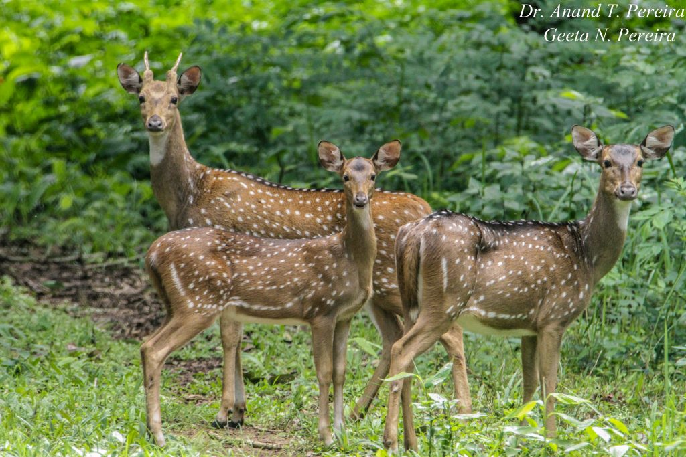
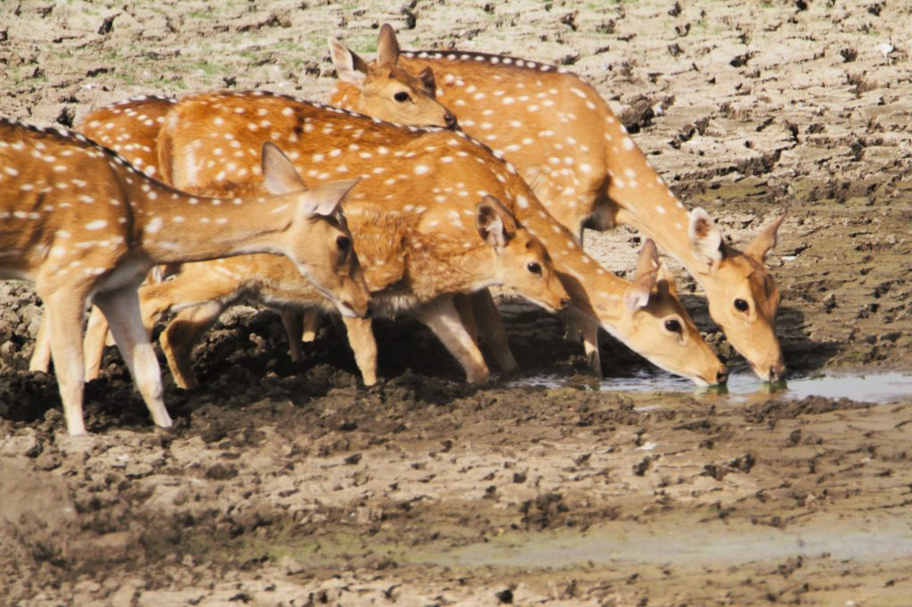

Coffee Plantations in India are predominantly shade-grown under the canopy of a heterogamous tree population. The multi-storied crops, along with herbs, spices, and shrubs, growing beneath the canopy serve as the ideal food, for a wide variety of wildlife species. Over the years, diversification into chemical-intensive crops has burdened the soil, resulting in a host of new species of grass emerging on the topsoil. Compounding the problem, the resultant breakdown of the ecological integrity of the surrounding forests has brought in hundreds of wildlife, directly dependent on the coffee ecosystem as a source of food. This article pertains to the spotted deer, a magnificent mammal, which is not only gregarious but is permanently setting base inside shade coffee, and monopolizing resources, thereby upsetting the fragile ecological balance. Their strength in numbers is negatively impacting agriculture and is a major cause in reducing native biodiversity.

Axis deer or the spotted deer are found in almost all tropical evergreen forests. They prefer dense forests as well as open grasslands. The spotted deer is a social animal. They are highly adaptable to different environments. They commonly occur in herds of 10 to 50, which may contain 3 or 4 stags. Herds are common and composed of adult females and their young from the present and previous year. During the early mornings, they can be seen feeding on grass laced with the early morning dew. They also live close to ponds and water bodies and rest under the coffee canopy when daytime temperatures are high.

A few decades back, a couple of spotted deer were observed in coffee plantations. In fact, it was a rare sight to spot them. But off late their population is crossing the ecological carrying capacity of the coffee ecosystem. They have set up a permanent base inside coffee forests.

### **Food**

Spotted deer are herbivores, capable of securing and ingesting a wide range of food. They feed on various types of multiple crops and tree species. They eat over 75 species of plants, as well as the full gamut of plant parts including herbs, shrubs, inflorescence, leaves, pods, stems, fruits, seeds, flowers, and bark. Green grasses less than 10cm high are preferred. All species of deer have a four-chamber stomach which allows them to chew the cud. This is a process of partially chewed food, regurgitating it, and chewing it again to make it easier to digest. In simple terms, this requires a constant supply of intake of food, to feed the digestive chambers.

### **Reproduction**

The spotted deer has a prolonged mating season, as the perpetually cool and warm climate allows females to remain fertile and to give birth to fawns any time of year.

### **Why Axis Deer is a menace in shade coffee**

The Primary reason being, Coffee Planters, year in and year out plant thousands of daps and nursery plants comprising of diversified tree species like white and red cedar, silver oak, jack orange, Areca, Mango, butter fruit, and different species of native forest trees along with coffee seedlings and other fruit trees. The spotted deer and their young ones comprising of 40 to 50, start grazing inside the new clearings and chew off the apical stem and the top flush, comprising of tender shoots, of all young seedlings, causing permanent damage.

Trampling of young seedlings leaves long-lasting damage leading to replanting, which is again an expensive proposition.

During the rut season, the deer rub and polish their antlers, against the stem and bark of young trees, causing severe aberrations, resulting in poor growth and development of the tree. The trees subjected to this treatment, have poor timber quality and also produce significantly low biomass. In many instances, it leads to the death of trees.

Since deer live close to streams and ponds, they often mess up with the young trees resulting in loss of stability and destabilisation of stream banks, altering the flow of water during the rainfall. This directly contributes to increased erosion, and sedimentation of streams, ponds and rivers.

Local Dogs, often chase deer and as the number of deer, 50 to 60 in number, with hardened antlers run helter skelter in panic, inside the coffee plantation, they tend to break the productive coffee branches significantly affecting crop yields. They can run up to 60 to 65 km/h to escape their predators.

Other damages are due to the fact that when herd populations become too large they graze on tank and lake bunds, heavily trampling on soft soil, leading to erosion.

When deer populations are far too many than the carrying capacity of the coffee ecosystem, they create dirt pathways, loosening the topsoil which gets washed up during the monsoon.

They tend to decrease the ground cover by grazing, resulting in loss of surface vegetation, which acts as a sponge for the infiltration of rainwater into the deeper layers of the aquifers. The runoff off water results in shifting precious topsoil.

They also forage on a variety of vegetation removing food sources for many native species and domestic cattle.

Many endemic species are lost forever.

They also carry transmissible diseases like bovine tuberculosis and several other diseases. They also act as carriers of common parasites that can directly affect humans if and when droppings enter freshwater systems. Parasitic zoonoses harbored by *A. axis* include leptospirosis, cryptosporidiosis, and strains of *Escherichia coli* .

Deer can jump up to 10ft high. They often crash through fences, resulting in loss of property. Many cases have been recorded where estate workers have suffered a severe injury when working inside coffee.

They pose an increased threat to human safety in and around roadways and high corridors.

### Wildlife Protection Act

Since all wildlife comes under the schedule of the Wildlife Protection Act, (WPA, 1972), there are no hunting permits issued by the forest department. Also, they act helpless, because they are understaffed and neither do they have the resources to contain them within their forest range.

### **Conclusion**

Invasive species can have a number of undesirable impacts on the areas that they invade. Perhaps the most significant of these is the widespread loss of habitat. Spotted deer or Axis deer are known to have a negative impact on the coffee ecosystem. As such, our observations of three decades clearly imply that they not only destabilize the native biodiversity but cause environmental harm, economic harm and impact human health and livestock. Also, since they lack predators, their multiplication goes unchecked. These species also alter the environment in a manner that makes it more favorable for them, but less favorable for natives, which is called ecological facilitation. It’s time the Forest Department wakes up to the reality that invasive species will ultimately cause economic damage leaving thousands of planters and the supporting workforce without jobs, increasing the poverty cycle.

We need to understand that while many invasive species may not ever be fully eradicated, as Planters, we need to be innovative and learn to cohabit with invasive species. This can only be achieved with increased awareness and research.

### References

Anand T Pereira and Geeta N Pereira. 2009. Shade Grown Ecofriendly Indian Coffee. Volume-1.

[Invasive Species](https://www.nwf.org/Educational-Resources/Wildlife-Guide/Threats-to-Wildlife/Invasive-Species)

[Description of Deer (Axis axis)](http://natureconservation.in/description-of-deer-axis-axis-spotted-deer/#:~:text=USA%2C%20and%20Argentina.-,Habit%20and%20habitat,deer%20is%20a%20social%20animal) .

[Invasive Species Compendium](https://www.cabi.org/isc/datasheet/89941)

[Invasive Species: How](https://www.environmentalscience.org/invasive-species)