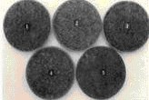

Many present-day coffee plantations use chemical fertilizers, especially nitrogenous and phosphatic ones. These types of fertilizers are bad for two main reasons: they are very expensive, and these chemical fertilizers often make use of non-renewable energy resources like fossil fuels, which can deplete nature’s precious resources. Furthermore, these synthetic fertilizers can harm Mother Earth due to water pollution. Thus, these chemical fertilizers are disastrous for the fragile ecology of coffee-growing regions.

Many generations of coffee farmers have ignored and abused the soil. The soil imbalance process takes time and the changes in each generation are minute, so no one cared – and many people still don’t care. Now, many farmers need to enrich the soil, so they turn to chemical fertilizers. The core issue for farming is how can we foster development and production without negatively affecting environment?

### A Change in Mindset

Faced with a problem of such a enormous magnitude, one can find a easy, yet effective solution for fertilizer needs of Coffee Plantations by just looking at the soil as a major natural resource. Most people think of soil as a dead, inert material. However, from an agricultural standpoint a healthy soil is the lifeline of any nation.

Soil itself is a living system with millions of beneficial microbes, acting as factories that provide biological nitrogen and other nutrients to the plant. Consider that 83.3% of the earth’s atmosphere is made up of inert nitrogen gas. Microorganisims can convert this atmospheric nitrogen and make it available to the plant in the soluble form (such as ammonia) that the plant can absorb and utilize. This process enriches the soil; thereby enriching the ecosystem.

### Microorganisms in the Soil

Microorganisims are present almost everywhere. Microbes are ubiquitous and at the same time promiscuous. The tip of a needle can hold more than 100,000 bacteria; so when you talk about bacteria, you’ve got to think on a grand scale.

The soil acts as a reservoir for millions of microorganisms, of which more than 85% are beneficial for plant life. Thus, the soil is a resilient ecosystem. Good soil consists of 93% mineral and 7% bio-organic substances. The bio-organic parts are 85% humus, 10% roots, and 5% edaphon.

Humus is a product of the synthetic and decomposing activities of the microflora; it exists in the dynamic state. It is under continual attack, yet it is constantly reformed by the subterranean inhabitants. Similarly,edaphon is a world of life and consists of microbes, fungi, bacteria, earthworms, micro-fauna, and macro-fauna as follows:

-   40% fungi/algae
-   40% bacteria/actinomycetes
-   12% Earthworms
-   5% Macrofauna
-   3% micro/mesofauna

Thus, soil microorganisms provide precious life to soil systems catering to plant growth. These microorganisms work *incognito* to maintain the ecological balance by active participation in carbon, nitrogen, sulphur and phosphorous cycles in nature. Soil microorganisms play a pivotal role both in the evolution of agriculturally useful soil conditions and in stimulating plant growth.

### Growing Significance

For quite sometime the Coffee Planting Community world wide has preferred synthetic fertilizers. They analyse the soil for Ph, electrical conductivity, macro and micronutrients. However, none may have analysed their soils for **microbial count**. Times are changing, and the role of **bio-fertilizers** for augmenting the fertilizer needs of Plantation crops is gaining significance. This method is not only safe but preserves the soil for future generations by enhancing and maintaining soil fertility.

### Why Use bio-fertilizers in Coffee-Growing areas?

Tropical areas where coffee is grown should use bio-fertilizers for several reasons.

-   In the tropics, the restricted availability of major nutrients like nitrogen and phosphorus limits plant growth and yield. Meanwhile super-phosphate fertilizer is expensive and in short supply, but bio-fertilizers can bridge the gap.
-   Also, in India for example, phosphate-deficient soils can be enriched with phosphate-fixing soils, which are often widespread in other areas.
-   The soil temperature is high in tropical areas, which acts as a catalyst in enhancing microbial activity; thereby increasing the flow of nutrients to the plant. So bio-fertilizers are an efficient fertilizing option.
-   Bio-fertilizers do not pollute the environment. They are ecofriendly and harmless. Bio-fertilizers address the core issue of supplementing nutrients, without affecting environment.
-   Biofertilizers are a low-cost technology for coffee plantations, the majority of which are owned by small-time farmers. A low-cost solution that enriches the soil gives a thrust to economic development without disturbing ecological balance.

### What is a Bio-fertilizer?

Most fertilizers add nitrogen to the soil. This can be done via chemical fertilizers, or through a process called biological nitrogen fixation (BNF). On a worldwide basis it is estimated that about 175 million tons of nitrogen per year is added to soil through biological nitrogen fixation (BNF). The term **bio** means *living*; so bio-fertilizers refer to living, microbial inoculants that are added to the soil. These bio-fertilizers are products consisting of selected and beneficial microorganisms, which are known to improve plant growth through supply of plant nutrients.

The soil microorganisms used in biofertilizers are: Phosphate Solubilizing microbes, Mycorrhizae, Azospirillum, Azotobacter, Rhizobium, Sesbania, Blue Green Algae, and Azolla. Let’s go through these groups in a little detail in order to understand their role in bio-fertilizers, which can be used to make rich, living soil that is suitable for coffee plants.

### Phosphate Solubilizing Microbes:

Phosphorus is an important nutrient for plants. There are several microorganisms which can solubilize the cheaper sources of phosphorus, such as rock phosphate. Bacteria like Pseudomonas striata, and Bacillus megaterium are also important phosphorus solubilizing soil microorganisms. Many fungi like Aspergillus and Penicillium are potential solubilizers of bound phosphates. They solubilise the bound phosphorus and make it available to the plant, resulting in improved growth and yield of crops.

Soil phosphates are rendered available to plants by soil microorganisms through secretion of organic acids. Therefore, phosphate dissolving soil microorganisms play some part in correcting phosphorus deficiency in plantation soils. They may also release soluble inorganic phosphate into soil through decomposition of of phosphate rich organic compounds. These microbial inoculants can substitute almost 20 to 25% of the phosphorus requirement of plants.

  
*Rock Phosphate Solubizing Microorganisms*

Phosphate solubilising microbes can also be inoculated to coffee husk along with rock phosphate while preparing compost to enrich the compost with available phosphorus.

### Mycorrhizae:

The term “mycorrhizae” refers to fungus associated with plant roots. These fertilizers are divided into ectotrophic and endotrophic or the vesicular arbuscular mycorrhiza (VAM) categories. Most plants depend on their mycorrhizal association for adequate uptake of nutrients (especially the immobile ions such as phosphate, zinc and micronutrients) and survival in natural ecosystems.

Mycorrhixal association stimulates branching of the root and increases the absorption surface of the root. Other benefits include tolerance to drought, high soil temperature, soil toxins, and extreme Ph levels, as well as protection against root pathogens. This is why, When trees are introduced to new regions, inoculation of soil with mycorrhizal fungi is a necessary prerequisite for the establishment of the trees.

**Azopirillum**

Azospirillum are nitrogen-fixing bacteria that lives in a symbiotic relationship in the root cortex of several tropical crops. They stimulate plant growth through nitrogen fixation and production of growth subustances like auxins, gibberellins and cytokinin. It is estimated that almost 10 to 15% of the required nitrogen can be met by Azospirillum biofertilizer.

**Azobacter**

Azotobacter are free-living, nitrogen-fixing bacteria and are known to produce several plant growth promoting subustances. In addition to nitrogen fixation by these bacteria, they are also known to protect plants against pathogenic microorganisims either by discouraging their growth or by destroying them. These inoculants need more attention in view of their triple action of nitrogen fixation, bio-control, and production of plant growth regulators.

**Rhizobium**

Rhizobium bacteria, basically form root nodules in leguminous plants and fix atmospheric nitrogen in a symbiotic association. The Rhizobium bacteria gives nitrogen to the plant and the plant gives protection to the bacteria from oxygen damage by harbouring it inside the root nodule.

**Sesbania**

Many legumes are grown and then turned into the soil while they are still green to enrich soil nitrogen. Sesbania is a green manure plant which forms both root and stem nodules in association with rhizobium and thereby fixes more atmospheric nitrogen. These legumes produce ten times more nodules than other legumes and have a very high capacity to fix atmospheric nitrogen. Apart from enrichment of soil nitrogen, green manuring enriches the phosphorus, calcium, sulphur and other micronutrient of the soil.

**Blue Green Algae**

Blue Green Algae (BGA) or Cyanobacteria have the ability to carry out both photosynthesis as well as nitrogen fixation. They belong to the order Nostocales and Stigonematales. Algal flakes are grown and then broadcasted.

**Azolla**

Azolla is a floating fern which harbours a blue green algae in its leaf cavities. The fern multiplies very fast with the symbiotic association of the algae and this rapid multiplication creates a huge amount of biomass on the surface of the water. It is then harvested, dryed and used as biofertilizer.

  
*Nitrogen-fixing Azolla strains commonly used in coffee plantations*

### Conclusion

Bio-fertilizers (also known as microbial inoculants) improve soil fertility and enhance nutrient uptake and water uptake in deficient soils, thereby aiding in better establishment of plants. Bio-fertilizers also secrete growth subustances and antifungal chemicals, as well as improve seed germination and root growth. The dual effects of phosphorus mobilizing fungi and specific nitrogen-fixing bacteria can cater to the needs of the current coffee plantation sector.

Thus, the use of bio-fertilizers will effectively enrich the soil and will cost less than chemical fertilizers, which harm the environment and deplete non-renewable energy sources.