_Readers are requested to refer the article [COFFEE PLANTATIONS -A MULTIDISCIPLINARY APPROACH](/coffee-plantations-a-multidisciplinary-approach/) for a better understanding of the present article._

Coffee Planters are fortunate that the entire Western Ghats is considered one among the 18 hot spots of the globe. The Western Ghats runs along the West coast of South India and covers various places along the mountains – the Anamalais, the Pulneys, the Sahyadris, the Nilgiris, and the High Ranges. In the midst of nature coffee plantations grow luxuriantly and it is for this very reason that Indian coffee has occupied a place of pride as ecofriendly. Coffee has always maintained a symbiotic relationship with the surrounding biotic community. The supporting role played by coffee may explain as to why coffee is native to forests. There is no doubt that over thousands of years of evolution, coffee evolved as a natural beverage because of the ideal conditions prevailing inside the forest. As such there are quite a few invisible and visible ecological divisions within the coffee habitat. At higher elevations the Arabica varieties of coffee perform better under shade and at lower elevations the Robusta varieties of coffee perform better under open conditions.

Coffee plantations are characterized by structural and behavioral differences among and between varieties. Factors that can upset the biodiversity equation of the coffee mountain include selection, mutation, and gene pooling. It is desirable to have variation in the gene pool by way of evolution, rather than achieving the same by inbreeding. This statement can be corroborated by the fact that most of the introduced coffee varieties have a host of problems like susceptibility to pest and disease incidence, poor cup quality and erratic yield patterns. In the Indian context, mixing of foreign gene pool has also resulted in quality problems. Our entire concept is to maintain the fragile native genetic pool and not carry it too far. Coffee planters have been slow to recognize the danger presented by the rapid disappearance of the surrounding flora and fauna.

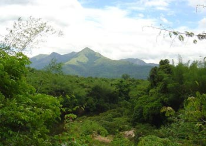

The term BIODIVERSITY has a very significant meaning. BIO refers to LIVING and LOGY refers to the discourse of science. As such all living entities on this planet earth have the right to live and carryout the tasks and functions assigned to them by nature. Any species for that matter May it be plant or insect, have multiple roles to play in the food chain. This is evident from the fact that that the productiveness of the global food chain is closely linked to the wellbeing of coffee forests, oceans and wildlife. Biodiversity serves as a stabilizing factor where in heterogeneous populations express themselves either independently or in combination. In the end analysis, a purposeful variation is maintained in the gene pool. Many of the habitats are threatened by humans; hence show less degree of adjustability.

The Natural selection by way of millions of years of evolution gave rise to a biodiverse planet. The remarkable thing about Evolution is that it is a slow and gradual process allowing MEMBERS of the biotic community to evolve and adapt until they are fully adapted to a particular environment. At this point they tend to remain stable. Every step was marked with mutual inter dependence of species, if not, sudden changes in the environment may wipe out the entire population. Not many planters are aware of the fact that quite a few related genera of coffee like Nostolachma khasiana , Psylanthus wightiana , Psylanthus bengalensis and Psylanthus travencorensis are native to Indian forests.

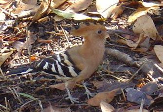

Deep in the heart of the Western ghat range are the shola rain forests known for their rich and diverse species of plants and animals. The latest survey reports that more than 40 % of plants, 50 % of reptiles, 80 % of amphibians and 10 % of insect SPECIES HAVE BECOME ENDEMIC SPECIES. For hundreds of years the build up of a stable ecology coupled with mutual respect and sharing of resources was the norm. The western ghat range is instrumental in advancing the southwest monsoon to peninsular India. More than 100 rivers originate from the mountain tops and provide 250 billion cubic meters of water used for irrigation. Today, all that has changed with Man’s dominance of nature resulting in the critical exploitation of forest wealth and converting forest land into agri zones. We have witnessed firsthand the enormous build up of pressure on coffee ecosystems and its natural resources leading to an IRREVERSIBLE damage. The future looks bleak, despite the fact that coffee plantations have a wealth of biodiversity. Sooner than later reality will catch up with us.

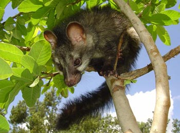

### Fundamentals of Hotspots

Now what exactly does one mean by the term HOTSPOT? The answer appears simple, yet is quite complicated. For any place to be denoted as a HOTSPOT, there are quite a few criteria that have to be met. One among these calls for the collapse of the biotic system harboring thousands of rare flora and fauna and the urgent conservation needed to arrest this decay. The Western Ghats is one such hotspot. A glimpse of the Western Ghats will simply overpower the imagination of any nature lover by its breath taking beauty and in it a vast treasure house of very rare and unique biodiversity. The most important part is that this Western ghat preserve is home to some of the most THREATENED species of herbs, shrubs, literally thousands of species of flora and fauna. The entire belt is threatened by man made activities like mining, timber logging, ore extraction etc. It is indeed a specialized ecosystem with highly specialized breeding grounds for a large variety of insects. But most of its secrets have yet to be revealed.

We strongly feel that it will take another two hundred years to unravel a part of the mystery locked within the Garden of Eden called Western Ghats. Infact, studying the dimensions of the biodiversity of the region, calls for urgent and immediate attention in safeguarding each and every ecological niche which acts as a ladder in supporting the entire, complex web of life. Many of these hotspots are located in developing economies of the world. In other words, the global community needs to put their act right in conserving the Planets biodiversity, because the very risk of loosing precious herbs, shrubs, insects, wildlife or aquatic life will have repercussions to the global community. The underdeveloped countries need the resources of the Developed world in conserving this precious mother earth’s resource. Otherwise due to expanding human populations and encroachment into forest land, the specter of large scale destruction of threatened species will be a reality. It is a fact that species are destroyed even before they are discovered. Thousands of species of medicinal plants, herbs, shrubs are yet to be discovered in the Western Ghats but sadly are being wiped out before they see the light of the day. The cure for all forms of cancer, AIDS, flu virus lies hidden in these medicinal and aromatic herbs and shrubs. Hence the urgent need to protect the western ghats as a bio reserve.

Evolution has bestowed the coffee planter with the greatest diversity of native as well as unique medicinal species inside the coffee mountain and in the valleys the wetlands harbor different forms of microbial life. Botanists and environmentalists have always appreciated the role of coffee in protecting the bio diverse forests and they point out that the coffee shrub has worked particular wonders in preserving the flora and fauna of the region.

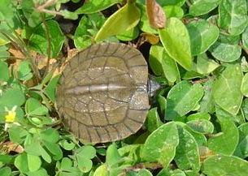

The CYCAS plants are found only in a few pockets of the Western Ghats. One such species known as Cycas circinalis , commonly referred to as the Dinosaur foot tree is well known for its medicinal and other healing properties. It also plays a very important role in the top soil fertility, much before several other life forms evolved on the earth. The species has evolved over thousands of years and reports indicate that it belongs to the Jurassic age. This rare plant has been indiscriminately exploited by florists for decorations and now is on the verge of extinction. In spite of the plant being listed among the 36 rare herbal plants facing extinction, it is being robbed from its natural habitat. The worrying factor is that the growth pattern of this plant is pretty slow and only one or two leaves sprout from a frond every year. The survey conducted by the Mysore Amateur Naturalists show that 85% OF THE SURVIVING CYCAS PLANTS in Narayandurga forests are less than two years old with hardly a handful full grown trees remaining.

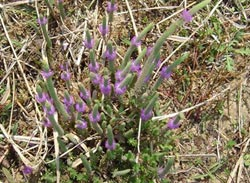

Trees that are being extinct: are ROSE, SANDAL, MATTI, HONNE, and NANDI.

Globally millions of hectares of rainforests, precious and rare plants, animals, birds and insects are being destroyed. Indonesia is the producer of quality Robusta coffee. Even though the country covers 1.4 per cent of the planet’s land, it is home to 10 % of all flowering plants, 17% of birds, 12% of mammals and 16% of reptiles and amphibians. However, due to the commercial exploitation of virgin forests the entire belt is under threat. Monocropped plantations have the capacity of wiping out entire biodiversity belts which will have a long term impact on the environment.

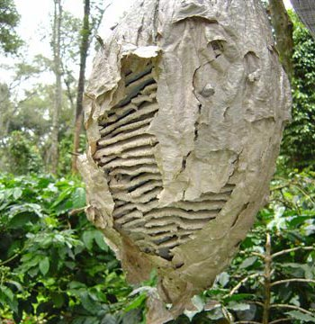

Brazil is famous, both for the Amazon rain forest as well as the world’s largest producer of coffee. Recent reports indicate that an explosion in cattle ranching has not only endangered thousands of rare plants, animals and insect species, but has also sped up global warming and deprived many Brazilians of forest products on which they depend. The latest report on the status of the Brazilian Amazon forests released by the Government indicates that in the year 2003, the region lost enough forests to cover almost two-thirds of Switzerland and since 1970’s a sixth of the rainforests has been lost.

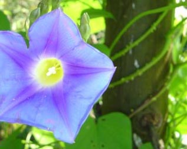

Recently, scientists from India working on new age fibers unearthed the hidden potential of the web spun by a wild spider crib let. Bulletproof vests could be made using these fibers from the web. Japanese scientists working on spider silk in Japan claim that spider silk with a stretching capacity of 30 to 40 per cent more than that of steel and nylon is the best fiber for making bullet proof jackets. The highly elastic nature as well as the ecofriendliness of the product because of its biodegradability could replace synthetic, no biodegradable nylon. They are also of the opinion that spider silk can also be used in parachutes, fishing nets and for transporting dry poison and tobacco. The scientists have also succeeded in making high quality and cost effective fibers from the volcanic stone known as BASALT. They are of the opinion that fire resistant {resistant up to 1000 degree centigrade} and chemical resistant fibers made from basalt are sound insulating, ecologically pure and has exceptional mechanical qualities. The multiple uses of basalt is such that it can replace carbon fibers and asbestos fibers in the steel industry and is a highly durable material for hi tech industries like airplanes, satellites, and nuclear industry.

Scientists in China have perfected a technology for mass scale production of SOYABEAN PROTEIN FIBRES. Scientists say that it could well be the fiber of the future because it has a number of environment friendly characteristics like absorbing moisture like cotton, providing warmth, germ free and resistant to u. v. rays and most importantly the presence of amino acids which has an excellent affinity to human skin. A few of these examples amply demonstrate that biodiversity has all the answers in reaching out to mankind’s needs, but we need to respect nature to get the best out of nature.

### Plantation Task Force

Globally, coffee farmers need to have an environmental master plan with a common frame work that development should not be undertaken at the cost of the environment. They need to promote, conserve and revive the biogenetic diversity of each and every region and pass it on in the written form to future generations. They need to harness the power of the internet in exchanging ideas and educating planters, not only locally, but globally, in protecting ecological sensitive niches which are key drivers in sustaining the coffee farm. To achieve any measure of success we need multiple grass root organizations with women at the forefront in planning, facilitating, evaluating, monitoring, executing biodiversity programmes with clarity of thought and mind. In simple terms it requires a multidimensional approach.

One way of going about this is the setting up of a GERMPLASAM BANK with intellectual property rights. Though royalty payments need to be restricted towards multinationals whose prime objective is exploitation of resources, otherwise to the farming community exchange of plant material should be free. Seed conservation and gene banks are a vital link in the success of any such programmes. The programmes should encompass natural drought resistance, pest and disease resistance and also survival of species in heavy rainfall regions.

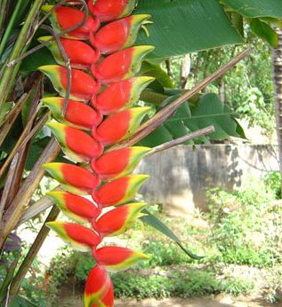

### Loss of Bio Diversity

A study published by the royal society concluded that there are in fact 1000 times too many of us in our planet to be sustainable for very much longer. A combined scientific study in one of the most biodivere rich areas of the planet has predicted that at the present rate of forest destruction, by the year 2025 almost 1.50 million species of plant and animal life will be wiped out. Temperatures will rise by 10 to 15 degree F. Scientists may have a wealth of information with the help of modern and sophisticated computers to monitor loss of habitat, but we need to realize that farmers have the wisdom in tackling the most severe of crisis with simple tools and uncommon common sense. Birds and animals can migrate but the plant community needs to adjust to variations.

A stable bio-diverse ecosystem has a number of tangible benefits like cleaning up of air from toxic fumes, production of oxygen and regulation of carbon dioxide, purification of water systems, and creation of a self supporting and self sustaining system.

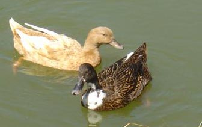

Public memory is short lived. Very recently, (16th February, 2004 ) policy makers, scientists and Nongovernmental organizations from more than 100 countries arrived in Kuala Lumpur to seek ways to stop , if not curb the extinction rate of rare and threatened species. On paper, all Governments pledge their support in arresting the fast decline of biodiversity throughout the globe. Luckily, all concerned, scientists and bureaucrats have understood that the unprecedented rate of loss of biodiversity is a direct consequence of human activities. The United Nations convention on biological diversity (CBD) was unanimous that species belonging to plant, animal and insect kingdom are being wiped out at an alarming rate. So also delegates at the Earth Observation Summit who met at Tokyo {26th April, 2004\] agreed to kick start the Global Earth Observation System (GEOSS) towards protecting the global environment and achieving sustainable development.

### Species Diversity

India contains a great wealth of biological diversity in its forests, its wetlands and in its marine areas. This richness is shown in absolute numbers of species and the proportion they represent of the world total (see Table 1).

Table 1. Comparison Between the Number of Species in India and the World. Source [WCMC](http://www.wcmc.org.uk/).

Group

Number of Species in India (SI)

Number of Species in the World (SW)

SI/SW (%)

Mammals

350

4,629

7.6

Birds

1,224

9,702

12.6

Reptiles

408

6,550

6.2

Amphibians

197

4,522

4.4

Fishes

2,546

21,730

11.7

Flowering Plants

15,000

250,000

6.0

### Conclusion

The coffee forest is a symbol of ecological prosperity. It never ceases to amaze us that the joy of protecting forests is rewarding. This great NATURAL CORRIDOR is the passport for the well being of future generations. The genetic resources in coffee plantations are shrinking. In the next few years the plantation landscape will be a picture of industries. Trees and plants replaced by industrial corridors, railways, petroleum lines, thermal stations and international airports. We are aware that the Western Ghats is one vital link which will protect future generations in a number of ways. What is first needed is an understanding that nature is a part of our well being and it has a perfectly complimentary role to play. The root of most apprehensions lies probably in the fact that biodiversity is meant only for the scientific world and the common citizen has nothing to do with it. In the coming years we need to draw the attention of policy makers and planners to draw up a blue print to make conservation of biodiversity everybody’s business. There is also a need to establish backward and forward linkages by creating appropriate local forums. It calls for a huge human effort to save the Western Ghats. Our ultimate goal is to protect this rare habitat. The conservation effort should have the foresight and the wisdom to accommodate the needs of the forest in terms of preservation of the natural habitat, instead of seeing things from the human angle.

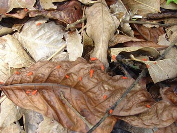

Astronaut Russell Schweickart when flying on the Apollo 9 missions has this to say “As you pass from sunlight into darkness and back again every hour and a half, you become startlingly aware how artificial are thousands of boundaries we’ve created to separate and define. And for the first time in your life you feel in your gut the previous unity of the earth and all the living things it supports”. It is time coffee lovers worldwide reflect on the above words and think of conservation every time they sip a cup of coffee. Fortunately, if we plan on a global scale for future generations, we can find our way through these challenges.

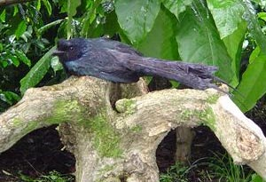

### References

[The IUCN Red List of Threatened Species](http://www.iucnredlist.org/)

[Indira Gandhi Conservation Monitoring Centre](http://www.wwfindia.org/about_wwf/enablers/igcmc_gis/igcmc_at_wwf_india/)

[Madhav Gadgil’s Homepage](https://web.archive.org/web/20180321173902/http://ces.iisc.ernet.in:80/hpg/cesmg/indiabio.html)

Coffee Guide. Sixth edition,2000. Central Coffee Research Institute, Coffee research station, Chickmagalur District. Karnataka.

International Consultation on Biological Diversity (SAARC, Asean and Other Regional Countries), Country Paper: India, Ministry of Environment and Forests, Government of India and United Nations Environment Programme, Bangalore, India, August 22-23 1994, page 3.

Lal, J.B. (1989). India’s Forests: Myth and Reality. Natraj Publishers, New Delhi, India.

MacKinnon, J. and MacKinnon, K. (1986). Review of the Protected Areas System in the Indo-Malayan Realm. International Union for the Conservation of Nature and Natural Resources, Gland, Switzerland and Cambridge, U.K. 284 pp.

Nayar, M.P. and Sastry, R.K. (Eds) 1987. Red Data Book of Indian Plants. Botanical Survey of India, Calcutta, India. 367pp.
