_Readers are requested to refer the article [Microbial Inoculants](/microbial-inoculants/) for a better understanding of the present article._

### Early History

Shade grown coffee belts are unique to India and a handful of countries throughout the globe. Essentially, the FOREST approach of growing coffee along with MULTIPLE CROPS, in India has enabled the plantation to fight many outbreaks of pests and diseases. Monocropped Plantations are under constant threat of pest and disease incidence because it favors the build up of pest population.

Such risks have literally closed down monocropped coffee plantations in many other countries. However, with the advent of modern day varieties dictated by indiscriminate use of chemicals, weedicides, insecticides, fungicides, nematicides, the bio-sensitive coffee niche is under tremendous pressure of snapping away.

Today there are more than 250 organic pesticides and thousands of formulations. The coffee industry unfortunately relies on these poisons to protect the plant and berries from insect attack and disease spread. In some advanced countries aerial spraying of these hazardous chemicals is carried out to save on labor costs.

Most, coffee farmers advocate the use of BROAD SPECTRUM pesticides. These are more dangerous than systemic pesticides because they act on many insects both beneficial and harmful. There is every chance that these chemicals can easily drift or get washed or leached by heavy showers and reach groundwater or open estuaries thereby contaminating the earth’s precious water reserve. So the best bet is the use of BIOLOGICAL control to combat pest and disease incidence.

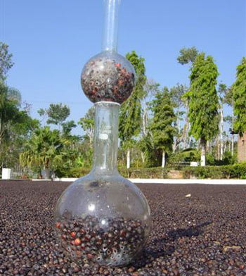

Soil borne pathogens are complex not only in their behavioral pattern but also in their biochemical constituents. Hence, it is not very easy to control these pathogens. Understanding and dealing with soil borne pathogens is a very difficult and challenging task.

This article gives a broad outlook on how biological control could work in the SOIL SYSTEM for the present as well as for the future. After all Biological control of soil borne pathogens is an important natural phenomenon which has existed long before coffee was introduced to India.

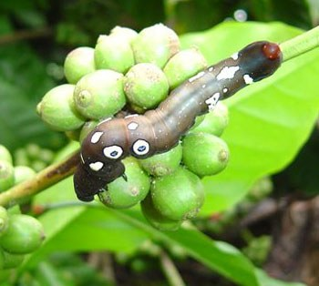

**The world over, commercially grown coffees are the Arabica’s and Robusta’s. Both these coffees are susceptible to a number of soil borne pathogens.**

- Root diseases are of four types namely, Brown root disease caused by Fomes noxius.
- Red root disease caused by Poria hypolateritia Berk , Black root disease caused by Rosellinia bunodes ( B. & BR. ) Sacc. , Rosellina arcuata Petch and Santavery root disease caused by Fusarium oxysporum f.sp.coffeae.
- Coffee Trunk Canker ( coffee stem disease ) caused by Ceratocystis fimbriata EII & Halst.
- Collar rot caused by Rhizoctonia solani Kuhn.
- Black rot commonly referred to as koleroga and the casual organism responsible is Koleroga noxia.
- Anthracnose of coffee caused by the fungus Colletotrichum gloeosporioides Penz. The fungus inhabits the bark of various trees and finally infects coffee.

Baker and Cook define Biological control as the reduction of inoculum or disease producing activity of a pathogen in active or dormant state by one or more organisms accomplished naturally or through manipulation of the environment, host or antagonist or by mass introduction of more antagonists other than man.

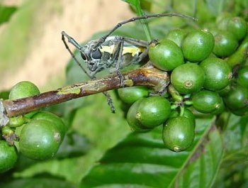

**Antagonists are bio control agents like bacteria, fungi, actinomycetes, viruses, nematodes that reduce the number or disease producing activities of the pathogen.**

Dr. Bill Symondson and a group of bio scientists from the school of bio sciences of Cardiff University, very recently discovered that a DNA in a spider’s stomach could behave like pesticide. Linyphidae or money spider is the species responsible. At a time when there is growing demand to do away with chemical pesticides, such natural pest killers offer hope. Stink bug which is commonly found in all tropical countries is known to predate on a number of pests.

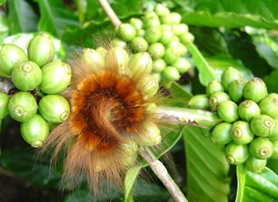

Scientists at the University of Agricultural Sciences (U.A.S.) Bangalore, Karnataka, India. Are on the verge of a breakthrough in controlling fungal diseases in coffee with the help of a bacteria isolated from the Western Ghats. The plants are made immune to fungi by injecting the fungicidal gene in coffee seeds.

### Consequences

Aerial sprays destroy large populations of predators and parasites. It also breaks their life cycle and increases the tolerance level of pathogens and pests. A broad spectrum chemical may be highly effective against a highly mobile pest, but at the same time, be equally or even more effective against other biotic communities beneficial to nature.

Few are aware of the fact that the sensitivity of the beneficial insects against pesticides is considerably higher than that of pests. The pest then multiplies without restraint from natural enemies. Appearance of new pests is another problem that needs to be tackled. Honeybees which are generally the non target organisms are at considerable risk. However when insecticide formulations are done this is a weak link.

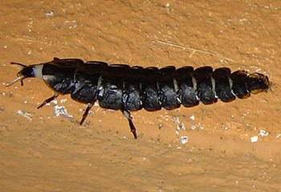

Paul Muller of Switzerland in 1942 discovered DDT as an insecticide and was awarded the Nobel Prize. DDT was hailed as a wonder insecticide and effective crop protectant. Billions of dollars are spent each year by individual countries in applying toxic chemicals against pests and diseases.

Also even more billions of dollars are spent on cleaning up the toxic wastes accumulated in the biological food chains resulting in deformities in man and lower productivity in arable lands. A decade back DDT was banned throughout the world, but is still available in developing economies. It has done more harm than good and in most cases the harm to the environment is irreparable.

### Characteristics of an Ideal Biological Control Organism

According to the soil scientist A. KERR from the Department of Plant Pathology, Waite Agricultural research Institute, Adelaide, Australia:

1.  The organism should survive for an extended period of time in the soil in an inactive or active form.
2.  The organism should contact the pathogen either directly or indirectly by diffusion of chemicals.
3.  Multiplication in the laboratory should be simple and inexpensive.
4.  It should be amenable to a simple, efficient and inexpensive process of packaging, distribution and application.
5.  If possible, it should be specific for the target organism; the more specific it is, the less environment upset it will cause.
6.  It should not be a health hazard in its preparation, distribution and application.
7.  It should be active under the appropriate environmental conditions.
8.  It should control the target pathogen efficiently and economically.

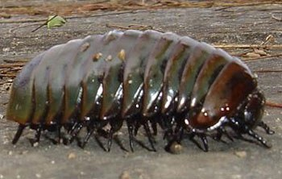

### Soil Dynamics

The type of soil inside the coffee plantation greatly influences the nature and type of soil micro flora. An over worked soil tends to be sick and results in several new types of pathogens. They upset the soil equilibrium and in turn the coffee bush is more susceptible to soil borne pathogens. A healthy soil system contains 10 to the power 9 bacteria, 7 x 10 to the power five actinomycetes, 4 x 10 to the power five fungi, 10 to the power five protozoa, and other microflora.

As such a healthy soil system is a reservoir of millions of beneficial microorganisms which constantly communicate with each other and maintain life’s processes in an orderly way. There are many diverse groups of microorganisms in soil. However, in practice, the ground reality is very different. The health status of the soil is constantly under threat due to the repeated use of chemicals which will ultimately reduce the immunity of the plants towards diseases. What’s more, the population of pathogens will multiply beyond the threshold level and create macro imbalances which result in loss of productivity. Growth of natural weeds which is a good sign of the fertility status of the soil will also be brought under check, retarding the growth of beneficial microorganisms.

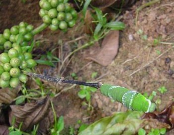

### Sterilized Soils vs Natural Soil

Tremendous success has been observed by Microbiologists and soil scientists with the introduction of biological control agents in sterilized soils. When soil is fumigated with chemicals or treated with steam, it is devoid of all biological activity. If in such treated soils a pathogenic organism is introduced, it grows and multiplies rapidly and has the capability of causing severe damage to susceptible crops. However, the inoculation of pure cultures under field conditions is not very effective because of the presence of native microflora.

The best way of tackling soil borne pathogens is by observing their life cycle. All soil borne pathogens have an inactive phase and most survive this phase by producing resistant structures such as oospores, chlamydospores,sclerotia and cysts. These structures are resistant to attack by other soil microorganisms. More research work is needed in identifying the mechanism that breaks these resistant structures.

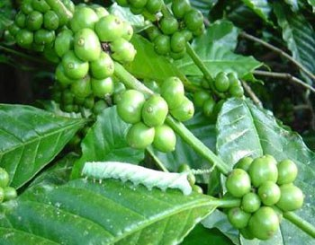

### Cultural Practices

Traditional farm wisdom also spells out a number of ecofriendly measures in controlling pests. For e.g. Marigold is known to control the spread of nematodes inside coffee plantations. Certain shrubs too planted in a circular manner serve as food for pests which become weak after eating them. Subsequently, the remains add up as soil nutrients. In quite a few instances crop rotation is the answer. The idea behind this is to starve the pathogen and prevent its multiplication.

For centuries it was observed that soils rich in organic matter suppressed the virulent pathogens and in some cases the pathogen becomes a saprophyte and the soil borne disease reduced. These soil amendments provide a source of food for soil borne microorganisms that can inhibit the development of plant pathogens. The British pioneers in opening up thousands of acres of plantations were careful to follow the circular method of planting. From the centre of the circle, inwards the Arabica varieties were grown and on the outer edge of the circle the Robusta varieties were grown.

Since Robusta is resistant to a large number of coffee pests it acted as a barrier for the entry of pests into the inner most circle of Arabica. Eel worms in soil are a bit of a problem for plant growth and development. Eel worms are not stationary; they are quite active and are constantly on the move. Certain predacious fungi live as saprophytes in the soil, one such fungus is Arthrobotrys oligospora. The fungus forms hyphal loops which are sticky with a viscous fluid on the surface. As the eel worm migrates it gets entrapped in the mycelial mat and dies.

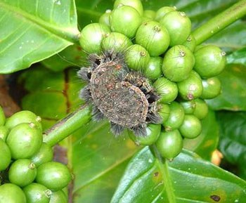

### Present Drawbacks

Unfortunately and due to lack of sufficient scientific data, the addition of specific microorganisms in soil has not resulted in the control of the target pathogen. Pure cultures of microorganisms multiplied in the laboratories and inoculated into the soil have not been able to suppress the soil borne pathogens nor has it succeeded in increasing the level of naturally occurring biological control.

Soils naturally contain species of fungi that trap and feed on plant parasitic nematodes. However, external application of additional nematode trapping fungi failed to protect plants under field conditions. This may be due to the fact that the soil may not favor the activity of the introduced organism or the native strains may suppress the introduced strains.

Since soil borne pathogens are mostly associated with the roots of plants , the use of chemicals is restricted because the roots are embedded in soil and hence protected from most chemicals. Systemic chemicals have limited application potential because the characteristic feature of micro flora is to mutate and develop resistance.

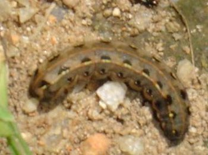

### Biological Control Agents

The following list is a generalized list of microbial bio agents and not specifically intended for coffee.

- **Bacteria**
  - Pseudomonas fluorescens
  - Pseudomonas spp
  - Pseudomonas putida
  - Agrobacterium radiobacter
  - Bacillus spp
  - Streptomyces spp
  - Pasteuria penetrans
- **Fungus**
  - Trichoderma harzianum
  - Trichoderma viridae
  - Coniothyrium minitans
  - Sporidesmium sclerotivorum
  - Arthrobotrys
  - Dactylaria
  - Dactycella
  - Monacrosporium

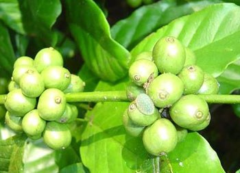

### Mechanisms at Play

Biocontrol of soil borne pathogens is a direct result of the action of antagonists through one or more of the following mechanisms. These mechanisms reduce the infection level and bring about the desired results.

- **ANTIBIOSIS:** It refers to the inhibition or destruction of the pathogen by the metabolic product of the antagonist. These products include lytic agents like enzymes, volatile compounds, toxic substances and antibiotics which result in the destruction, disintegration and decomposition of the pathogen.
- **COMPETITION:** Occurs when the antagonist directly competes for the pathogens resources like nutrients, oxygen, space etc. E.g. Pseudomonas fluorescens is known to produce siderophores that bind strongly to iron, making it unavailable to other soil microorganisms which cannot grow for lack of it.
- **PARASITISM; HYPERPARASITISM; MYCOPARASITISM:** The antagonist invades the pathogen by excretion of extra cellular enzymes, phenols, chitinases, cellulases and other lytic enzymes.

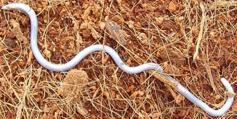

### Practical Way Of Overcoming Soil Borne Pathogens

The best way to tackle soil borne diseases or pathogens is by seed treatment. Seed treatment ensures sufficient quantity of the antagonists on the seed as protectants against seed borne and soil borne diseases. The large population of antagonists colonizes the outer seed coat and thus protects the germinating seed. Many farmers have experimented with a set of mixed cultures containing both bacterial and fungal antagonists and the results are highly encouraging.

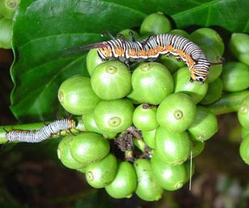

### Kirehully & Joe’s Sustainable Farm

We have isolated species of Trichoderma, Pseudomonas and other bacterial and fungal strains from within the farm (NOT FROM EXTERNAL SOURCES) and inoculated the same into compost pits. Care is taken to inoculate the pure culture isolates after 12 weeks of compost preparation. This lag period allows the breakdown of various raw materials and stabilizes the compost.

The idea is that the biocontrol agent is a native strain and can establish itself quickly, multiply rapidly and also acclimatizes itself with ease. However, most Planters fall prey to the commercial cultures which are isolated from soils other than coffee plantations.

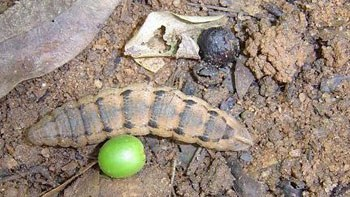

### Mass Multiplication

Biocontrol agents can be mass multiplied on various substrates like farm yard manure, compost, sawdust, wheat bran, and ragi. Trichoderma species and Pseudomonas species are mass multiplied on an industrial scale. Trichoderma viride and Trichoderma harzianum have been successfully used to check spread of pepper wilt inside coffee plantations.

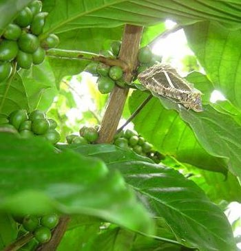

### Conclusion

We believe that our past approach to the pesticide problem needs a new look. At a time when there is growing demand to do away with chemical poisons , natural pest control is the best alternative and offer’s hope of a safe method of dealing with pests. However, the task ahead is challenging. But that is what makes it so exciting as well.

Research is needed in order to exploit more fully the use of various forms of organic matter to enhance the biological control of soil borne pathogens. One probable reason that pure cultures of specific target microorganisms may not work under field conditions is that the soil system already contains the maximum number of microbial load that it can support and hence the soil system itself needs to be altered. A new way of looking at the problem is the introduction of a mutant strain or a hypo virulent strain of the pathogen that is incapable of producing the disease. Such strains may prevent development of the pathogenic strains.

This method has been successfully exploited in the control of crown gall bacteria. A totally different approach is in altering the chemical and microbial root zone area of coffee such that the root exudates may inhibit the establishment, multiplication and spread of the pathogenic strain.

Experience teaches that all too often that the farmers look at immediate, effective and efficient methods of controlling the pathogen, without regard to other organisms in the surrounding biotic community. We need to realize that man and nature should co exist for a better tomorrow. Ultimately, disturbing this delicate balance of nature can have serious consequences to the total environment.

Experimenting with nature with the fond hope of eradicating a pathogen is always stressful. Biological control of soil borne pathogens is a very slow and deliberate process, but the results are more stable and lasting compared to chemical control. We need to look at ecologically safe, economically viable and socially sound viable strategies such that minimum danger is caused to the environment.

There is so much to introspect on the words of of RACHEL CARSON: _A truly extraordinary variety of alternatives to the chemical control of insects is available. Some are already in use and have achieved brilliant success. Others are in the stage of laboratory testing. Still others are little more than ideas in the minds of imaginative scientists, waiting for the opportunity to put them to test. All have this in common: they are BIOLOGICAL SOLUTIONS._

### References

[The Fine Art of Composting In Coffee Plantations](/the-fine-art-of-composting-in-coffee-plantations/)

[Organic Matter Decomposition In Coffee Plantations](/organic-matter-decomposition-in-coffee-plantations/)

[Farm Coffee Organic Manures](/farm-coffee-organic-manures/)

[Invisible Communications in Coffee Plantations](/invisible-communications-in-coffee-plantations/)

[Microbial Inoculants](/microbial-inoculants/)

[Toxin build-up is highest in young](http://www.theguardian.com/science/2004/oct/08/sciencenews.environment)

[Born Too Soon By CHRISTINE GORMAN](http://content.time.com/time/magazine/article/0,9171,1101041018-713195,00.html)

[Toxin build-up is highest in young](http://www.theguardian.com/science/2004/oct/08/sciencenews.environment)

[Born Too Soon By CHRISTINE GORMAN](http://content.time.com/time/magazine/article/0,9171,1101041018-713195,00.html)

[TOO YOUNG TO DIE / Infant Deaths](http://www.sfgate.com/health/article/TOO-YOUNG-TO-DIE-Infant-Deaths-3302210.php)

[www.EnvironmentalHealthNews.org](http://www.EnvironmentalHealthNews.org)

[pubs.acs.org/cen/news/8242/8242notw3.html](http://pubs.acs.org/cen/news/8242/8242notw3.html)

[www.birthdefects.org](http://birthdefects.org/)

[Amphibian Red List Authority](https://web.archive.org/web/20181228015525/http://www.amphibians.org:80/redlist/)

Alexander, M. 1977. Introduction to soil Microbiology. 2nd edition. New York. John Wiley and sons.

Alexander, M. 1974. Microbial Ecology. New York. John Wiley and sons.

Baker. E. F and R.J. Cook, 1974. Biological control of plant pathogens. W.H. Freeman & Co. Sanfransisco, 433pp.

Baker. E. F. 1987. Evolving concepts of biological control of plant pathogens. Annul. Rev. Phytopathol., 25: 67-85.

Coffee Guide. Sixth edition, 2000. Central Coffee Research Institute, Coffee research station, Chickmagalur District. Karnataka.

Carson. R. 1963. Silent spring, Hamilton, London.

David Steinman and R. Michael Wisner. 2003. living healthy in a Toxic world.

Graham. H. J and J.M. Mitchell, 2002. Biological control of soil borne plant pathogens and nematodes (chapter 19). In Principles and applications of soil microbiology. Edited by David M Sylvia, J.J. Fuhrmann, Peter G Hartel and David A Zuberer. Prentice Hall. Upper Saddle River, NJ 07458

Hornsby. D. (Ed). 1990. Biological control of soil -borne plant pathogens. CAB International, Wallingford, Oxon, England.

Kerr. A. 1982. Biological control of soil-borne microbial pathogens and nematodes. In Advances in Agricultural Microbiology, Ed. N.S. Subba Rao. Oxford & IBH Publishing CO. New Delhi.

Weller. D.M. 1988. Biological control of soil borne plant pathogens in the rhizosphere with bacteria. Annul. Rev. Phytopathol. 26: 379-407.
