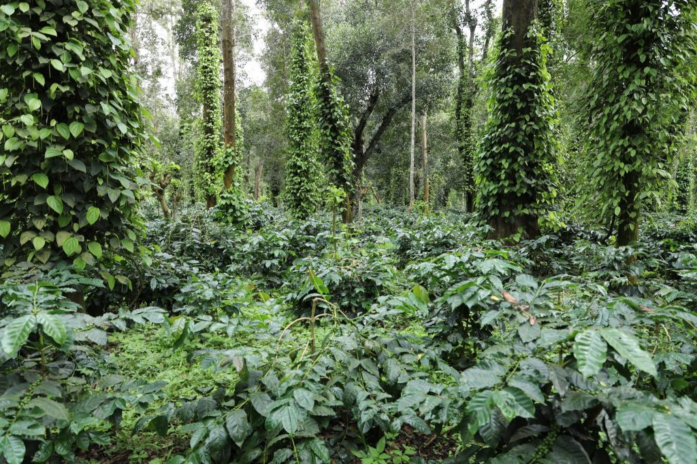
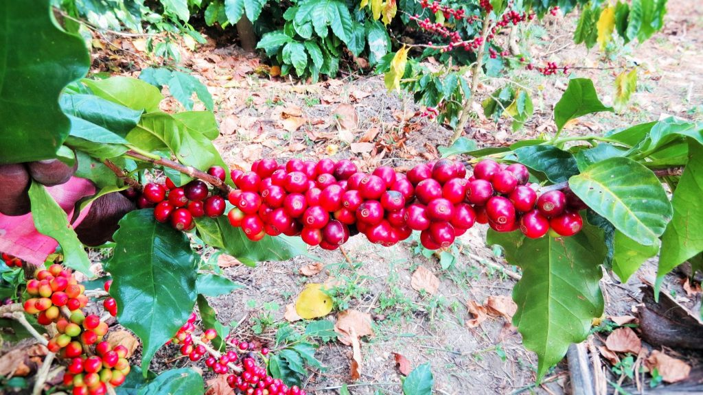
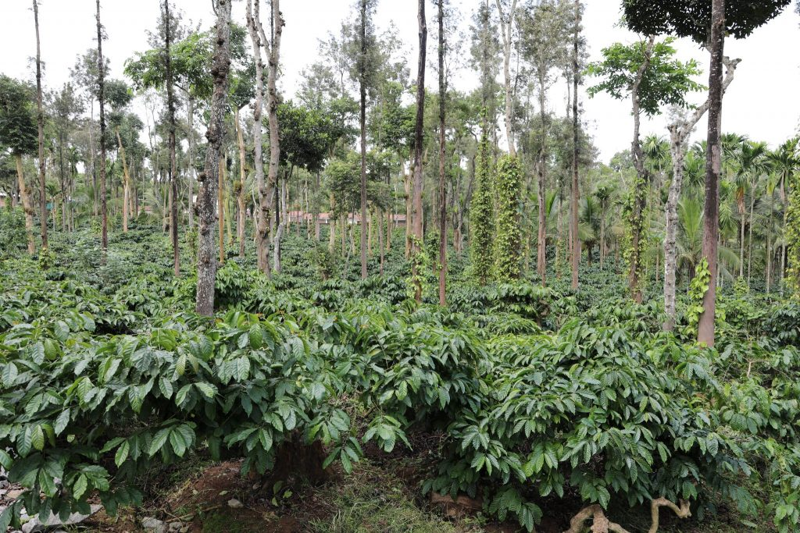

In recent years, the Plantation Community is experimenting with new ideas and the prime reason for this transformation is the active interest of the younger generation who have dug in their heels head on into the Plantation. This indeed is a positive sign because it will enable the coffee sector to be vibrant with newfound energies and scintillating ideas.

In this paper, we wish to highlight the agents responsible for Biological Nitrogen Fixation as an important source of nitrogen to augment the nutritional requirement of multiple crops within the coffee ecosystem. More importantly, the new focus in plantation research is to shift away from fossil fuel or hydro carbon intensive technologies towards safer and non-polluting, highly energy efficient biological systems involving a host of different microorganisms.

As Microbiologists and Horticulturists, we have isolated beneficial microorganisms from our very own coffee Plantation, involved in various transformations and have successfully inoculated these bio fertilizers, systematically into various coffee blocks,  over a period of three decades. We are happy to state that the Coffee Community is taking serious note of our work and are trying to replicate the same in their respective plantations.

Nitrogen fixation, then is a subject of immense practical significance because it has far reaching consequences in terms of sustainable yield and also the overall health of the coffee ecosystem. Review of literature states that , nitrogen fixing systems once thought to be trivial are increasingly been recognized as important and exploitable because of the availability of modern sophisticated tools in accurately measuring biological nitrogen fixation.

Earth’s atmosphere is about 78% nitrogen, making it the largest pool of nitrogen. Most of it is unavailable for plant growth and development. We do know that fixed nitrogen is a limiting nutrient for life on this planet. In order for nitrogen to be used for growth it must be “fixed” (combined) in the form of ammonium (NH4) or nitrate (NO3) ions. Hence, nitrogen is often the limiting factor for growth and development of coffee and multiple crops associated in the Coffee Agroforestry ecosystem. However, nature has gifted the Planting community with microbes capable of fixing atmospheric nitrogen and making it available to the plants in the available form.

The downside of Industrial fixation is that it is a highly energy intensive process requiring fossil fuels which are depleting at an alarming rate.

In the past four decades, the unrestricted and unregulated use of nitrogenous fertilizers, especially in the underdeveloped and developing world has resulted in serious environmental consequences in terms of nitrate pollution in water bodies, eutrophication of aquatic habitats, soil sickness and increased pest and disease incidence. A big disadvantage with synthetic nitrogenous fertilizers is that it can undergo sudden transformations (Volatilization, Leaching, Denitrification) and is either lost to the atmosphere or fixed in the soil due to unfavourable weather conditions. The efficiency of applied fertilizer nitrogen in field conditions is only 25 to 30 %. On the other hand Biological Nitrogen Fixation is efficient and is readily available to the plant for uptake. The losses are bare minimum but the disadvantage is that the rates of nitrogen fixation per unit area are relatively small depending on the crop and the microorganisms involved require ideal host plants in symbiotic associations or ideal soil and climatic factors for improved nitrogen fixation. Economic and environmental factors favour biological nitrogen fixation as the choice of nitrogen for the future well being of the Planet.

### Biological Nitrogen Fixation

Biological Nitrogen Fixation is the conversion of atmospheric nitrogen gas by the activity of microbes into more active form of nitrogenous compounds (Ammonia), in the presence of the enzyme nitrogenase, which is readily incorporated into the tissue and absorbed by the plants. Nitrogen present in the atmosphere in the dinitrogen (N=N) form, therefore, the microorganism which fixes nitrogen is called diazotrophs. Biological nitrogen fixation occurs in a variety of bacterial species, especially in rhizobia, photosynthetic bacteria and cyanobacteria. The process is carried out by two main types of microorganisms, known as symbiotic and non-symbiotic (Free living).

### Nitrogen & Coffee

Nitrogen is essential for many biological processes; and is crucial for any life here on Earth. Nitrogen is a key element for the synthesis of proteins, nucleic acids and other cellular constituents. It is basically present in all life forms. In plants, much of the nitrogen is used in chlorophyll molecules which are essential for photosynthesis and further growth. It is also present in chlorophylls, alkaloids and cytochromes. The nitrogen energy requirement is significantly high and needs to be present at all stages of plant growth and development right up to the maturity of the berries. Due to the micro climate availability inside coffee forests much of the energy balance can be provided by beneficial nitrogen fixers at various stages of crop development.

### Table-1. Sources of Nitrogen for crop production

ORIGIN

MILLIONS OF METRIC TONNES

Industrial Fixation (Fertilizer)

42

Biological Nitrogen Fixation

175

Agricultural Soil

90

Crop Legumes

40

Crop Non Legumes

09

Meadows and Grass Lands

45

Lightning

10

Combustion

20

Ozonization

15

It is an established fact that microorganisms have a central role to play in biological nitrogen fixation , thereby providing significant amounts of Nitrogen to all crops as well as trees inside coffee forests.

The agriculture systems of the world depend on two sources of nitrogen. First, Industrial Nitrogen production which in turn depends on fossil fuels as raw material. Second, Biological Nitrogen Fixation, mediated by various groups of microorganisms. Rough, but predictable estimates point out that Biological Nitrogen Fixation, worldwide is more than three times that of Industrial Fixation.

### Nitrogen Fixing Systems

Asymbiotic Or Free Living Nitrogen Fixers

In Asymbiotic nitrogen fixation, the microorganisms involved in nitrogen fixation do not need an obligate host for protection. Some of the bacteria and most of the cyanobacteria comprise this class of microorganisms. They are also called free-living diazotrophs. Among cyanobacteria unicellular, filamentous non-heterocystous and filamentous heterocystous fix nitrogen independently. Both aerobic and anaerobic bacteria are free-living diazotrophs. Water, oxygen, nutrients are required in optimum amount, so that, the microorganism can grow. Although free-living, N2-fixing microorganisms are widely distributed in soils, the quantity of nitrogen they fix seldom approaches that of the symbiotic systems.

Bacteria can be classified based on how they use oxygen. Obligate aerobes are obligated to use oxygen, meaning they have to have oxygen in the environment in order to survive. Obligate anaerobes do not require oxygen, and many cannot even live in the presence of oxygen. Facultative anaerobes are the most versatile type of bacteria; they can live either with or without oxygen.

Microaerophillic

Bacteria which are capable of fixing atmospheric nitrogen under very low oxygen conditions. The enzyme nitrogenase responsible for nitrogen fixation is highly sensitive to high levels of oxygen.

Facultative nitrogen fixers can either be aerobic (in presence of oxygen fix nitrogen) or anaerobic which fix nitrogen in the absence of oxygen.

Symbiotic

In a symbiotic association the microorganism responsible for nitrogen fixation requires a host for the protection. The host plant providing the protection is referred to as the macro  symbiont and the microbe providing nitrogen to the plant is referred to as the micro symbiont. In this association both the partners are benefitted.

Associative

There is an intermediate biological system referred to as associative N2 fixation. Nitrogen fixing microorganism form symbiotic association with the grasses without nodule formation. Such association is called associative nitrogen fixation.

### Conclusion

Many questions remain unanswered with respect to nitrogen availability in the coffee ecosystem. Relatively little is known about annual inputs of nitrogen fixation through biological means. An audit needs to be done to understand the amounts of nitrogen fixed through biological means. The eco-friendly shade coffee ecosystem in India is an ideal breeding ground for beneficial microbes. As a microbiologist involved in isolation of various microbes, we are certain that the humus rich coffee forests are teaming with a multitude of beneficial microbes, both aerobic, micro aerophillic and anaerobic. We request the research wing of the Coffee Board to develop a low cost technology to enable the Planters to isolate beneficial microbes from their respective plantations and screen them for higher efficiency in nitrogen fixation.

### References

Anand T Pereira and Geeta N Pereira. 2009. Shade Grown Ecofriendly Indian Coffee. Volume-1.

Bopanna, P.T. 2011.The Romance of Indian Coffee. Prism Books ltd.

Anand Titus Pereira & Gowda. T.K.S. 1991. Occurrence and distribution of hydrogen dependent chemolithotrophic nitrogen fixing bacteria in the endorhizosphere of wetland rice varieties grown under different Agro climatic Regions of Karnataka. (Eds. Dutta. S. K. and Charles Sloger. U.S.A.) In Biological Nitrogen Fixation Associated with Rice production. Oxford and I.B.H. Publishing. Co. Pvt. Ltd. India.

Booker, Karen. 2000. Fertilizers and Soil Amendments: It’s Tricky Business. Erosion Control Feature Article, September/October.

Martin Alexander. 1978. Introduction to soil microbiology. Second edition. Wiley Easter Limited. New Delhi.

[Biological Nitrogen Fixation Best Results From Wikipedia](https://web.archive.org/web/20190513100526/http://www.edurite.com:80/kbase/asymbiotic-nitrogen-fixation) 

[Symbiotic](https://www.researchgate.net/publication/279534008_Symbiotic_and_Asymbiotic_N2_Fixation)

[Bacteria](https://www.ijcmas.com/vol-3-3/Maheep%20Kumar.pdf)

[Symbiotic and Asymbiotic](https://www.researchgate.net/publication/279534008_Symbiotic_and_Asymbiotic_N2_Fixation)

[Facultative Aerobes](http://study.com/academy/lesson/facultative-aerobes-definition-examples.html)

[The world fertilizer outlook](http://www.fao.org/3/a-i4324e.pdf)

[Nitrogen Fixation](https://web.archive.org/web/20160729012828/http://rubisco.ugr.es/fisiofar/pagwebinmalcb/contenidos/Tema13/N_fijacion.pdf)

[The Microbial World](http://archive.bio.ed.ac.uk/jdeacon/microbes/nitrogen.htm)

[Forage Information System](http://forages.oregonstate.edu/nfgc/eo/onlineforagecurriculum/instructormaterials/availabletopics/nitrogenfixation/definition)

[Nitrogen Fixation Types](http://www.biologydiscussion.com/nitrogen-fixation/types-nitrogen-fixation/nitrogen-fixation-types-physical-and-biological-nitrogen-fixation-with-diagram/14969)