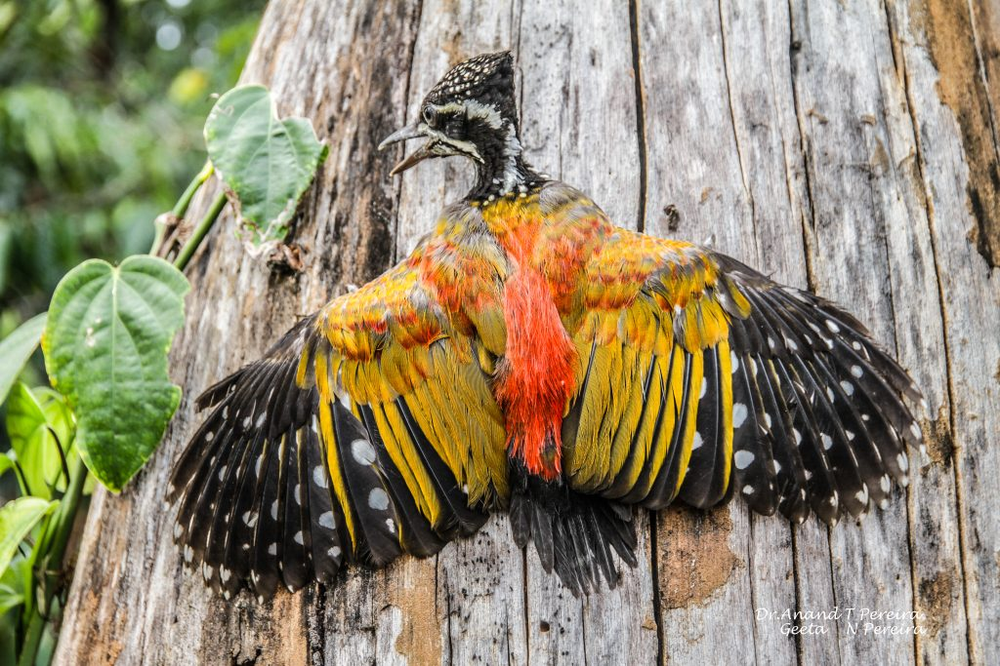
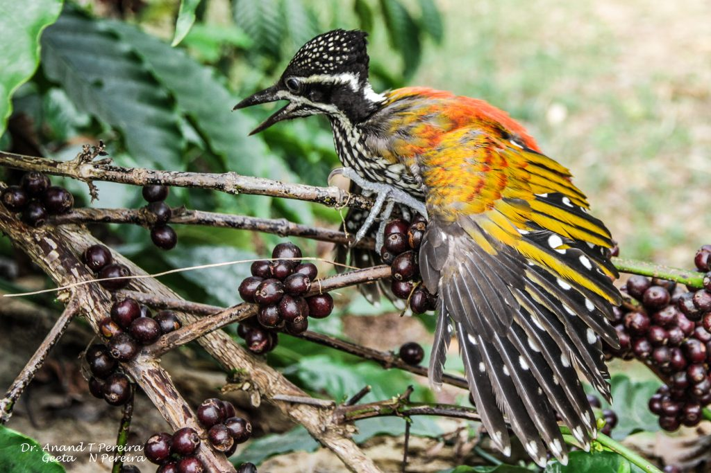

Woodpeckes are found in a variety of colours and patterns. Woodpeckers in coffee plantations have black and white spots and shades of yellow and red feathers which aid in camouflage. Woodpecker, any of about 200 species of birds that constitute the subfamily Picinae (true woodpeckers) of the family Picidae (order Piciformes), noted for probing for insects in tree bark and for chiselling nest holes in deadwood. Woodpeckers occur nearly worldwide, except in the region of Australia and New Guinea, but are most abundant in South America and Southeast Asia. Woodpeckers in Asia are almost as diverse as they are in South America. There are between 75 and 80 species in Asia.  
The black-rumped flame back, also known as the lesser golden-backed woodpecker or lesser golden back, is a common bird  inside coffee forests. It is one of the few woodpeckers that has a characteristic flying pattern which can be easily identified from afar. At first, we were under the impression that the tapping sound made by the woodpecker was a result of the impact of the hammering onto the trees. Only when we spoke to bird experts, did we know that woodpeckers do not have vocal cords. Both the males and females have the ability to peck trees, and none of them has vocal cords, so they use the pecking as a way of communication as well. In fact, Woodpeckers advertise their presence by drumming rapidly on a tree. Different species have different time intervals between knocking.

### Classification table is as follows.

KINGDOM Animalia

PHYLUM Chordata

CLASS Aves

ORDER Piciformes

FAMILY Picidae

GENUS Dinopium

SPECIES Dinopium benghalense

### **Distribution**

The black-rumped flame back, also known as the lesser golden-backed woodpecker or lesser golden back, is a woodpecker found widely distributed inside coffee forests. It is also associated with open forest and cultivation.

Continent. Asia

Countries. [India,](https://animalia.bio/india-animals) [Bangladesh,](https://animalia.bio/bangladesh-animals) [Bhutan,](https://animalia.bio/bhutan-animals) [Myanmar,](https://animalia.bio/myanmar-animals) [Nepal,](https://animalia.bio/nepal-animals) [Sri Lanka,](https://animalia.bio/sri-lanka-animals) [Pakistan](https://animalia.bio/pakistan-animals)

Biogeographical Realms Indomalayan

###  **Description**

The adult male Black-rumped Flameback is a large species, 26 to 29 cm in length has distinctive golden yellow wing coverts. The bird has a red crown and crest. The underparts are white with dark chevron markings. The black throat finely marked with white. The head is whitish with a black nape and throat, and there is a greyish eye patch.

Females have a black fore crown spotted with white, with red only on the rear crest.

Young birds are like the female, but duller.

### **Feet**

Zygodactyl feet. While two toes face forward, the other two are bent backward. The toe arrangement helps them to get a good grip of trees and move vertically up the tree trunk.

### **Beak**

Woodpeckers have a straight, chisel-shaped bill. Strong and Sharp beaks for effective drilling into the trunk.

### **Behaviour**

These birds are often observed in pairs and can be seen foraging on the floor of the coffee forest as well as the canopy of trees.

The long tongue can be darted forward to capture insects.

### **Habitat**

These woodpeckers are often seen flying from semi dried branches to dead standing trees in search of beetles. They often fly in pairs.

### **Nest**

Most woodpeckers spend their entire lives in trees. They make      holes in the barks and making nests inside the holes. They mostly choose rotten or dead woods to make such nests. Woodpeckers need at least a month to drill a big enough hole to make the nest.

### **Status**

As per ICUN , they come under the category of Least Concern

### **Size**

The adult male Black-rumped Flameback is a large species, 26 to 29 cm in length.

### **Diet**

Insects, larvae, butterflies, Nectar, fruits. Ants, termites, caterpillars, beetles, spiders, lizards, bird eggs, arthropods, tiny rodents, etc.

### **Special Adaptations**

Woodpeckers’ tongues are usually about twice the length of their bill so that they can reach for insects inside the holes they peck out. When not in use, the long tongue curls around the back of the head between the skull and the skin.

Their tongues are also sticky. Most woodpeckers have either barbed tongues or sticky saliva that helps them pull out insects they find in their holes.

### **Breeding**

The breeding season varies with weather and is between February and July. They frequently drum during the breeding season. The eggs are laid inside the unlined cavity. The normal clutch is three and the eggs are elongate and glossy white. The eggs hatch after about 11 days of incubation. The chicks leave the nest after about 20 days.

### **Communication**

They communicate with each other by drumming against wood to make a loud sound. Drumming is one of their unique features.

### **Migration**

Local migration

### **Threats**

Habitat Loss, Deforestation, Excessive use of pesticides and weedicides.

### **Special Characteristic**

A Woodpecker is the only species in the animal kingdom that can make sounds that aren’t inside from their body. They drum in various ways on different things to send signals to the other Woodpeckers. Each drumming pattern carries different messages.

### **Conclusion**

Woodpeckers play a beneficial role inside the coffee ecosystem as ecosystem engineers. They break down dead wood and expose it to the elements of nature and bring about organic matter decomposition, increasing the carbon content in the soil. These birds have the ability to eat insect pests and maintain an ecological balance that keeps the predator prey balance in equilibrium.

### **References** 

Anand T Pereira and Geeta N Pereira. 2009. Shade Grown Ecofriendly Indian Coffee. Volume-1.

Bopanna, P.T. 2011. The Romance of Indian Coffee. Prism Books ltd.

 [Black-rumped Flameback Woodpeckers](https://earthlife.net/black-rumbed-flameback-woodpecker/)

[Birds LESSER GOLDENBACK](https://www.natureweb.net/taxa/birds/blackrumpedflamebackwoodpecker)

[Amazing facts](https://www.outdoorrevival.com/facts/amazing-facts-about-woodpeckers.html)

[ANIMALIA](https://animalia.bio/black-rumped-flameback#:~:text=The%20black%2Drumped%20flameback%20is,white%20with%20dark%20chevron%20markings).

[Black-rumped](https://en.wikipedia.org/wiki/Black-rumped_flameback)

[BLACK-RUMPED FLAMEBACK](https://animalia.bio/black-rumped-flameback#:~:text=The%20black%2Drumped%20flameback%20is,white%20with%20dark%20chevron%20markings).

[woodpecker](https://www.britannica.com/animal/woodpecker)

[Woodpecker Information](https://www.vedantu.com/animal/woodpecker)

[Learn about the amazing birds](https://www.scienceofbirds.com/blog/woodpeckers-picidae)

[NINE FUN FACTS ABOUT WOODPECKERS](https://dickinsoncountyconservationboard.com/2018/10/10/nine-fun-facts-about-woodpeckers/)