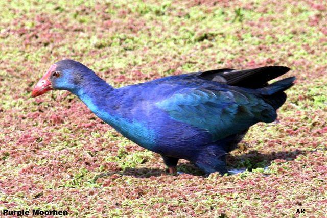
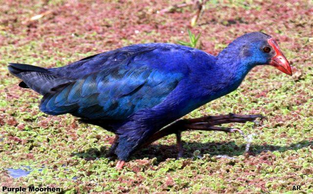
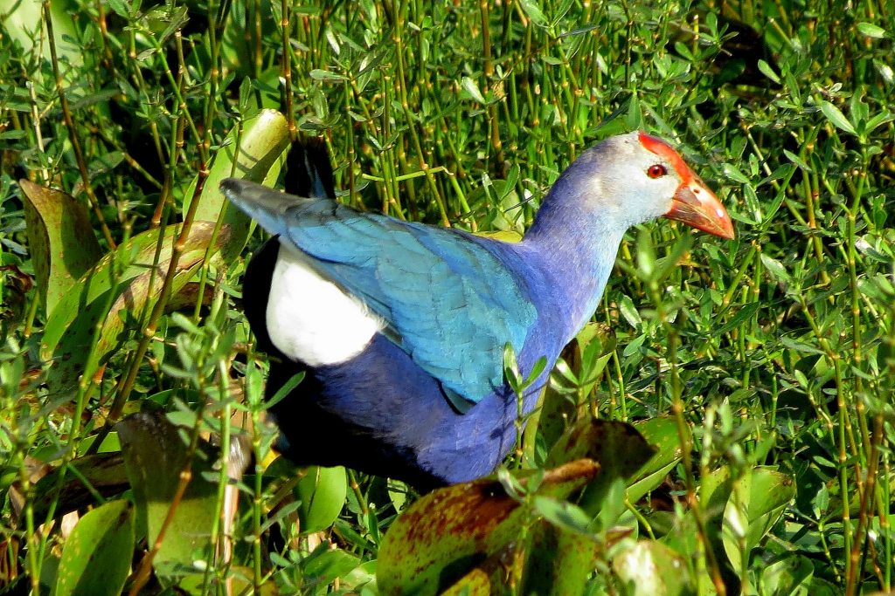
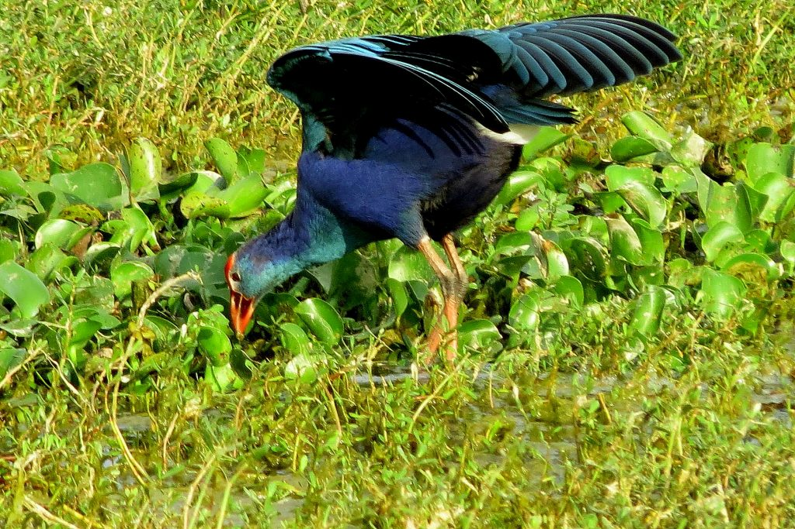
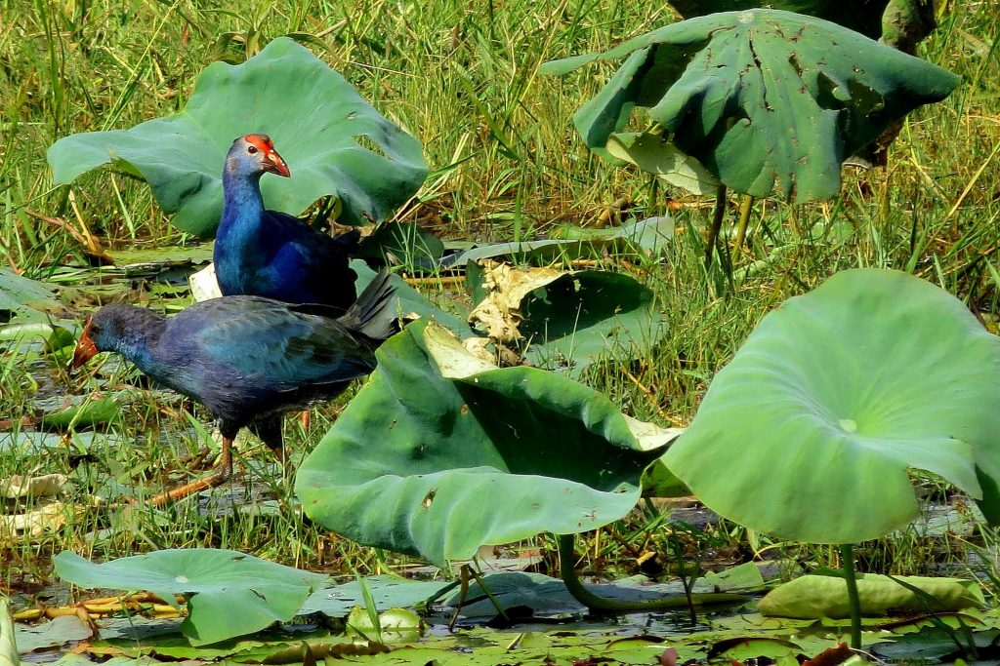
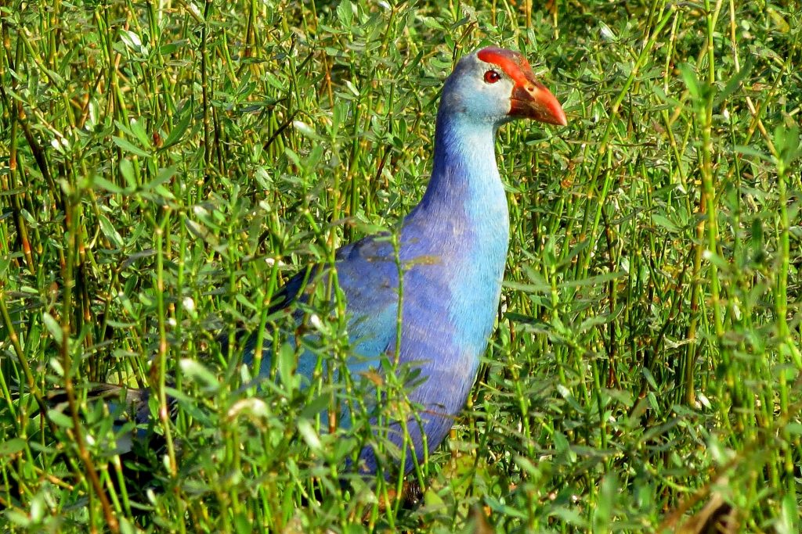
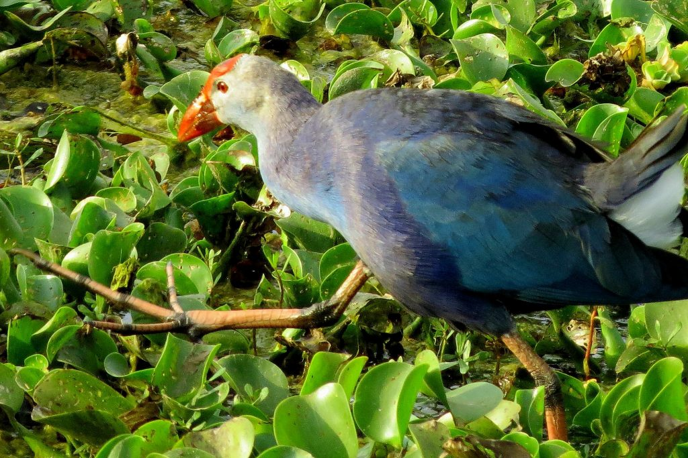

Nestled in the heart of the Western Ghats, coffee forests, provide the ideal habitat for a wide variety of wildlife. These evergreen coffee forests run all along the Western Ghat corridor and is home to one of the world’s veritable treasure houses of biodiversity. New species of birds, animals, insects, microbes and plants are found here regularly.

Around 98 per cent of the India’s coffee output is produced in the Southern States of Karnataka, Kerala and Tamil Nadu. The coffee forest acreage in Karnataka stands at 229,658 hectares, followed by Kerala with 84,948 hectares and Tamil Nadu with 31,344 hectares. The innovative agro forestry practices followed by the planting community, has resulted in the establishment of a symbiosis between planters, and wildlife.

Our earlier articles on shade coffee has stressed on the pivotal role played by the growing community in safeguarding biodiversity and the establishment of a positive eco balance between conservation and development. Around 98% of the coffee out put in the Country is produced in just three States of Karnataka, Kerala and Tamil Nadu.

Very recently, not far away from coffee forests, the first ever bird survey was conducted at the Cauvery Wildlife Sanctuary. The aerial distance connecting the sanctuary to coffee forests is hardly a few kilometers. The survey recorded nineteen more bird species than compiled earlier. Of the new species, at least 13 are confirmed to have been recorded here for the first time. The survey discovered several rare birds. One such bird is the White naped tit or pied crested tit. This was its only record of sighting in entire South India.

The bird is also a critically endangered tit. Three type of warblers-Large billed leaf warbler, Green Leaf Warbler and Western crowned Leaf warbler have also been sighted for the first time. Others include the fairy blue bird, the Indian blue robin, the yellow throated bulbul, the crested Goshawk, rosefinch, fork tailed swift, Orphean warbler and Eurasian bee eater. Another rare bird the Eurasian Craig Martin was also sighted.

We have also sighted many of these bird species inside coffee forests . Alot more needs to be done. It is for this very reason that we keep stressing the importance of carrying out a comprehensive survey of the bird species in all coffee forests, throughout the length and breadth of the Country. This will enable us to understand the wealth of biodiversity within coffee forests. It will also throw light on the new habitats different bird species occupy.

We have provided pictures of the Purple Moor Hen also commonly referred to as the Purple Swamp Hen, which is a very common site in ponds and lakes inside coffee forests.

### Scientific classification

Kingdom:

Animalia

Phylum:

Chordata

Class:

Aves

Order:

Gruiformes

Family:

Rallidae

Genus:

Porphyrio

Species:

P. porphyrio

### Ecology

Purple Moor Hen are wide spread in almost all coffee growing zones in the State of Karnataka. Purple in color with a red patch on the bald head and red beak with long red legs. The male is a glistening purple color and the female is a little duller than the male with greyish-purple color.

However, we have noticed varied colours, with some birds exhibiting deep purple and the others light grey shades. We have reason to believe that this difference in colour depends on specific agro climatic region and more importantly the type of habitat that the bird resides in. Some lakes are swampy and the others have clear water with tall reeds. Our observations point out that the birds residing in swampy lakes are dark purple in colour compared to the ones found in open shallow tanks with tall reeds.

### Behaviour

We have studied this bird for quite a number of years, almost one decade. Irrespective of the size of the tank or lake or marshy habitat, it is quite common to find a dozen or more Purple Moor Hens living in close proximity with other aquatic and semi aquatic birds like common moor hen, Coot, Sand piper, [Bronze winged Jacana](http://ecofriendlycoffee.org/bird-friendly-shade-coffee-and-the-bronze-winged-jacana/), Glossy Ibis, Whistling teals, Egrets, Pond herons, Grey herons and Purple herons. They are good swimmers and can also fly long distances. It is relatively easy to photograph these birds in the wild because they they are quite used to the presence of human beings.

### Breeding

Pairs are often found nesting very close to the edge of ponds and lakes. The nest consists of a large platform of interwoven reeds and twigs. Multiple females may lay eggs on one nest and later help in the after care. Each bird can lay 4 to 5 speckled eggs. The incubation period is 25 to 27 days and is performed by both sexes.

### Diet and Feeding

They often eat tender shoots of lotus or reeds commonly found in lakes and swamps. There are reports that they also eat eggs, beetles, mollusks, small fish and invertebrates.

### Status and conservation

The species is considered to be Least Concern globally by the IUCN. While the species as a whole is not threatened.

### Threats

The only major threat is from water pollution, especially toxic residues of fertilizers and pesticides entering the water bodies. This can largely impact the egg shell as well as the clutch size.

### References

[Full gallery](http://www.flickr.com/photos/108766628@N08/sets/72157639771683214/)

[http://ecofriendlycoffee.org/eco-friendly-indian-coffee-a-profile/](http://ecofriendlycoffee.org/eco-friendly-indian-coffee-a-profile/)

[http://ecofriendlycoffee.org/bird-friendly-shade-coffee-and-the-brahminy-kite/](http://ecofriendlycoffee.org/bird-friendly-shade-coffee-and-the-brahminy-kite/)

[http://ecofriendlycoffee.org/bird-friendly-shade-coffee-and-the-pied-kingfisher/](http://ecofriendlycoffee.org/bird-friendly-shade-coffee-and-the-pied-kingfisher/)

[http://ecofriendlycoffee.org/bird-friendly-shade-coffee-and-the-black-crowned-night-heron/](http://ecofriendlycoffee.org/bird-friendly-shade-coffee-and-the-black-crowned-night-heron/)

[http://ecofriendlycoffee.org/a-symphony-of-birds-inside-coffee-forests/](http://ecofriendlycoffee.org/a-symphony-of-birds-inside-coffee-forests/)

[http://ecofriendlycoffee.org/aquatic-birds-of-the-western-ghats/](http://ecofriendlycoffee.org/aquatic-birds-of-the-western-ghats/)

[http://ecofriendlycoffee.org/coffee-forests-and-green-national-accounts/](http://ecofriendlycoffee.org/coffee-forests-and-green-national-accounts/)

[http://ecofriendlycoffee.org/coffee-forest-symbiosis/](http://ecofriendlycoffee.org/coffee-forest-symbiosis/)

[http://ecofriendlycoffee.org/coffee-forests-and-wildlife-credits/](http://ecofriendlycoffee.org/coffee-forests-and-wildlife-credits/)

[http://en.wikipedia.org/wiki/Purple\_Swamphen](http://en.wikipedia.org/wiki/Purple_Swamphen)

Anand T Pereira and Geeta N Pereira. 2009. Shade Grown Ecofriendly Indian Coffee. Volume-1.

Bopanna, P.T. 2011.The Romance of Indian Coffee. Prism Books ltd. Perrins, C. (Ed.). (2003).

BirdLife International (2012). “Porphyrio porphyrio”. IUCN Red List of Threatened Species. Version 2013.2. International Union for Conservation of Nature.