Millions of birds migrate each year into the Western Ghats which provides a safe haven for all types of wildlife, especially birds. We have observed migratory birds flying over distances of hundreds and thousands of kilometers in order to reach the Western Ghats to feed and breed. Shade grown ecofriendly coffee plantations with steep valleys, wetlands and  mountain tops not only provide suitable breeding grounds for all types of birds, but most importantly provide refueling stops for migratory birds to rest and feed.

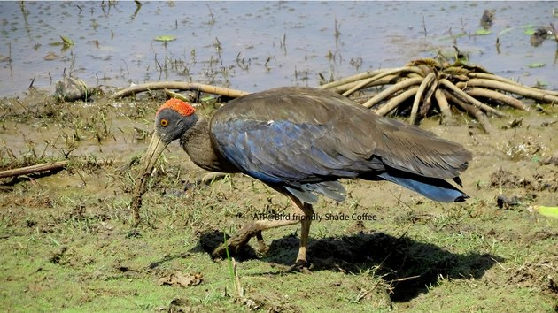

**World Migratory Bird Day (WMBD)** was initiated in 2006 and is a global awareness-raising campaign highlighting the need for the protection of migratory birds and their habitats. On the second weekend each May, people around the world take action and organise public events such as bird festivals, education programmes and bird watching excursions to celebrate World Migratory Bird Day and to help raise awareness around a specific theme.  This brief article is to raise awareness about the threats to migratory birds inside shade grown ecofriendly coffee forests.

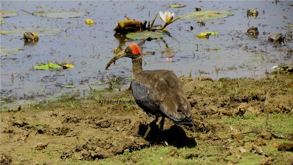

**[Scientific classification](http://en.wikipedia.org/wiki/Biological_classification)**

Kingdom:

[Animalia](http://en.wikipedia.org/wiki/Animal)

Phylum:

[Chordata](http://en.wikipedia.org/wiki/Chordate)

Class:

[Aves](http://en.wikipedia.org/wiki/Bird)

Order:

[Pelecaniformes](http://en.wikipedia.org/wiki/Pelecaniformes)

Family:

[Threskiornithidae](http://en.wikipedia.org/wiki/Threskiornithidae)

Genus:

_[Pseudibis](http://en.wikipedia.org/wiki/Pseudibis)_

Species:

**_P. papillosa_**

###  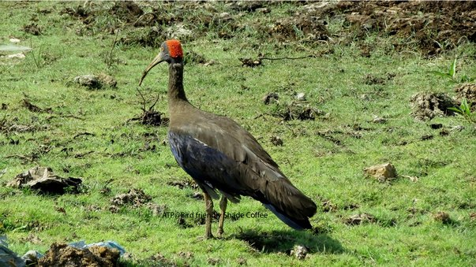

### Description

The Red-naped Ibis (_Pseudibis papillosa_) also known as the Indian Black Ibis or just the Black Ibis, is a species of [ibis](http://en.wikipedia.org/wiki/Ibis) found in parts of the [Indian Subcontinent](http://en.wikipedia.org/wiki/Indian_Subcontinent). These birds are not very uncommon inside shade grown ecofriendly Indian Coffee Plantations, especially during the months of January and February. It is a medium sized bird of about 68 cm length with a wing span of about 38 cm having a 16 to 19 cm long tail.

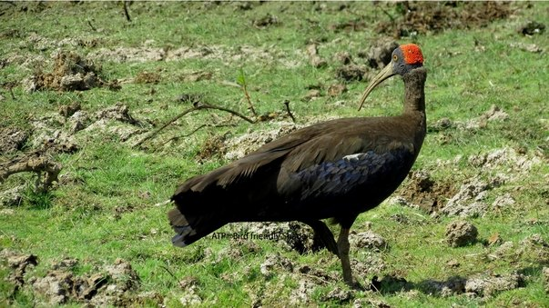

The adult bird has a triangular patch of red warts on the head and extending about 13 to 17 cm long down curved bill. It has an inner lesser wing covert with a white shoulder patch that is visible while the bird is in flight. The neck, mantle, lower back, rump and lower plumage are all brown. The scapulars and back feathers are bronze green. The tail is black and richly glazed with blue green. The wings are black, glazed blue and secondary feathers of wing are sometimes flecked with white. A large, brood patch of white runs along the leading edge of the wing on the lesser wing coverts to well below the carpal joints. 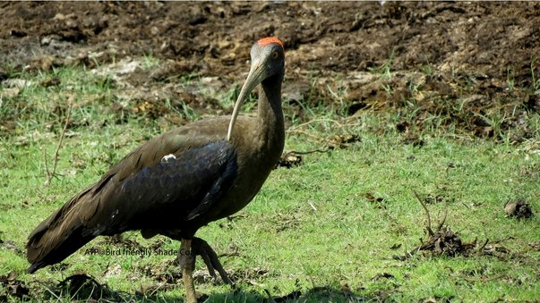

Although prominent in flight, this features shows only a thin white line when the wings are closed. The short legs are hidden beneath the steel blue tail in flight. The tibia has feathering half way to the tarsus joint. The head, somewhat square shaped is black and distinctively capped with a triangular patch of warty red skin, absent in juveniles. The eye is orange red to bright red. The curved bill and the broad stubby feet are horn coloured. The iris, legs and feet turn bright red at the commencement of breeding. The male is slightly larger than the female.

### Distribution and habitat

### 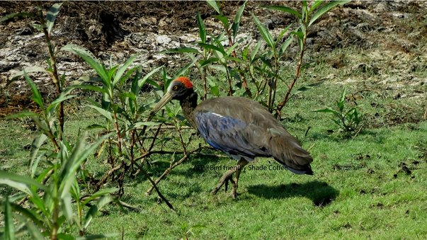

We have observed a flock of Red naped Ibises’ in different coffee locations, either in pairs or in a group consisting of six to seven. These big birds easily adapt to human habitation and are seen foraging very close to water bodies, rivulets and streams. They are not solitary in nature and mix freely with other aquatic bird species. They are seen in almost all Coffee growing regions, irrespective of elevation and topography.

### Behaviour and ecology

### 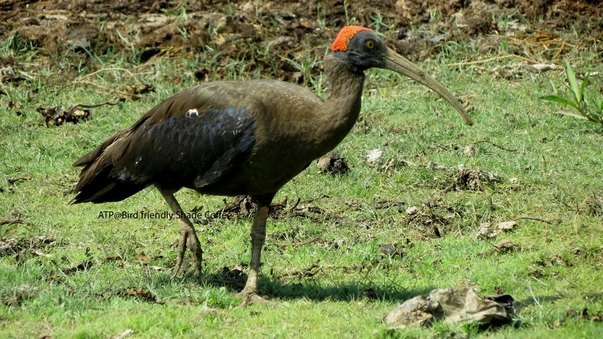

They are not solitary in nature and mix freely with other aquatic bird species, without any territorial markings. When they sense danger, they quickly walk from one place to another and seldom fly, even though they are good flyers. Our observations also point out that these birds spend equal amount of time foraging on dry land as well as aquatic habitats.

### Feeding

### 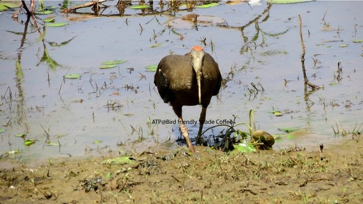

The Ibis exhibits several kinds of feeding behaviour that can be broadly classified as Probing behaviour, Bill dragging, flipping, and foot raking. They are found to feed on beetles, snails, fish, plant matter, animal matter, insects and also on organic matter.

### Conservation Status

**[Conservation status](http://en.wikipedia.org/wiki/Conservation_status)**

[Least Concern](http://en.wikipedia.org/wiki/Least_Concern) ([IUCN](https://en.wikipedia.org/wiki/IUCN_Red_List)

### Nesting

These birds nest in trees close to water bodies and also build nests in tall trees with many branches. It is common to see the red ibis nesting on the same tree with a host of other bird species.

### Breeding

### 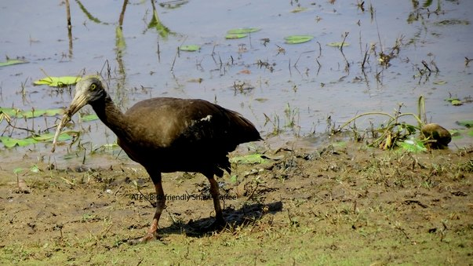

The breeding season commences from March to October. The female lays approximately 3 to 4 eggs, ellipsoid in shape, plain and dull white with bluish tinge and dark red spots. Both the parents incubate the eggs for a period of approximately 4 weeks.

### Conclusion

### 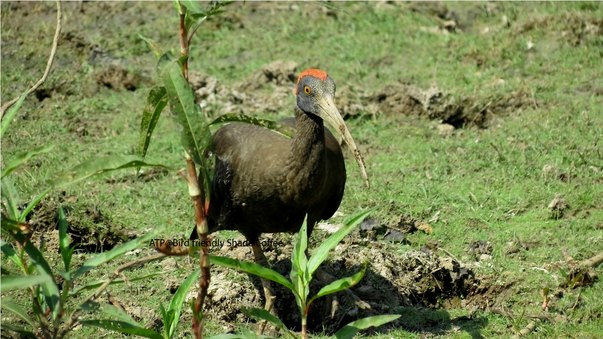

In the past two decades, the Coffee hot spot is being degraded at an alarming rate due to habitat fragmentation, construction of mini hydel projects, dams, wind mills, mining and construction of a vast net work of rail and roads. The Coffee landscape too is rapidly changing due to a host of reasons beyond the control of coffee farmers.

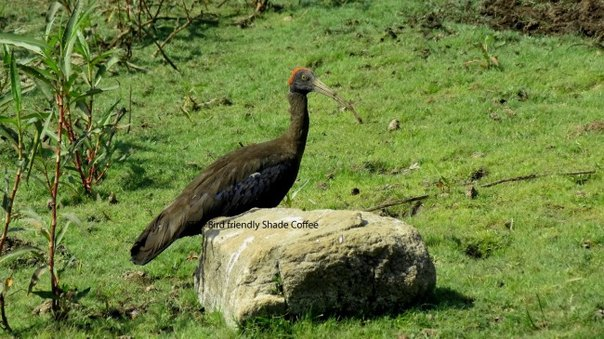

Conversion of wetlands into ginger and coffee, Marshy areas being planted with palm oil, mono culture of silver oak and other tree species which are not fruit bearing. The effect of pesticides and weedicides, pollution, over exploitation and impact of climate change has also had telling effects on all migratory birds. If this trend continues, some species may be extinct within a few years and others may face significant population losses.

### References

[Full Gallery](https://www.flickr.com/photos/67484414@N08/sets/72157643113008025/)

[Anand T Pereira and Geeta N Pereira. 2009. Shade Grown Ecofriendly Indian Coffee. Volume 0ne.](/textbook/)
