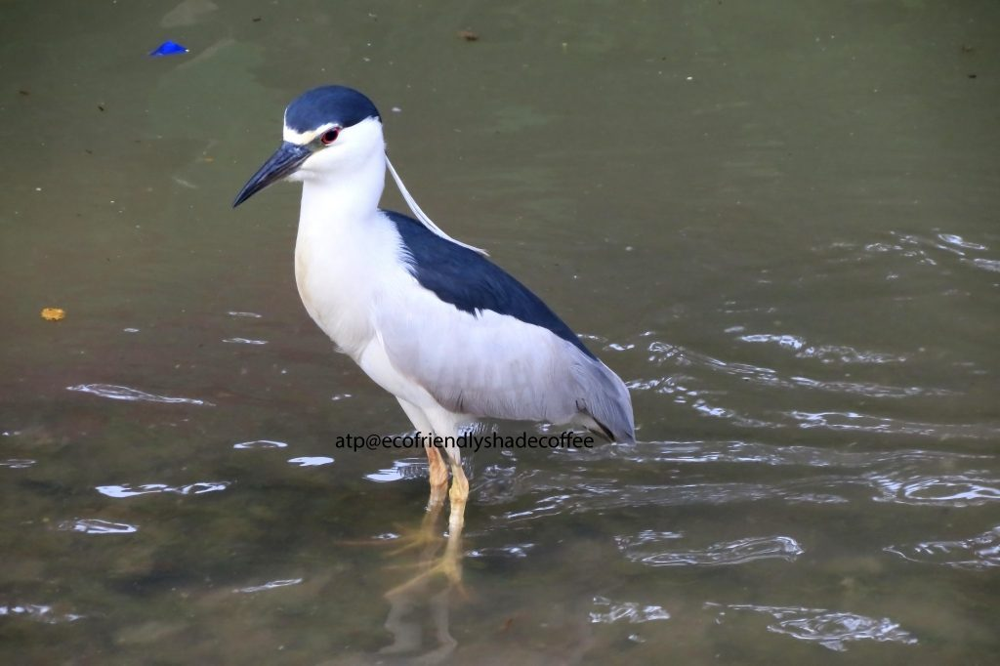
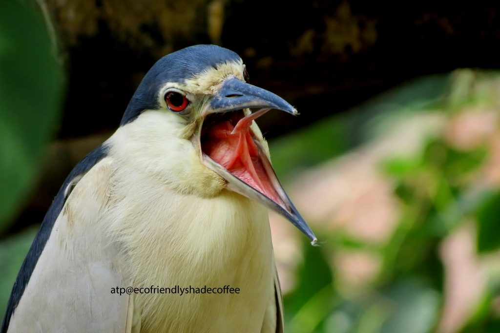
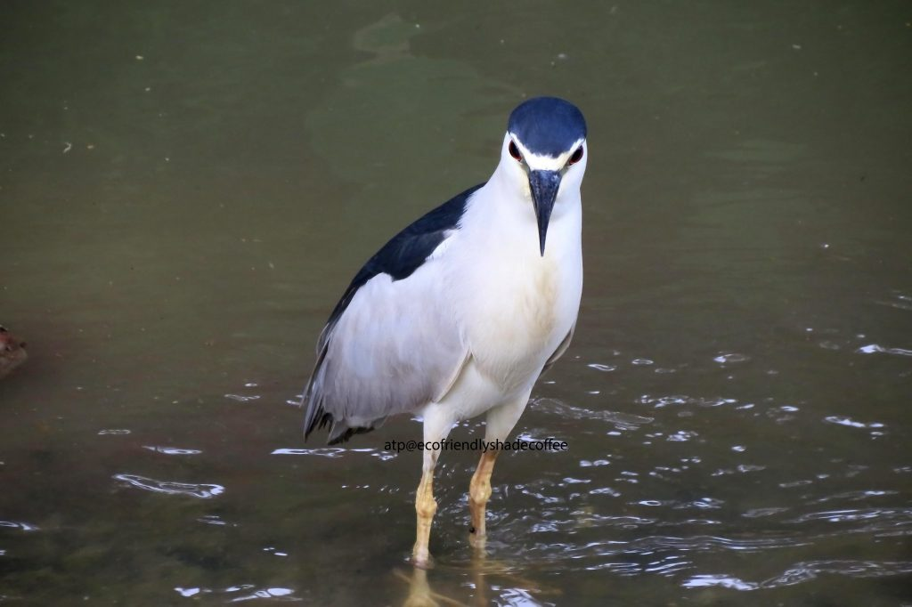
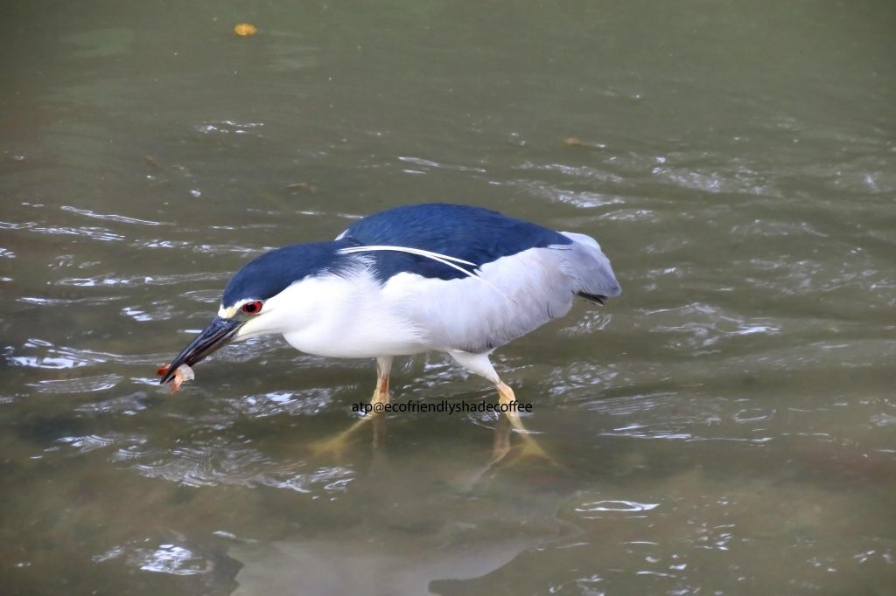
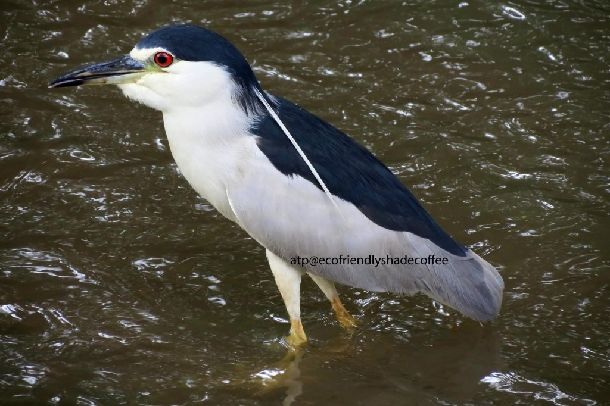
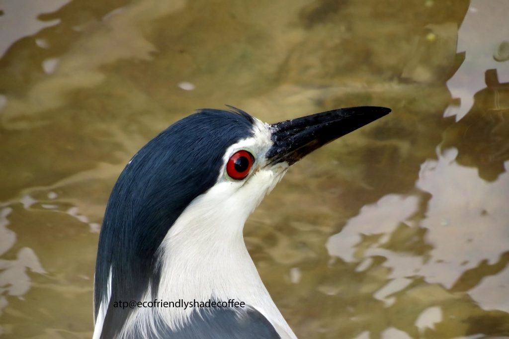

_Kindly refer to our earlier article; [Bird Friendly Shade Coffee and the Pied Kingfisher](/bird-friendly-shade-coffee-and-the-pied-kingfisher/) for a better understanding of the Significance of Birds, inside shade grown ecofriendly coffee forests._

In writing this short article we have focused on two very important aspects. To highlight the avian fauna inside Shade Grown Ecofriendly Indian Coffee Forests and secondly to highlight the risks faced by migratory birds inside coffee forests.

The Black crowned Night Heron is also commonly referred to as the Night Heron. Most colonies are associated with wet lands such as swampy areas, marshes, streams, rivulets, ponds and lakes of the Western Ghats.

### Chemicalization inside Shade Coffee

In the quest for improving yields, the Coffee Board has embarked on an ambitious project of doubling the yield of coffee on a per hectare basis with the introduction of modern highbred and high yielding varieties. This in turn has lead to the over chemicalization of coffee farms. Among the various pesticides used in the Country, insecticides constitute 75%, fungicides 15%, weedicides 6% and others 4%.

Our viewpoint is that chemical application is fine if it is used as per the recommendations of the manufacturer. However, over the years, indiscriminate use of chemical fertilizers, pesticides (insecticides, fungicides, weedicides, herbicides, nematodicides, and rodenticides) has threatened the fragile coffee ecosystem due to the extremely high levels of nitrates and nitrites which has resulted in the breakdown of food chains vital for the survival of both migratory and resident birds.

Pesticide residue cycle in the environment starts right from the stage of application for the purpose of pest control, leading to the contamination of every constituent of the environment, especially non targeted flora and fauna. For Example: Excessive use of DDT results in skeletal shelled bird eggs, threatening reproduction and ultimately leading to decline in bird populations.

One way of solving this problem is to enlighten and educate the Plantation community on Integrated Pest Management (IPM). This method can go a long way in controlling (not totally eliminating pests) pest damage in the most economical way and with the least possible risk to people and the ecosystem involved.

The use of biopesticides which includes naturally occurring substances that control pests (biochemical pesticides), microorganisms, that control pests (microbial pesticides) and plant derivatives (plant incorporated protectants, Awareness, through electronic media, billboards and pamphlets will bring about a responsible outlook in the way farmers use chemicals, thereby protecting the food chain and food web.

The black crowned Night heron is classified under:

**Phylum:** Chordata

**Order:** Ciconiiformes

**Class:** Aves

**Family:** Ardeidae

**Genus:** Nycticorax

**Characteristics:** The black-crowned night heron is 23-28 inches tall. It has a wingspan of almost four feet. It is a medium-sized heron with a stocky body and short legs and neck. It has a black crown and back, gray wings and a white underside. Adults have red eyes and yellow legs and feet. The adults has typical coloring with black cap.

In breeding season adults have two long white plumes on their heads. Females and males look alike, but females are a little smaller.

Immature night herons have a gray-brown head, chest, and belly streaked with white. Their eyes are yellow and they have gray legs. Black-crowned night herons don’t have adult plumage until they are around three years old.

**Diet:** The black-crowned night heron hunts for food in the early morning hours and at dusk. It stands and waits for prey like frogs and fish to pass by and them snatches them up with its bill. It sometimes raids the nests of other herons and birds and steals the chicks. It also eats amphibians, crustaceans, insects and small mammals.

**Life cycle:** The female black-crowned night heron lays three to five eggs in a nest in the reeds or thicket and occasionally in a tree. The nests are made of sticks and twigs. The chicks hatch in 24-26 days. Both parents incubate the eggs and feed the chick’s regurgitated food. Black-crowned night herons nest in colonies and will often nest with other bird like ibises and other herons. The chicks will fledge in 42-49 days.

**Range:** The black-crowned night heron breeds in many places all along the Western Ghats. Migration happens in large flocks.

**Habitat:** The black-crowned night heron lives in lakes, tanks, rivers streams, fresh and saltwater marshes, and swamps.

**Behavior:** Male night herons use their nests to attract a mate. The same nest may be used for many years.

**Reproduction:** Night herons are supposed to be monogamous. There is one brood per season. Mates are known to perform aggressive snap displays in order to select the right mate. At the time of pairing, the legs of both sexes turn pink. There is one brood per season.

**Nesting:** They build nests very close to the tree trunk. Depending on the size of the tree, each tree can house approximately25 to 30 nests. The nest consists of twigs, dried grass or leaves. Three to four eggs are laid at two day intervals, beginning 4 to 5 days after pair formation. Incubation which lasts approximately 25 days is carried out by both adults. Eggs are green in color. At times Parents wet their feathers to prevent the eggs from high temperature.

**Parenting:** Both Parents brood the young. In two to three weeks the young leave the nest and in approximately two months they fly to new feeding grounds.

**Behavior:** Black crowned night herons are found to associate with other water birds, provided there is abundant food in a particular location. We have observed that a sizeable population of these birds not only feed at dusk but also during the daytime. They are known to aggressively defend their feeding and nesting territory.

**Food:** These birds are often seen in wetlands and marshy areas where they feed on earthworms, leeches, frogs, rodents, mollusks and other insects.

**Conservation:** According to the ICUN Red list, the Night heron is categorized as “LEAST CONCERN”.

Habitat destruction is also a cause of concern. Most wetland habitats are drained of water and converted into oil palm plantations resulting in a reduced amount of prey. Chemical fertilizer contamination and water pollution are areas of concern.

Due to their wide geographic distribution, these birds play an important role in monitoring the environment quality.

### References

[Full Photo Gallery](http://www.flickr.com/photos/108766628@N08/sets/72157637670216744/)

[Azolla, coffee and species preservation](http://theazollafoundation.org/features/azolla-and-coffee/)

[A Symphony of Birds Inside Coffee Forests](/a-symphony-of-birds-inside-coffee-forests/)

[Aquatic Birds of the Western Ghats](/aquatic-birds-of-the-western-ghats/)

[Coffee Forests and Green National Accounts](/coffee-forests-and-green-national-accounts/)

[Coffee Forests – A Gateway To Wildlife](/coffee-forests-a-gateway-to-wildlife/)

[Coffee Hotspots – An Inventory of Biodiversity](/coffee-hotspots-an-inventory-of-biodiversity/)

[Coffee Forest Symbiosis](/coffee-forest-symbiosis/)

[Coffee Forests and Wildlife Credits](/coffee-forests-and-wildlife-credits/)

[Quick guide to coffee certifications](http://www.coffeehabitat.com/certification-guide/)

[www.coffeehabitat.com/2010/11/bird-friendly-coffee-and-me-on-npr/](http://www.coffeehabitat.com/2010/11/bird-friendly-coffee-and-me-on-npr/)

[www.birdwatchingdaily.com/featured-stories/the-true-cost-of-coffee/](http://www.birdwatchingdaily.com/featured-stories/the-true-cost-of-coffee/)

[en.wikipedia.org/wiki/Bronzewinged_Jacana](https://en.wikipedia.org/wiki/Bronze-winged_jacana)

[www.rrbo.org/in-the-field/bird-stuff-you-should-know/coffee-for-the-birds/](https://web.archive.org/web/20171027035403/http://www.rrbo.org:80/in-the-field/bird-stuff-you-should-know/coffee-for-the-birds/)

[www.coffeehabitat.com/2006/12/coffee_and_biod/](http://www.coffeehabitat.com/2006/12/coffee_and_biod/)

[www.coffeehabitat.com/2011/01/coffee-and-climate-change-updates/](http://www.coffeehabitat.com/2011/01/coffee-and-climate-change-updates/)

[www.coffeehabitat.com/2011/10/coffee-growing-in-india/](http://www.coffeehabitat.com/2011/10/coffee-growing-in-india/)

[www.coffeehabitat.com/2012/02/coffee-bird-malabar-barbet/](http://www.coffeehabitat.com/2012/02/coffee-bird-malabar-barbet/)

[environmentalgeography.blogspot.in/2011/01/frozen-orange.html](http://environmentalgeography.blogspot.in/2011/01/frozen-orange.html)

[nationalzoo.si.edu/scbi/migratorybirds/coffee/quick_reference_guide.cfm](https://web.archive.org/web/20170103001324/https://nationalzoo.si.edu/scbi/migratorybirds/coffee/quick_reference_guide.cfm)

The Bird in your Backyard – Bronze Winged Jacana

[stateofthebirds.audubon.org](http://web4.audubon.org/bird/stateofthebirds/)

[Species list](http://web4.audubon.org/bird/at_home/coffee/species/index.html)

[Annual Roadside Survey Results for Small Game](http://www.extension.iastate.edu/article/annual-roadside-survey-results-small-game-released)

[en.wikipedia.org/wiki/Black-crowned_Night_Heron](https://en.wikipedia.org/wiki/Black-crowned_night_heron)

[Nycticorax nycticoraxblack-crowned night heron](http://animaldiversity.org/accounts/Nycticorax_nycticorax/)

[birdweb.org/birdweb/bird/black-crowned_night-heron](http://www.birdweb.org/birdweb/bird/black-crowned_night-heron)

[birding.about.com](http://birding.about.com/)

[Preening How and Why Birds Preen](http://birding.about.com/od/birdbehavior/a/Preening.htm)

[Black-crowned Night Heron – Nycticorax nycticorax](http://www.nhptv.org/natureworks/blackcrown.htm)

Anand T Pereira and Geeta N Pereira. 2009. Shade Grown Ecofriendly Indian Coffee. Volume 0ne.

Bopanna, P.T. 2011. The Romance of Indian Coffee. Prism Books ltd.

Bali, A., Kumar, A. and Krishnaswamy, J. (2007). The mammalian communities in coffee plantations around a protected area in the Western Ghats, India. Biological Conservation 139:93-102. DOI:10.1016/j.biocon.2007.06.017

Davis, W. E., Jr. 1993. Black-crowned Night-Heron (Nycticorax nycticorax). In The Birds of North America, No. 74 (A. Poole and F. Gill, eds.). The Academy of Natural Sciences, Philadelphia, and The American Ornithologists’ Union, Washington, D.C.
