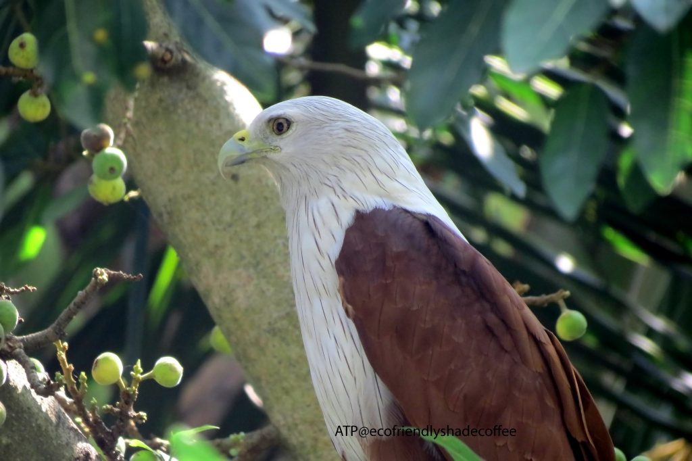
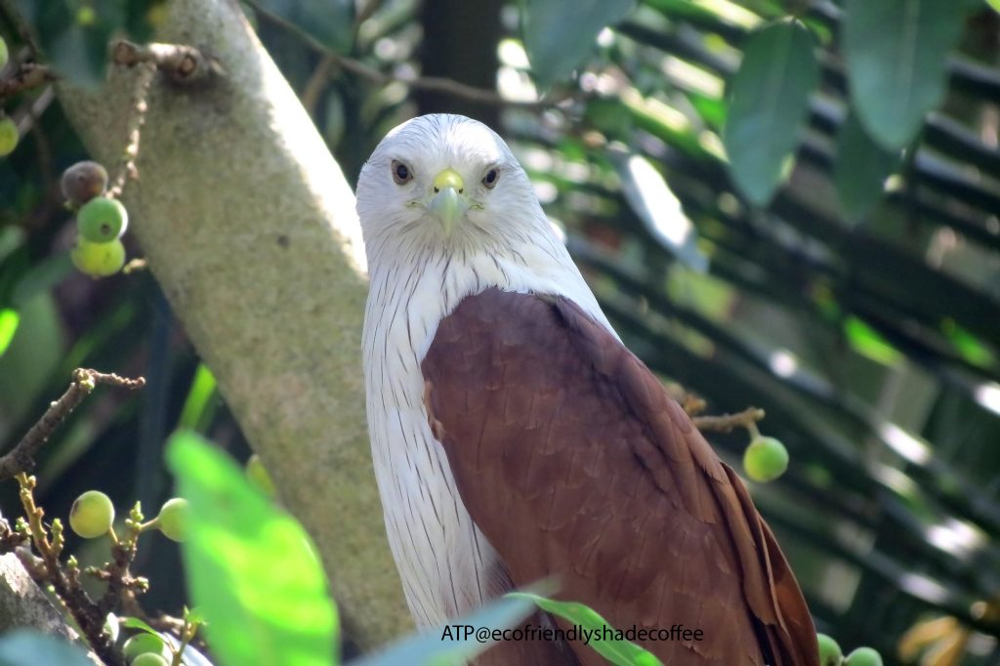
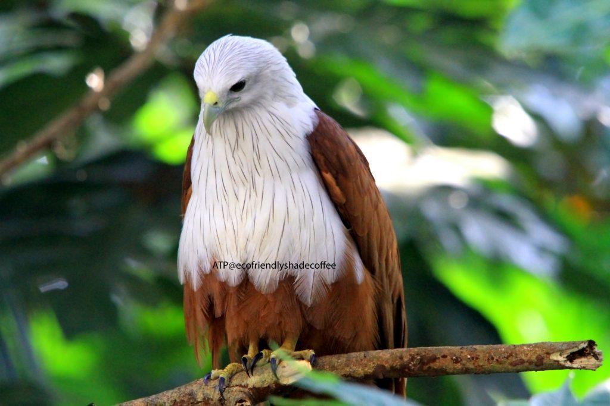
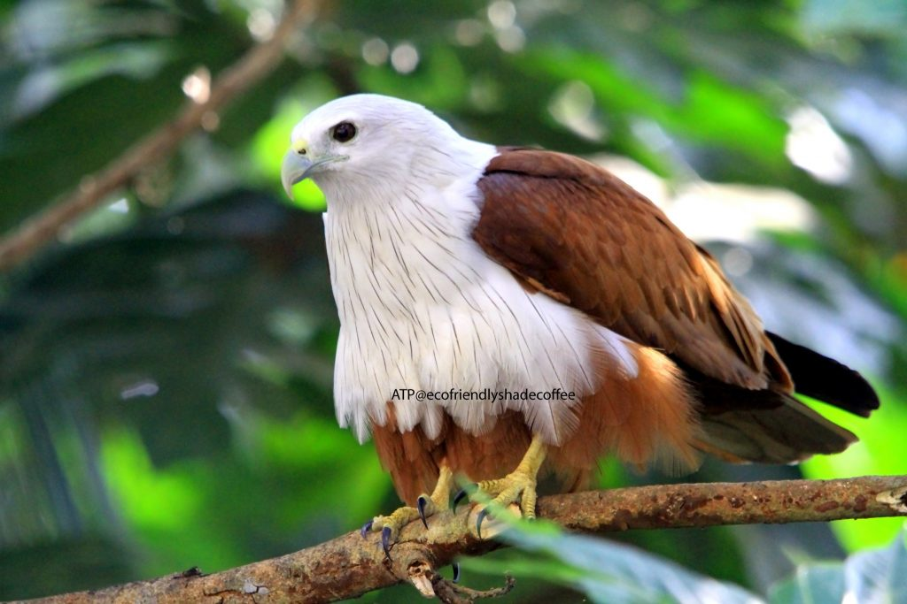
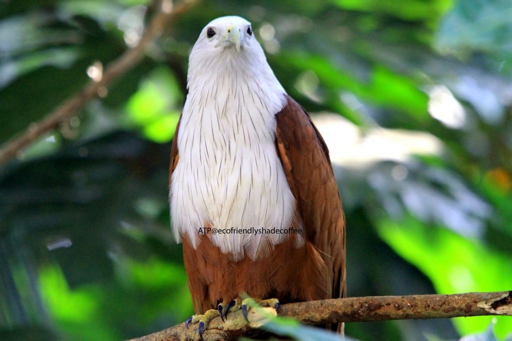
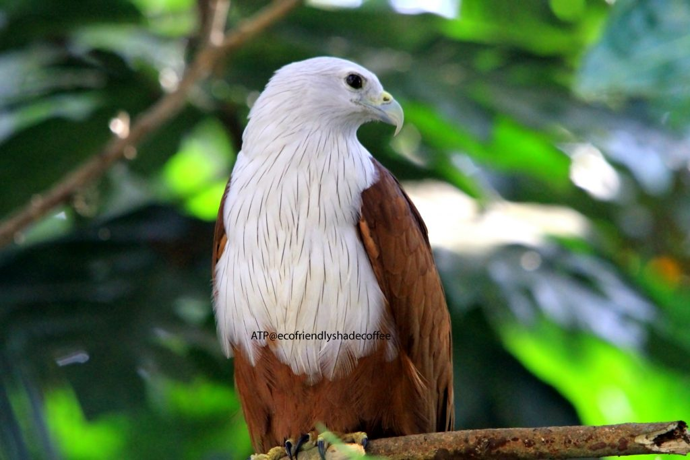
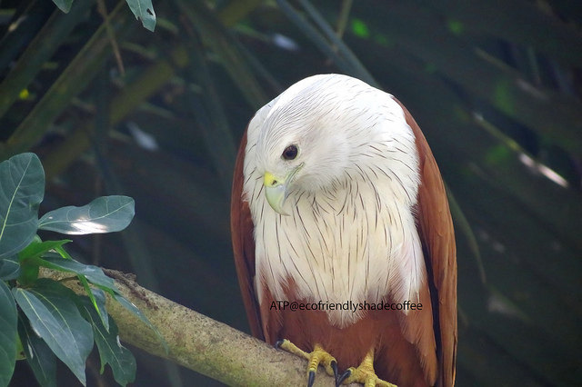
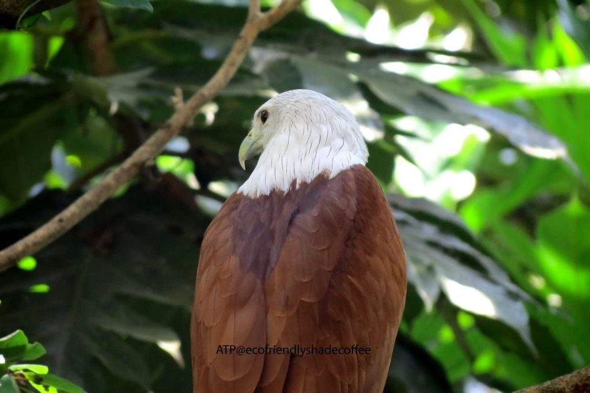
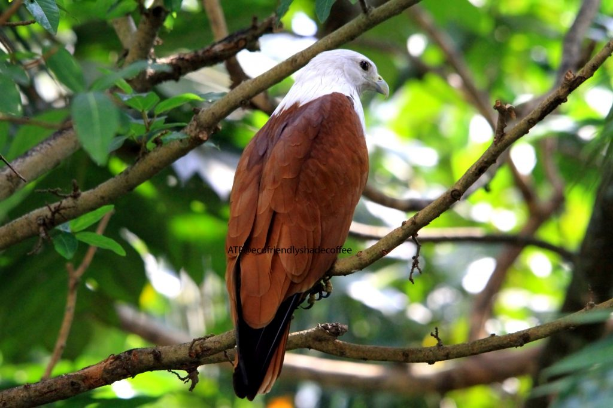

Shade grown ecofriendly coffee forests is a birders paradise in terms of the diversity of bird life. The reason being; shade grown ecofriendly coffee provides quality natural habitat across tens of thousands of acres which is ideal for bird habitats. Indian coffee forests stretching forth thousands of miles are perfect bird sanctuaries because they provide a safe haven for all forms of life.

These coffee forests radiate a wide variety of birds in different shapes, sizes, colors, habits and instincts. Each species is present in select numbers and occupy almost every conceivable niche. The coffee mountain has many geographical and environmental zones; comprising of coffee forests, valleys, grass lands, meadows, scrub, marshes, ponds, lakes and rivers.

Birds echo a rhythm and the arrival of the seasons. Bird migration, nesting, Courtship, shedding and renewing plumage are excellent indicators of the arrival of seasons. A few of our earlier articles on bird diversity has clearly brought out the symbiotic role of birds with various partners inside the coffee ecosystem. We have written this article on bird friendly shade coffee with the understanding that it will open up new areas of thinking in terms of understanding the ecology of birds associated with coffee and how this symbiotic relationship can be exploited for the benefit of both the growers as well as the bird community. We are of the firm opinion that understanding bird ecology is very important because it provides valuable insights on the study of birds and how they relate to their environment.

In our earlier articles on shade coffee, we have brought out the significance of shade coffee in relation to its ecology and biodiversity. In this article we have gone a step further and tried to understand the population size and the occupation of niches of not only the Brahminy kite but various other birds associated with coffee forests. We have tried to document the feeding relationships of birds too. There are a number of reasons why this is a good approach. First, one of the major problems faced by birds is the availability of food. Second, it will enable us to get a better picture of the various interactions; finally, it will enable us to understand why some bird species are on the threatened or endangered list. This scientific data will enable the coffee community to eliminate a few of the major risks that bird population’s face and will go a long way in the conservation effort. The study of bird ecology will throw light on how the accepted order of things should be in terms of food availability and habitat in their natural habitat.

The Brahminy Kite is a medium sized bird of prey. These magnificent raptors occur naturally on the Indian subcontinent; Very often seen hovering majestically in the blue skies, throughout the coffee range. The kite is a familiar sight in the coffee plantation zones. They are known to perform seasonal movements associated with rainfall in some parts of the coffee range. The Brahminy Kite is distinctive and contrastingly colored. It is easily recognized, with its sharply contrasting plumage. The head, neck, upper belly and flanks are generally white; the rest of the body, including the wing coverts, thighs and tail is largely bright chestnut with the exception of its white tipped tail and dark outer flight feathers. The light yellow hooked bill is distinct. The legs are unfeathered and short. Females are slightly larger than the males.

SIZE: Brahminy Kites measure about 18 – 20 inches (45 – 51 cm) in length, and have a wingspan of 3.6 – 4.1 feet (109 – 124 cm). They weigh between 11.3 – 24 oz (320 – 670 g). The females tend to be slightly larger than the males.

OTHER NAMES: Chestnut-white Kite, Red-backed Kite, Rufous Eagle, Rufous-backed Kite, White and Red Eagle-kite, White-headed Fish Eagle, White-headed Kite, White-headed Sea-eagle.

HABITAT: The Brahminy Kite occupies a wide range of habitats including river beds, wetlands, lakes, marshes and swamps. It can be found at altitudes of up to 3000 metres. They generally fly in pairs.

Conservation: \[conservation status from birdlife.org\]

This species has an extremely large range, and hence does not approach the thresholds for Vulnerable under the range size criterion (Extent of Occurrence <20,000 km2 combined with a declining or fluctuating range size, habitat extent/quality, or population size and a small number of locations or severe fragmentation). Despite the fact that the population trend appears to be decreasing, the decline is not believed to be sufficiently rapid to approach the thresholds for Vulnerable under the population trend criterion (>30% decline over ten years or three generations). The population size is very large, and hence does not approach the thresholds for Vulnerable under the population size criterion (<10,000 mature individuals with a continuing decline estimated to be >10% in ten years or three generations, or with a specified population structure). For these reasons the species is evaluated as Least Concern.

The Brahminy Kite Status lower risk and population is Stable.

Classified as Least Concern (LC) on the IUCN Red List.

The Brahminy Kite co exists well with humans. In recent years there is a dip in population due to habitat loss and may be also due to pesticide use.

CONSERVATION: There are currently no known conservation measures in place for the Brahminy kite

FOOD: The Brahminy Kite is quite a cosmopolitan feeder. fish, crabs, frogs, rodents, insects, reptiles, small mammals, birds. They are also known to be opportunistic scavengers.

BREEDING: Pairs nest in solitary, although adjacent pairs may be only 100 m apart in different trees

NESTING: The nest is large, made from sticks,twigs, bark, leaves or driftwood and lined with a variety of materials such as lichens, and moss. The nest is built in living trees near water, often near lakes and streams. usually on a forested slope providing a view of the surroundings .They show considerable site fidelity nesting in the same area year after year.

Both parents incubate the eggs and the young are fed bill to bill with small pieces of food.

During mating season (November-December) the female lays one to three eggs, which are incubated for 28 to 35 days before hatching. The young fledge after 40 to 56 days. Both parents raise the young.

Migration?: Brahminy Kites are sedentary and do not migrate.

### CONCLUSION

We have tried to document the avian fauna inside shade grown ecofriendly coffee forests for over 25 years and at every step the journey has been fascinating and rewarding in terms of new discoveries. We are often asked as to why the promotion wing of the coffee board has done precious little in documenting the flora and fauna inside shade grown Indian coffee forests.? Our answer is simple. Every coffee planter needs to do his little bit in documenting the biological riches in their respective plantations and pass it on to the Coffee Board which in turn can build up data bases and share it on the web. We firmly believe in sharing our findings to the local as well as global community ,so that it will enable people from all walks of life to appreciate the way we grow our coffee in an ecofriendly manner and will also generate scientific data which can be used by scientists all over the globe.

More importantly, birds in any given environment are important indicators of the health of the ecosystem. Looking at the larger picture, the abundance, distribution and health of the bird community will signal the wellbeing of the coffee ecosystem and will provide valuable insights in terms of understanding the complex interactions between and among various biotic partners inside coffee forests.

### REFERENCES

[Full Gallery](http://www.flickr.com/photos/108766628@N08/sets/72157638104241843/)

[http://ecofriendlycoffee.org/bird-friendly-shade-coffee-and-the-pied-kingfisher/](http://ecofriendlycoffee.org/bird-friendly-shade-coffee-and-the-pied-kingfisher/)

[http://ecofriendlycoffee.org/bird-friendly-shade-coffee-and-the-black-crowned-night-heron/](http://ecofriendlycoffee.org/bird-friendly-shade-coffee-and-the-black-crowned-night-heron/)

[http://ecofriendlycoffee.org/a-symphony-of-birds-inside-coffee-forests/](http://ecofriendlycoffee.org/a-symphony-of-birds-inside-coffee-forests/)

[http://ecofriendlycoffee.org/aquatic-birds-of-the-western-ghats/](http://ecofriendlycoffee.org/aquatic-birds-of-the-western-ghats/)

[http://ecofriendlycoffee.org/coffee-forests-and-green-national-accounts/](http://ecofriendlycoffee.org/coffee-forests-and-green-national-accounts/)

[http://ecofriendlycoffee.org/coffee-forest-symbiosis/](http://ecofriendlycoffee.org/coffee-forest-symbiosis/)

[http://ecofriendlycoffee.org/coffee-forests-and-wildlife-credits/](http://ecofriendlycoffee.org/coffee-forests-and-wildlife-credits/)

[http://www.coffeehabitat.com/2011/10/coffee-growing-in-india/](http://www.coffeehabitat.com/2011/10/coffee-growing-in-india/)

[http://www.coffeehabitat.com/2010/11/bird-friendly-coffee-and-me-on-npr/](http://www.coffeehabitat.com/2010/11/bird-friendly-coffee-and-me-on-npr/)

[http://en.wikipedia.org/wiki/IUCN\_Red\_List](https://en.wikipedia.org/wiki/IUCN_Red_List)

[http://www.birdlife.org/](http://www.birdlife.org/)

[Brahminy Kites](http://beautyofbirds.com/brahminykites.html)

[Why Count Birds](http://audubonva.org/why-count-birds/)

[https://birdlife.org.au/bird-profiles/](https://birdlife.org.au/bird-profiles/)

[http://opwall.com/senior-thesis-dissertations/topics/bird-ecology-topics/](https://web.archive.org/web/20171210041851/http://opwall.com:80/senior-thesis-dissertations/topics/bird-ecology-topics/)

Anand T Pereira and Geeta N Pereira. 2009. Shade Grown Ecofriendly Indian Coffee. Volume 0ne.

Bopanna, P.T. 2011. The Romance of Indian Coffee. Prism Books ltd.

Debus, S.J.S. 1994. Brahminy Kite. P. 119 in del Hoyo, J., A. Elliott, and J. Sargatal (eds.), Handbook of birds of the world. Vol. 2. New World vultures to guineafowl. Lynx Edicions, Barcelona, Spain.

Debus, S. 1998. The birds of prey of Australia: a field guide. Oxford University Press, Melbourne.

Ferguson-Lees, J., and D.A. Christie. 2001. Raptors of the world. Houghton Mifflin, Boston, MA.