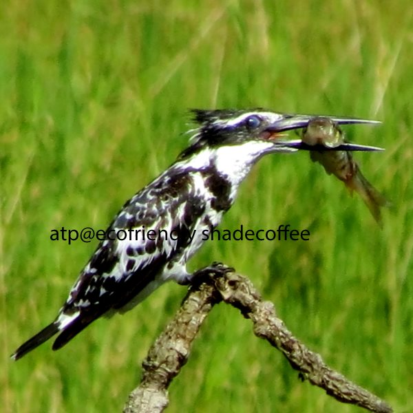
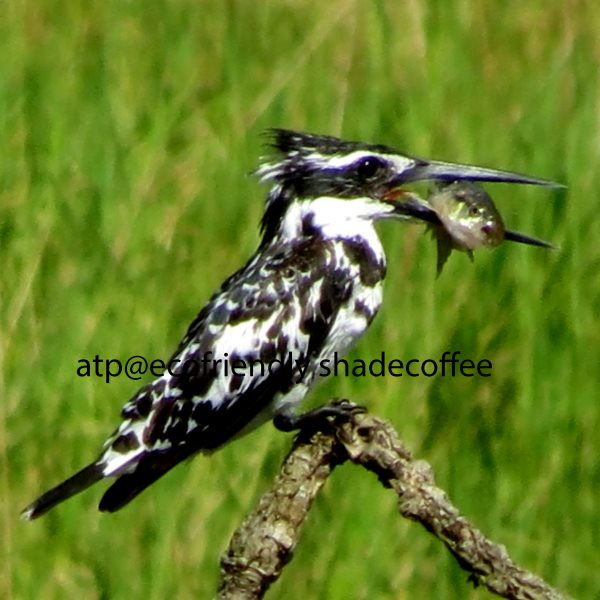
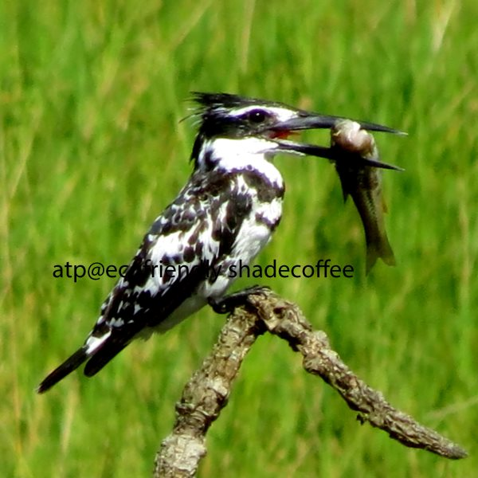
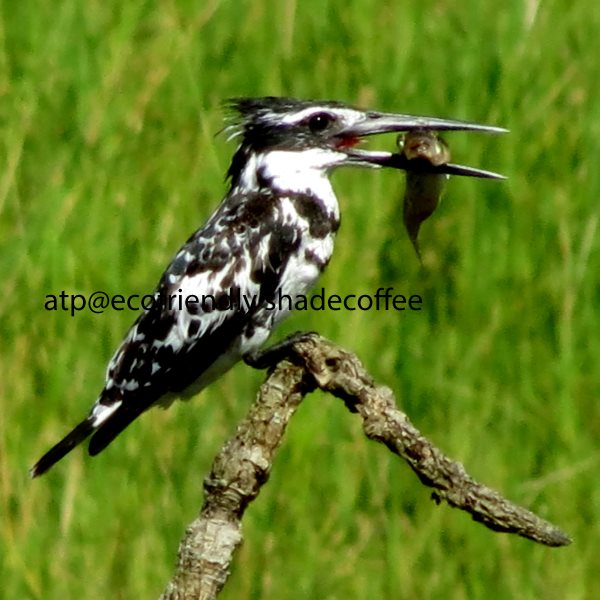
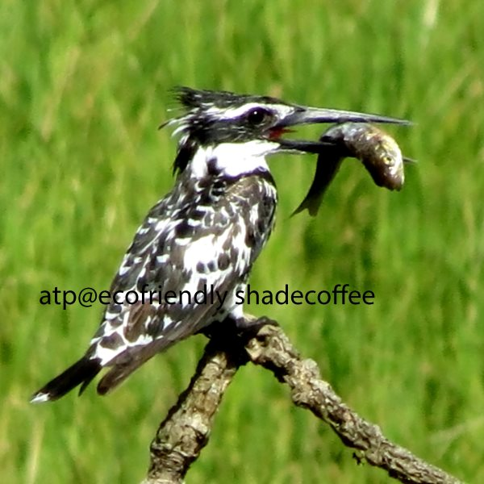
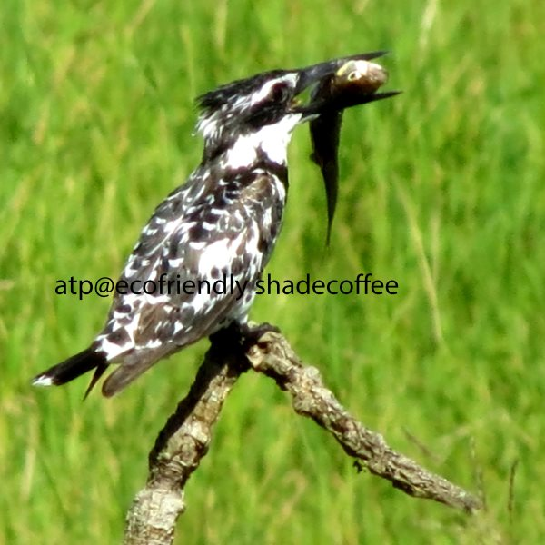
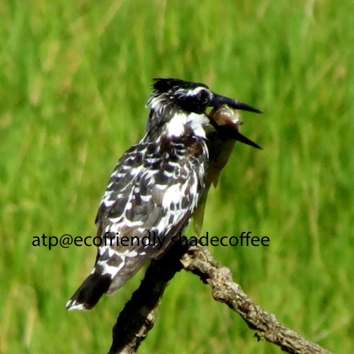
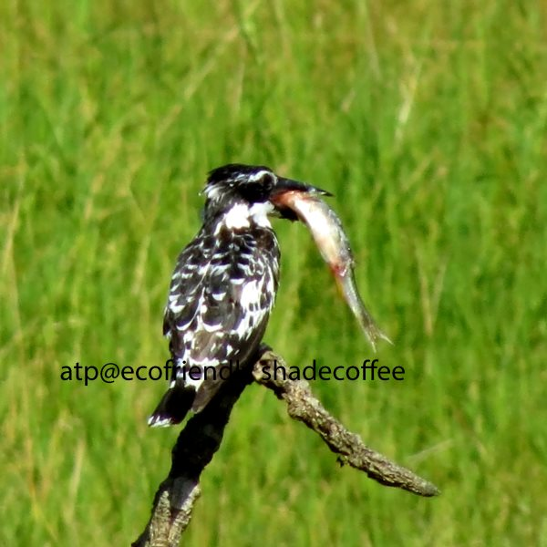
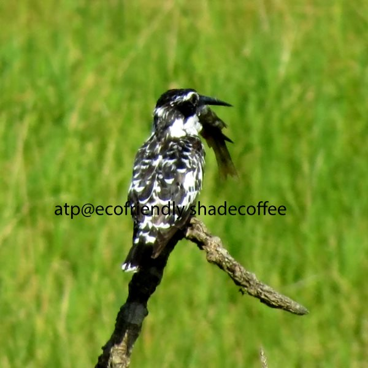
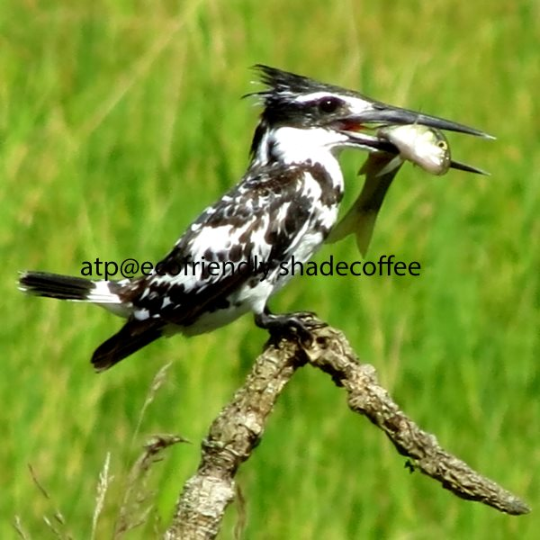

We have worked on coffee Ecology for over 25 years and this passion has been rewarding in terms of getting an opportunity of documenting the diverse flora and fauna associated with shade grown Ecofriendly Indian coffee forests in the States of TamilNadu, Karnataka and Kerala, which contributes more than 95% of India’s shade coffee.

When we first started documenting the flora and fauna inside Indian coffee forests, 25 years ago, a vast majority of the coffee planters then, were of the opinion that this exercise was not worth it, as it had no direct benefit to the Planting community. However, today most of the Planters realize that our book on *Ecofriendly Coffee , Volume – One (2009)* depicting the biodiversity of coffee forests is a invaluable reference book, allowing the local and global community understand the importance of shade coffee and its positive impact on the ecology.

Our work also provides a window of opportunity to coffee lovers around the world on the symbiotic role of coffee forests in providing a safe haven for all types of wildlife. We are very proud of our work, simply because, we had the passion and the vision to document the fauna inside shade grown ecofriendly Indian coffee, despite the many obstacles we faced. We genuinely hope that our book on ecofriendly coffee will help form a permanent library of knowledge on every aspect of coffee.

  

Today, both roasters and consumers, worldwide, look for ecofriendly certified coffees and are also concerned with the conservation of biodiversity, sustainability and the socio economic conditions of the people employed in coffee.

This is a welcome sign, because it will create a significant amount of awareness on the need to protect shade grown coffee and enhance rural livelihoods. It will also empower the coffee farmers to develop more sustainable and productive agricultural systems. We are also fortunate that the specialty coffee sectors, worldwide, look for various types of coffee like Smithsonian bird friendly, Ecofriendly, Rainforest Alliance certified, Fair trade certified, and so on.

It is inspiring to note that when planters are guardians of nature, Roasters and consumers are willing to pay a slightly higher price, so that part of the proceeds, directly benefit the grower.

### Three Canopy Layers

Indian Coffee is grown on one of the most sensitive hotspots in the world, called the WESTERNGHATS, which is a treasure house for flora, fauna and biodiversity. Basically, Indian Coffee Plantations grow shade grown coffee under the canopy of a three-tier shade system. A lot of care is taken in selecting the trees to be introduced.

### Type of Birds

Every Plantation acts as a wildlife sanctuary. Rare species of birds and a multitude of migratory birds often nest inside the coffee plantations. Birds such as the Grebes, Cormorants, Darters, Herons, Egrets, Storks, spot billed ducks, Hawks, Eagles, Kites, Pheasants, Partridges, quails, Moorhens, Jacanas, lapwings,, sandpipers, Parakeets, Cuckoos, owls, swifts, Kingfishers, Bee eaters, Rollers, Hoopoes, Hornbills, Barbets, Woodpeckers, Pittas, Larks, Swallows, Orioles, Drongos, Mynas, Fly catchers, Sun birds, Green pigeon, Black necked crane, Whistling Teals, Ibis, Painted stork, Asian open billed stork and many others thrive in the coffee forest canopy.

In short, coffee forests support the largest numbers of forest dependent resident as well as migratory birds. All estates have waterholes for the purpose of irrigation, which also support other forms of wildlife.

**To date we have identified 110 Bird species and 450 different bird types, both resident and migratory inside shade grown ecofriendly coffee forests.** We have yet to identify all the birds right up to the species level. We are in the process of doing just that. We intend to classify them as Resident, Aquatic, semi aquatic, land based, Birds of Prey, and Migratory birds.

We have posted pictures of the pied King Fisher which is commonly observed near small ponds and lakes inside coffee forests. The pictures that you see were taken at “Joe’s Ecofriendly coffee Plantations” (Kirehully Estate), Sakleshpur, Karnataka state. This fearless bird is quite adaptable to human behavior and one can watch the bird’s activities from a safe distance without disturbing it. Youngsters can learn from the bird’s behavior not only in terms of how it catches the fish, but also the way it eats its prey.

**Distribution:** The Pied Kingfisher is found widely distributed across Africa and Asia. In India it is distributed mainly on the plains. The Pied Kingfisher is estimated to be the world’s third most common kingfisher, and being a noisy bird, hard to miss

**Description:** This is the only Kingfisher with all black and white plumage. The distinctive bird has white spotted, black upper parts and white under parts, with a broad band of black streaks on the upper breast and a narrow black bar below. There is a prominent white eyebrow and a black eye band that stretches to the back of the neck as well as a white throat and collar and a white patch on the wing coverts. The rump is barred black and white, the iris is brown and the feet and legs are black. The male pied kingfisher is distinguished from the female by the presence of two full breast bands with the female having just a single incomplete band.

A large headed, stout bodied and short legged bird with a straight, strong dagger like black bill. The bird is extremely agile in the air and hovers more often than any other king fisher’s. In flight it holds the body almost vertical, with the head and bill angled sharply downwards, and beats the wings extremely rapidly. When perched, it frequently cocks it tail up and down and raises a crest of feathers on its head. This boldly patterned, black-and-white bird is the only kingfisher that regularly fishes offshore. Instead of watching for prey from a perch, as many other kingfisher species do, it flies rapidly above the surface with its head facing down as it scans the water below. If it spots food, it hovers on the spot, and then dives down to make a catch. It can also eat while in flight, another unique adaptation.

**Habitat:** The pied kingfisher occupies a variety of fresh and saltwater habitats, including large, inland, slow-moving rivers, estuaries, mangroves, tidal rock pools, lagoons, dams and reservoirs, requiring some water-side perches such as trees, reeds, fences and other man-made objects. It occurs up to altitudes of around 2,500 meters in Africa and 1,800 meters in Asia.

**Status:** The pied kingfisher is classified as Least Concern (LC) on the IUCN Red List

**Size:** Length: 25 cm, Male weight: 68 – 100 g, Female weight: 71 – 110 g

**Diet:** Primarily consist of fish, but they will also eat crustaceans and large aquatic insects, such as dragonfly larvae. It is the only King fisher which can hunt on salt and freshwater.

**Breeding:** The breeding season is February to April. Its nest is a hole excavated in a vertical mud bank about five feet above water. The nest tunnel is 4 to 5 feet deep and ends in a chamber. Several birds may nest in the same vicinity. The usual clutch is 3-6 white eggs. The pied kingfisher sometimes reproduces co-operatively, with young non-breeding birds from earlier brood assisting parents or even unrelated older birds. In India, nesting’s have been found to be prone to maggot infestations and in some areas to leeches. Nest holes may sometimes be used for roosting.

The pied kingfisher nests in holes in vertical sandbanks that are excavated by the breeding pair. The tunnel is around 1.2 meters in length and leads to a 20 to 30 centimeter wide chamber in which the nest is constructed. The tunnel takes around 26 days to excavate by stabbing with the open bill and kicking the sand out with the feet. Between one to seven, usually four or five, eggs are laid and incubated mainly by the female for around 18 days.

The pied kingfisher is a cooperative breeder, meaning that the breeding adults are assisted by helpers in caring for the young. The helpers are usually one year old offspring of the breeding pair, but may also be other adults that have failed in breeding, and assist with tending the chicks and defending a territory around the nest. The chicks stay in the nest for 24 to 29 days, learning to hunt by 38 to 43 days of age, and becoming fully independent at 1 to 2 months. The pied kingfisher reaches sexual maturity at a year old but may not breed until its second or third year.

**Threats:** The pied Kingfisher which was once commonly observed near ponds and lakes has suffered declines due to pollution and chemical poisoning. By far the greatest threat is the disappearance of wetland habitats.

### Conclusion

India is perhaps the only country in the world growing all its coffee under the canopy of different shade levels. Coffee plantations in India are traditional shade grown coffees, grown naturally, inside a canopy of wild and introduced trees. This symbiotic role between coffee and forests has resulted in a high degree of biodiversity within the confines of the coffee forest.

Of late coffee planters receive a little bit of extra money for protecting the biological riches but it does not compensate them for the added expenses involved in producing ecofriendly bird friendly coffee. One way of going about this is to build a coffee model with the help of all stake holders (Coffee Board, Roasters, Grinders, Growers and Consumers) that promotes investment in training the planting community to safeguard precious biodiversity and bring about a authentic origin certified coffee that will meet the standards of the Specialty Coffee Associations that are willing to pay a premium price for bird friendly or any coffee that is certified as Ecofriendly.

### References

[Azolla, coffee and species preservation](http://theazollafoundation.org/features/azolla-and-coffee/)

[A Symphony of Birds Inside Coffee Forests](http://ecofriendlycoffee.org/a-symphony-of-birds-inside-coffee-forests/)

[Aquatic Birds of the Western Ghats](http://ecofriendlycoffee.org/aquatic-birds-of-the-western-ghats/)

[Coffee Forests and Green National Accounts](http://ecofriendlycoffee.org/coffee-forests-and-green-national-accounts/)

[Coffee Forests – A Gateway To Wildlife](http://ecofriendlycoffee.org/coffee-forests-a-gateway-to-wildlife/)

[Coffee Hotspots – An Inventory of Biodiversity](http://ecofriendlycoffee.org/coffee-hotspots-an-inventory-of-biodiversity/)

[Coffee Forest Symbiosis](http://ecofriendlycoffee.org/coffee-forest-symbiosis/)

[Coffee Forests and Wildlife Credits](http://ecofriendlycoffee.org/coffee-forests-and-wildlife-credits/)

[Quick guide to coffee certifications](http://www.coffeehabitat.com/certification-guide/)

[Bird-friendly coffee](http://www.coffeehabitat.com/2010/11/bird-friendly-coffee-and-me-on-npr/)

[The true cost of coffee](http://www.birdwatchingdaily.com/featured-stories/the-true-cost-of-coffee/)

[Building local institutional capacity](http://ecoagriculture.org/publication/building-local-institutional-capacity-to-implement-agricultural-carbon-projects/)

[Pied kingfisher](https://en.wikipedia.org/wiki/Pied_kingfisher)

[Shade coffee and birds](https://web.archive.org/web/20171027035403/http://www.rrbo.org:80/in-the-field/bird-stuff-you-should-know/coffee-for-the-birds/)

[Online Guide To Birds](http://www.allaboutbirds.org)

[Research: migratory birds provide pest control](http://www.coffeehabitat.com/2008/09/research-migratory-birds-provide-pest-control-increase-profit-in-jamaican-coffee-farms/)

[Coffee and biodiversity hotspots](http://www.coffeehabitat.com/2006/12/coffee_and_biod/)

[Coffee and climate change updates](http://www.coffeehabitat.com/2011/01/coffee-and-climate-change-updates/)

[Coffee growing in India](http://www.coffeehabitat.com/2011/10/coffee-growing-in-india/)

[Know your coffee birds: Malabar Barbet](http://www.coffeehabitat.com/2012/02/coffee-bird-malabar-barbet/)

[Environmental Geography](http://environmentalgeography.blogspot.in/2011/01/frozen-orange.html)

[Quick Reference Guide](https://web.archive.org/web/20170103001324/https://nationalzoo.si.edu/scbi/migratorybirds/coffee/quick_reference_guide.cfm)

[What is shade-grown coffee?](http://www.coffeehabitat.com/2006/02/what_is_shade_g/)

[WE SAVE SPECIES](https://nationalzoo.si.edu/)

[Species List](http://web4.audubon.org/bird/at_home/coffee/species/index.html)

[Eco-friendly Coffee – Book by Dr Anand & Geeta Pereira](https://web.archive.org/web/20100511154508/http://www.daijiworld.com/chan/exclusive_arch.asp?ex_id=1153)

Anand T Pereira and Geeta N Pereira. 2009. Shade Grown Ecofriendly Indian Coffee. Volume 0ne.

Anand, M. O., Krishnaswamy, J. and Das, A. (2008) Proximity to forests drives bird conservation value of shade-coffee plantations: Implications for certification. Ecological Applications 18(7): 1754-1763. DOI:10.1890/07-1545.1

Bopanna, P.T. 2011. The Romance of Indian Coffee. Prism Books ltd.

Bali, A., Kumar, A. and Krishnaswamy, J. (2007). The mammalian communities in coffee plantations around a protected area in the Western Ghats, India. Biological Conservation 139:93-102. DOI:10.1016/j.biocon.2007.06.017

Dolia, J., Devy, M. S., Aravind, N. A. and Kumar, A. (2008). Adult butterfly communities in coffee plantations around a protected area in the Western Ghats, India. Animal Conservation 11: 26-34. DOI:10.1111/j.1469-1795.2007.00143.x

Raman, T. R. S. (2006). Effects of habitat structure and adjacent habitats on birds in tropical rainforest fragments and shaded plantations in the Western Ghats, India. Biodiversity and Conservation 15: 1577-1607. DOI: 10.1007/s10531-005-2352-5. \[PDF\]

National Research Council. 1993. Sustainable Agriculture and the Environment in the Humid Tropics. National Academy Press, Washington, D.C.

Pimentel, D., U. Stachow, D.A. Takacs, H.W. Brubaker, A.R. Dumas, J.J.Meaney, J.A.S. O’Neil, D.E. Onsi, and D.B. Corzilius. 1992. Conserving biological diversity in agricultural/forestry systems. BioScience 42(5):354-362.

Kellermann, J. L., M. D. Johnson, A. M. Stercho, and S. C. Hackett. 2008. Conservation Biology 22:1177-1185. Ecological and economic services provided by birds on Jamaican Blue Mountain coffee farms.