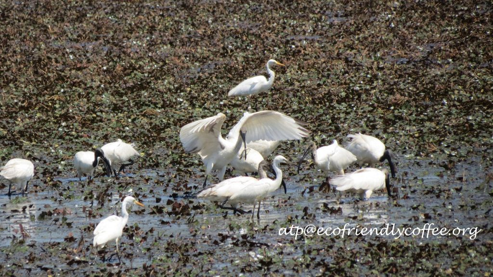
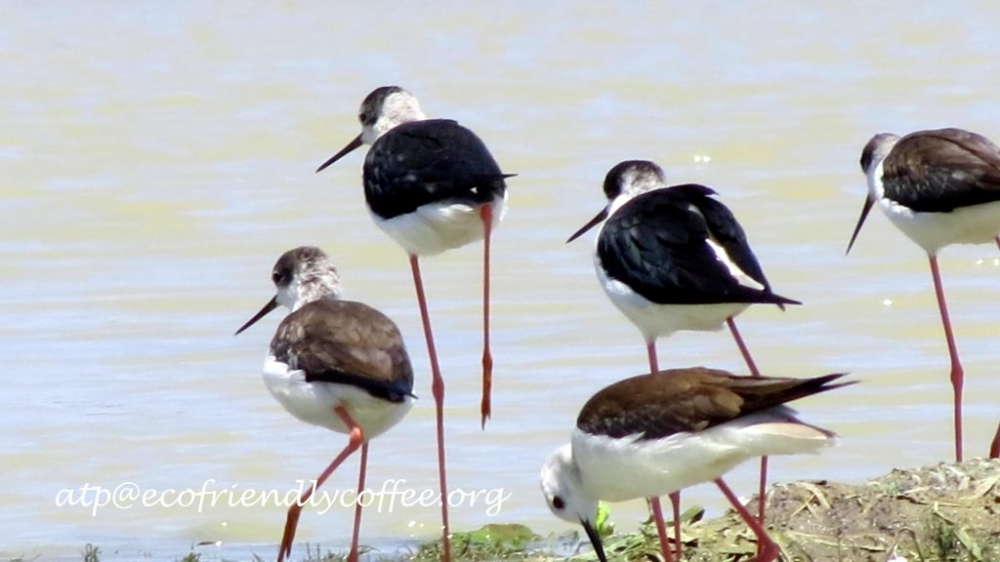
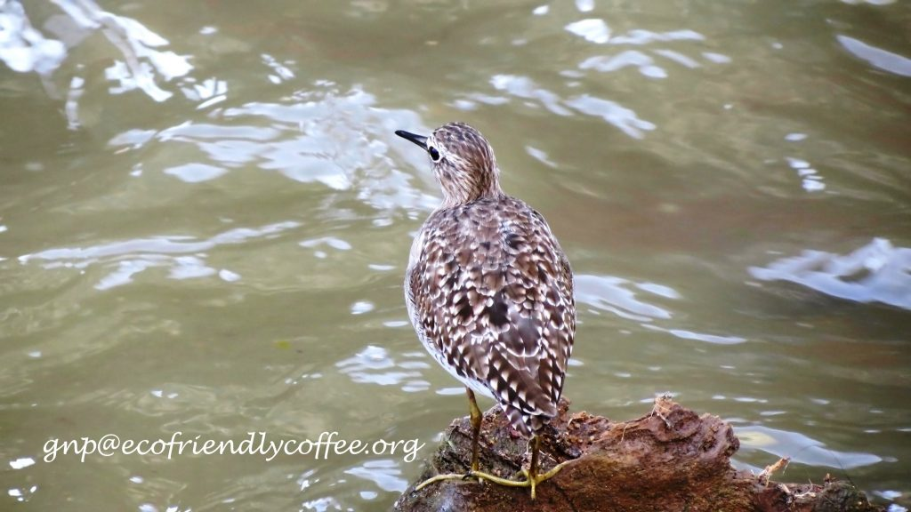
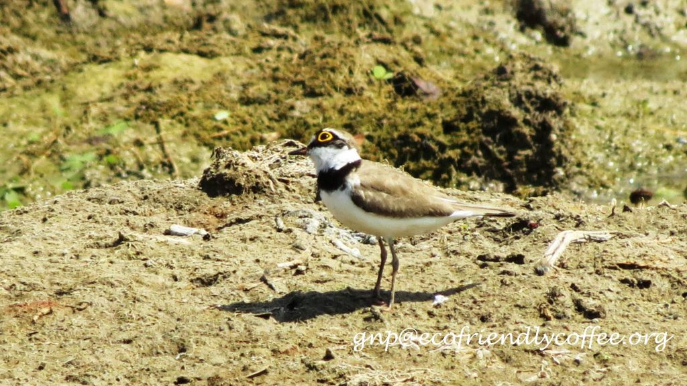
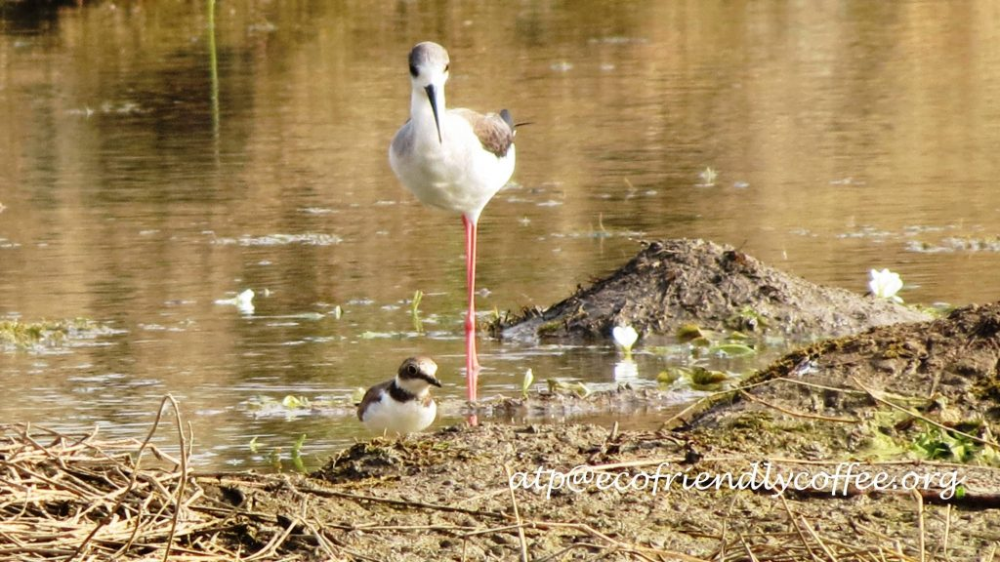
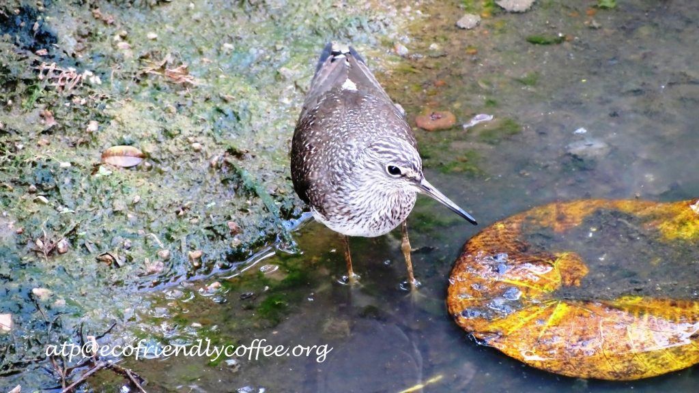
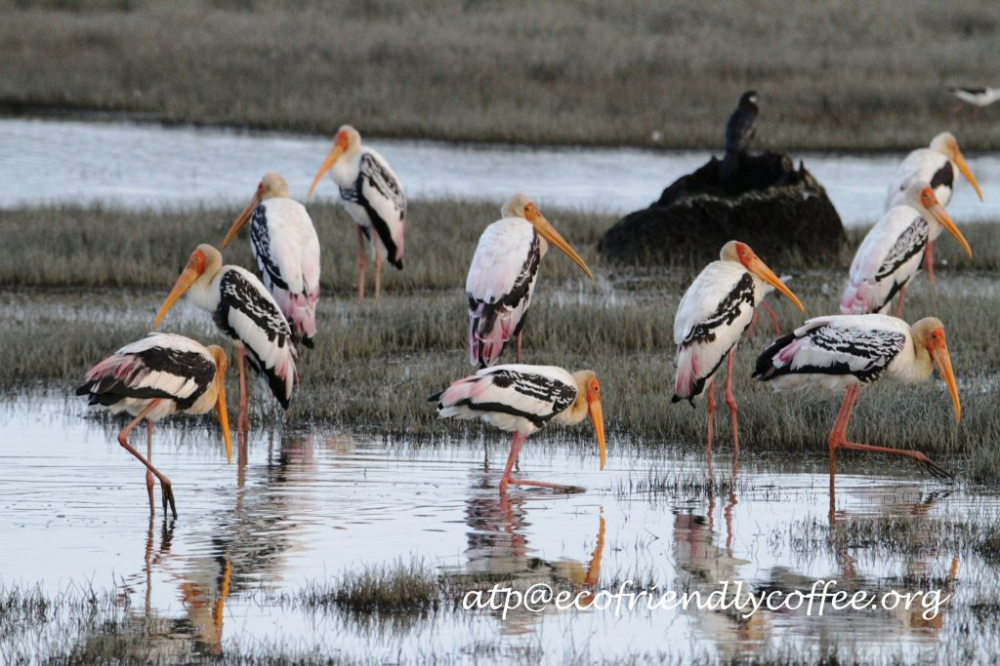

Each year thousands of migratory birds fly hundreds and thousands of kilometers in order to reach Ecofriendly Indian coffee forests because these birds and other migratory birds find the ideal ecological conditions and habitats for breeding , feeding and raising their young. Different species of birds have different life patterns. Shade coffee with varied agro climatic regions provides the right habitat for each species based on their preferences.

At every step Coffee Planter’s in India are proactive in conservation of the biological riches of the coffee forest and are also sensitive to the needs of the biological community. However, in the recent past, many Coffee Planter’s are opening up the tree cover inside shade coffee and are trying out innovative methods to boost yields by way of high density coffee planting, drip irrigation, fertigation and growing coffee with minimum tree canopy.

This, unfortunate trend is a direct consequence of the Planter’s receiving a remuneration far below the cost of production. With International markets like the New York stock exchange terminal guiding the coffee futures market and the London terminal deciding the Robusta futures, today’s coffee prices are at a historical low. It is a tight rope walk for the Planting Community.

The fact of the matter is that a combination of market forces as well as the impact of global warming is playing havoc in the lives of coffee Planter’s. The plain truth is that at the current market prices, the cost of production of growing coffee  is higher than the cost of returns. In fact, the livelihood of Planter’s is at stake.

How then do the Planter’s strike a balance. After all they need to feed their families and educate their children and provide gainful employment to thousands of unskilled workers. We have suggested ways and means of helping the farming community to get a premium for Ecofriendly Indian Coffee by suggesting innovative ideas, like requesting the Coffee Board to award the Coffee Planting Community with a Landscape Label to showcase each and every aspect of Ecofriendly and  Bird Friendly Indian Coffee.

We would like to impress on the International Community that Shade Grown Ecofriendly Indian Coffee is perhaps, one of the most intelligent way of growing a commercial crop of great economic value, in close harmony with nature. In this model, Coffee mimics the Natural forest and the ecological balance remains significantly undisturbed. The Coffee forests not only accommodates multi cropping but also heterogeneous tree populations, along with herbs, shrubs and wild flowering plants. The wetlands , grasslands, and marsh lands provide ample opportunity to both resident and migratory wildlife to breed and move on  their onward journey.

The loss of habitats due to intensive agriculture and growing coffee with no shade trees will surely have ecological consequences not only for wildlife, but for mankind too.  Scientists, world over have called for a greater International collaborative effort to save the world’s migratory birds, many of which are at risk of extinction due to loss of habitat along their flight paths.

More than 90 % of the world’s migratory birds are inadequately protected due to poorly coordinated conservation around the world, a new study published in the journal science today reveals. The study states that the majority of migratory birds having ranges that are well covered by protected areas in one Country, but poorly protected in another. “More than half of migratory bird species travelling the world’s main flyways have suffered serious population declines in the past 30 years.

This is due mainly to unequal and ineffective protection across their migratory range and the places they stop to refuel along their routes,” says lead author Dr Claire Runge of CEED and the University of Queensland.

In fact, Birdlife International states that “The threats leading to population declines in birds are many and varied: agriculture, logging and invasive species are the most severe, respectively affecting 1,065 (87%), 668 (55%) and 625 (51%) globally threatened species. These threats create *stresses* on bird populations in a range of ways, the commonest being habitat destruction and degradation, which affect 1,146 (93%) threatened species”.

For migratory birds, the Coffee Forests have always acted as stop over sites for refueling and breeding. The loss of these sites, will significantly impact on the birds chances of survival. The Coffee Forests which is a stopover for thousands of migratory birds has been seeing a sharp decline in their numbers each year. In some instances, a few bird species have not made Coffee Forests their refueling or stop over destination. We are of the opinion that though the diversity is still good, the population and variety of migratory birds is degrading, owing to changes made by Coffee Planter’s to their landscape.

There is no blame game here. Every individual needs to survive. Cultivation of coffee, should make economic sense and improve livelihoods. At the same time, when Coffee Planter’s are rewarded with a reasonable premium for growing bird friendly or Ecofriendly shade coffee, they in turn will look at conservation with a third eye and safeguard nature.

### References

Anand T Pereira and Geeta N Pereira. 2009. Shade Grown Ecofriendly Indian Coffee. Volume-1.

Bopanna, P.T. 2011.The Romance of Indian Coffee. Prism Books ltd.

C. A. Runge, J. E. M. Watson, S. H. M. Butchart, J. O. Hanson, H. P. Possingham, R. A. Fuller. **[Protected areas and global conservation of migratory birds](http://dx.doi.org/10.1126/science.aac9180)**. _Science_, 2015; 350 (6265): 1255

[Why Migratory Birds?](http://www.worldmigratorybirdday.org/migratory)

[The Importance of Migratory Birds](http://www.worldmigratorybirdday.org/2012/index23c2.html?option=com_content&view=article&id=18&Itemid=4)

A range of threats drives declines in bird populations

[Few migratory birds adequately protected across migration cycle](http://www.sciencedaily.com/releases/2015/12/151203150135.htm)
