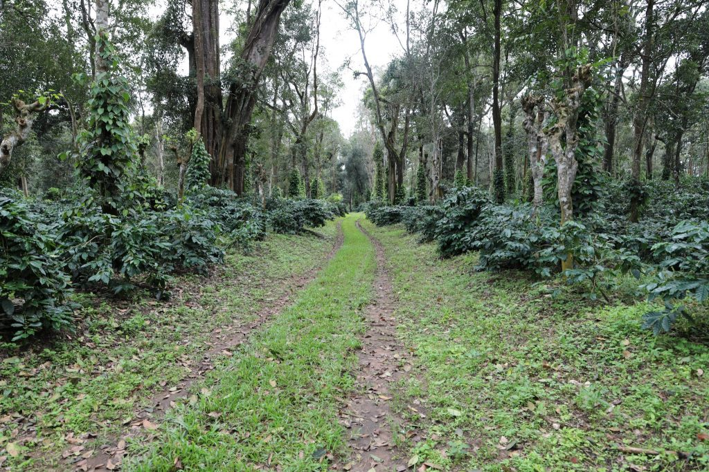

Coffee Plantations in India are always associated with multiple crops. For better establishment and crop productivity, coffee agroforestry requires 17 essential nutrients. One of the major nutrient keys to plant wellness is phosphorus. Phosphorus is a primary macronutrient. The role of phosphorus is crucial and phosphorus cannot be replaced by any other nutrient for optimum growth, reproduction, and yield. Phosphorus has diverse physiological and biochemical functions in plants. Phosphorus improves plant resilience against diseases and helps the coffee bush overcome harsh environmental conditions. It is required for plant respiration and photosynthesis, as well as cell division and plant growth.

Phosphorus, is one of the major elements, alongside nitrogen and potassium, essential to successful plant growth. Since phosphorus is classified as a major nutrient, meaning that it is constantly removed from the soil for plant growth and development, a large amount of phosphorus should be made available from external sources. The total P concentration in agricultural crops generally varies from 0.1 to 0.5 percent.

### **What role does phosphorus play in plant health?**

Phosphorus (P) is vital to plant growth and is found in every living plant cell. It is involved in several key plant functions.

Phosphorus helps in coffee and other allied crops in improving photosynthetic activity and efficiency. It plays a direct role in energy transformations and is a key component of adenosine triphosphate.

It is also a key component of both DNA and RNA and plays a pivotal role in the build-up of proteins. It is incorporated into organic compounds, including nucleic acids (DNA and RNA), phosphoproteins, phospholipids, sugar phosphates, enzymes, and energy-rich phosphate compounds.

Phosphorus is a vital component of the substances that are building blocks of genes and chromosomes. It helps in building nucleic acids, proteins, and enzymes that decide on all physiological aspects of plant growth and development.

Right from the seedling stage to maturity adequate amounts of phosphorus is required for all crops associated with coffee agroforestry.

Phosphorus availability has a measurable impact on both qualitative and quantitative aspects of yield.

Better access to phosphorus results in better root growth and quick establishment of all crop plants.

Especially during coffee blossom, the availability of phosphorus makes a significant difference in flowering and fruit sets.

Phosphorus imparts drought tolerance and increased disease resistance.

Balanced phosphorus application, aids in the uptake of other nutrients. Improves the efficiency of other nutrients such as nitrogen.

Phosphorus helps plants withstand environmental stress and harsh winters.

Phosphorus is actively involved in the transfer of genetic characteristics from one generation to the next.

Adequate phosphorus also ensures that plants use water efficiently.

### **Phosphorus Uptake**

The coffee root system is unique and the bulk of the feeder roots is in the 30 to 60 cm depth. About 80-90% of the feeder root is in the first 20 cm of soil and is 60-90 cm away from the trunk of the coffee tree. The lateral roots can extend 2 m from the trunk.  The roots systems are heavily affected by the type of soil and the mineral content of the soil.  To be thick and strong, the coffee roots need an extensive supply of nitrogen, phosphorus, calcium, and magnesium. Phosphorus enters the plant through root hairs, root tips, and the outermost layers of root cells. Mycorrhizae also help in the uptake of phosphorus. Phosphorus is taken up mostly as the primary orthophosphate ion (H2PO4 – ), but some are also absorbed as secondary orthophosphate (HPO4 =), this latter form increasing as the soil pH increases.

### Conclusion

Although much is known about P and its importance in crop productivity, more research needs to be done in terms of timing of application and availability of P in the available form, round the year, for coffee and allied crops.  Among the major elements limiting plant growth and productivity, phosphorus plays a vital role. Phosphorus is present in all biological systems and no other nutrient can be substituted for it when it is lacking. Once the deficiency sets in, the damage is lasting and is difficult to undo. Hence Phosphorus management needs to be clearly defined for coffee Agroforestry.

### References

Anand T Pereira and Geeta N Pereira. 2009. Shade Grown Ecofriendly Indian Coffee. Volume-1.

Bopanna, P.T. 2011.The Romance of Indian Coffee. Prism Books ltd.

Alexander M. 1977. Introduction to soil microbiology (2nd ed.). NewYork: John Wiley,p 337

Anand Titus Pereira & Gowda. T.K.S. 1991. Occurrence and distribution of hydrogen dependent chemolithotrophic nitrogen-fixing bacteria in the endorhizosphere of wetland rice varieties grown under different Agro-climaticA Regions of Karnataka. (Eds. Dutta. S. K. and Charles Sloger. U.S.A.) In Biological Nitrogen Fixation Associated with Rice production. Oxford and I.B.H. Publishing. Co. Pvt. Ltd. India.

[PHOSPHORUS](https://www.cropnutrition.com/nutrient-management/phosphorus)

[The role of phosphorus in crops](https://www.iclfertilizers.com/phosphorus)

[The role of phosphorus](https://www.greenwaybiotech.com/blogs/gardening-articles/whats-the-function-of-phosphorus-p-in-plants)

[Importance of Phosphorus](https://passel2.unl.edu/view/lesson/0718261a1c9d/2)

[Phosphorus Management](https://www.agronomy.k-state.edu/documents/nutrient-management/nmrg-ppt-phosphorus-management.pdf)

[Importance](https://passel2.unl.edu/view/lesson/0718261a1c9d/2#:~:text=Phosphorus%20is%2C%20therefore%2C%20important%20in,tillering%2C%20and%20often%20hastens%20maturity) .

[Phosphorus](https://passel2.unl.edu/view/lesson/0718261a1c9d/1)

[The Plant Problem](https://passel2.unl.edu/view/lesson/0718261a1c9d/4)

[AGRICULTURAL NUTRIENT PROFIL](https://taurus.ag/importance-of-phosphorus-to-crops/)

[Functions of Phosphorus](http://www.ipni.net/publication/bettercrops.nsf/0/53639639D7A590D68525798000820183/$FILE/Better%20Crops%201999-1%20p06.pdf)

[Farmers are facing a phosphorus](https://www.nationalgeographic.com/science/article/farmers-are-facing-a-phosphorus-crisis-the-solution-starts-with-soil)

[Phosphorus is a primary](https://plantprobs.net/plant/nutrientImbalances/phosphorus.html)