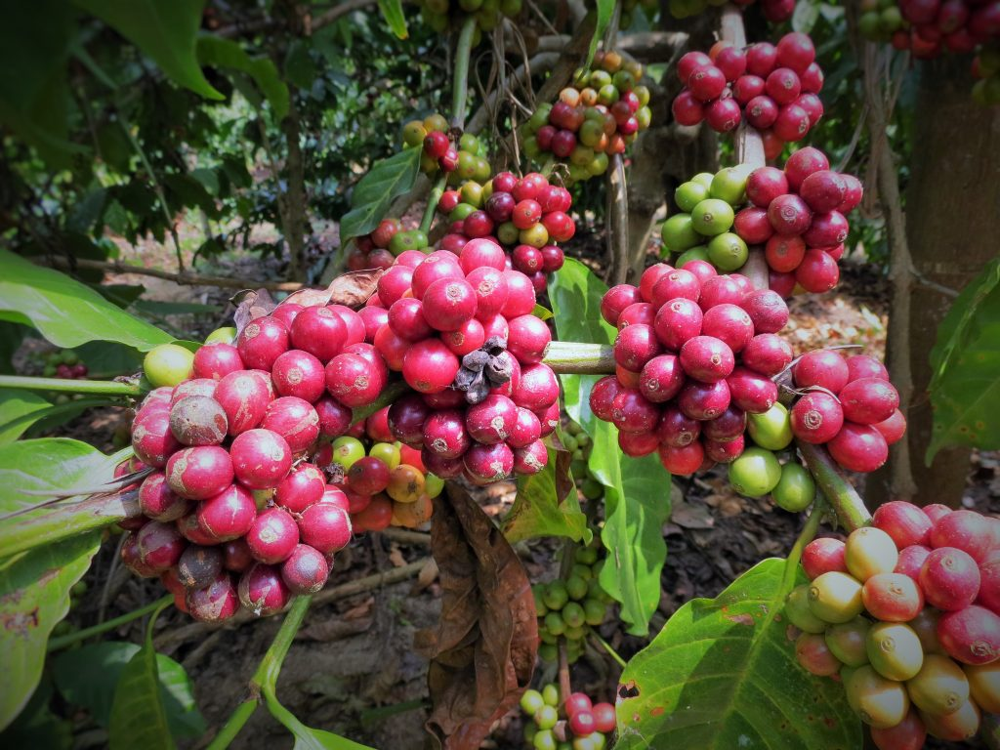
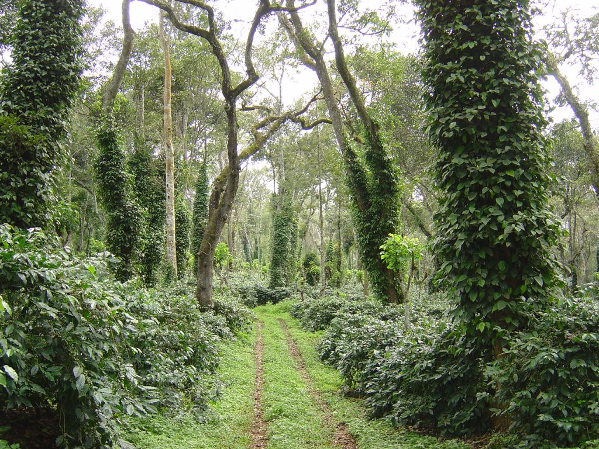
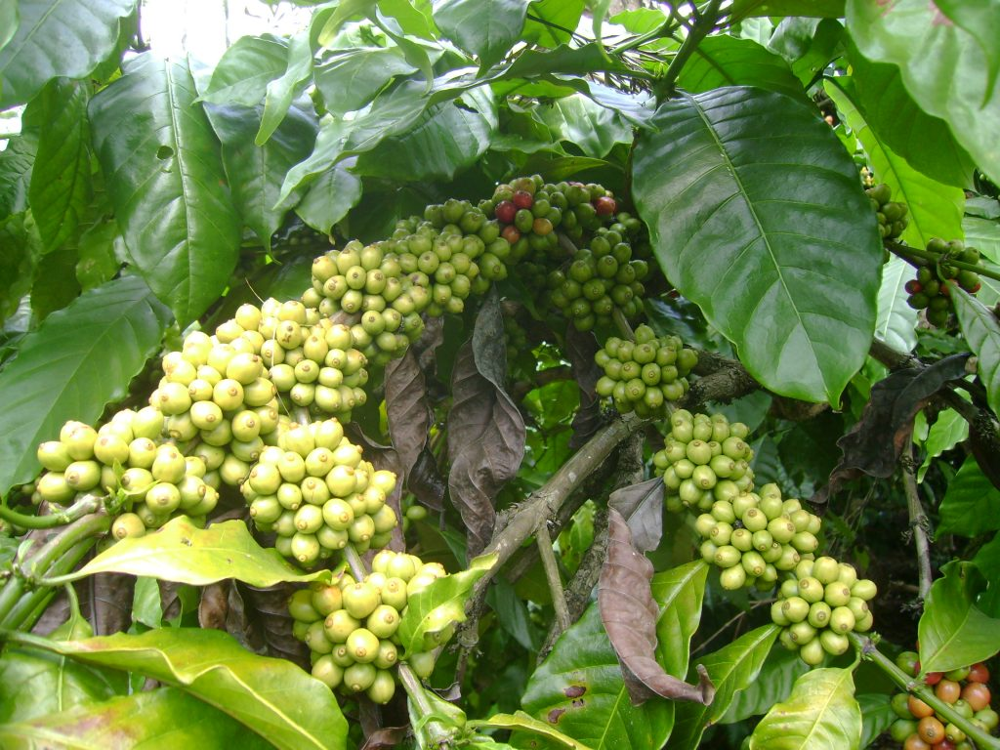

There is no denying the fact that Coffee soils in India are rich in nitrogen, but the paradox is that most of it is in the unavailable form. Second, Nitrogen is the most imperative element for proper plant growth and development of the coffee bush. Third, nitrogen plays a pivotal role in significantly increasing and enhancing the yield and quality of coffee by playing a vital role in the biochemical and physiological functions of the plant. Fourth, Pivotal N is required in larger quantities at critical stages of growth and development. Lastly, nitrogen provides the bulk of nutrients for the production of biomass.  
Coffee Planters need to be aware that the single most factor for the decline in yield and productivity of coffee and multiple crops associated with coffee agroforestry is due to improper and non-judicious use of N and its reason is lack of awareness.  
This article throws light on some basic aspects of nitrogen and the way plants absorb it.

### Nitrogen And Coffee

Nitrogen is an essential constituent of the coffee bush. It is present as the fundamental unit in proteins, nucleic acids, chlorophyll, and other organic components. It is a vital constituent of the enzyme systems and plays a crucial role in all the metabolic processes in the plant. Nitrogen largely determines the crop production and consequently also that of the productive woods.  
A balanced supply of nitrogen increases photosynthetic activity, vegetative growth and gives a dark green color to the leaves. It also plays a significant role in speeding up the maturity of coffee. Most importantly, a balanced supply of nitrogen for the plant is a must for the uptake and translocation of other nutrients.

### When is Nitrogen most required by Coffee

Even though nitrogen is essential for coffee plants throughout the year, nitrogen demand by coffee plants is maximum during the vegetative phase, blossom and berry development. Nitrogen is required for flower differentiation, speedy shoot growth, the health of flower buds and increased quality of fruit set. Application of the correct form of nitrogen at critical stages of plant growth and development has one significant advantage, which is most often overlooked by coffee Planters and that being, nitrogen, acts as a catalyst for the efficient uptake of other mineral elements. For better sustainable yields and safeguarding the coffee garden from nitrate pollution, it is to wisely apply fertilizer nitrogen by applying the correct type of nitrogen, in split doses at optimal times whenever the soil moisture is right.

### Harmful Aspects of Too much Nitrogen

Application of excess fertilizer nitrogen can use stability issues, leaching nutrients and over stimulating vegetative growth. In fact, our observation points out that a vast majority of Planters are in the habit of using excess nitrogenous fertilizers either as a top dressing or basal application to enhance productivity. This practice is wrong. First and foremost it results in an imbalance both in the soil nutrient flux and also in the physiological integrity of the Coffee Bush. For example, we have noticed that blocks receiving excess nitrogenous fertilizers have luxuriant growth but poor productivity. The coffee bearing nodes are far apart and the berry size and cluster too is small. Also, the fruit setting is highly unstable and berry drops, especially during monsoon is high. Hence judicious use of nitrogen is of paramount importance to provide for long term stability and integrity of the coffee ecosystem.

### Forms of Nitrogen Absorbed by Plants

Plants absorb nitrogen as both ammonium and nitrate. Nitrate generally occurs in higher concentrations than ammonium and is free to move to the roots by mass flow and diffusion. Some ammonium is always present and will influence plant growth and metabolism in ways that are not completely understood.  
The preference of plants for either ammonium or nitrate is determined by the age and type of plant, the environment, and other factors.

### Nitrate

The rate of nitrate uptake is usually high and is favored by low ph conditions. When plants absorb high levels of nitrate, there is an increase in organic anion synthesis within the plant coupled with a corresponding increase in the accumulation of inorganic cations like calcium, magnesium, and potassium.

### Ammonium

Plants generally prefer ammonium as the preferred source of nitrogen. This is because energy will be saved when it is used, instead of nitrate for the synthesis of protein. More importantly, ammonium is less subject to losses from the soil by leaching and denitrification.  
Ammonium and hydrogen ion concentration.  
Plant uptake of ammonium proceeds best at a ph of 7.00 and is depressed by increasing acidity. Absorption of ammonium by roots reduces calcium, magnesium and potassium uptake while increasing absorption of orthophosphates, sulfates, and chlorine.

### Ammonium and Nitrate Concentrations

Scientific literature supports data that plant growth is often improved when plants are nourished with both nitrate and ammonium compared to either nitrate or ammonium alone. There is increasing evidence that mixtures of these forms are beneficial at certain growth stages for some genotypes of agronomically important cash crops.

### Soils

Coffee soils are either sandy loam or have high clay content. Soil texture affects how well nutrients are absorbed. It is noticed that clay and organic soils hold nutrients efficiently compared to sandy loam.

### Nitrogenous Compounds % Nitrogen Content

UREA 46  
AMMONIUM SULPHATE ( AS ) 21  
CALCIUM AMMONIUM NITRATE ( CAN ) 25  
SINGLE SUPER PHOSPHATE ( SSP ) 16  
DI-AMMONIUM PHOSPHATE ( DAP ) 18  
AMMONIUM PHOSPHATE ( MAP ) 20  
NITRO PHOSPHATE 20  
AMMONIUM POLYPHOSPHATE ( APP ) 12  
NPK COMPLEX – SUPHALA 15  
VIJAYA 17  
SAMPURNA 19

### Conclusion

It’s a myth that the application of high doses of fertilizer nitrogen results in better crop productivity. On the contrary, it can have deleterious effects not only on the coffee ecosystem but also on other multiple crops. Coffee farmers worldwide should practice safe and sound agricultural practices that are environmentally safe and ecologically sound. The best way to achieve this is by way of balanced fertilization, and split doze application of fertilizers which results in the supply of nutrients in-sufficient and balanced quantities, in available form and most importantly when the coffee bush requires it.

### References

Anand T Pereira and Geeta N Pereira. 2009. Shade Grown Ecofriendly Indian Coffee. Volume-1.

Bopanna, P.T. 2011.The Romance of Indian Coffee. Prism Books ltd.

Anand Titus Pereira & Gowda. T.K.S. 1991. Occurrence and distribution of hydrogen dependent chemolithotrophic nitrogen fixing bacteria in the endorhizosphere of wetland rice varieties grown under different Agro climatic Regions of Karnataka. (Eds. Dutta. S. K. and Charles Sloger. U.S.A.) In Biological Nitrogen Fixation Associated with Rice production. Oxford and I.B.H. Publishing. Co. Pvt. Ltd. India.

Brady.N.C. and Weil. R.R. 2004. The nature and Properties of Soils. Thirteenth Edition. Pearson Education Pte. Ltd., Indian Branch, F.I.E. Patparganj, Delhi 110 092, India.

Samuel L. Tisdale, Werner L Nelson, James D.Beaton and John L. Havlin. 2003. Fifth Edition. Soil Fertility and Fertilizers. Prentice-Hall of India Pvt. Ltd.

Anonymous.2002.Fertilizes and their Use. 2002, A pocket guide for extension officers. Fourth edition. FOOD AND AGRICULTURE ORGANIZATION OF THE UNITED NATIONS. INTERNATIONAL FERTILIZER INDUSTRY ASSOCIATION ROME, 2000.

Alexander, M. 1974. Microbial Ecology. New York. John Wiley and sons.

Alexander, M. 1977. Introduction to soil Microbiology. 2nd edition. New York. John Wiley and sons.

Brady.N.C. and Weil. R.R. 2004. The nature and Properties of Soils. Thirteenth Edition. Pearson Education Pte. Ltd., Indian Branch, F.I.E. Patparganj, Delhi 110 092, India.

[Nitrogen Economy](http://ecofriendlycoffee.org/nitrogen-economy-inside-coffee-plantations/)