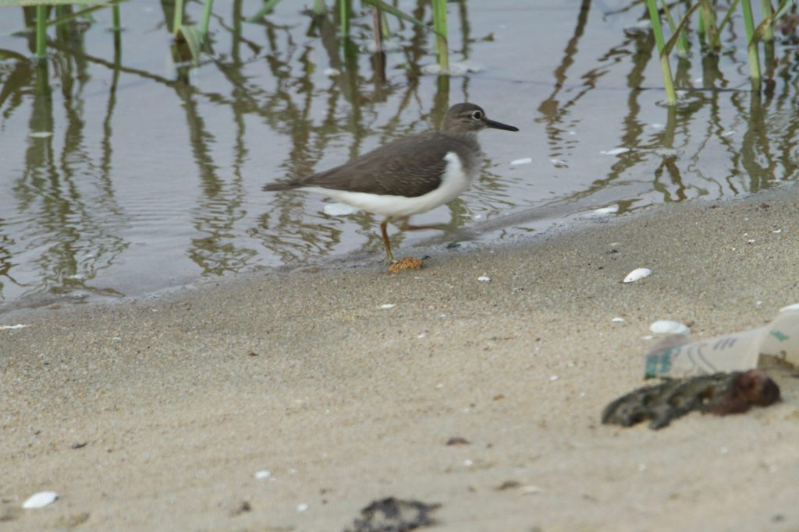

This article focuses on wetlands, recognized globally as the world’s most economically valuable ecosystems and essential regulators, to mitigate global warming. They are diverse in terms of habitat, biota, distribution, functions and uses. Wetlands are critical to our natural environment as they provide habitat to birds and animals; mitigate the impact of floods; and improve water quality. Unfortunately, world statistics, paint a grim picture because wetlands are disappearing three times faster than forests. The disappearance of wetlands is a disturbing sign and its time policy initiatives protect these vital wetlands before they are lost forever.

On 2nd February 2021, India’s first Centre for Wetland Conservation and Management has been set up in Chennai. There are 42 wetlands in India that have international importance and hence recognized as the Ramsar Sites in India. Ramsar Sites are wetlands that have international importance.

The term was coined when the International Treaty for the Conservation and Sustainable Use of Wetlands was signed at a city of Iran called Ramsar in 1971.

Shade-grown eco-friendly coffee plantations is often associated with a variety of aquatic habitats. Each of these is specialized and significantly contribute to the ecological integrity of the Coffee ecosystem. Some of these habitats include Marshes, swamps, bogs, and rice-growing wetlands. Scientific data reveals that Wetlands are the first line of defence against flooding and are some of the most biodiverse ecosystems on Earth. They are able to hold and filter, freshwater, and over the long term, can sometimes store more carbon per hectare than tropical forests. In essence, they are responsible for the overall stability and sustainability of the coffee ecosystem.

### Significance of wetlands

Wetlands play a number of functions, including, improving the water table,groundwater recharge, water purification, water storage, carbon mitigation, recycling of nutrients, erosion control, stabilization of valleys, and support of plants and animals. Inside shade coffee, they act as refuelling stops for migratory birds. The fauna and flora in aquatic habitats is unique and only adapted to this particular wetland ecosystem.

### Loss of wetlands

Scientific reports, state that since 1900, over half of the world’s wetland area has disappeared, according to the World Wildlife Fund. Scientific data reveals that approximately 35% of the world’s wetlands were lost between 1970-2015 and the loss rate is accelerating annually since 2000. Up to 40% of the world’s species live and breed in wetlands, although now more than 25% of all wetlands plants and animals are at risk of extinction. According to WWF-India, wetlands are one of the most threatened of all ecosystems in India. Loss of vegetation, salinization, excessive inundation, water pollution, invasive species, excessive development, and road building, have all damaged the country’s wetlands.

### Threats to Wetlands

Drainage of water to facilitate plantation crops like coffee, Areca, Oil Palm. Conversion to Coffee Plantation

Some of the world’s most important agricultural areas are wetlands that have been converted to farmland. This is especially true in case of coffee Plantations. The wetlands are modified to grow cash crops like ginger, and horticulture crops like areca and plantation crops like coffee and oil palm.

Ginger Cultivation

Chemical pollution in terms of synthetic chemicals, weedicides, herbicides and pesticides.

Invasive species at the cost of native flora and fauna

**Solutions**

Local Governments should be proactive to protect wetlands from conversion by enacting ordinances and at the same time providing incentives to coffee planters who safeguard them.

Educating farmers on the benefits and importance of the essential services, by way of landscape labelling and the benefits it provides the ecosystem.

Wetlands Day is observed every year on February 2. It is celebrated to raise global awareness about the vital role of wetlands for people and our planet.

### Conclusion

Wetland degradation and destruction is occurring more rapidly inside the coffee ecosystem than in any other ecosystem. This has not only destabilized the sensitive ecology of the Western Ghats but has resulted in flooding and landslides, the magnitude, of which is yet to be understood. In recent years, in many coffee-growing Districts, Planters have witnessed hundreds of acres of mountain tops moving into valleys and large scale destruction of coffee forests. Wetland conversion has increased flood and drought damage, and nutrient runoff into streams, rivers and other water bodies.

### References

Anand T Pereira and Geeta N Pereira. 2009. Shade Grown Ecofriendly Indian Coffee. Volume-1.

Anand Titus Pereira & Gowda. T.K.S. 1991. Occurrence and distribution of hydrogen dependent chemolithotrophic nitrogen-fixing bacteria in the endorhizosphere of wetland rice varieties grown under different Agro-climatic Regions of Karnataka. (Eds. Dutta. S. K. and Charles Sloger. U.S.A.) In Biological Nitrogen Fixation Associated with Rice production. Oxford and I.B.H. Publishing. Co. Pvt. Ltd. India.

Brady, N.C. and R.R. Weil. 2002. The Nature and Properties of Soils, 13th edition, Prentice Hall.

Martin Alexander. 1978. Introduction to soil microbiology. Second edition. Wiley Easter Limited. New Delhi.

[Wetland](https://en.wikipedia.org/wiki/Wetland)

[Map Of The Month: Where Are The World’s Wetlands?](https://blog.resourcewatch.org/2019/04/17/map-of-the-month-where-are-the-worlds-wetlands/#:~:text=Developed%20by%20the%20World%20Wildlife,percent%20of%20the%20earth's%20surface).

[World Wetlands](https://www.indiatoday.in/information/story/world-wetlands-day-2021-theme-significance-and-all-you-need-to-know-1765094-2021-02-02)