*Readers are requested to refer the article [BIODIVERSITY IN RELATION TO COFFEE PLANTATIONS](http://ecofriendlycoffee.org/biodiversity-in-relation-to-coffee-plantations/) for a better understanding of the present article.*

India has been home to coffee for almost 200 years and has always been and still remains shade grown. However, with the winds of globalization and liberalization reaching the Indian shores, Forest grown Indian coffee is making inroads in the West as a specialty coffee.

The coffee grown under the shade of forest trees has a unique taste of nature in the cupping quality. There are three key ideas here. This uniqueness is not only the result of the forest factor but also due to the fact that the coffee habitats are an integral part of multicrops, herbs and spices. In addition, Indian coffee plantations harbor thousands of species of old diverse and significant species of rare birds, insects and endangered wildlife.

Nature lovers can appreciate the beauty and variety of trees by simply taking a walk inside the Shade grown Indian coffee Plantation. It is like walking hand in hand with nature. One can hear different species of birds singing, especially at dawn and at dusk, we are greeted with a sonata of natural sounds. The amazing fact is that coffee habitat and nature bring out the best chemistry in sustaining each others needs.

Many foreigners who visit the plantation remark that Indian coffee plantations are bird and game sanctuaries. The architectural detail of the coffee mountain is astounding.

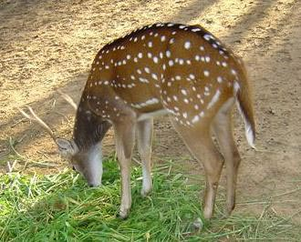

These coffee ranges are home to wildlife sanctuaries, National parks, Tiger reserves, and biodiversity plantations. The Bandipur National park flanked by Nagarahole National park, Madhumalai wild life sanctuary and Wayanad wildlife sanctuary, together constitute the protected NILGIRI BIOSPHERE reserve, which is India’s first biosphere reserve.

This reserve is a key breeding landscape for tigers, elephants, sambars, and other mega fauna distributed across the three states of Karnataka, Kerala and TamilNadu. Indian coffee is a proud partner of this biosphere reserve. In the literal sense the Indian coffee farmer has always been an asset to the Nation as well as to the global community by being a pro active nature conservationist first and secondly by growing earth friendly Indian coffee.

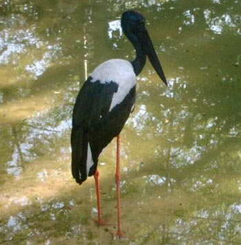

This article is intended to be an eye-opener or a window to the world of coffee lovers worldwide in allowing them to appreciate the role of Indian coffee farmers in maintaining the fragile forest cover and its inhabitants. It provides an opportunity to observe the complexity of nature both on the forest floor and the coffee canopy.

With the unique flora and fauna, the coffee mountain allows one to experience the sights, sounds, smells and life of the forest canopy. In recent years, the coffee landscape had changed for the worse, but a new awareness is catching up with the present generation in rectifying some of the past mistakes. The new generation of coffee farmers are paying undivided attention into A forestation programmes.

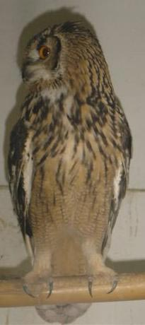

World Environment day, commemorated each year on June 5th is one of the principal vehicles through which the United Nations stimulates worldwide awareness of the environment. It’s perhaps a good occasion to sit back and take stock of the state of our environment. We need to give mother earth a chance to repair itself from man made problems like deforestation and rapid Industrialization. Our commitment for a better earth must be articulated in terms of future generations.

### Forest Cover in India

The forest survey of India states that the forest cover in the country is 63 million hectares, literally covering 19% of the geographical area of the country. More than 25 million hectares of this forest land is degraded resulting in barely 10% of the land under forests.

The scientific truth spells out that for any country to maintain its ecological integrity, the forest cover should be at least 33%. In such a depressed scenario, the coffee planters in the country come to the rescue of the Governments by not only protecting forests but also converting barren hills into dense forests by planting millions of saplings. It is an established fact that coffee planters are largely responsible in stopping the dwindling of forest resources.

Shade loving coffee farms often provide a safe haven for the biotic community. The State of Karnataka produces approximately 70% of India’s shade grown coffee. Karnataka ranks 18th in the Country in terms of forest cover with 19.3% of its land covered by forests. 70% of these biodiverse forests come under the Western Ghat range recognized world over as one among the 18 hotspots of the world.

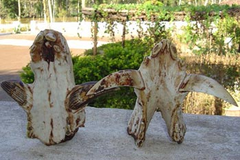

### World Scenario

The World Resources Institute has indicated that more than 80 per cent of the planet’s natural forests have already been destroyed. The Food and Agriculture Organization (FAO) estimates that 53,000 square miles of tropical forests were destroyed each year during the early 1980’s. Of this 21,000 square miles of tropical rainforests were deforested annually in South America, most of this in the Amazon basin.

Forests air condition the planet and regulate its temperature. The Amazon forest act as the lungs of the earth. They inhale carbon dioxide and give out oxygen. Matter of fact, these forests are prime generators of the earth’s oxygen.

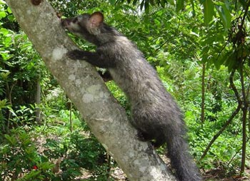

### Significance of Coffee Forests

Man-made Forests

Marginal lands or grasslands are slowly and steadily converted to bio-rich coffee plantations by first growing a cover crop of legumes like Sesbania and Daincha, followed by growing millions of trees, which acts as shade for wildlife and birds.

These man made forests also serve to harvest rain as well as preserve the sensitive ecology of the region. A single large tree can release up to 400 gallons of water into the atmosphere each day. One acre of trees produces enough oxygen for 18 people every day. One acre of trees absorbs enough carbon dioxide per year to match that emitted by driving a car 26,000 miles. Meanwhile, urban neighborhoods with mature trees can be up to 11 degrees cooler in summer heat than neighborhoods without trees. Furthermore, large trees remove 60-70 times more pollution than small trees.

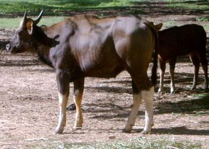

### Critical Period

5O years back, the Plantation scene was totally different. There were more wild animal species than the number of coffee planters put together. Our forefathers were sensible people. Men with vision and uncommon, common sense. They were excellent observer’s of natural life. They had it at the back of their mind the LIVE and LET LIVE live approach.

One could see Leopards, Tigers, Elephants, Rabbits, bison’s, sambar, reptiles, spotted deer, wild boar, Green pigeons, and cranes, at the waterholes inside the Plantation. Literally, every plantation with their extensive lakes provided a safe haven. During the migration periods as well as during the mating season, seldom would any Planter venture out hunting. Also during the hunting season, care was taken such that the female of the species was not hunted down.

Wild fruit trees were allowed to grow in the valleys along with shrubs and herbs and this thick jungle of shrubs and thorn bushes used to be the lodge as well as food baskets for wildlife. The big cats were selectively shot only because they were man eaters. Planters never killed wildlife indiscriminately. They never used to overdo things. Today the situation is pathetic.

The forest itself is in trouble. The wildlife numbers have declined alarmingly due to over hunting and clearing of restricted zones within the coffee forest. Deforestation and extension of Plantations has also made the task of conserving that much difficult. Planters and their guns far out number the wildlife population. Migrations are earmarked as opportunities for poaching. All that remains are fragments of a once pristine wildlife habitat.

Extension of coffee plantations too is an undesirable trait because it leads to mechanization of the forest in terms of leveling and clearing of shrubs and exposing the virgin land to direct sunlight. Dr. Romulus Whitaker, a leading conservationist from the United States is of the opinion that the Western Ghats is one of the largest unbroken pieces of forest. Cutting even a single tree in the dense Western Ghats can cause severe damage to thousands of beneficial microorganisms. The destruction of the natural environment was rapid in the last five decades.

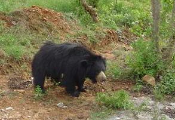

The International Union of Conservation of Nature ( IUCN ) has released a RED LIST of THREATENED Species. This list uses scientific criteria in classifying species into one of eight categories. EXTINCT; EXTINCT IN THE WILD; CRITICALLY ENDANGERED; ENDANGERED; VULNERABLE; LOWER RISK; DATA DEFICIENT and NOT EVALUATED.

A species is classified as threatened if it falls in the Critically Endangered, Endangered, or vulnerable categories. The March, 2004 red list states that nearly 30 per cent of the primate species are in the threatened category.

Table 2. Globally Threatened Animals Occurring in India by Status Category.

1994 IUCN Red List Threat Category

Group

Endangered

Vulnerable

Rare

Indeterminate

Insufficiently

TOTAL Known

Mammals

13

20

2

5

13

53

Birds

6

20

25

13

5

69

Reptiles

6

6

4

5

2

23

Amphibians

0

0

0

3

0

3

Fishes

0

0

2

0

0

2

Invertebrates

1

3

12

2

4

22

TOTAL

26

49

45

28

24

172

A few endangered species of wild animals: Tigers. Elephants, leopard cat, rusty spotted cat, Asiatic wild dog, sloth bear, lion-tailed macaque , Nilgiri tahr and Nilgiri langur purple-faced.

INDIAN ELEPHANT: International demand for Ivory and Organized crime inside the game sanctuaries is threatening the wild elephant population. Elephants are in real peril. Unlike the African elephant only the males of the Indian elephants have tusks, and a part of the genetic population called MAKHNAS do not have it at all. The tusk size denotes rank and position among the herd.

Young and females form herds and Males tend to disperse. Fully grown individuals consume up to 350 kg of grass and foliage per day. However, they never overgraze. Compared to the African elephant, the Indian elephant is much smaller in size. The only way out to protect these animals is by giving them their own domain of untouched forests, free from human habitation.

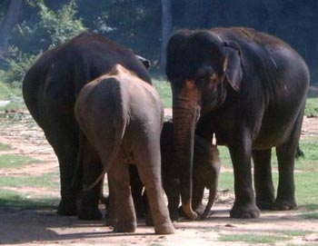

TIGER: The tiger made its appearance in India about 10,000 years ago and has ruled the forests of the subcontinent since then. In 1948, the tiger population was estimated to be 25,000. However, with the forest cover shrinking at an alarming rate together with poaching, only, 3500 of these majestic cats is found in the wild. Extinction is a grim possibility. Tiger is recognized as the National Animal of India. An adult tiger can weigh up to 600 pounds and pull down an animal four times its size.

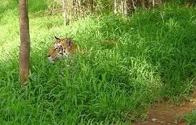

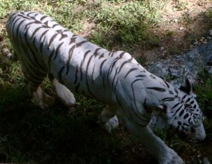

### Environmental Crisis

For the past three years the price of coffee has been below the cost of cultivation and this coffee crisis has triggered a range of reactions from the coffee farmers. Coffee farmers are increasingly diverting their attention towards short term profits. On one side they are indiscriminately cutting native trees and replanting the soil with saplings like eucalyptus, mangium, maesopsis, acacia, delonix, feltoforum, and other species meant for the restoration of desert soils.

These tree species have high amount of phenolics and are miners of precious nutrients. Instead of contributing to the soil fertility they degrade the soil and also remove water from the groundwater table. In the bargain the self supporting stability of natural forests decline. We firmly believe that the greatest threat to this fragile planet in the 21st century is the destruction of coffee forests and creation of mono-cropped forests.

Imagine millions of acres of pine, eucalyptus, acacia or mangium forests. They do not support any other plant or animal life. So called forests have the potential of wiping out millions of plant, animal and bird species which are vital for mans existence.

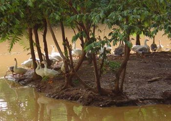

### Solution

Forest nurseries and private nurseries need to propagate the native forest trees which contribute thousands of tons of biomass and periodically rejuvenate the soil system. So coffee farmers need to prepare and preserve the seeds of these traditional varieties of hardwood and semi hardwood species which act as rain harvesters and enrich the fertility status of the soil.

Our earlier studies have shown that below the ground interface, all biotic partners are interconnected with each other and closely follow nature’s principle of sharing the land and the bounty it holds.

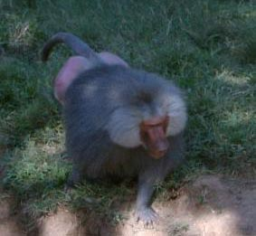

### Consequences Due To Loss of Forest Cover

-   -   Precious topsoil is washed down the mountain. Fertile regions cannot support plantations in just a few years because of the loss of nutrients.
    -   Coffee grown in High rainfall areas suffer due to the early onset of drought.
    -   Hydel dams get affected due to silting of rivers and choking the river beds.

Power production from hydro dams get drastically reduced due to less water holding capacity in the dams resulting in power shortages to the coffee farmer.

-   River catchments lose their green cover leading to drying up of streams and rivulets.
-   Coffee forests with their dense mulch and organic matter act as blotting papers in absorbing rain into the fragile earth. They indirectly, purify more than 70 per cent of the water that we drink, from harmful bacteria. Nature’s purification system takes a heavy toll.
-   The global carbon accumulation results in greenhouse effect.
-   The hydrogen cycle is severely affected. Transpiration and evaporation are significantly reduced due to loss of green cover.
-   Erratic rainfall patterns.
-   Biodiversity is lost.
-   Biodynamic soil loses its resilience. Rapid destruction of million’s of beneficial soil microorganisms. Soil will depend only on artificial chemical manures for productivity.
-   Environment and Ecology are closely related to poverty reduction & sustainable development.
-   Unemployment to millions of unskilled workers and physically challenged people.

### Strategies to Protect Coffee Forests

-   Never look at the coffee forest as a commercial generator of wood.
-   Political outlook should give way to scientific outlook.
-   Creation of greater awareness among the bureaucratic classes.
-   Earmarking coffee growing zones as heritage sites.
-   Environmental consciousness’ to start from the lowest rung of the ladder.
-   Promote coffee as a natural and International beverage.
-   Give Industry status to coffee farmers so that quick and low interest cash flow can be established. This will reduce the pressure on the land.
-   Conservation and regeneration of indigenous forest species to be given prime importance.
-   Earmark coffee zones as ecologically sensitive zones and ban mining and Other related activities.
-   Encourage multi storied crops within the coffee farm.
-   Encourage eco tourism.
-   The GENERAL Agreement on Trade and Tariffs (GATT) should earmark Shade grown coffee under the GREEN BOX. This will facilitate the farmers To conserve nature as well as get a fair price for their produce.
-   Creation of wildlife corridors , not only linking States, but neighboring Countries. (When the forest is continuous, wildlife moves freely through regular migratory paths )

### Conclusion

The specter of Industrial growth catching up in rural towns is increasing dramatically and within a decade it will have a telling effect on the world’s natural resources which are already under threat. Mistakes have been made, forests cut down when they could have been saved, wildlife, destroyed when they could have been preserved.

People need to know to know the value of what they are destroying. These environmental concerns have been expressed time and again by the United Nations but precious little has been done. Our goals should be reliable supplies of energy that are ecofriendly and affordable. First; we should recognize that even as forests become scarce, other fossil fuels like tar and shale will remain plentiful for centuries. This fact will ease the pressure on existing forests.

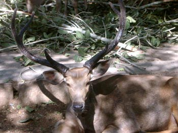

“Coffee can protect wildlife, ecosystems and environments,” said Tensie Whelan, executive director of the Rainforest Alliance. And caring about sustainable coffee can also protect coffee workers, of whom there are some 25 million worldwide. Ted Lingle “Sustainability is a three-legged stool, he said. “It consists of economic viability, environmental stewardship and social responsibility”.

The good news is that the United Nations has made a Commitment to Serve Sustainable Coffee, at its head quarters, Certified by the Rainforest Alliance. They further recognize that worldwide many countries that are breeding new generation varieties of coffee which are sun loving and respond to high amounts of fertilizers and chemicals can damage the fragile ecosystem. This in itself is a dangerous trend because it defeats the very purpose of sustainability.

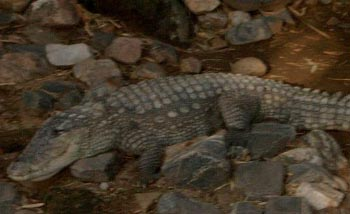

On one hand we need to keep alive the spirit of the forests and that of our ancestors. After all this ancient time tested partnership between man and forests has helped in preserving the richness of the mountain. Imagine a world without wildlife and trees ! . It creates an empty world, without depth and substance. It will spell disaster to all of mankind. On the other hand the war on poaching is escalating.

Rare species of butterfly, crocodile, elephant tusks, rhino horn etc are trophies that are exhibited in affluent houses. Under our very own eyes, our entire ecosystem is changing. Man’s unbridled greed has resulted in accelerating deforestation. There may not be enough land left for the survival of wildlife, leave alone forests. In the coming months we need to take stalk of old challenges and gear ourselves to face new challenges. Just as we speak about global peace, we also need to make peace with mother earth’s flora and fauna.

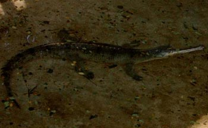

The authors wish to express their heartfelt gratitude to **Mr. Allen J Pais**, Coffee Planter, ” PROVIDENCE ESTATE ” ,Siddapur, Coorg, Kodagu. For contributing the wildlife photos.

### References

[ecofriendlycoffee.org/biodiversity-in-relation-to-coffee-plantations/](http://ecofriendlycoffee.org/biodiversity-in-relation-to-coffee-plantations/)

[www.arkive.org](http://www.arkive.org)

[www.wildscreen.org](http://www.wildscreen.org/)

The IUCN Red List of Threatened Species

forests.org

[Forests – Greenpeace](http://www.greenpeace.org/international/en/campaigns/forests/)

[passporttoknowledge.com/rainforest](http://passporttoknowledge.com/rainforest/intro.html)

[www.zoomschool.com/subjects/rainforest](http://www.zoomschool.com/subjects/rainforest/)

[Worldwildlife.org](http://www.worldwildlife.org)

[www.enchantedlearning.com](http://www.enchantedlearning.com)

Groombridge, B. (Ed). 1993. The 1994 IUCN Red List of Threatened Animals. IUCN, Gland, Switzerland and Cambridge, UK. lvi + 286 pp.

World Conservation Monitoring Centre 2000. Global Biodiversity: Earth’s living resources in the 21st century. By: Groombridge, B. and Jenkins, M.D. World Conservation Press, Cambridge.