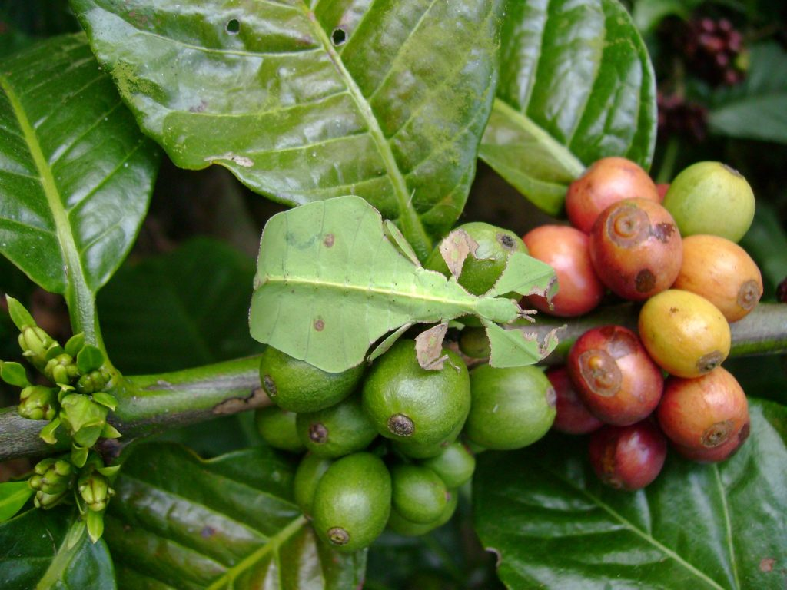
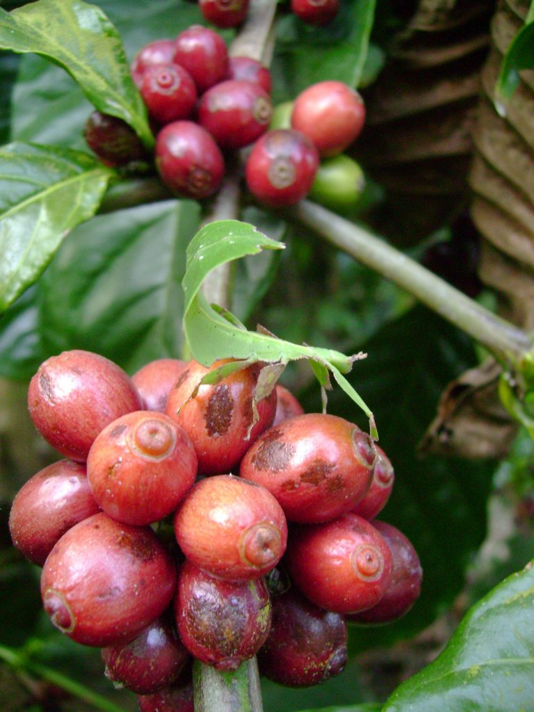
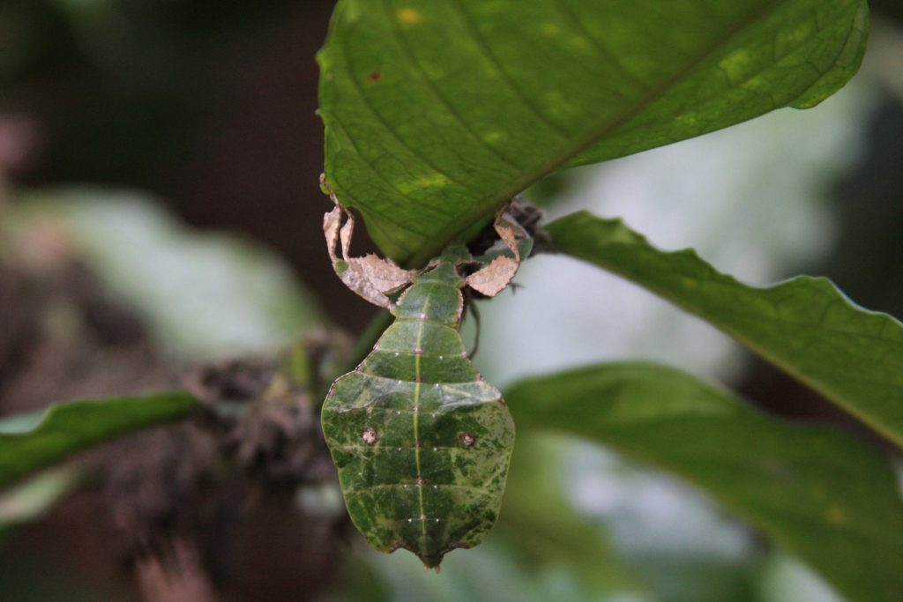

The Western Ghats recognized globally as a hot spot of biodiversity is home to India’s shade grown coffee forests. In fact, 60 per cent of the Western Ghats is found in Karnataka. This ecologically sensitive region **covers** an area of 59,940 sq. km. in Karnataka State and represents a continuous band of natural vegetation. It is also recognized as one of the world’s eight “hottest” hotspots in terms of their significance for biodiversity conservation efforts. The range is home to at least 84 amphibian species, 16 bird species, seven mammals, and 1,600 flowering plants which are not found anywhere else in the world. New species of flora and fauna continue to be regularly discovered in this region, despite the negative effects of shrinking ecosystems and climate change. Mapping of forest cover is an important measure of natural resource inventory and management for any area. Yet there are no comprehensive studies particularly on the biodiversity of coffee.

Thus the objective of the present study is to document the flora and fauna, especially rarely seen insect species which hide within the canopy of the three tiered coffee shade system.The pictures of the leaf insect that you are about to view is a result of our work spread over two decades in mapping the biodiversity of the western Ghats.

Coming to the Amazing Leaf insect….It is one of the best masters of disguise in terms of camouflage. The entire insect resembles a leaf and it is very difficult to spot the insect foraging on leaves. When the insect walks, it gently sways its whole body from side to side giving the appearance of a leaf blowing in the wind. The leaf insect when young has also developed mechanisms capable of regeneration where in it can cast off parts of its legs when a predator threatens it. The part of the leg then grows back to normal. However, once it has reached its adulthood, it can no more replace the lost limb.

### Physical Characteristics

Leaf insects commonly referred to as “Walking Leaf” are flat green insects, with leaf like appearance and are herbivorous in nature. The leaf like forms usually bear a striking resemblance to foliage, exhibiting leaf veins, mildew spots and even apparent insect feeding damage.

Color and form provide protection by allowing these insects blend with their environment. Leaf insects are green and have extremely flattened, irregularly shaped bodies, wings, and legs; they are usually about 4 in. (10 cm) long. Their wings often have venation similar to that of the leaves on which they live. Females are flightless and so the hind wings have no function. The eggs of leaf insects are scattered on the ground. The young resemble the adults except for their smaller size and reddish color; shortly after they begin feeding on leaves they turn green.

Leaf insects are tropical in distribution and range from India to the Fiji Islands. Scientists studying these insects have stated that these creatures have not significantly changed for the last 50 million years ever since they first evolved.

Species Information

### Habitat

Found in a variety of habitats including tropical forests dry forest and grasslands.

### Size

Species of leaf insect range from 28mm to 113mm

### Conservation status

### IUCN Red List

Unknown for many species

### Threats

Birds, amphibians and reptiles. Some species imported in great numbers for the pet trade

### Diet

Variety of leaves

### Interesting fact

Male leaf insects are usually smaller and more slender than the females. This allows them to fly and search for more mating partners, since the females tend to stay higher up in trees. Mostly found in tropical forests, some species reproduce without mating. Males are very rarely seen. Females are able to reproduce through parthenogenesis, where they can lay fertile eggs without a male. Their camouflage is one of the best systems in nature – not only does their body have leaf “veins”, some of them develop brown edges that mimic a damaged real leaf.

### Conclusion

These herbivorous and nocturnal leaf insects live not only in dense forests but are also found to thrive well in fringe forests close to human habitation. However, if one browses through the world wide web, one can find very little information regarding the occurrence, behaviour and over all ecology of the Indian leaf insect. They are known to thrive in the Western Ghats and it is in our hands to make a pledge to protect its habitat. It is a fact that the vast expanses of tropical forest have become increasingly threatened in the last one decade, as large commercial companies back clearance schemes for commercial activity. Ultimately, we need to ask ourselves if man himself has become too efficient a Predator.

### References

Anand T Pereira and Geeta N Pereira. 2009. Shade Grown Ecofriendly Indian Coffee. Volume-1.

Bopanna, P.T. 2011.The Romance of Indian Coffee. Prism Books ltd.

[Leaf insect](https://www.britannica.com/animal/leaf-insect)

[Leaf Insect – The Phantom](http://www.factzoo.com/insects/leaf-insect.html)

[Phylliidae](https://en.wikipedia.org/wiki/Phylliidae)

[Introducing the Green Leaf Insect](http://www.tropicalpets.com/insects/green-leaf-insect/)

[Western Ghats](https://en.wikipedia.org/wiki/Western_Ghats)

[The Art of Deception](https://www.nationalgeographic.com/magazine/2009/08/mimicry/)