*Dr.Anand Titus Pereira is a Coffee Evaluator and Technical Consultant to Canara Bank (A Govt. of India Enterprise)*

The United Nations General Assembly declared 2011 as the International Year of Forests to raise awareness on sustainable management, conservation and sustainable development of all types of forests. According to the Food and Agriculture Organization of the United Nations, “Forests for People” is the main theme of the Year, highlighting the dynamic relationship between forests and the people who depend on them. In this article we talk about coffee forests and three interdependent relationships, commonly referred to as the **tripartite coffee forest symbiosis**.

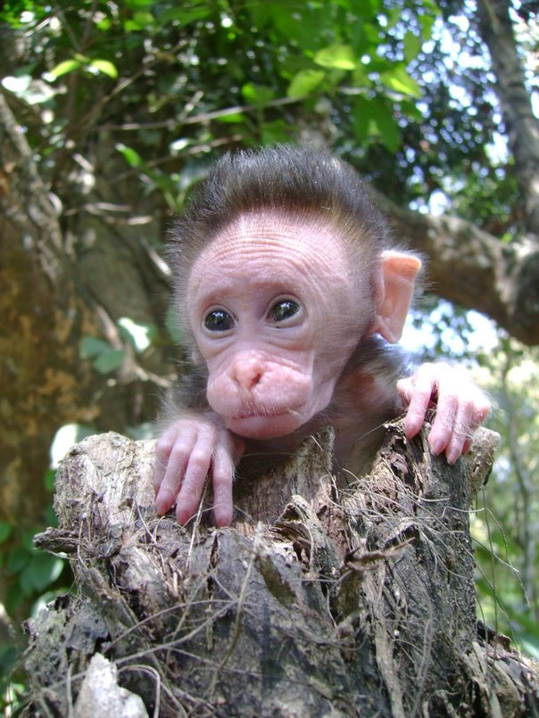

Shade grown Coffee forests are positioned deep in the heart of the Western Ghats. Coffee forests are blessed with an extraordinary wealth of wildlife and other forms of biodiversity. A vast majority of Shade grown eco friendly Indian coffee forests cultivating more than 90 % of coffee are flanked by National parks and wildlife sanctuaries.

The Bandipur National park flanked by Nagarahole National park, Madhumalai wild life sanctuary and Wayanad wildlife sanctuary, together constitute the protected NILGIRI BIOSPHERE reserve, which is India’s first biosphere reserve. These Game reserves are a key breeding landscape for tigers, elephants, leopards, sambars, Gaur, wild dogs and other mega fauna distributed across the three states of Karnataka, Kerala and Chennai. Indian coffee is a proud partner of this biosphere reserve.

In addition to this reserve, we have the Kudremukh National park in Chikmagalur District, the Brahmagiri and Pushpagiri range in the District of Coorg and a number of reserve forests like Muthodi, Maldare, and Bislae, which act as natural bridges for the migration of wildlife. Incidentally, the Kudremukh National Park is given an additional status of Tiger reserve.

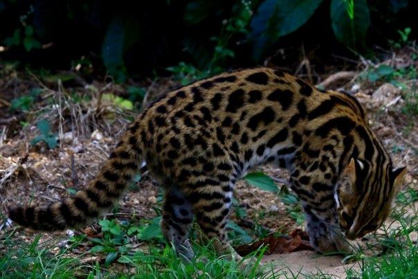

Our research spanning 22 years with respect to coffee plantation ecology and mapping the biodiversity of the Western Ghats has clearly brought out the symbiotic role played between and among various biotic partners in increasing the intrinsic value of shade grown eco friendly Indian coffee.

The main objective in writing this article is to take readers to the next level in bringing about a global awareness concerning the types of wildlife wealth inside shade grown eco friendly Indian coffee forests and the delicate thread that binds the coffee forests and wildlife together with the adjoining national parks and game sanctuaries. This symbiosis is commonly referred to as the **TRIPARTITE SYMBIOSIS**, where all the three partners, Coffee forests, wildlife and National parks utilize the resources in a mutually reinforcing manner.

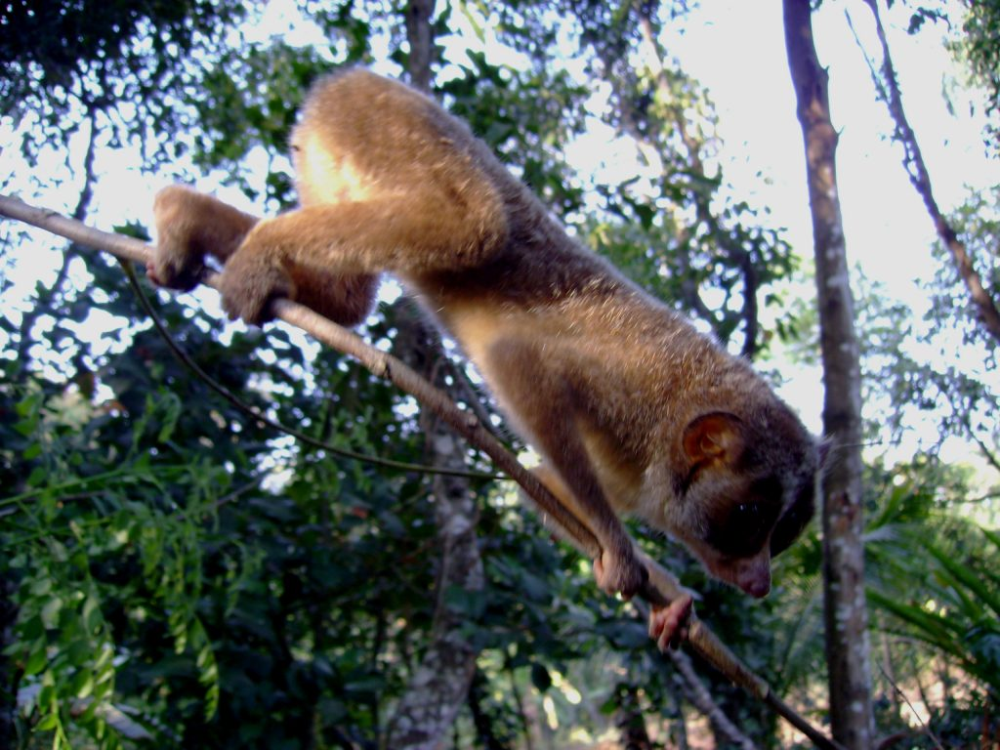

The Indian coffee landscape is wondrously rich in flora and fauna. Coffee forests are gifted with the most diverse biodiversity in terms of plant, animal, insect and microbial species. Any outsider will be stunned by the sheer perfection of the coffee forest and the majestic beauty of the coffee mountain. From the outside it is difficult to imagine the power of various life forms that inhabit each coffee growing region.

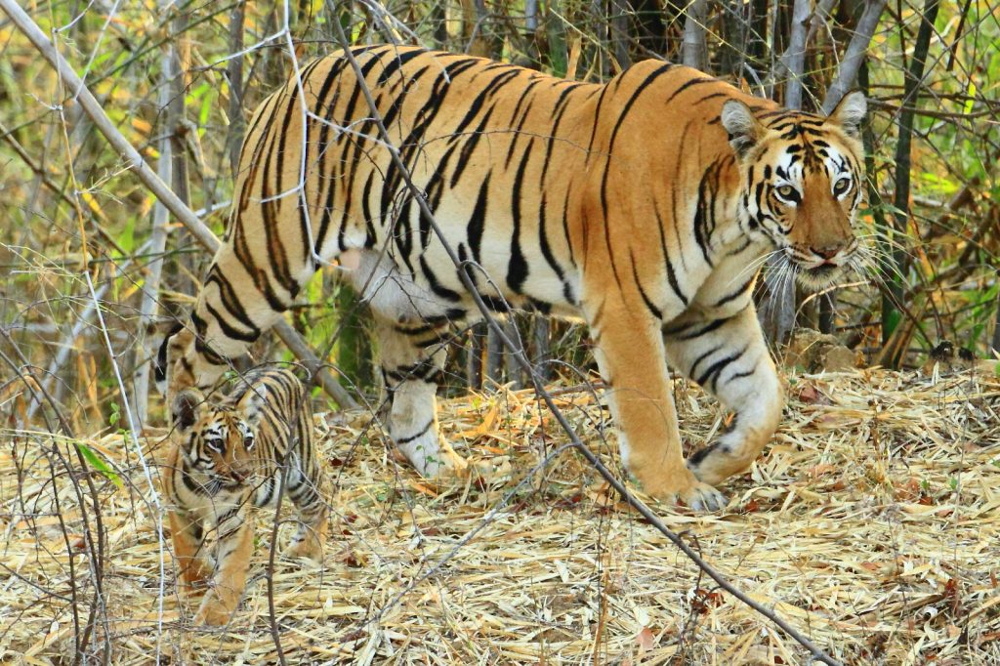

This simple article tries to address two key issues. First, to highlight the importance of coffee forests as migratory corridors for rare, threatened and endangered wildlife and second to work on an entirely new concept where technology development would have to pay attention to ecological sustainability and habitat conservation.

This article on wildlife credits evaluates the impact of economic growth on the environment, especially the coffee forests, posed by the loss of wildlife due to relentless pressure from logging, mining and other undesirable activities. It is a matter of paramount importance to find equilibrium between economic development and conservation of wildlife! Ecological dimensions have been brought into the development debate for reasons of equity as well as from the point of view of a desirable pattern of growth. We need to find acceptance values for environmental services rendered by the coffee forest.

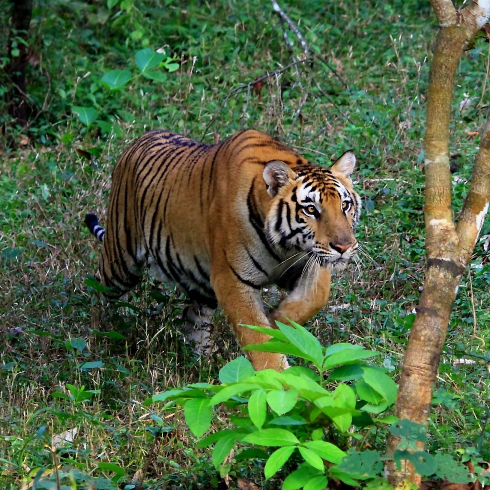

In this article we have gone one step further, in asking the scientific and global community to probe our findings and provide the growing community with a **wildlife landscape label** that will earn precious conservation credits which will enable the coffee farmer to be motivated to safeguard the earth’s precious biological resources.

It is our view point that the global community committed to social and environmental concerns, join in to promote greater awareness of the fragile coffee landscape together with the endangered and rare species there in for the benefit of future generations.

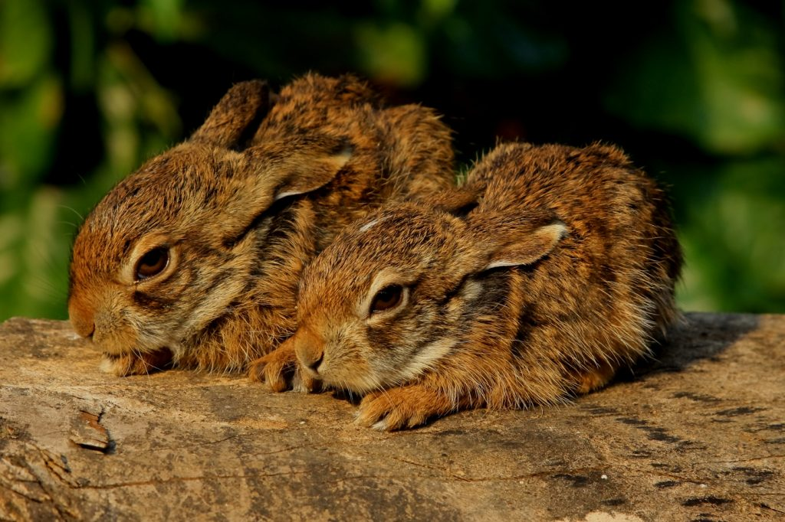

The point that we are trying to make is that, in spite of the fact that shade coffee is responsible in creation of wealth in India’s economic development; supporting livelihood of small and marginal coffee farmers, providing employment opportunities to unskilled workers and more importantly providing a wide assortment of environmental services as well, the coffee forests have not been suitably recognized for the tangible and intangible benefits they provide.

Despite the biological riches inside the coffee forests, the coffee farmers derive no legal income in terms of landscape labeling, tourism, wildlife credits, and carbon credits but the income from illegal actions like poaching, selling wildlife as pets, meat, fur etc is on the rise year after year. The impact is both hidden and apparent. Each year, foreigners purchase millions of dollars worth of wildlife from India. The biological resources are depleting at an alarming rate because of smuggling and other activities.

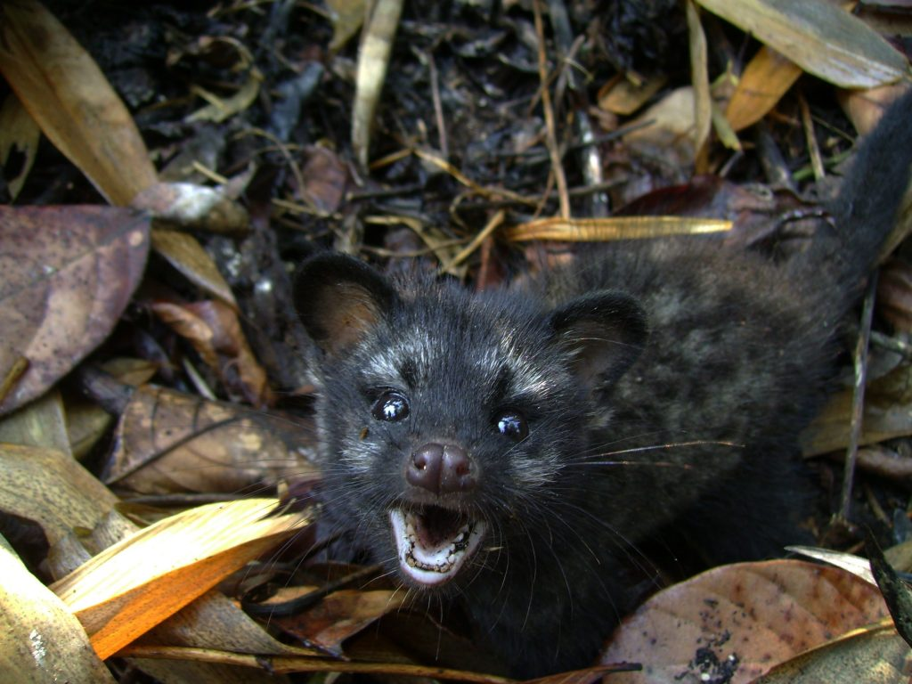

The Western Ghats runs through five states of India and are contiguous in nature. In three States, namely Karnataka, Kerala and Tamil Nadu, which contribute to more than 90% of India’s shade coffee, the British opened up coffee plantations in selective pockets. The high altitude ranges with abundant canopy cover was selected for the Arabic’s and the lower elevations reserved for the Robust’s.

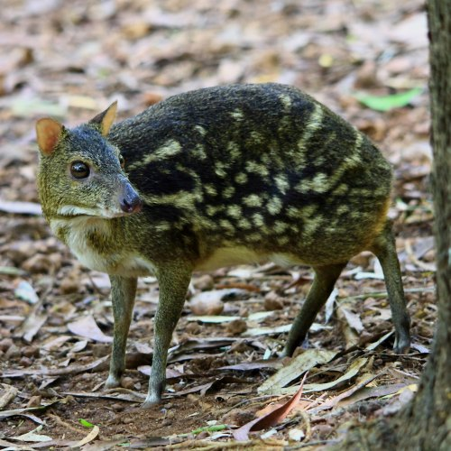

Off late this fragile hot spot a vital part of the Nilgiri Biosphere is grabbing International headlines because it harbors economically important, rare and threatened flora and fauna. Unfortunately, very little research has been carried out to discover the diversity of life forms that we still have not taken measure of. A vast majority of the rare and endemic flora and fauna can be only found here because the Western Ghats provides both the macro and micro habitat that is essential for the survival of the species.

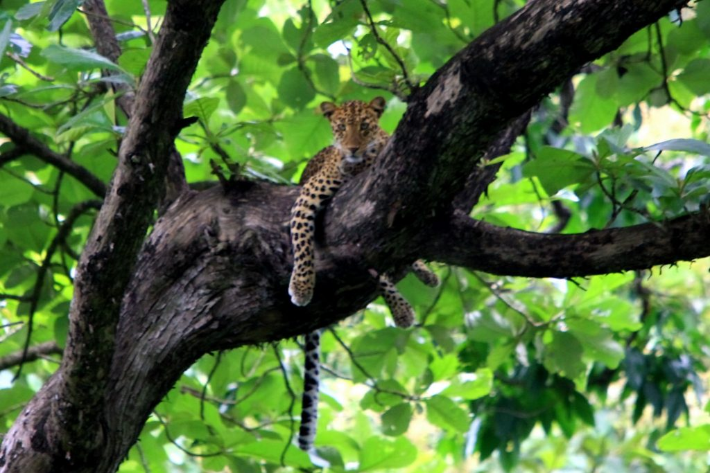

### Wildlife Refuge

Every Plantation acts as a wildlife sanctuary. Rare species of birds and a multitude of migratory birds often nest inside the coffee plantations. Apart from big game like tigers, elephants, leopards and wild buffaloes (Gaur) other species such as the slender Loris, leopard cat, green pigeon, Emerald dove, woolly necked crane, Whistling Teals, changeable hawk eagle, all thrive in the forest.

All estates have waterholes for the purpose of irrigation. In fact, our Estate known as KIREHALLI, literally translates to “Estate full of lakes or tanks”. At present, we have six Tanks; each measuring one and a half acres and 20 feet in depth. These tanks act as watersheds and recharge the groundwater, for future generations. During the night they act as waterholes for wildlife.

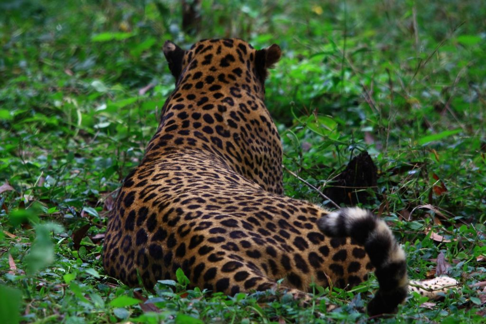

### Man-made Forests

Marginal lands or grasslands are slowly and steadily converted to bio-rich coffee plantations by first growing a cover crop of legumes like Sesbania and Daincha, followed by growing millions of trees, which acts as shade for wildlife and birds.

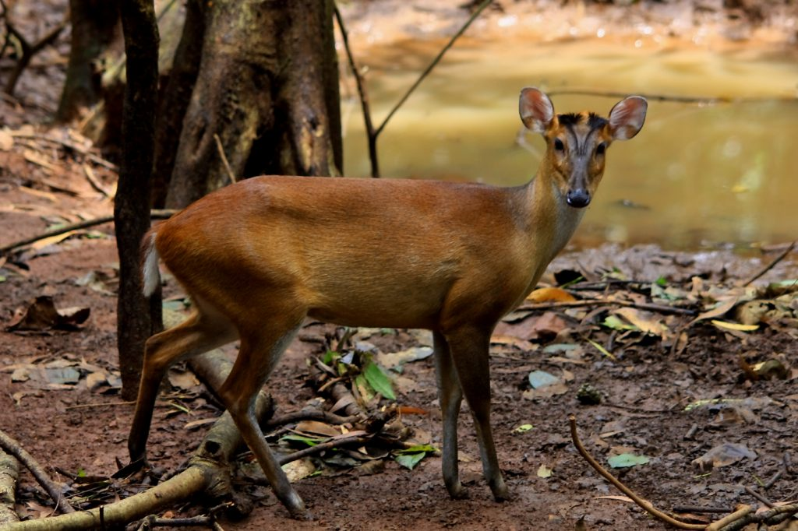

Biologists, Zoologists, Microbiologists and Botanists have recently discovered new species of flowering plants, trees of medicinal importance and new species of microorganisms, insects and animals, yet the various methods of estimation place the number yet to be discovered as thousandfold more.

The coffee forests provide sanctuary for Unknown numbers of plants and animals, both on the canopy as well as floor of the forest floor, the vast majority of which are specifically adapted to life in the tree tops or canopy. It is our understanding that 90 per cent of life forms in terms of microorganisms, insects and other small mammals reside inside the canopy and today it is the canopy which is at utmost risk because of deforestation and logging.

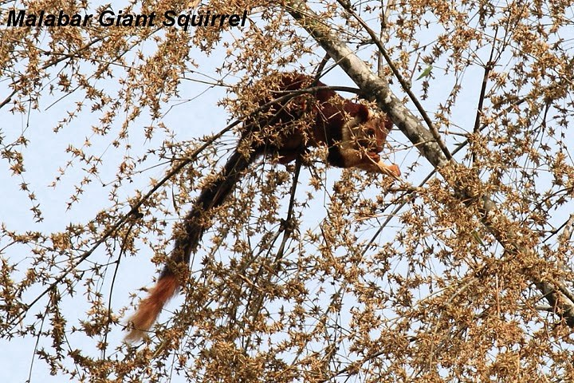

In our earlier articles on coffee forest symbiosis we brought out the interdependence where by the various partners inside the coffee ecosystem is dependent on one another to fulfill their biological needs. This type of biological interdependency may range from a simple symbiosis to an obligate one, where in one partner may need the other to complete their life cycle. These intimate and obligatory symbiotic relationships have developed over many centuries and any break up may significantly disrupt the functioning of the entire coffee ecosystem.

### Significance of coffee forests:

Coffee forests are found in the heart of the Western Ghats at different altitudes ranging from 700 meters main sea level right up to 1550 meters main sea level. Since coffee is grown in very selective elevations with varied layers of tree canopy, each coffee forest is distinct in terms of elevation and rainfall pattern.

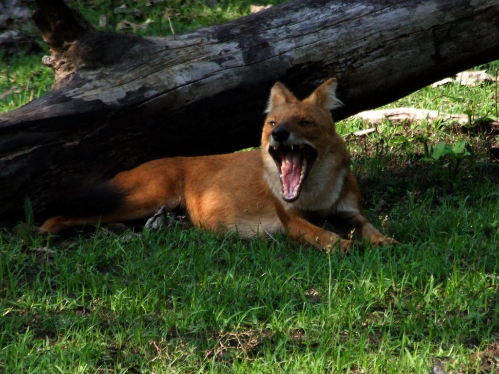

Depending on the terrain, the forests are classified as scrub forest, moist deciduous forest, semi evergreen forest, evergreen forests, shola type and dry deciduous forest. Correspondingly, each forest type harbors a specific assemblage of wild life. About 100 mammal species, including about 6000 elephants and 300 tigers, 73 reptiles and 58 amphibians have been recorded in Karnataka.

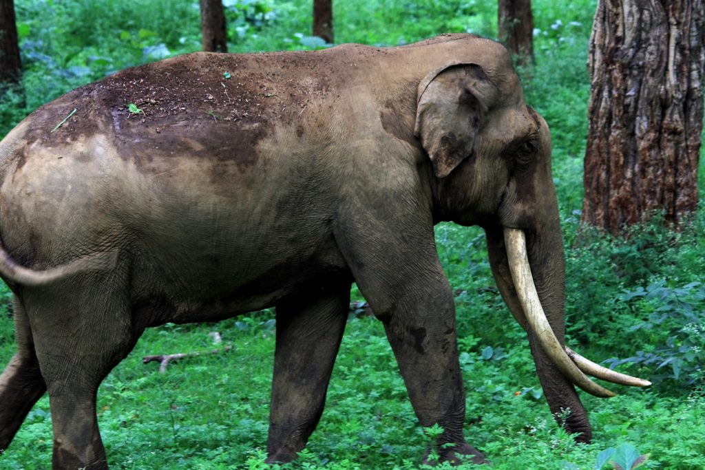

The PROTECTED AREA NETWORK in Karnataka includes five National Parks, and twenty one wildlife Sanctuaries, covering an area of 6320 square kms. Or 3.3% of the State’s geographical area. Of these two protected areas, Bandipur and Bhadra, enjoy an additional status of Tiger Reserves. Rajiv Gandhi National Park (Nagarahole) has been declared an extension of Bandipur Tiger Reserve.

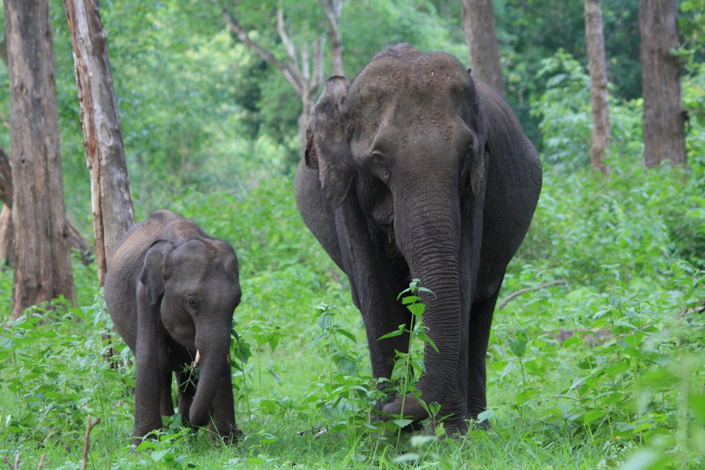

Recently, within the confines of the coffee forests scientists have discovered new species of frogs, bats, lizards and a host of other plant species with medicinal properties. Many species, few in number and limited in range, are on the verge of extinction and need urgent protection because of habitat loss. Right now in a few pockets, coffee forests have already undergone a sea change in terms of deforestation. In the lower shoal regions the extinction of the precious biodiversity is having a cascading effect on the coffee forests flora and fauna.

To make two ends meet and overcome the high cost of cultivation farmers are resorting to felling of trees and poaching. This fetches quick money to the grower but in the long run, the consequences are there for all to see. The question that the global community should address is. Does this really make a difference to anybody? Will it matter at all to planet earth? Why should anyone care if the wealth of the coffee forests is plundered by a few planters or coffee farmers!

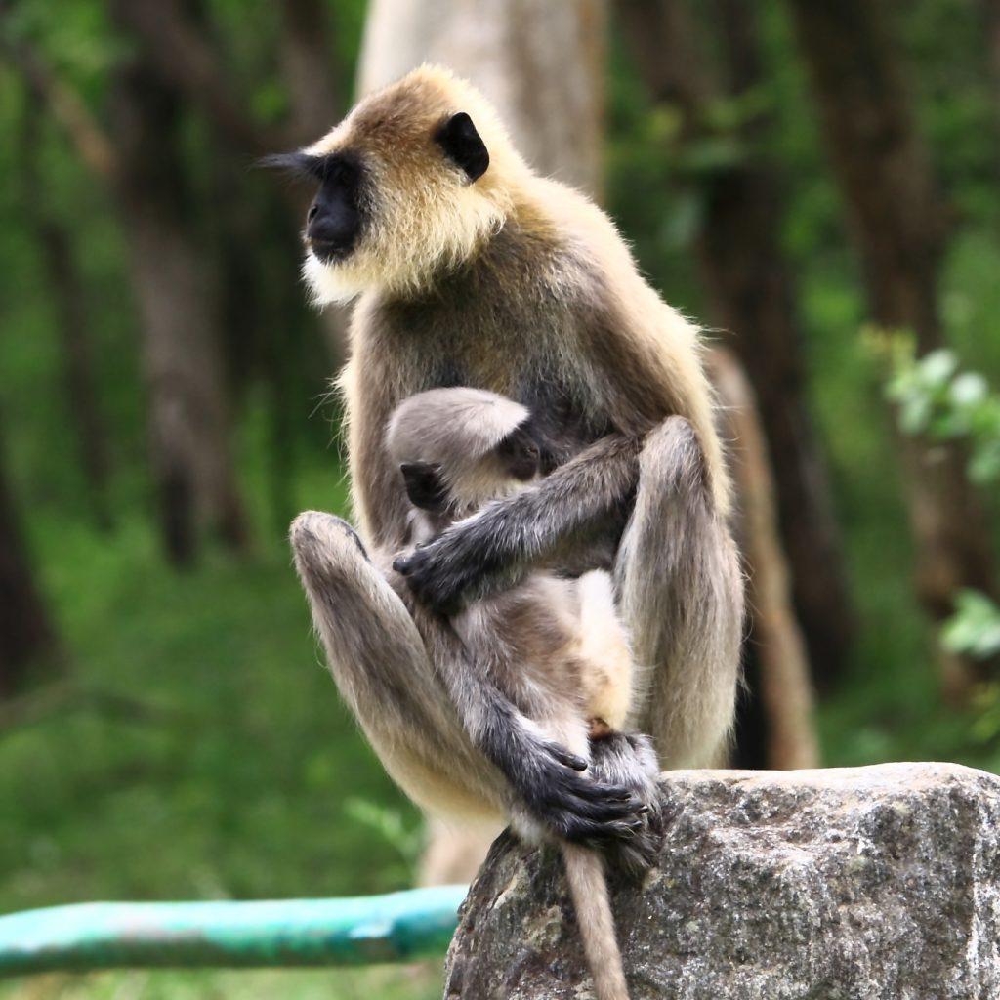

If one were to look at the larger canvas, the picture seems alarming. The concern is not about losing a few wild animals and trees here and there. Humanity stands to lose because coffee forests play an important role in climate stabilization and in regulating the earth’s temperature as well as the water cycles and other key components of the biosphere.

The influence may be limited, but by destroying coffee forests we risk our own worth, risk of accelerating global warming and more importantly destroying homes of wild animals and threaten existence of other plant, animal , microbial and insect species. These changes can undermine the precious services provided by coffee forests. There are potential benefits from both discovered as well as undiscovered species. Many medicines and bio remedies come from plants and animals.

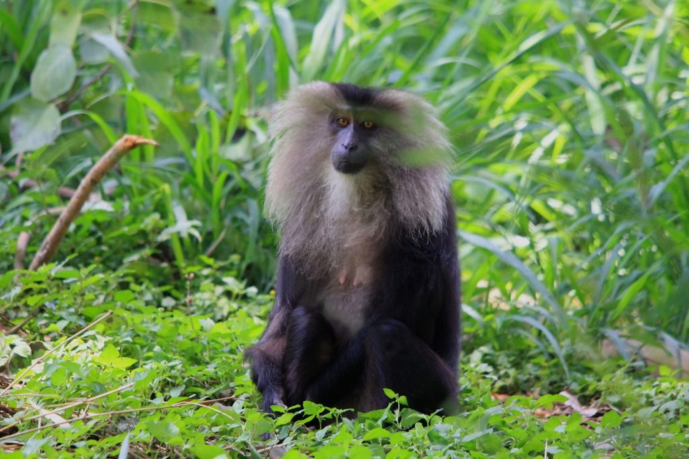

In spite of the enormous complexity inside the coffee forests and the surrounding zones, each unit that makes up the coffee forest is also very fragile. Although it appears robust, the entire system is delicate. A small disturbance has a cascading effect on various components.

Pollution, timber extraction, ginger cultivation and leveling of meadows and grasslands for oil palm cultivation is leading to the introduction of invasive species because of the indiscriminate application of banned weedicides and pesticides which leaves behind unacceptable levels of residual toxicity. In a select few places the ecological damage is irreversible because invasive species take over the ecosystem and compete with native species for nutrition and survival. We are wiping out species due to habitat destruction, even before we have even began to understand the potential value, now and for future generations.

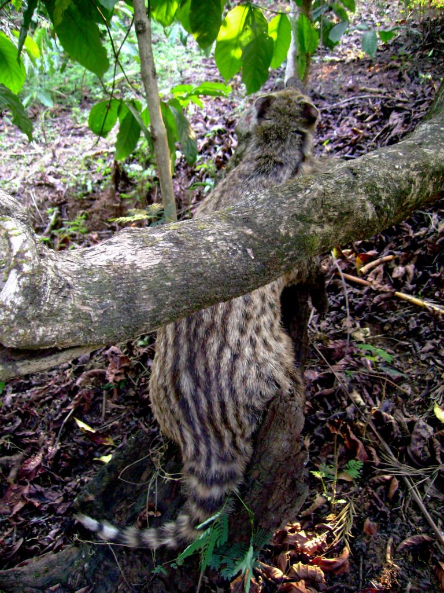

**BIOLOGICAL TREASURES OF THE WESTERN GHATS**

The Western Ghats as a whole contains almost half of all plant species and a third of vertebrate species. Of the 372 species of mammals found in India, 63 are in the Western Ghats. 16 of these are endemic. More than 70% of land snails in the Western Ghats are threatened with extinction. The sad truth is that there are many plant and animal species which are not even known to humans.

Hence it is difficult to understand the significance of various species, as there are no documents concerning them. Also, one doesn’t know and may never know before it is too late, how many species of plants and animals are endangered, and how many have already disappeared.

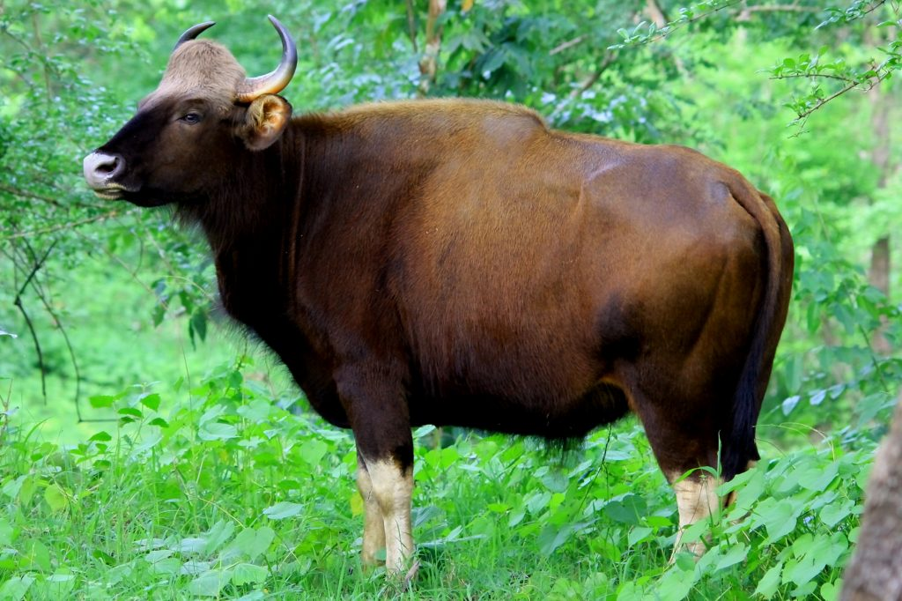

### WHY THE NEED FOR WILDLIFE CREDITS:

Coffee forests are gifted with the most diverse biodiversity in terms of endemic, rare and endangered flora and fauna. By recognizing the value of coffee forests in providing migratory corridors for big game and habitats for small sized endemic rare and threatened animals, plants, microbes and birds, the International community should facilitate purchasing of wildlife credits so that large corporations or companies can fulfill part of their obligations in conserving the wealth of the planet.

This in turn will go a long way in providing an incentive and an assured source of income to subsistence farmers for being guardians of nature. After all, this wealth belongs to the present as well as future generations and is being protected at a great cost. Our contention is to request the Government to quantify the natural resources both qualitatively and quantitatively and ask Industries to share profits or make royalty payments, and generate funds to support local villagers.

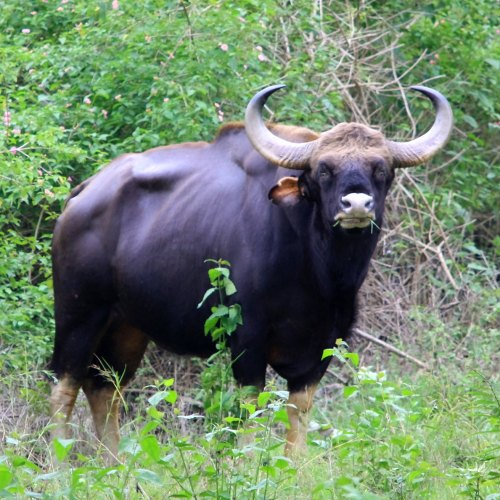

### POSITIVE ASPECTS OF WILDLIFE CREDITS:

Conservation of wildlife in its natural habitat is the safest way of safeguarding the future of wildlife because it will have a positive impact on the ecology of coffee forests. Wildlife credits will go a long way in providing incentives to coffee farmers to protect wildlife. By providing a monetary value; coffee farmers will not only protect wildlife species but more importantly, will protect their **habitat**. This in turn will bring about dual benefits in terms of assured income as well as ecotourism.

In the absence of wildlife credits the real danger is in poaching and selling wildlife as pets for commercial gain, especially to be used as pets in the domestic market. In our opinion, the commercial use of wildlife carries many conservation risks, resulting in the decline in wildlife populations. Another, risk, in the absence of wildlife credits, is the over-exploitation of a particular species resulting in the imbalance of the other species. Each displaced species could have enormous value and impact the entire ecosystem in a significant way. In short it will upset the balance of nature.

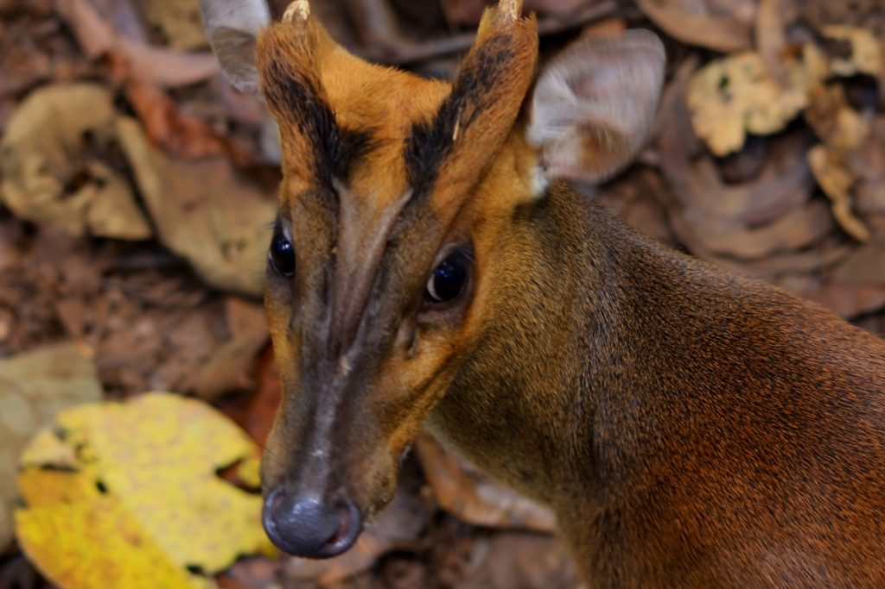

### INVESTMENT and VISION 2025

Coffee forests are generators of wealth to the nation. Unfortunately, both the planting community as well as the various stakeholders concerned has not understood in depth the ecological role of the forests in providing both sustenance to millions of unskilled workers, livelihood to subsistence farmers and sanctuary to wildlife. The sad part of the story is that investment in the plantation sector has not kept pace with the changing times.

The total value of coffee forests has been less treasured and over the years, the low investment has resulted in low annual growth. Due to lack of capital and support, the Industry has stagnated for a long time and needs to be proactive in defining a set of goals. We would request the Coffee Board to frame pro active policies and practices and set up a think tank to formulate a vision-**Vision 2025** and bring out a detailed paper to energize the entire plantation sector from coffee cultivation right up to value addition, increase in domestic consumption and exports during the 12th five year plan.

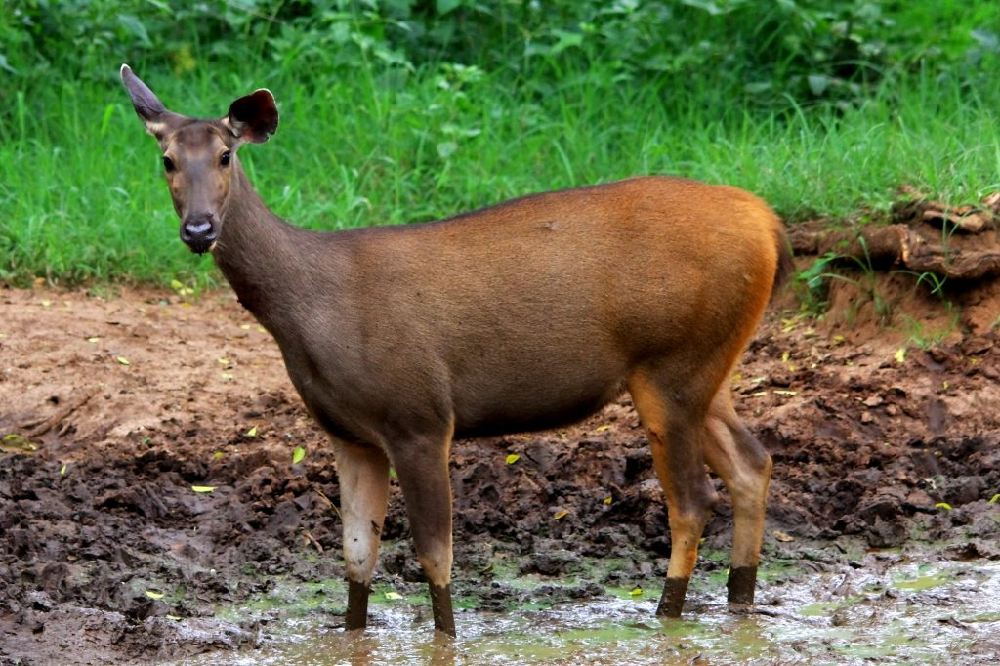

### GREEN GDP

The key indicator to measure the health of the economy is in terms of measuring the gross domestic product. However, this methodology has a few limitations. It fails to capture the contribution of several essential elements pertaining to the biological wealth inside shade grown coffee forests.

Time and again we have emphasized that Gross domestic product should reflect on green domestic product, taking into account the environmental costs and impacts. Only then, will we understand the environmental and ecological implications of high GDP growth. We are not questioning the need for high GDP, but would like to emphasize the need for a sustainable GDP which accounts for biodiversity as a key component.

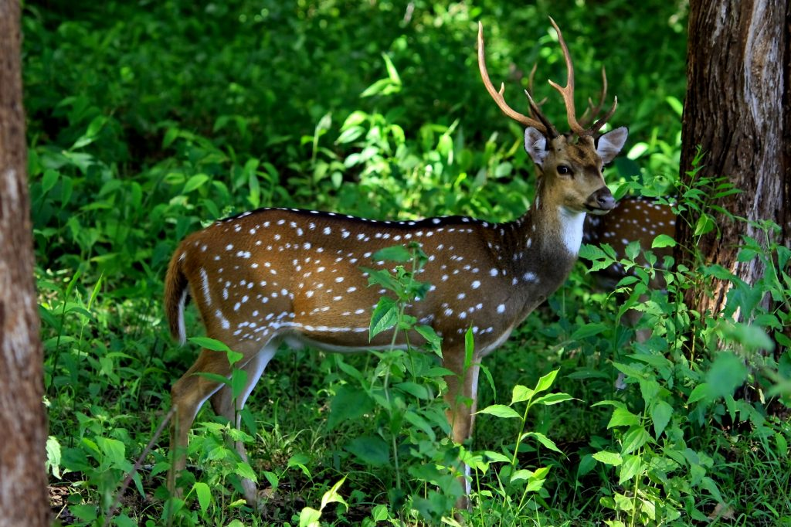

World over, a handful of Countries factor green GDP in mainstream accounting. In India, the impact on environment and biodiversity loss has not been factored in the gross domestic product; otherwise it would be much less. It is evident that decline in biodiversity would have a severe impact on business; this is especially true for developing countries which are gifted with more than 80 % of the world’s biodiversity.

It signals a warning that if the imbalance continues, it can only lead to further problems and spell disaster for the biodiversity conservation of the Country. The extinction of biodiversity will in turn endanger a number of wildlife species who depend on it. There is need for economic growth and there is no dispute in that, but we need to reconcile eco conservation with economic growth.

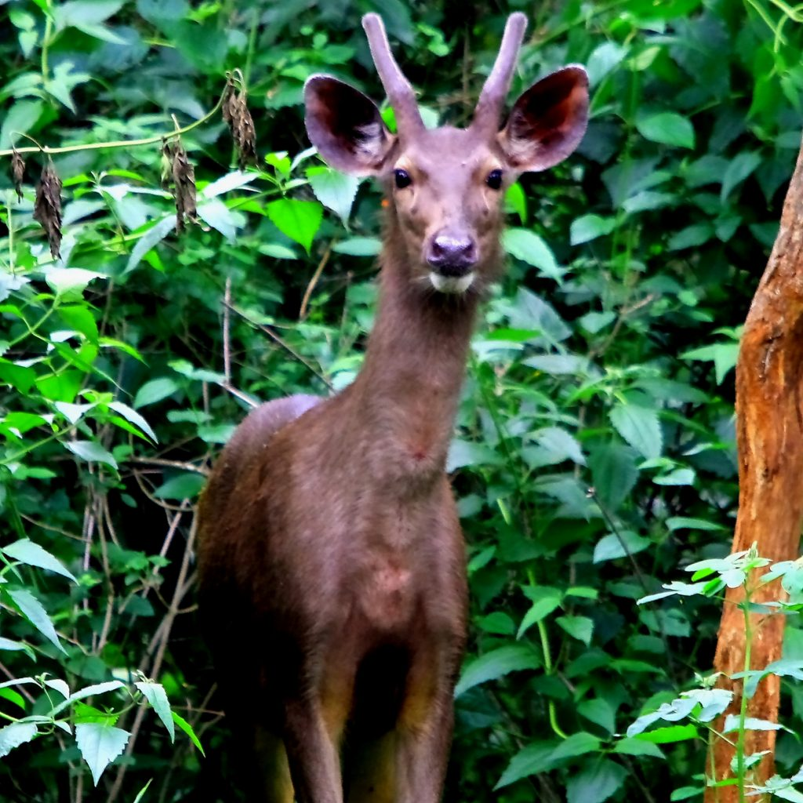

### A NEW METHOD OF ACCOUNTING

We need to look into a better model of growth and development which will actively consider environmental and ecological implications of high GDP growth on biodiversity and ecology. It is a fact that the conventional method of measuring real gross domestic product does not take into account the gains or losses of both human as well as natural capital resulting in the depletion of the Nation’s wealth. We are of the opinion that national wealth should compulsorily include natural capital along with industrialized and financial assets. GDP should take into account the environmental costs and impacts.

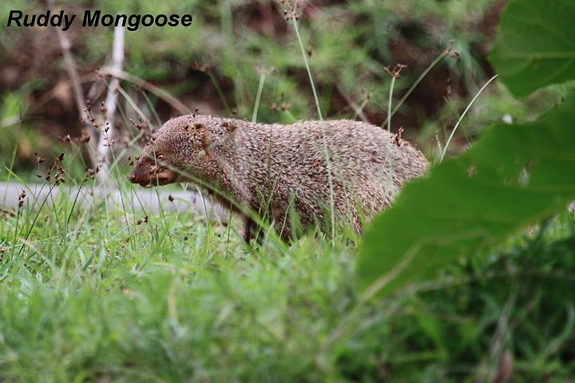

### CONSEQUENCES

In recent years, the conservation of biodiversity inside shade grown eco friendly coffee forests is being threatened due to many factors like mini hydel projects, drawing high tension power lines connecting mega grids, excavation of pristine forests for laying underground oil pipelines, ore and sand mining, timber logging, wildlife poaching and a host of undesirable , unsustainable activities.

Unfortunately, we fail to realize that these economic activities, some of which involving land fragmentation are responsible for permanently blocking vital migratory corridors of land mammals and other species. The migration is provoked by changes across even longer distances. In time the balance of nature is upset, leaving behind unsustainable populations on one side of the forest and a vulnerable population on the other side. In addition many important species are at the risk of genetic isolation, leading to their extinction.

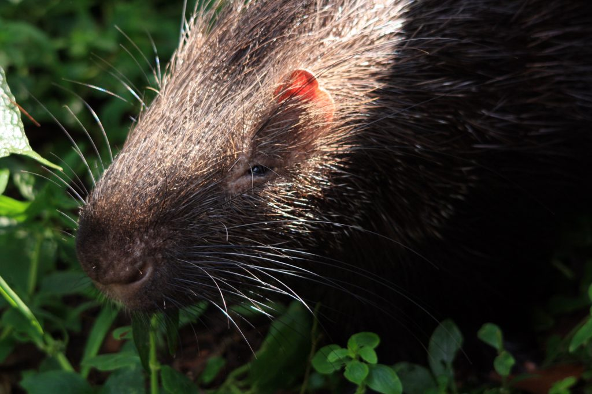

Another important point that we would like to stress, is that once migratory corridors are blocked due to dams or mining activities, it will result in inbreeding and wipe out the entire population of a particular species. Secondly, Loss of migratory corridors and Habitat loss will also prevent the reintroduction of endangered species because the ecosystem will not have the carrying capacity in terms of supporting biodiversity. In simple terms it is almost impossible to reclaim such ecosystems for restoration.

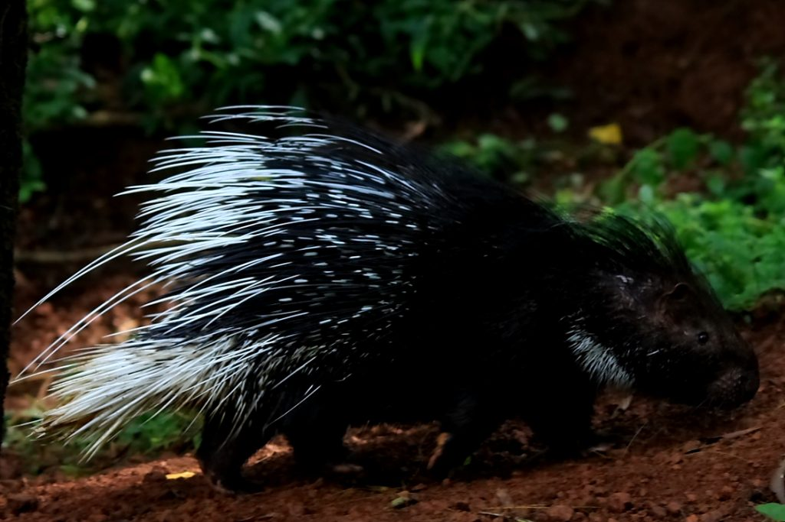

### SIGNIFICANCE OF WILDLIFE CREDITS:

Wildlife credits will benefit the Coffee farmers in a number of ways. First and foremost it will stimulate the imagination of the planting community in conserving the earth’s precious biological resources. The other benefits include:

-   -   Monetary benefits/Alternate source of income.
    -   Prevents distress selling of land to land sharks.
    -   Prevents farmers from migrating to urban areas.
    -   Builds Self esteem and confidence building measures.
    -   Premium price for coffee.

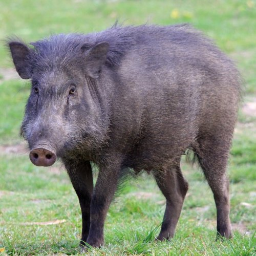

-   Ecotourism
-   Conservation of habitat
-   Global recognition for eco friendly shade coffee.

### RECOMMENDATIONS:

-   -   We must admit to the fact that due to deficiencies in planning and inadequate allocation of funds; wildlife population is declining.
    -   Officials at the helm of affairs should understand that protection of forests and its wealth in terms of flora and fauna cannot be achieved without the active participation of coffee farmers, alongside with forest officials.
    -   Permit logging, but limit commercial logging.

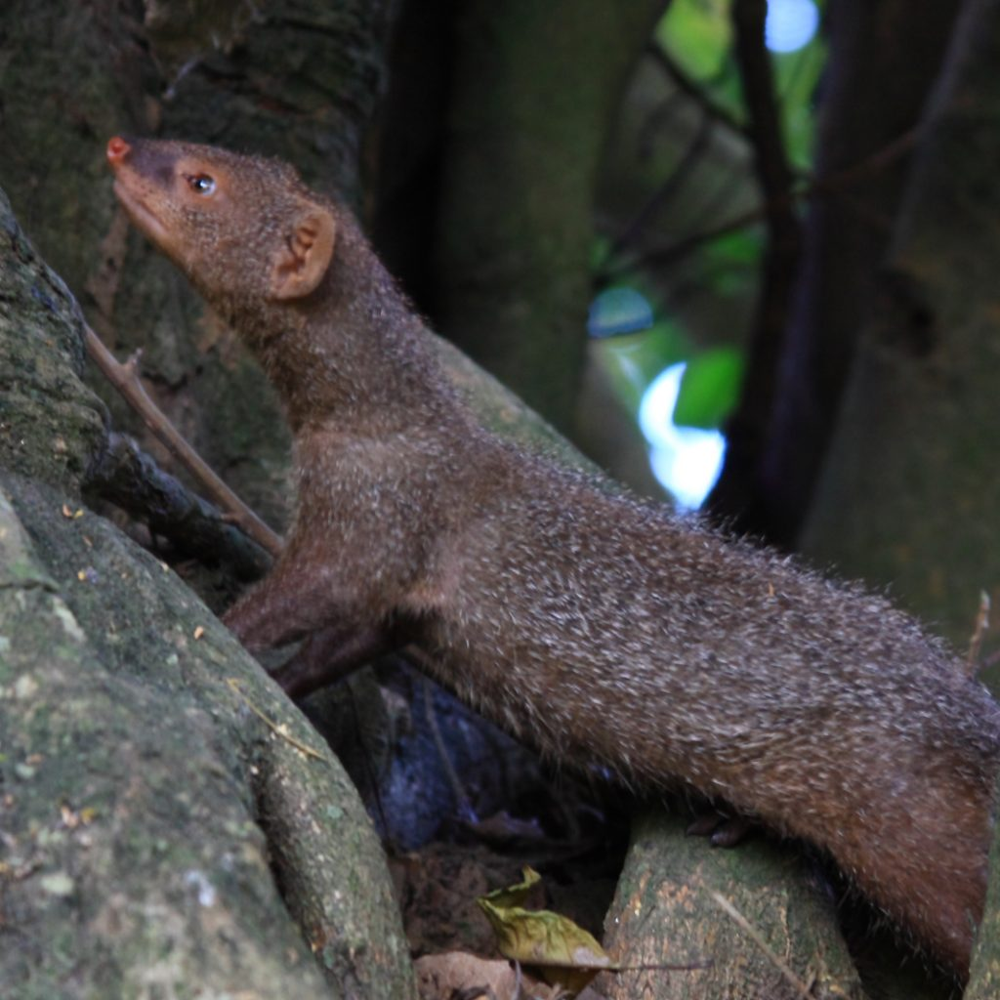

-   Ecosystem based management.
-   We should redouble our efforts in protecting wild life from the threats of poaching and wildlife trafficking.
-   The very slow disposal of cases related to wildlife crimes sends a wrong signal to the rich and powerful.
-   Many tribal’s still live inside sanctuaries. We need to find a way to satisfy their legitimate livelihood needs. But it is equally vital to ensure that such livelihood needs do not come at the cost of the wild animals.
-   Educating the rural youth in particular, especially children; can play an important role in reducing animal human conflict.
-   Companies pay environmental tax through purchase of wildlife credits.
-   Creation of data bases and e libraries of all flora and fauna.
-   Tax benefits to individuals or companies sponsoring a particular animal species.
-   Wildlife offsets as an insurance package to corporations and individuals to compensate for loss of habitat for setting up Industry.
-   If only coffee farmers and large plantation holders can earmark 5% of their total land area to be totally devoted as a sacred forest without planting any commercial crop, it will act as a magnet in attracting wildlife and will help in the regeneration of dwindling species of flora.

### CONCLUSION

In the Indian context, Wildlife offsets are not well known but have been around for several years in North America, generally known as species banking or mitigation banking. Wildlife trafficking is estimated to be a twenty billion dollar a year unlawful business. Smugglers derive huge profits from illicit trade, which is next only to drugs. Many Indian and Multinational companies have a big impact on the wildlife in their respective areas of operations, sand and mining companies being at the forefront of the impact.

Very few people realize that the value of goods and environmental services provided by Indian forests contributes substantially to the Country’s GDP. However, in official statistics, forestry only makes a contribution of 1.2% of the GDP. In spite of about two decades of U.N. conferences, the earth’s biological diversity is steadily eroding as ecosystems suffer. Everyone involved believes that both wildlife and biodiversity needs to be saved, but the fight over what to do and who pays for it is still alluding policy makers.

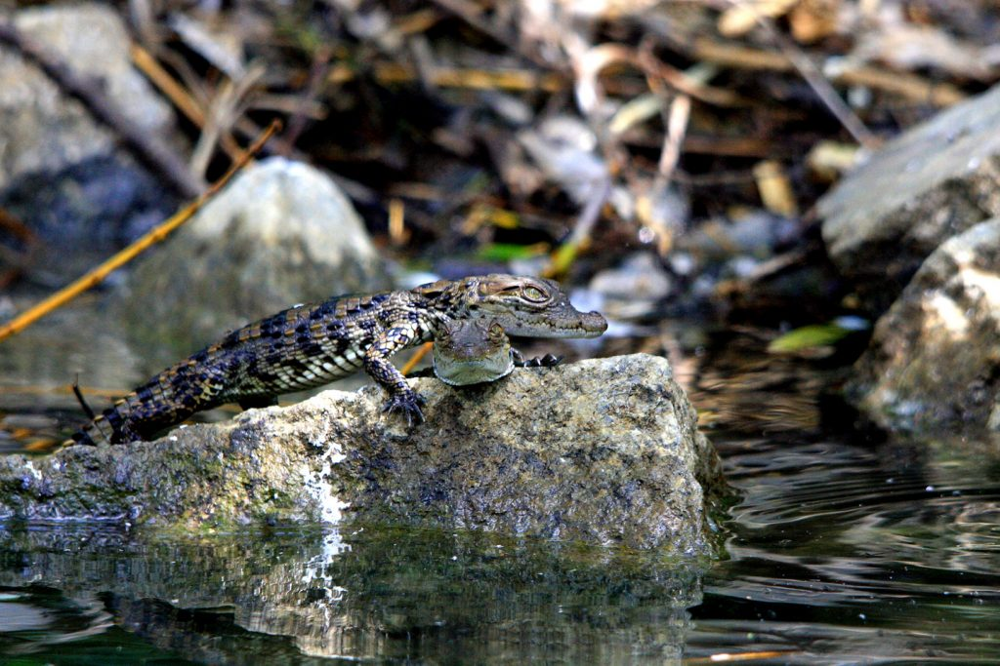

In our guarded opinion, when one talks about conservation, sustainable use of resources and policy to safe guard these resources ; the very people who understand ways and means of protecting biodiversity inside coffee forests are still the people listened to least by policy makers.

Our concern is not just for the present generation, but more importantly for future generations. We need to embrace a new world order where the present generation should be conscious of handing over a better and sustainable world for the next generation.

We need to draw attention to the need for a new form of risk assessment that takes the value of ecological services rendered by the coffee system in protecting wildlife. Wildlife is important, because if wildlife dies our coffee forests die too. And this is not a far away consequence that will leave our lives untouched.

Let’s recall the words of wisdom of the Red Indian Chief Seattle” What is man without the beasts? If the beasts were gone, men would die from a great loneliness of spirit. For whatever happens to the beasts, soon happens to man. All things are connected “.

### REFERENCES

[ecofriendlycoffee.org/coffee-forests-and-green-national-accounts/](http://ecofriendlycoffee.org/coffee-forests-and-green-national-accounts/)

[ecofriendlycoffee.org/coffee-forests-a-gateway-to-wildlife/](http://ecofriendlycoffee.org/coffee-forests-a-gateway-to-wildlife/)

[ecofriendlycoffee.org/coffee-hotspots-an-inventory-of-biodiversity/](http://ecofriendlycoffee.org/coffee-hotspots-an-inventory-of-biodiversity/)

[ecofriendlycoffee.org/coffee-forest-symbiosis/](http://ecofriendlycoffee.org/coffee-forest-symbiosis/)

[ecofriendlycoffee.org/eco-friendly-indian-coffee-a-profile/](http://ecofriendlycoffee.org/eco-friendly-indian-coffee-a-profile/)

[coffeehabitat.com/2007/09/research-mammal/](http://www.coffeehabitat.com/2007/09/research-mammal/)

[rainforests.mongabay.com/0402.htm](https://rainforests.mongabay.com/0402.htm)

[rainforests.mongabay.com/0801.htm](https://rainforests.mongabay.com/0801.htm)

[rainforests.mongabay.com/0305.htm](http://rainforests.mongabay.com/0305.htm)

[youtube.com/watch?v=ZPxLuaxOFp8](http://www.youtube.com/watch?v=ZPxLuaxOFp8)

Anand T Pereira and Geeta N Pereira. 2009. Shade Grown Ecofriendly Indian Coffee. Volume 0ne.

Anil Agarwal (Ed). 1990. The Price of forests. Centre for Science and Environment. New Delhi.

Amitabh Kundu and Michael Von Hauff (Eds). 2008. Environmental accounting.-Explorations in Methodology. Manak Publications.Pvt. Ltd.

Anonymous.1999. Nature’s Numbers: Expanding the National Economic Accounts to Include the Environment (National Academy of Sciences Press, 1999).

Anonymous.2001. The value of forest ecosystems.CBD Technical series-4. Convention on Biological diversity.

Anonymous.2001. Putting a price tag on conservation: cost-benefit analysis of Venezuela’s national parks, mimeo.

Anonymous.2005. Millennium Ecosystem Assessment, 2005. Ecosystems and Human Well-being: Synthesis. Island Press, Washington, DC.

Batagoda, B., Turner, R., Tinch, R and Brown, K. 2000.Towards Policy Relevant Ecosystem Services and Natural Capital Values, CSERGE Working Paper GEC 2000-06,University of East Anglia and University College London.

Beckerman, W and Pasek, J. 2001. What Price Posterity?.Environmental Ethics for a New Millennium, Oxford:Oxford university Press.

Butler, Rhett A. “Diversities of Image – Rainforest Biodiversity.” Retrieved 9 January 2006, fromMongabay.com / A Place Out of Time: Tropical Rainforests and the Perils They Face.

Brock. T. D. 1979. Biology of Microorganisms. Third Edition. Englewood Cliffs. Prentice-Hall.

Coffee Guide. 2000. Central Coffee Research Institute, Coffee Research Station. Chikmagalur District. Karnataka. India.

De Witt. W. 1977. Biology of the cell. An Evolutionary Approach. W.B. Saunders Company. Philadelphia, London, Toronto.

FAO (2010) Global forest resources assessment 2010 country reports [http://www.fao.org/forestry/62318/en](http://www.fao.org/forestry/en/).

Goldsby. R. A.1979. Biology. Second Edition. Harper and Row publishers Inc.

Kremen, C., Niles, J., Dalton, M., Gaily, G., Ehrlich, P., Fay, J., Grewal, D and Guillery, R. 2000. Economic incentives for rain forest conservation across scales, Science, 288, 1828-1832

Miller, K and Tangley, L. 1991. Trees of Life: Saving Tropical Forests and their Biological Wealth, Boston:Beacon Press.

Mooney, H., Lubchenco., Dirzo, R and Sala, O. 1995. Biodiversity and ecosystem functioning: basic principles,in V.Heywood (ed), Global Biodiversity Assessment,Cambridge: Cambridge University Press, 275-325

Pearce, D.W., Putz, F and Vanclay, J. 2001. A sustainable forest future? In Pearce, D.W and Pearce, C (eds), Valuing Environmental Benefits: Case Studies from the Developing World, Cheltenham: Edward Elgar

Putz, F., Redford, K., Robinson, J., Fimbel, R and Blate, G. 2000. Biodiversity Conservation in the Context of Tropical Forest Management, Biodiversity Series – Impact Studies, Paper no 75, Washington DC: World Bank.