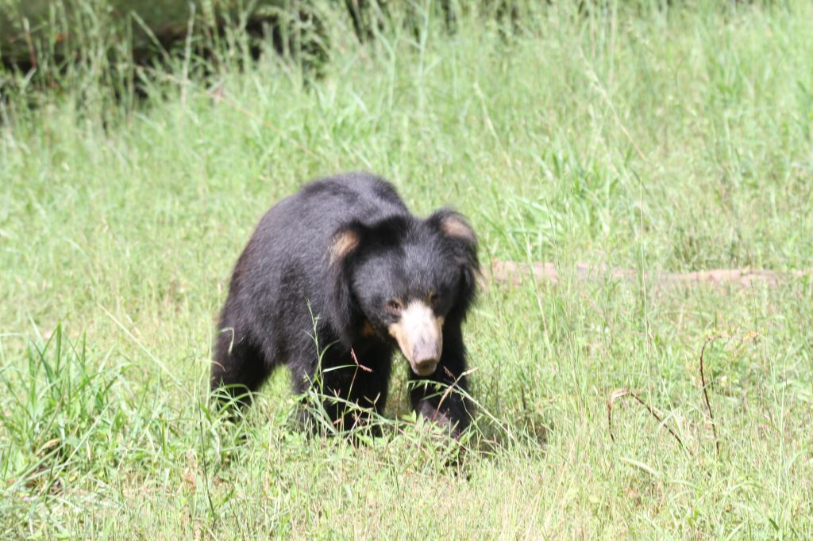
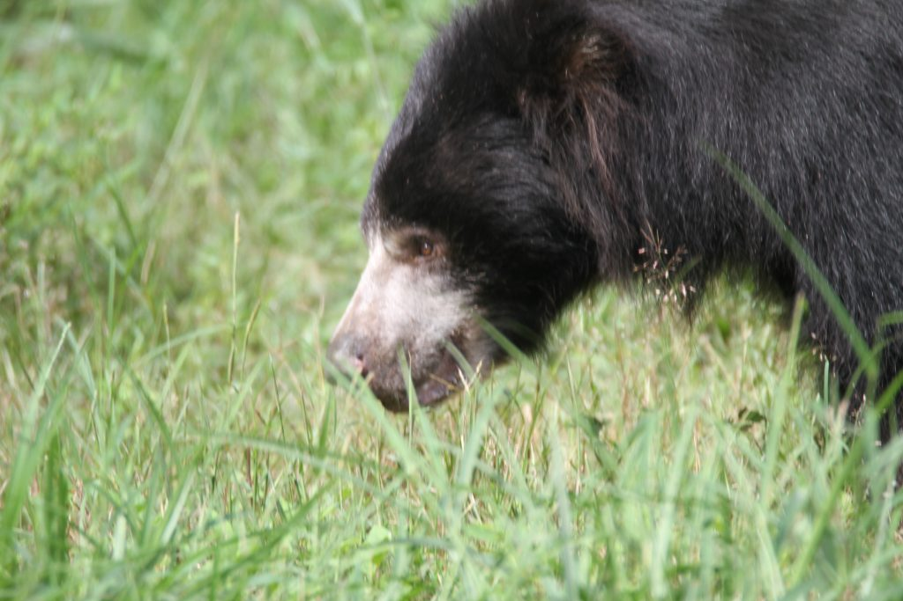

In recent times, the human-animal conflict has spilled over into shade coffee with elephants, deer, Gaur, and other species of wildlife freely roaming inside shade coffee. At times, some of this wildlife, have selected coffee plantations as their permanent sanctuary. We have selected the sloth bear for this article because it is listed as Vulnerable on the IUCN Red List, mainly because of habitat loss and degradation. Forest degradation is also a stepping-stone to deforestation.  
In our earlier articles, we had clearly elucidated the facts that coffee plantations are surrounded by wildlife sanctuaries and coffee forests are often used as migratory corridors by wildlife. It is important to distinguish that, in earlier times, coffee forests were used only as migratory corridors and not as permanent dwelling places for wildlife. However, due to forest degradation and scarcity of food in wildlife sanctuaries, animals are moving lock stock and barrel into shade coffee. There are a few main drivers of forest degradation. Apart from Climate change, resulting in higher temperatures and unpredictable weather patterns, forest fires, pest infestation, and disease; the main cause of forest degradation is unsustainable and illegal timber logging and mining of precious minerals and granite in the core areas of wildlife sanctuaries. The UN Food and Agricultural Organization (FAO) has defined deforestation as the conversion of forest to another land use or the long-term reduction of tree canopy cover below the 10% threshold.

  
SLOTH BEAR

Class: Mammalia  
Order: Carnivora  
Family: Ursidae  
Genus and Species: Melursus ursinus  
SCIENTIFIC NAME: Melursus ursinus  
TYPE: Mammals  
DIET: Omnivore  
GROUP NAME: Solitary  
AVERAGE LIFE SPAN IN CAPTIVITY: Up to 40 years  
SIZE: 5 to 6 feet; tail: 2.7 to 4.7 inches  
WEIGHT: 120 to 310 pounds

### Distribution

The shaggy-coated sloth bear is native to India, Sri Lanka and Nepal.

### Physical Description

Shaggy black coat and a cream-colored snout, and their chest is usually marked with a whitish “V” or “Y” design.  
Size and Appearance  
Sloth bears are solitary creatures and generally nocturnal. They grow up to 6 feet in length, Adults are 150 to 190 centimeters (60 to 75 inches) long. Males weigh 80 to 140 kilograms (175 to 310 pounds), and females weigh 55 to 95 kilograms (120 to 210 pounds).

### CONSERVATION STATUS

Vulnerable  
IUCN estimates that fewer than 20,000 sloth bears survive in the wilds of the Indian subcontinent and Sri Lanka. The sloth bear is listed in Schedule I of the Indian Wildlife Protection Act, 1972, which provides for their legal protection. International trade of the sloth bear is prohibited as it is listed in Appendix I of the Species. About 20,000 or fewer total sloth bears remain in the wild. However, no reliable large-scale population survey has been conducted. It is estimated that their population has declined by 30 to 49 percent in the last 30 years.

### Native Habitat

Sloth bears live mainly in tropical areas. It occurs in a wide range of habitats including moist and dry tropical forests, savannahs, scrublands, and grasslands below 1,500 m (4,900 ft) on the Indian subcontinent.

### Behavior

Sloth bears are mainly nocturnal. Their sense of smell is well developed but their sight and hearing are poor.

### Diet

Sloth bears are omnivorous. Sloth bears are considered myrmecophagous. The main diet consists of termites and ants. They also feed on a variety of fruit and flowers, including mango, fig, and ebony. They are especially fond of honey.

### Communication

They often grunt and snort when looking out for food. They stand upright when they sense danger.

### Social Structure

There is little information on social organization, but observations in the wild suggest sloth bears live as solitary individuals, except for females with cubs. Some reports suggest that they may be seen in groups when resources are plentiful.  
Reproduction and Development  
In India, they mate in April, May, and June, and give birth in December and early January. After a six- to seven-month gestation period sloth bears normally give birth to a litter of two cubs Sows gestate for 210 days, and typically give birth in caves or in shelters under boulders. Litters usually consist of one or two cubs, or rarely three. Cubs are born blind and open their eyes after four weeks. They become sexually mature at the age of three years. Intervals between litters can last two to three years.

### Life Span

Up to 40 years

### Sleep Habits

Maybe on a nocturnal, diurnal or crepuscular. In protected areas, for example, sloth bears may be more active during the day. Sloth bears are typically active for about eight to 14 hours each day, and they do not hibernate.

### Relationships with other animals

Besides tigers, there are few predators of sloth bears. Leopards can also be a threat, as they are able to follow sloth bears up trees.  
Relationships with humans  
This is the species of bear that most regularly attacks humans.

### Ecosystem Roles

Since these bears include some fruit in their diet, they disperse the seeds of the fruit they eat. Also, by feeding on numerous amounts of termites, they keep the termite populations in check

### **Special Characteristics** (As per the Smithsonian National Zoo and Conservation Biology Institute)

Sloth bears’ nostrils can close completely, protecting the animals from dust or insects when raiding termite nests or beehives.  
Sloth bears are the only bears to routinely carry their young on their backs.

###   
Conclusion

In recent years, many of the Wildlife Sanctuaries inside the Nilgiri Biosphere region have lost their ecological carrying capacities due to timber logging, illegal mining of iron ore, and planting of invasive species of trees. Also, large infrastructure projects have been proposed in the core areas of wildlife sanctuaries that disturb the delicate balance of the fragile forest ecosystem. It remains a challenge to balance conservation and development and this can only be achieved through science and technology.

### References

Anand T Pereira and Geeta N Pereira. 2009. Shade Grown Ecofriendly Indian Coffee. Volume-1.  
[Sloth bear](https://en.wikipedia.org/wiki/Sloth_bear)  
[Downturn in shade-grown coffee](https://news.mongabay.com/2014/07/downturn-in-shade-grown-coffee-putting-forests-wildlife-people-at-risk/)  
[Elephants in the midst](https://news.mongabay.com/2014/05/elephants-in-the-midst-warning-system-prevents-human-elephant-conflicts-in-india-saves-lives/)  
[What is forest degradation](https://www.worldwildlife.org/stories/what-is-forest-degradation-and-why-is-it-bad-for-people-and-wildlife)  
[Deforestation in India](https://www.intechopen.com/books/forest-degradation-around-the-world/deforestation-in-india-consequences-and-sustainable-solutions)  
[Sloth bear](https://nationalzoo.si.edu/animals/sloth-bear)  
[ANIMALS](https://www.nationalgeographic.com/animals/mammals/facts/sloth-bear)  
[Melursus ursinus](https://animaldiversity.org/accounts/Melursus_ursinus/)  
[APPEARANCE](https://www.bearbiology.org/bear-species/sloth-bear/)  
[Top Reasons For Animal Population](https://www.worldatlas.com/articles/major-causes-of-decline-in-wildlife-populations-worldwide.html)