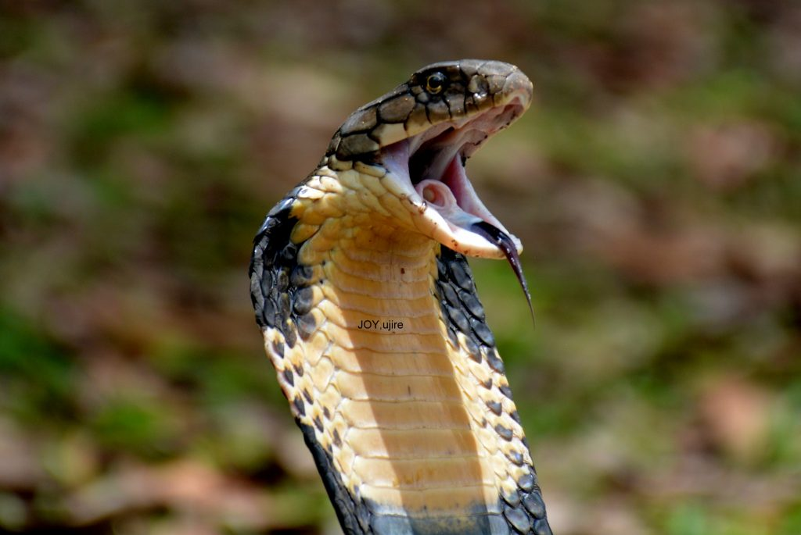
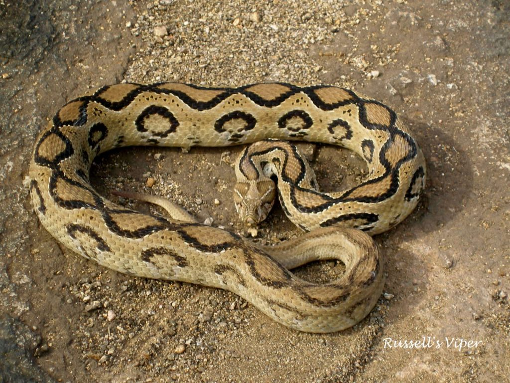
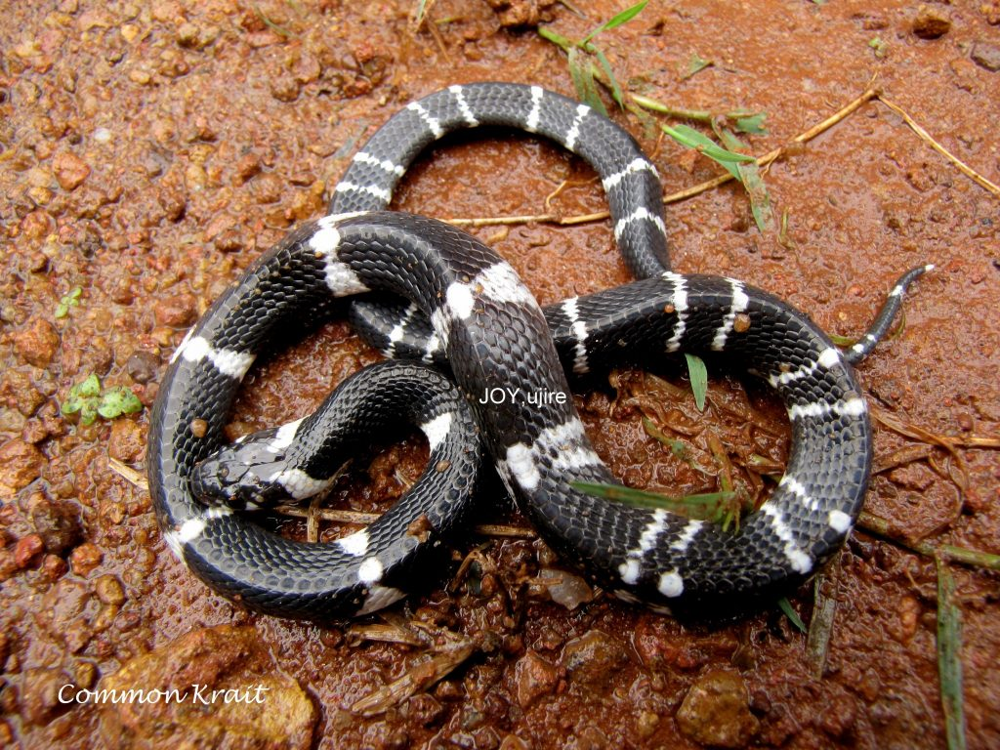
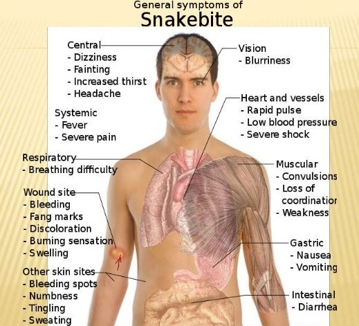
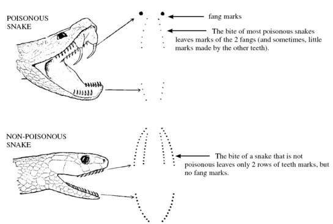
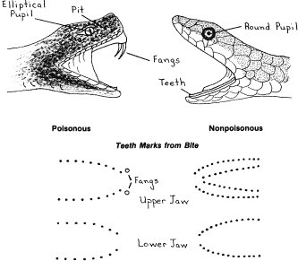
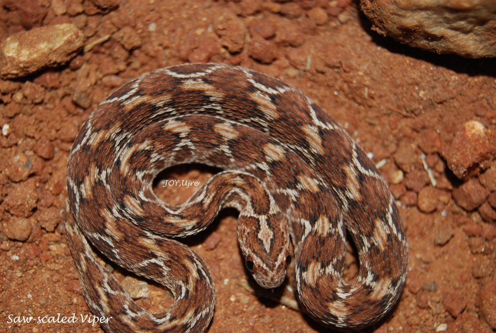
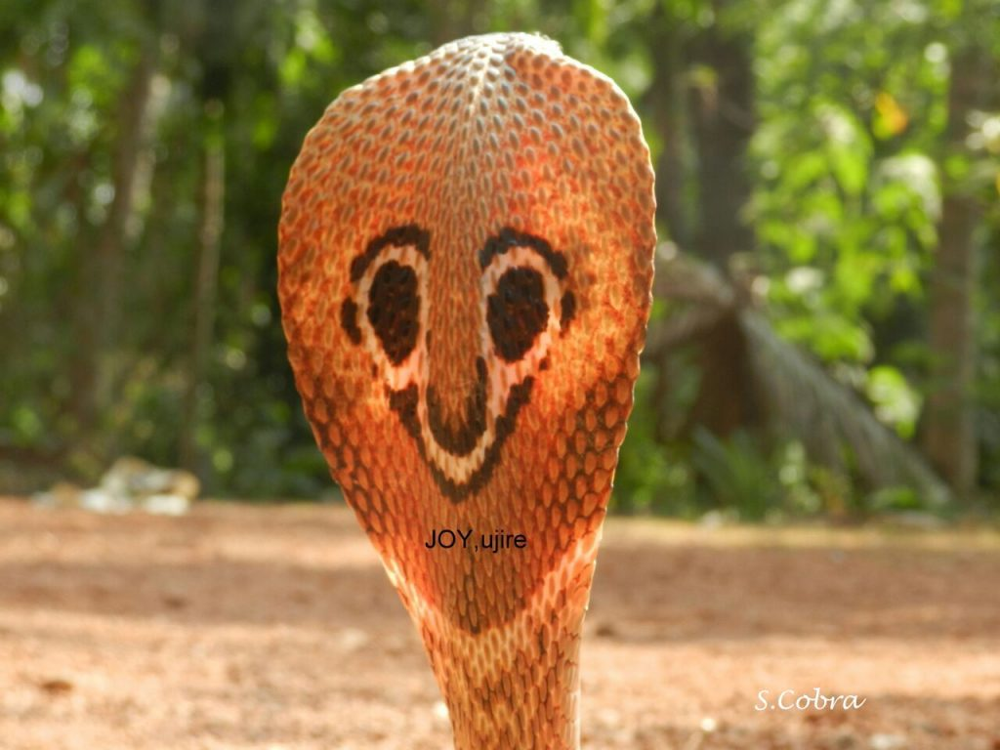
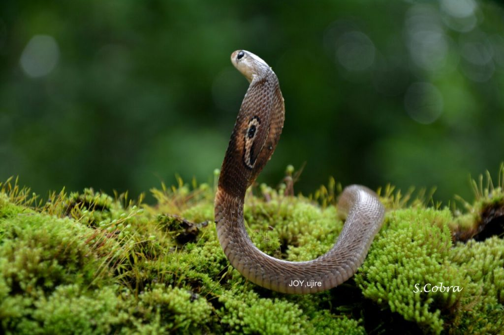

The Coffee forests are blessed with some of the most unique and beautiful snakes. Almost all coffee zones are fertile ground for both venomous and nonvenomous snakes. The type of shade pattern inside the coffee estates varies with Arabica Plantations having dense shade and Robusta plantations more open to sun. Since reptiles are cold blooded, they rely on the warmth of the sun to heat their bodies. Hence one can commonly observe snakes regulating their body temperature by sitting out in the sun and moving back to shaded areas for the purpose of thermoregulation.

Worldwide, only about 15% of the more than 2000 species of snakes are considered dangerous to humans, of which 290 are present in India ranging from the 10 cm long worm snake to the 7 meter long python and King Cobra. The best part is that only 52 are venomous and restricted to specific geographical regions. Hence, the chances of a snake bite are highly specific to a few snakes adapted to a particular habitat. This makes identification based on fang markings more reliable. The composition of venom of a single snake species varies from place to place, season to season and between adults and their young. Individual snake venom may even change with its diet.

The idea behind writing this article is to increase awareness, appreciation, and understanding of reptiles and their habitats, which can enhance conservation actions and stewardship practices. It is a matter of concern that many species have declined significantly across all coffee related zones. We are losing out on reptiles, due to over-killing, because of lack of awareness, and many myths associated with reptiles.

In this brief article we have highlighted important information regarding snake bites in Coffee zones caused by the big four, namely Spectacled Cobra, Common Krait, Russell’s viper and Saw-Scaled Viper. Before reading any further it is desirable to understand the difference between Poison and venom. Poison must be inhaled, ingested, or delivered via touch, while venom is injected into a wound. Hence in our opinion, the term poisonous snake is incorrect. (We also stand to be corrected).

The annual number of cases of snake bite worldwide is about 5 million resulting in 15-200,000 deaths per year. India is estimated to have the highest snake bite mortality in the world. The World Health Organization (WHO) estimates, place the number of bites in India to be 83,000 per year with approximately, 11,000 deaths.

Proper first aid is of paramount importance in the life of a snake bite victim, especially in the first hour, also known as the **“golden hour”.** The facts state that 80 % of the snake bites are by non-venomous snakes. On the other hand, it is very important to understand that 50 % of bites by venomous snakes are dry bites that result in no harm. This is because snakes have complete control over how much venom they inject anytime they bite. So one could get a **“DRY BITE”,** with no venom at all.

With respect to bites from venomous snakes, 70-80 % of the bites are attributed to Russell’s viper and saw – scaled Viper, which involve hemotoxin/ vasculotoxin. The spectacled Cobra and Common Krait together constitute 30 % of the bite and are neurotoxic in nature.

Statistics show that the snake bite between males and females is in the ratio of 2:1. Majority of the bites being on the lower extremities. It is also important to note that snakes inject the same doze of venom into children and adults. Children must therefore be given exactly the same doze of antivenom as adults.

In India the big four, namely the spectacled Cobra, Common Krait, Russell’s viper and Saw Scaled viper, together, are known to cause more than 90 % of the snake bite deaths. The venom of Krait and Russell’s viper is much more toxic than that of cobra.

Basically snake venom is classified into four types.

Neurotoxic. e.g. Cobra. The venom paralyses the respiratory centre.

Hemotoxic. e.g. Russell’s viper. The venom typically affects the blood, resulting in necrosis (death of tissue) and anticoagulant (preventing the blood from clotting).

Myotoxic. e.g. Sea snakes. The venom results in muscle breakdown.

Cardio toxic e.g. S.Cobra. Affects the heart.

### General Symptoms of Snake Bite

### Diagnosis Of Snake Bite

FANG MARKS: Classically, two puncture wounds separated by a distance varying from 8mm to 4cm, depending on the species involved. However a side swipe may produce only a single puncture, while multiple bites could result in numerous fang marks.

The Effects of envenomation can be categorized into four distinct types namely, Neurotoxic (Krait &Cobra), Hemotoxic (Russell’s viper) Cardio toxic (Spectacled Cobra & others) and Myotoxic (Sea Snakes). Maximum, with Viper bite, least with Krait bite. Hence krait bite can sometimes go unnoticed.

### First aid for snake bites

Should you be bitten by a snake, it’s essential to get emergency treatment as quickly as possible. However, there are some tips that you should also keep in mind:

Keep calm and still as movement can cause the venom to travel more quickly through the body.

Remove constricting clothing or jewelry because the area surrounding the bite will likely swell.

Don’t allow the victim to walk. Carry or transport them by vehicle.

Do not kill or handle the snake. Take a picture if you can but don’t waste time hunting it down.

### First aid myths

There are also several outdated first aid techniques that are now believed to be unhelpful or even harmful:

Do not use a tourniquet.

Do not cut into the snake bite.

Do not use a cold compress on the bite.

Do not give the person any medications unless directed by a doctor.

Do not raise the area of the bite above the victim’s heart.

Do not attempt to suck the venom out by mouth.

Do not use a pump suction device. These devices were formerly recommended for pumping out snake venom, but it’s now believed that they are more likely to do harm than good.

### **How to Avoid Snake Bites**

Always wear protective foot wear

Protective clothing in terms of long pants and long sleeved shirt

Carry a flash light

Do not reach out to dark corners or gaps, crevices or holes without first examining the place with the help of a flash light.

Hay stacks, wood piles, bricks and stones are places where snakes tend to hide. Caution should be exerted when cleaning such places.

Avoid sleeping on the floor.

When walking in tall grass, always wear tall boots .

If you see a snake, allow it to go its way. Do not try to corner a snake.

### ANTI-SNAKE VENOM (ASV)

ASV is the main stay of treatment.  Antivenom is immunoglobulin purified from the plasma of a horse. Mule, donkey, or sheep that has been immunized with the venom’s of one or more species of snake. In India, polyvalent ASV is effective against all the big four.

### Conclusion

Over the last two decades, we have noticed a significant decline in reptile population and the strong possibility of some species disappearing from the coffee forest altogether is not ruled out due to habitat loss, degradation and fragmentation and unsustainable package of practices involving coffee and allied crops.

The focus needs to change on how we protect and manage our coffee forests without biodiversity loss. For E.g. Almost all wetlands inside the coffee ecosystem are drained to accommodate upland crops that do not thrive in aquatic or semi aquatic conditions. However, none of the Planting community is aware that on an acre to acre basis, wetlands produce and support more biomass than nearly any other habitat type. Apart from acting as precious refueling stops for migratory birds, wetlands are essential to the life history of many herpetofaunal species. In particular wetlands provide critically important breeding habitat for amphibians. Since most of the wetlands are associated with heavy rainfall regions, flooding and draining of waters result in specialized micro niche ecosystems which host its own unique assemblage of species, many of whom are partially or entirely dependent on a particular type of aquatic system to assure population sustainability and avoid extinctions.

We need to protect reptiles because they play important roles in the coffee ecosystem as mid and top level predators. In particular many snake species play a very unique role in controlling the population of rodents. Further research needs to be carried out to understand the roles of snakes as an indicator of the health of the coffee ecosystem.

### References

Anand T Pereira and Geeta N Pereira. 2009. Shade Grown Ecofriendly Indian Coffee. Volume-1.

Bopanna, P.T. 2011.The Romance of Indian Coffee. Prism Books ltd.

[Snake Bites](http://www.healthline.com/health/snake-bites#Overview1)

[Snake Bite! – Firstaid, Facts & Prevention](http://www.slideshare.net/JoseLouies/snake-bite-firstaid-facts-prevention)

[Wikimedia Commons](https://commons.wikimedia.org/)

[Venom As Medicine](http://www.medicaldaily.com/venom-medicine-how-spiders-scorpions-snakes-and-sea-creatures-can-heal-328736)

[Reptiles](https://web.archive.org/web/20180605204528/http://www.bbc.co.uk:80/nature/life/Reptile/by/rank/all)

[Loss of Biodiversity](http://www.globalissues.org/article/171/loss-of-biodiversity-and-extinctions)

[Worldwide Amphibian Declines](http://amphibiaweb.org/declines/declines.html)

[MECHANISM OF SNAKE BITE-TREATMENT](https://web.archive.org/web/20180906223624/http://www.biologydean.com:80/2015/12/mechanism-of-snake-bite-treatment.html)

[Everything you need to know about snake bites!](http://indiansnakes.org/content/everything-you-need-know-about-snake-bites)

[Indiansnakes](https://www.facebook.com/Indiansnakes.org/photos/)

[Emergency : Snake bite , what to do and what not to do](http://www.auroville.org/contents/1675)

[Snake Venom](https://web.archive.org/web/20170508054110/http://www.reptilegardens.com:80/reptiles/snakes/venomous/snake-venom.php)

[What to do if bitten](https://web.archive.org/web/20170519032034/http://www.reptilegardens.com:80/reptiles/snakes/venomous/snake-bites.php)

[Can Coffee Drinkers Save the Rain Forest?](http://www.theatlantic.com/magazine/archive/1999/08/can-coffee-drinkers-save-the-rain-forest/377733/)

When snake bites occur, seek help quickly

[Snake Bites](http://www.healthline.com/health/snake-bites#Firstaid7)

**Acknowledgement**

The snake photographs have been kindly provided by Joy Mascarenhas, Ujre.  Joy is a herpetologist, a person with interest and expert knowledge on the natural history of reptiles, especially the King Cobra.
