Planet earth is the only GREEN planet of the Solar system that can support life. It is indeed a gem of creation and a magnificent masterpiece of Nature, sustaining millions of life forms. Shade grown, ecofriendly coffee farms are perhaps a select few places on this planet where nature runs wild. Indian multi structured coffee plantations are home to a mind boggling array of diverse and endangered flora and fauna.

These plantations are like well maintained botanical gardens of the wild. India being a megadiversity country possesses, 1,270,000 species of microorganisms, plants and animals. The vast stretch of coffee forests constitutes one of the mega biodiversity zones of the Western Ghats which is abundant with unique and diversified floral and faunal wealth. For the past two decades we have not only tried to conserve them but have also documented the species for future references.

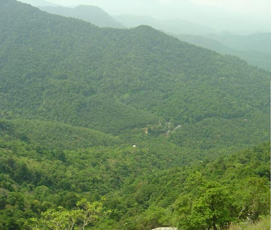

Coffee farmers are blessed with a verdant landscape. The Tall and misty coffee mountains boasts of magnificent scenic beauty and some exquisite archeological ruins. The dense coffee forests and steep valleys encircle the green coffee plantations. It is indeed a tourist’s delight. Inundated, by more than 70-200 inches of rain, due to the placement of the coffee farms in the rain shadow region of the western ghats, (Globally recognized as one among the 8 hottest hot spots of the world ) the forests are repositories of an amazing range of floral and faunal wealth.

Nature is always held supreme in the eyes of the coffee farmer and the two partners NATURE & COFFEE FARMER form an inseparable bond that is largely responsible in safe guarding the biodiversity of this ecologically sensitive hot spot. More importantly, one needs to understand that the coffee farmer from one generation to the next has developed deep feelings for the land and has bonded with the forests, rivers, valleys, space, energy, endangered flora and fauna. The understanding stems from the fact that these various parameters are intricately inter connected, inter related and interdependent with the web of life inside the coffee mountain. In other words, one cannot do without the other.

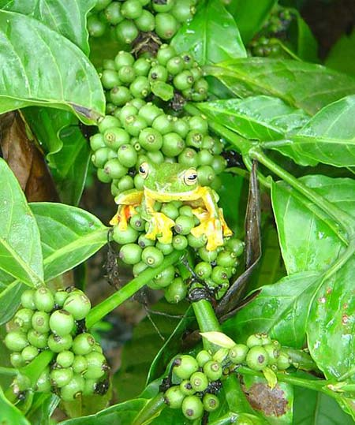

The British Pioneers established coffee plantations under the canopy of native forest trees, through very meticulous research. They took great risks in surveying hostile territories and over a long drawn period of more than three decades came to the conclusion that only fertile forest tracts with adequate shade will help in the establishment of quality coffee , without destroying the fabric of the forest. In each and every district they earmarked very specific tracts of land for coffee cultivation. The extent of selected land was significantly lower than the area occupied by other crops.

The area selected by the British was very rich in biodiversity and this very biodiversity played an integral role in the growing of ecofriendly shade grown coffee. Barren tracts or land like meadows, barren hills or open grass lands was categorized as unworthy for coffee cultivation. The COFFEE BOARD followed the British guidelines in letter and in spirit and thus the Indian coffee which had a unique taste of nature in the cupping quality was highly sort out in the Western world. Even today, shade grown Indian coffee fetches a premium in the International coffee market.

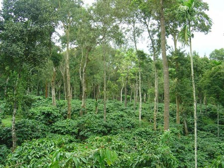

### WHY THE NEED TO RECOGONISE COFFEE PLANTATIONS AS HOTSPOTS

India produces approximately 3.5% of global coffee and more than 95% of this coffee is shade grown under a multi layered canopy of forest trees and multiple crops. Majority of the coffee is grown in only three States, namely Karnataka, Kerala and Chennai. In Karnataka coffee cultivation is confined to three districts, namely Chikmagalur, Coorg and Hassan.

In Hassan District coffee is grown in only two taluks namely sakleshpur and Belur. Sakleshpur taluk is famous for growing specialty coffee known as the MUNZERABAD coffee. Even in these three states coffee cultivation is restricted to only a few pockets. This is simply because growing coffee is not very easy and requires well defined natural forests as partners to fulfill each others needs. The plant genetic resources inside coffee forests are quite simply the first link in maintaining the health of the coffee forests.

Biodiversity forms the foundation for sustainable coffee cultivation. Without them growing sustainable coffee would be an unattainable dream. Based on these parameters we have considered shade grown Indian coffee as COFFEE HOT SPOTS supporting a wealth of biodiversity.

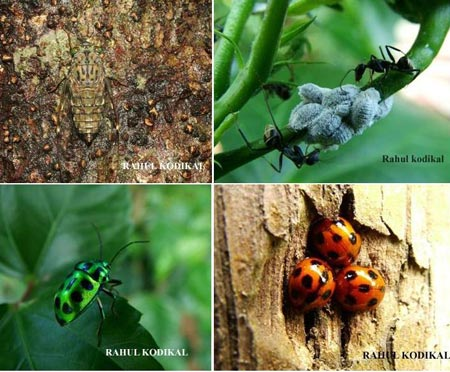

TABLE 1 : NATIVE JUNGLE TREES INSIDE COFFEE FORESTS

COMMON NAME

BOTANICAL NAME

FAMILY

HARD WOOD,SEMI HARD WOOD,SOFT WOOD (HW/SHW/SW)

ENDANGERED Yes/No

Baage

Albeizia lebbeck

Mimosaceae

SHW

No

Booruga

Bombax malabaricum

Bombacaceae

SW

No

Neeli mara

Bischofia javanica

Bishofiaceae

SHW

No

Mathi

Terminalia crenulata

Combrataceae

HW

No

Thare/Thandi

Terminalia

Bellerica

HW

No

Karpa Chekke

Cinnomomum malabatrum

Lauraceae

SHW

No

Hulirmahu

Persea macrantha

Lauraceae

SHW

Yes

Dhoopa

Cannarium strictum

Burceraceae

HW

Yes

Sandel wood

Santlalum album

Santalaceae

HW

Yes

Even though, the Western Ghats where coffee is grown is considered a hotspot, no subjective research has been conducted to investigate the biological richness in geographical zones in and around the coffee plantations. For over two decades we have collected specimens and have either tried to identify the same by way of books or passed it on to Universities.

Our research for the past two decades has clearly shown that the vast stretch of coffee mountains running forth thousands of miles contain a high degree of endemic species. They are also home to some of the rare medicinal plants. Scientific literature points out that the Western Ghats as a whole contains almost half of all plant species and a third of vertebrate species. Of the 372 species of mammals found in India, 63 are in the Western Ghats. 16 of these are endemic.

More than 70% of land snails in the Western Ghats are threatened with extinction. The sad truth is that there are many plant and animal species which are not even known to humans. Hence it is difficult to understand the significance of various species, as there are no documents concerning them. Also, one doesn’t know and may never know before it is too late, how many species of plants and animals are endangered, and how many have already disappeared.

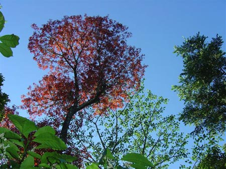

TABLE 2: NATIVE HERBS INSIDE COFFEE FORESTS

COMMON NAME

BOTANICAL NAME

FAMILY

MEDICINAL USE

ENDANGERED Yes/No

Nannari

Hemidesmes indicus

Periploceae

Haemorrhage, wounds, leprosy

No

Sida occuta

Malvaceae

Wounds, Diseases of Head

No

Ganeshaiah, (2002) is of the opinion that the parameters and criteria used for defining the biological richness of a country can vary heavily. For instance, it is not clear how much weight should be attached to the endemism and species richness of a country. We are not sure if we need to attach equal importance to the species richness of plants, of beetles and of other mammals.

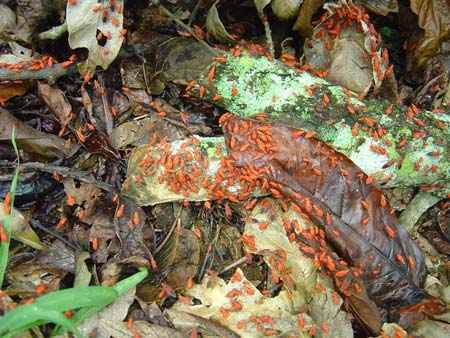

TABLE-3. ESTIMATED NUMBER OF SPECIES WORLD WIDE ( U. KUMAR & A.K.SHARMA, 2001)

TAXONOMIC GROUP

NUMBER OF SPECIES

BACTERIA

3,600

BLUE GREEN ALGAE

1,700

FUNGI

46,983

BRYOPHYTES

17,000

GYMNOSPERMS

750

ANGIOSPERMS

250,000

### BIODIVERSITY FACTS (Gabriel Melchias, 2001)

-   Nobody knows how many species are disappearing (or being generated) on the earth: probably fewer than 10% of species have been given a scientific name.
-   Since the beginning of this century about 75% of the genetic diversity among agricultural crops has been lost.
-   The rural poor depend upon biological resources for an estimated 90% of their needs.
-   A 13.7 km\[2\] area of La Selva forest in Costa Rica contains almost 1500 plant species-more than all those found in the United Kingdom’s 243500 km\[2\].
-   In the U.S.A. 25% of all prescriptions dispensed by pharmacies are substances extracted from plants. Another 13% come from microorganisms and 3% from animals.

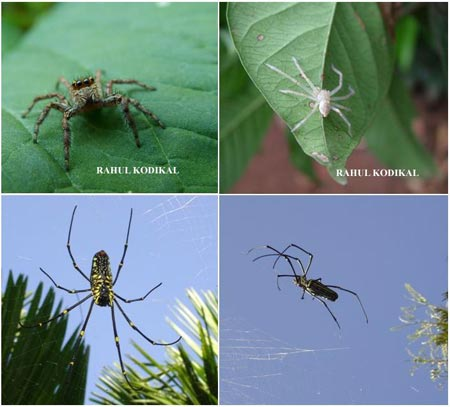

### INDIA IN RELATION TO BIODIVERSITY

India has a bio diversity of 45,000 species of flora which accounts for 15 per cent of the known world plants. Of the 15,000 species of flowering plants, 35 per cent are endemic and are located in 26 endemic centers. Among the monocotyledons, out of 588 genera occurring in the Country, 22 are strictly endemic.

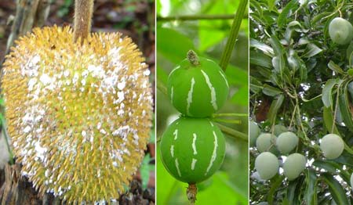

The WESTERN GHATS, one of the eight HOTTEST HOTSPOTS of biodiversity, are suffering annual deforestation rate of 1.16 per cent, despite 15 per cent of their land area being protected as wildlife sanctuaries. India ranks tenth in the world and fourth in Asia in plant diversity. The Indian gene centre is globally recognized as one among the twelve mega diversity regions of the world.

More than 20 crop species were domesticated here. It is known to have more than 49,000 species of plants, 18,000 species of higher plants, including major and minor crop (166) and their wild relatives (326). Around 1000 wild edible plant species are widely exploited by native tribes. These include 145 species of roots and tubers, 521 of leafy vegetables/ greens, 101 of buds and flowers, 647 of fruits and 118 of seeds and nuts. In addition, nearly 9500 plant species of ethno-botanical uses have been reported from the country of which around 7500 are the ethno-medicinal importances and 3900 are multi purpose, edible species.

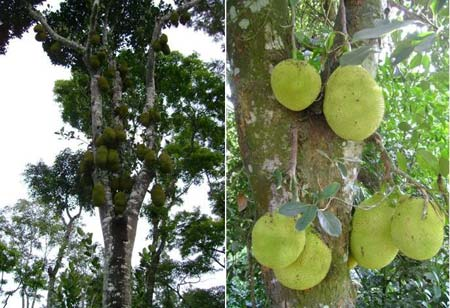

TABLE 4: NATIVE CLIMBERS INSIDE COFFEE FORESTS

COMMON NAME

BOTANICAL NAME

FAMILY

MEDICINAL USE

ENDANGERED Yes/No

Pepper

Piper nigrum

Piperaeae

Leprocy, Skin diseases, piles, worms, Fistula, Skin diseases.

No

Cyclea peltata

Menispermaceae

diverse

No

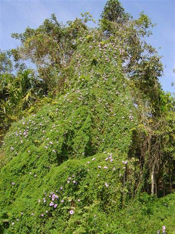

Savithramma et al have recorded that the rate of extinction of species in India is perhaps the highest in the world. They further state that about 150 species, which were collected 100 years ago, have not been spotted in the recent past. Around 600 to 700 species listed by the Botanical Survey of India alone are on the verge of extinction at the rate of 100 species per dens; this extinction rate will be more than 1000 times the estimated normal rate of extinction. In the tropics, the destruction of forests, threatens 1, 30,000 species which live no where else.

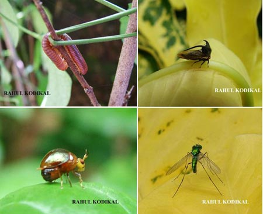

TABLE-5. NUMBER OF RECORDED BIOTA IN INDIA. ( U. KUMAR & A.K.SHARMA, 2001)

TAXON

NUMBER OF SPECIES

FLORA BACTERIA

850

ALGAE

2,500

FUNGI

23,000

LICHENS

1,600

BRYOPHYTA

2,700

PTERIDOPHYTA

1,022

GYMNOSPERMS

64

ANGIOSPERMS

17,000

TOTAL

48,736

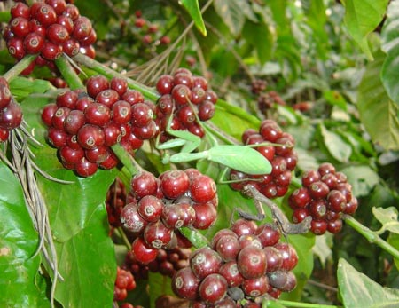

### GLOBAL BIODIVERSITY

-   The rough estimates points out that there exists 10-25 million species of living forms.
-   Only 1.5 million have been identified.
-   300,000 species of green plants and fungi.
-   800,000 species of insects
-   40,000 species of vertebrates
-   3,60,000 species of microorganisms

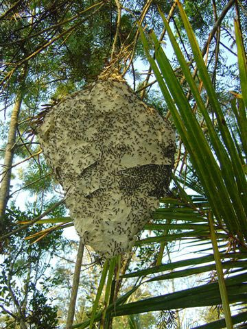

It is a well established fact in scientific circles that tropical forests are very rich in biodiversity. More than half of the species on the earth live in moist tropical forests, which are only 7 per cent of the total land surface, Insects 80 per cent and primates 90 per cent make up most of the species. World wide, tropical rain forests house the majority of floral and faunal species.

### TYPES OF BIO DIVERSITY

1\. GENETIC DIVERSITY Refers to variation of genes within the species.

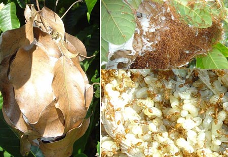

2\. SPECIES DIVERSITY Refers to the variety of species within a region. 

3\. ECOSYSTEM DIVERSITY Consists of complex mixes of diversity between and within species. The altitude plays an important role in supporting different species of plant, animal and microbial life.

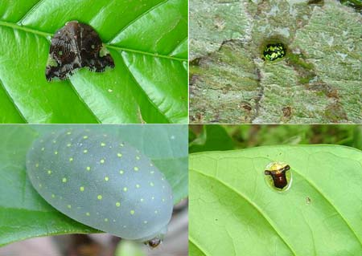

4\. AGRO BIODIVERSITY Refers to the major crops grown in a particular agri zone.

Agro- biodiversity in a traditional farming system… Adopted from Altieri, 1991 and UNDP, 1995.

-   Rich in plant and animal species
-   A wide diversity of niches in the local environment utilized.
-   Reuse of organic residues, consuming biomass enabled.
-   Ecosystems functions, such as pest, weed and disease management enhanced.
-   Locally available resources consumed to an advantage.
-   Reduction of risk and optimization of resource use.
-   Associated with farmers time tested local knowledge about resources.

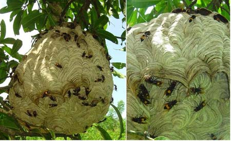

TABLE 6: NATIVE FRUIT TREES INSIDE COFFEE FORESTS

COMMON NAME

BOTANICAL NAME

FAMILY

MEDICINAL USE

ENDANGERED Yes/No

Hebbalasu

Artocarpus hirsutus

Moraceae

Anorexia, eye diseases, Aphrodisiac

Yes

Halasu (Jack fruit)

Artocarpus integrifolia

Moraceae

No

Cashew

Anacardium occidentalle

Anacardiaceae

Rejuvenator

No

Hathimara

Ficus rcaemosa

Moaceae

Constipation, Annemia

No

Pagade mara

Mimosops elengi

Sapotaceae

No

Scientific evidence clearly points out to the fact that biological diversity increases from temperate to tropics and from high to low latitudes. Coffee farms are characterized by heavy rainfall but the distribution of rainfall is unequal from one farm to the other because of the mountain ranges & topographical variations. Soil, climate and type of cultivation too are important in influencing the flora and fauna of the region.

However, altitude and rainfall pattern are the key elements in determining the type of vegetation in any given location. A change in the edaphic, topographic, relative humidity and micro and macro climate also profoundly alters the flora of the region. In short the interplay of the above mentioned factors results in the dominance of a particular species.

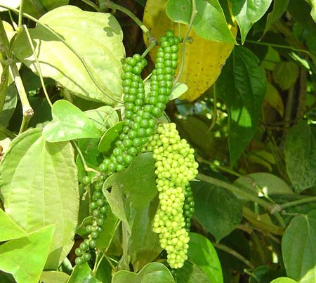

Documented evidence points out to a very startling fact. The so called DEVELOPED NATIONS are home to the smallest pockets of biodiversity while the Developing nations are blessed with the maximum biodiversity resource.

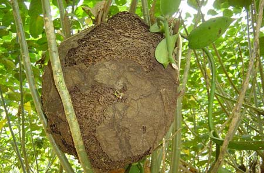

### FUTURE NEEDS

-   Local farmers need to be connected in a way that there is an exchange of seed and plant material among and between farming communities with no patents attached.
-   The wide genetic pool should be in the hands of farmers rather than a few select seed corporate.
-   The realization that coffee forests have in built social and environmental functions.
-   The urgent need is the creation of a multi agency action plan involving locals and the panchayat administration officials, right from the grass roots upwards in assessing the diversification of both floral and faunal species.
-   Participatory conservation practices involving local communities.
-   At a higher or an advanced level, training of locals in identifying and creation of herbariums so as to develop bio resource maps for each and every ecological niche.
-   Help from NGO’s and Government agencies.
-   World Bank funding.
-   Community forests with villagers as guardians of nature and not bureaucrats.
-   In Situ Conservation
-   Ex Situ Conservation
-   Privatization of genetic resources with farmers as major beneficiaries.

The conservation of biodiversity will directly reflect in maintaining the health and vitality of the coffee forest ecosystem. The important aspect is that by conserving biodiversity we indirectly support the coffee ecosystem at the micro level which includes microorganisms and at a macro level comprising of hills, valleys, mountains and all forms of biotic life.

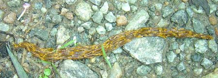

### CONSEQUENCES TO LOSS OF BIODIVERSITY

-   Deals a critical blow to SUSTAINABLE DEVELOPMENT.
-   Farming communities that lose traditional varieties that are locally adapted to a challenging environment, risk becoming increasingly dependent on external sources for seeds and other inputs.
-   Introduction of genetically modified seeds, new set of seeds to be bought only from multinationals.
-   Increased dependency on monocultures/ pesticides/weedicides/chemicals.
-   Increased cost of production per unit area.
-   Increased pressure on the land.

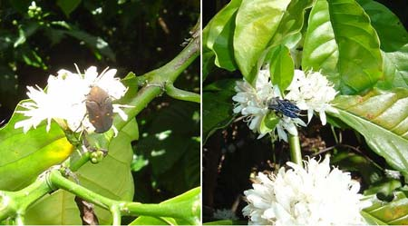

### FARMERS AS GUARDIANS OF BIODIVERSITY

Species extinctions have occurred throughout the establishment of coffee farms due to a number of factors like natural disasters, habitat loss, global warming and floods. Minimum extinctions have been caused by direct interference by coffee farmers. Inside the coffee ecosystem, farmers unknowingly practice three types of conservation. Conservation of species, conservation of forest ecosystems, and conservation of the biosphere.

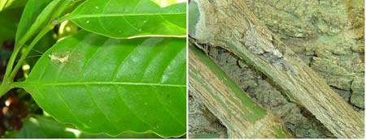

### WHAT CAN WE DO?

-   Avoid mono cropping
-   Avoid the introduction of exotic trees
-   Avoid the introduction of genetically modified crops
-   As individuals we need to make sure that our environment is as favorable for local and indigenous animal and plant life.
-   Generate awareness about the ecology of the Western Ghats among the local people.
-   As far as possible try to control pest and diseases by biological control and native remedies using herb, spice and mixtures.
-   Conservation of energy and resources should be our top priority.
-   Saving the biodiversity on an extensive scale should be on a war footing so that saving a few pockets will only result in a museum.

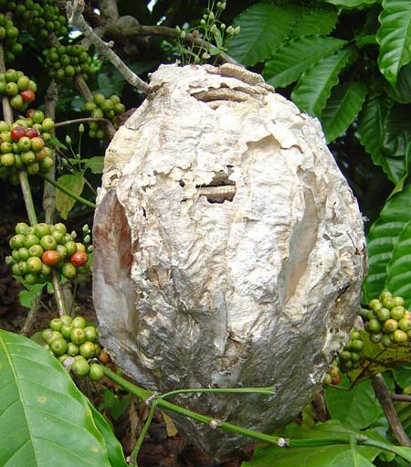

### EYE OPENERS AT JOE’S SUSTAINABLE FARM: KIREHULLY ESTATE.

1.  1.  ROLE OF WILD LIFE IN SEED GERMINATION OF FOREST TREES

We have also painstakingly observed for over many years that some of the rare “NATIVE” ENDANGERED hardwood species like Rosewood, Nandi, Matthi , Honne and a few other species of hardwood species show very poor germination in commercial or forest nurseries in spite of treating the seeds with dilute acids, intended to break the outer hard coat. However, these very same species show successful germination when seeds pass through the digestive system of a few wild animals and birds.

1.  We have also observed that the ripe COFFEE berries coming out of the digestive tract of wild animals have a unique taste and flavor.
2.  Local farmers use CRUDE EXTRACTS of many important plant species as food and medicine, not only for humans but for life stock too.

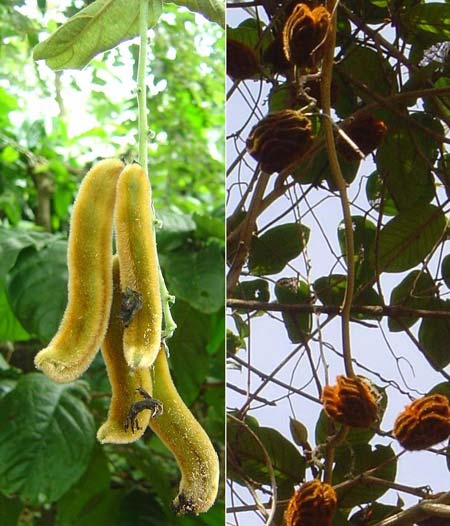

### CONCLUSION

The specter of an ecological crisis hangs over shade grown eco friendly coffee plantations due to global warming and diminishing biodiversity. Unpredictable climate change like flash floods and drought too is causing great distress to the coffee farming community. Already, chemical pollution, land degradation, over exploitation and depletion of natural resources is exerting a tremendous pressure on the coffee forest. It has reached a high point where it is threatening the very life support systems of the coffee mountain. It is a clear sign that if appropriate remedial measures are not forthcoming, it will result in the death knell for the biodiversity of the coffee mountains.

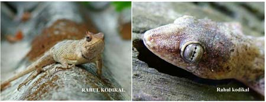

Our observations point out to the fact that management of our natural resources involves a MULTI SECTORAL approach. As a signatory to convention on biodiversity, India is committed to sustainability in terms of habitat restoration, conservation of biodiversity and benefit sharing. The Government needs to realize that the farming community is not only the backbone of the national economy, but most importantly each and every coffee farmer protects the earth’s precious natural resources. In a way they are guardians of nature and any price volatility would spell doom to the ecology of the coffee mountain resulting in environmental degradation.

Another area of concern is that the wealth of biodiversity in developing countries is being exploited by Developed countries. Every biological species plays a stabilizing and balancing role in maintaining the ecological integrity of the planet. This fine balance has been badly affected due to human intervention. It is vital that we realize the importance of every plant and animal species and do something to protect these.

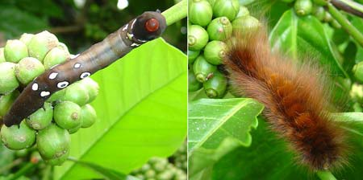

Environmental educator David Orr reports that “If today is a typical day on planet Earth, we will lose 116 square miles of rainforest, or about an acre a second. We will lose another 72 square miles to encroaching deserts, as a result of human mismanagement and overpopulation. We will lose 40 to 100 species, and no one knows whether the number is 40 or 100. Today the human population will increase by 250,000. And today we will add 2,700 tons of chlorofluorocarbons to the atmosphere and 15 million tons of carbon.

Tonight the Earth will be a little hotter, its waters more acidic, and the fabric of life more thread bare. The truth is that many things on which your future health and prosperity depend are in dire jeopardy: climate stability, the resilience and productivity of natural systems, the beauty of the natural world, and biological diversity”. Biodiversity will definitely flourish in mans absence. Hence man kind has to realize that it’s his interference that is causing the entire problem.

### REFERENCES

[seedsavers.net](http://seedsavers.net/)

[www.allgroundup.com](https://web.archive.org/web/20161025012649/http://www.allgroundup.com/)

[World Atlas of Biodiversity: earth’s living resources in the 21st century](https://archive.org/details/worldatlasofbiod02groo) (maps)

[www.ofrf.org/](http://www.ofrf.org/)

[United Nations Development Programme](http://www.undp.org)

Altieri,M.A., D.L. Glaser and L.L. Schmidt.1990.

Diversification of Agro ecosystems for Insect Pest Regulation: Experiments with Collards. In S.R. Gliessman ( Ed. Agro ecology: Researching the Ecological Basis for sustainable Agriculture. Springer-Verlag, New York. Ando, A., Comm. J., Polasky, S and A., Solow. 1998. Species distribution, lands values and efficient conservation. Science: 279 : 2060-2061.

Atlas, R.M. and R. Bartha. 1993. Microbial Ecology: Fundamentals and application. Third edition. Benjamin/Cummings Pub. Co. New York. Brock. T. D. 1979. Biology of Microorganisms. Third Edition. Englewood Cliffs. Prentice-Hall. Brookfield, H and C. Padoch. 1994. Appreciating biodiversity: A look at the dynamism and diversity of indigenous farming practices. Environment, 36 : 6-11. Chapman. J.L. & M.J. Reiss.1997. Ecology. Principles and applications. Cambridge University Press. Chaterjee. S. 1995. Global Hot Spots of biodiversity. Current Science, 68, 12 : 1178-11 79. Cox, C.B. & Moore, P.D. 1985. Biogeography : An Ecological and Evolutionary Approach .fourth edition. Blackwell Scientific Press, Oxford. David Orr i. 1990. Annals of Earth, Vol. VIII, No. 2, 1990. 10 Shanks Pond Road, Falmouth, MA 02540 Gabriel Melchias.2001.Biodiversity and Conservation. Oxford & IBH Publishing Co. Pvt. Ltd. New Delhi. GOI.1994. Conservation of Biological Diversity in India. An Appraisal . Ministry of Environment and Forests. Johnson. C., Knowles, R. and Colchester, M. 1989.

Rainforests : Land use options for Amazonia, Oxford University Press & WWF, U.K. in association with survival International. Jiaa Sy Spier. 6th century A.D. Chi Min Yao Shu. Kumar.U. & A.K. Sharma. 2001.

Plant Biotechnology & Biodiversity Conservation. Agrobios (India). Kotpal, R.L. and N.P. Bali. 2003. Concepts of Ecology. : Environmental and field biology. Vishal Publishing Compamy.India. Killham. K. 1994. Soil Ecology. Cambridge University Press, Cambridge. England. K.N. Ganeshaiah. 2002. Biodiversity Atlases for the Country: A prerequisite for conservation. In (Eds) Ramamurthi Rallapalli & Geetha Bali. 2002. BIODIVERSITY (Monitoring, Management, Conservation & Enhancement). A P H Publishing Corporation. New Delhi. M.S. Swaminathan & S. Jana. (Editors) 1992. Biodiversity- Implications for Global food security. Macmillan India Limited. India. Myers. N. 1988. Biodiversity (Ed. Wilson, E.G.) National Academy Press, Washington D.C. 28-35. N. Savithramma, K.N. Rao ansd N. Ramamurthy. 2002. Phyto-diversity, Monitoring and Conservation strategies of rare, endemic, endangered and Medicinal Plant species of Seshachalam hill range of South Eastern Ghats.In (Eds) Ramamurthi Paul. E.A. and Clark. F. E. 1996. Soil Microbiology and Biochemistry. Academic Press. Ramamurthi Rallapalli & Geetha Bali. 2002. BIODIVERSITY (Monitoring, Management, Conservation & Enhancement). A P H Publishing Corporation. New Delhi. Rallapalli & Geetha Bali. 2002. BIODIVERSITY (Monitoring, Management, Conservation & Enhancement). A P H Publishing Corporation. New Delhi. The Food & Agriculture Organization of the United Nations. 1998. The State of the world’s plant genetic resources for food and agriculture. FAO. Rome. World Resource Institute, 1992. World Resources. 1992-93. Oxford University Press… New York. Scott Wallace. 2007. Last of the Amazon. National Geographic, Jan. 2007. Soule, M.E. (Ed) 1986. Conservation Biology: The science of Scarcity and Diversity. Sinauer Associates Inc. Pub., Massachusetts. Uma shaanker, R and Ganeshaiah.K.N. 1998. Contours of conservation-A National agenda for mapping bio diversity. Current science, 75: 292-298.

### ACKNOWLEDGEMENT

We wish to give special recognition to Dr. C.G. Kushalappa, (Associate Professor. Dept. of Forestry Biology & Wildlife, College of Forestry, Coorg , University of Agricultural Sciences, Bangalore) who gave his time most generously in preparing the tables listed in the article. Dr. Kushalappa not only loves teaching, but also promotes the sustainable use of natural resources and practices bio dynamic farming. We are grateful for the help and encouragement given to us by Rahul Kodikal { Kamala Nivas, Nagabana Road, Marnami Katte, Mangalore 575 001 } He readily contributed valuable slides pertaining to Western Ghats bio diversity.