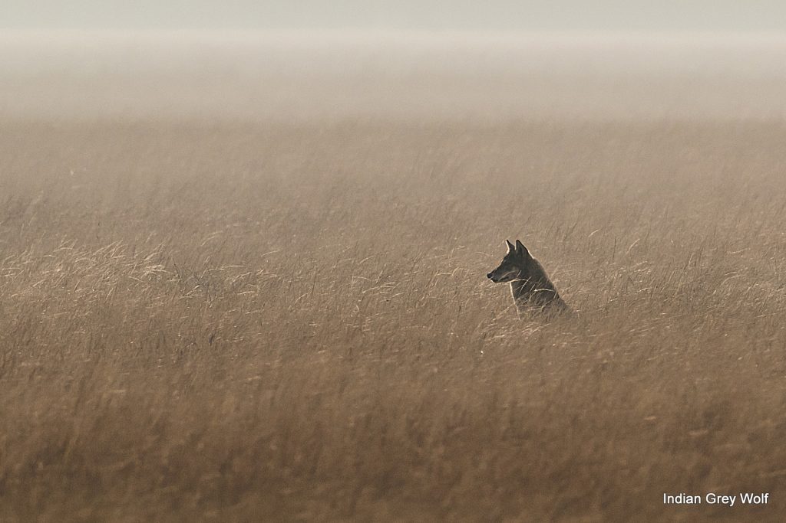
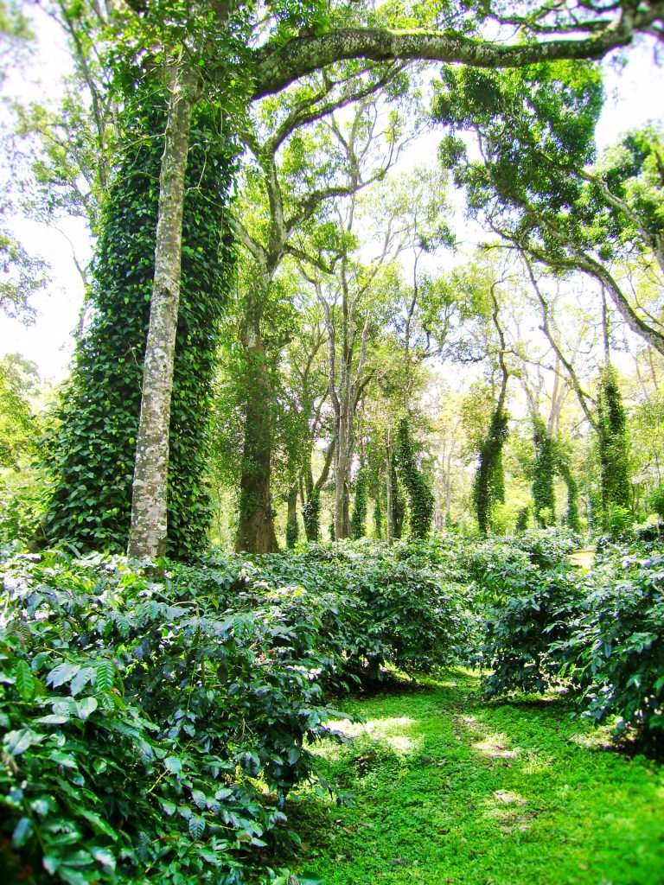

Coffee Planters are under the impression that converting grasslands and pasture lands into Agroforestry is beneficial to the ecosystem by way of carbon sequestrian, greening the Planet, creating microclimates to improving the hydrological systems, and help nurture all forms of wildlife. This is not always true. In fact, it can cause, irreversible damage to the ecosystem. Hence, this article is a wakeup call to the coffee Planting Community, to stop converting grasslands or scrublands into agroforestry, especially, monocultures of coffee. This understanding stems from scientific research and not based on our expertise, as microbiologists and Horticulturists.

There’s a wealth of scientific information regarding the importance of grasslands and scrub forests, not only as wildlife refuge but in its inherent ability to store carbon and mitigate the impacts of global warming.

It is a fact that though grasslands occupy a quarter of the earth’s landmass, most of it has been lost in less than 3 decades to agricultural development.

The added advantage of native grasslands is that they are highly resilient to the impact of global warming. They adapt well to excess rain or drought or wildfires. Research shows that grasslands reflect more sunlight than the forests and scrublands. These ecosystems has the ability to store carbon underground in the root system. The constant interaction between the root and the shoot helps in the carbon cycle and store it underground. It acts as a huge sink.

**Storehouses of Carbon**

New research findings clearly elucidate the fact that unlike forests that grow above ground, grasslands sequester most of their carbon underground. The recent bushfires in Australia and North America released millions of tons of carbon dioxide to the atmosphere. However when the fire burns grasslands, the carbon fixed underground tends to stay in the roots and soil. Making them more adaptive to climate change.

**New Clearings**

In recent years, many enterprising Coffee Planters are adopting more of sun-loving coffee in comparison to the time tested method of shade-loving coffee. When new plantations are established on grasslands/pasture lands, the continual conversion of native grassland by soil digging and pitting, releases tons of carbon into the atmosphere when converted and secondly puts specialized grassland species of flora and fauna at risk.

**Coffee Plantations, Mara Kashi, And Selective Tree Felling**

Since coffee is a Commodity traded on the International stock exchange, namely the New York stock exchange and the London International Financial Futures and Options Exchange  (LIFFE) stock exchange, it is subjected to volatility in prices. Whenever, the costs of coffee go below the cost of production, planters, selectively harvest silver oak and semi-hardwood species for their survival. Timber logging in thousands of acres contributes to significant amounts of carbon being released to the atmosphere. Timber logging involves the release of carbon stored in the woody biomass in terms of aboveground branches, stem, and roots below ground. Hence, the point that we would like to make is that the very trees which were supposed to behave as carbon sinks are now carbon emitters contributing to global warming.

**What we need to understand**

We would like to clearly state that Coffee Planters are responsible for growing millions of trees and only in desperate situations like a price drop, do they resort to selective timber logging. As such, they contribute in mitigating carbon release by acting as productive sinks.

Trees will always remain the number one carbon sinks and they cannot be replaced by grasslands or pasture lands or scrublands. However, each ecosystem has its own contribution to a sustainable foundation and should not be manipulated without proper scientific understanding.

**Threats to Grasslands**

Habitat loss

Unsustainable agricultural practices

Destruction of native flora and fauna by using pesticides, weedicides and other chemicals

Overgrazing

Crop Clearing

Introducing Agro-Forestry

Monoculture planting of exotic species of trees like Mangium, Mesopsis, Casurina, Acacia, soobabul which release alkaloids into the soil system.

Setting up of localised Agro-based Industries

Invasive species

**From the Farmers viewpoint, How to overcome**

Remuneration to farmers who protect grasslands

Restoration of grasslands and wetlands by helping rain-water to soak in.

Check for soil erosion

Controlled dry season burning

Educating the Farmers to go in for crop rotation to keep the soil vibrant.

Windbreaks to be planted at border areas to prevent soil erosion

**Conclusion**

Over the years we have witnessed the impact of climate change and global warming because of the destruction of the complex sensitive ecosystems, which are vanishing year by year. *Another very important aspect that is often overlooked is that these forest types are easy targets for reforestation activities.* *This will have serious undesirable consequences for grasslands and scrub forests.* We urge the Ministry of Environment to conduct more scientific research and use better technology that will help distinguish each habitat before they are converted to Plantations.

**References**

Anand T Pereira and Geeta N Pereira. 2009. Shade Grown Ecofriendly Indian Coffee. Volume-1.

Bopanna, P.T. 2011.The Romance of Indian Coffee. Prism Books ltd.

[Climate Change Impacts to Grasslands](https://climatechange.lta.org/impacts-to-grasslands/)

[Grasslands and Climate Change](https://www.fs.usda.gov/ccrc/topics/biomes/grasslands)

[Grasslands More Reliable Carbon Sink Than Trees](https://climatechange.ucdavis.edu/news/grasslands-more-reliable-carbon-sink-than-trees/#:~:text=A%20study%20from%20the%20University,forests%20in%2021st%20century%20California.&text=%E2%80%9CThis%20doesn't%20even%20include,increase%20carbon%20stocks%20in%20rangelands.%E2%80%9D)

[Grasslands](https://www.accentnatural.com/grasslands-climate-change/#:~:text=Research%20shows%20that%20grasslands%20reflect,heat%20as%20this%20transition%20occurs) .

[Can Grasslands](https://blog.nature.org/science/2017/01/17/can-grasslands-ecosystem-underdog-play-underground-role-climate-solutions/?src=e.nature.loc_b&lu=4096790&autologin=true)

[Grasslands among the best landscapes](https://uwmadscience.news.wisc.edu/ecology/grasslands-among-the-best-landscapes-to-curb-climate-change/)

https://climatechange.ucdavis.edu/news/climate-change-solution-beneath-feet/