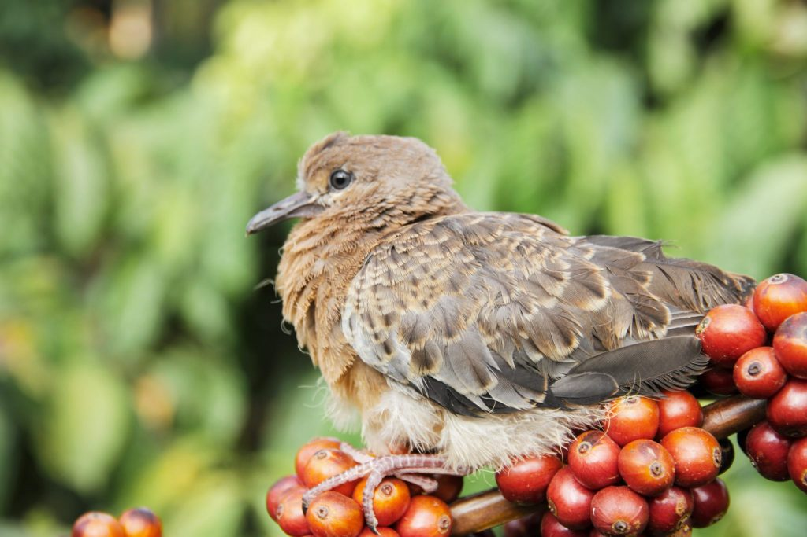
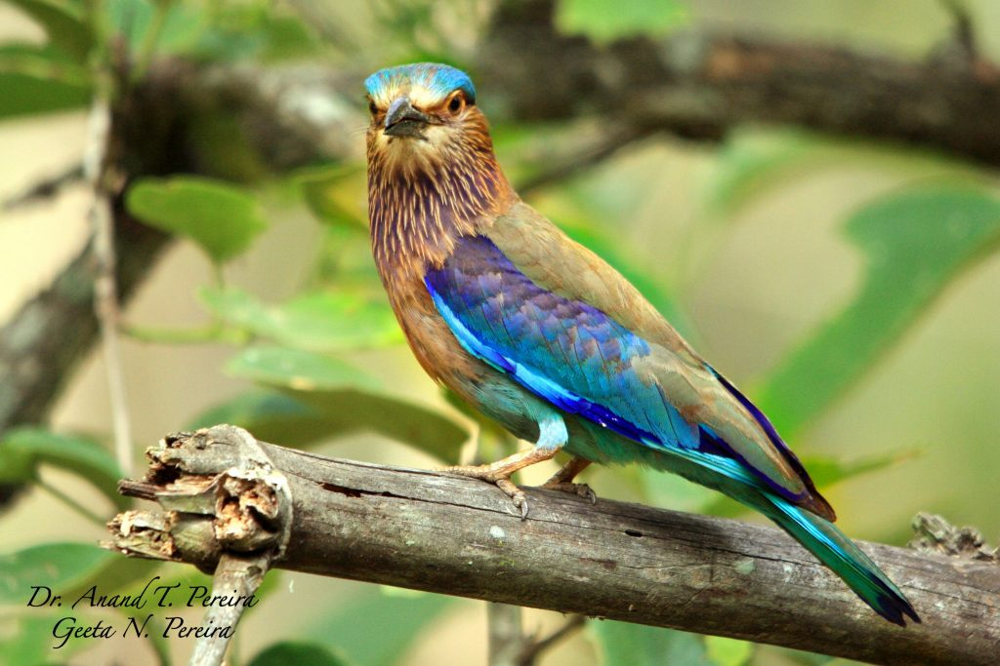
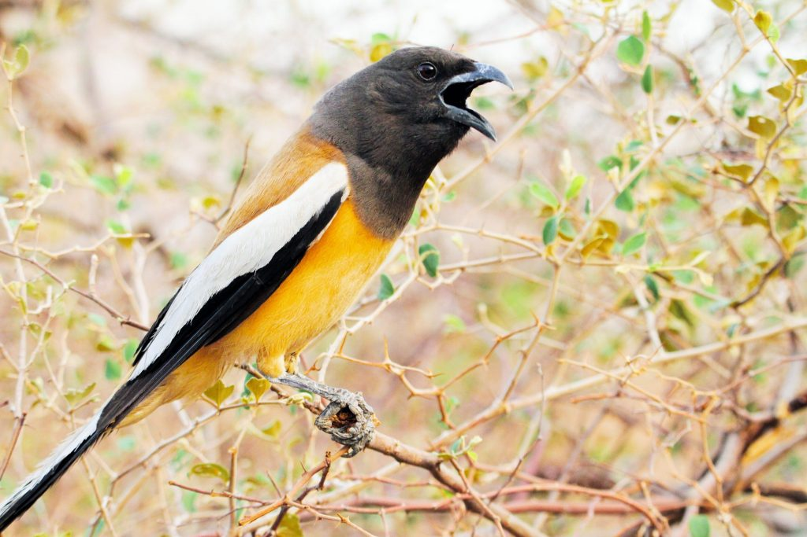
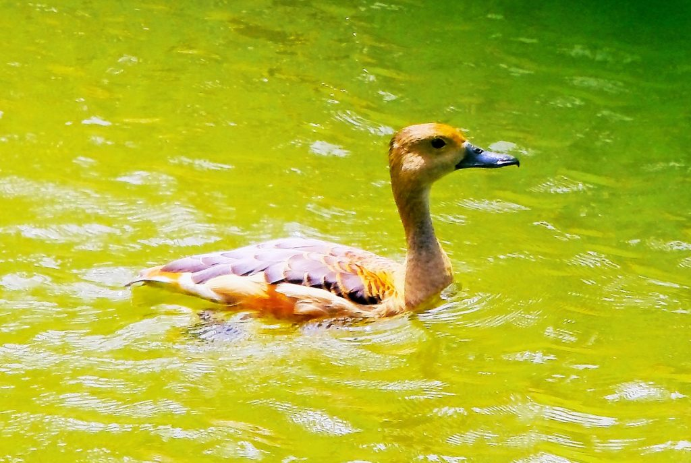
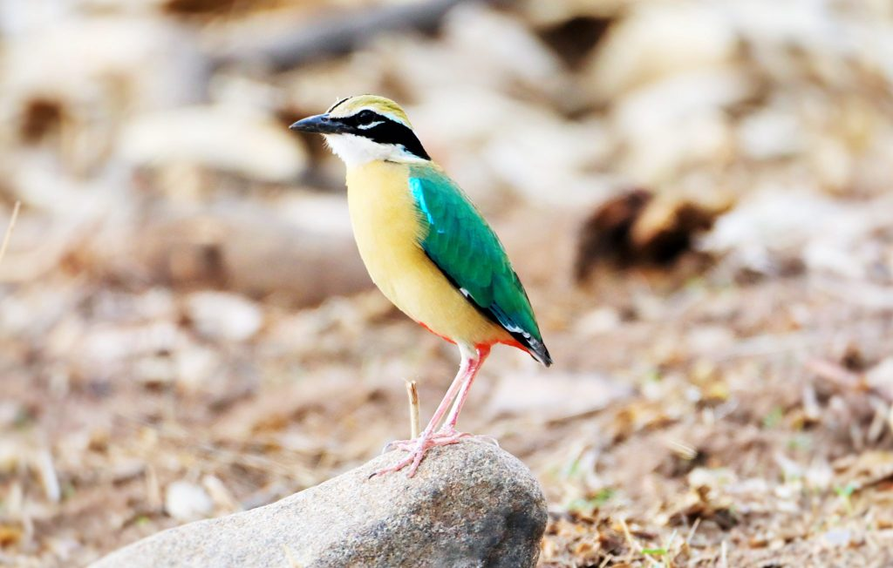
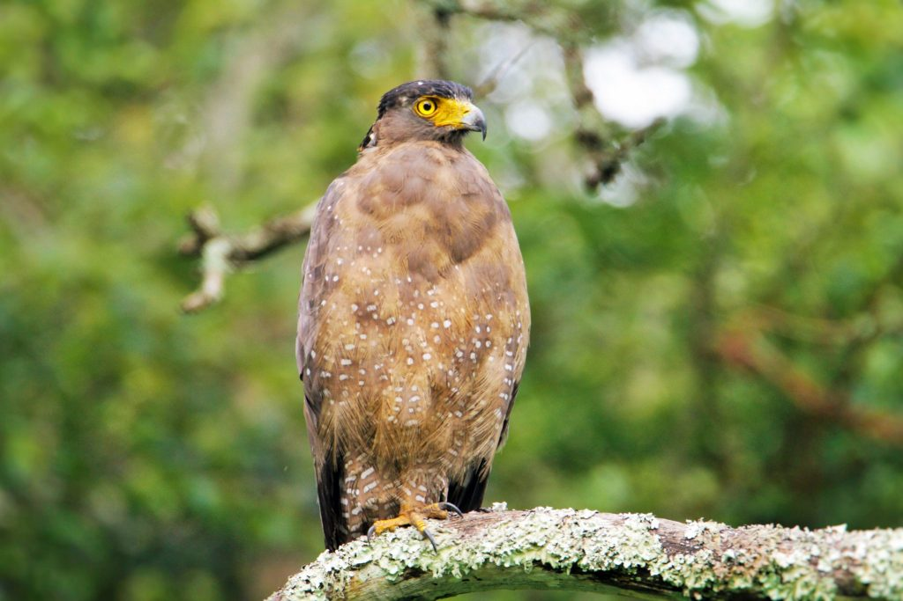
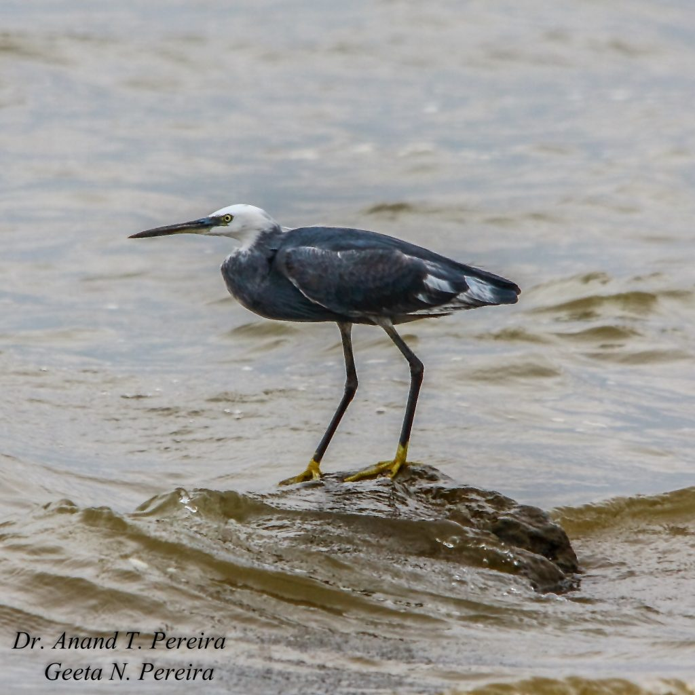
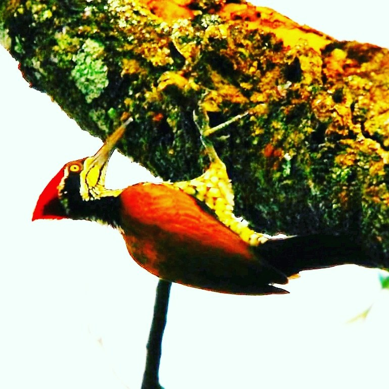
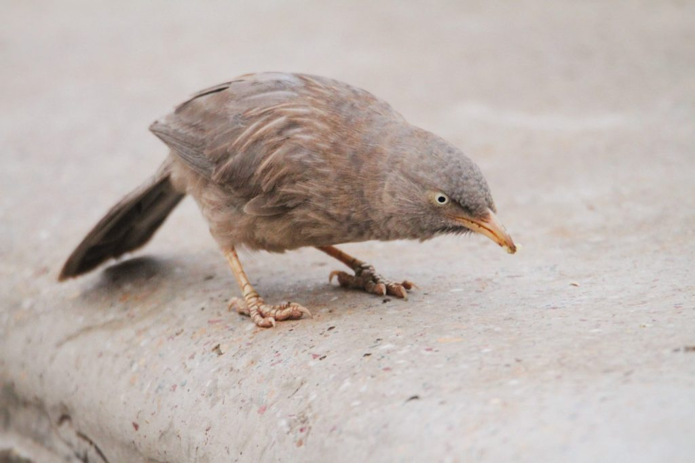

Indian coffee forests stretching forth thousands of miles are perfect bird sanctuaries because they provide a safe haven for all forms of life. These coffee forests radiate a wide variety of birds in different shapes, sizes, colors, habits and instincts. Each species is present in select numbers and occupy almost every conceivable niche. Every species is gifted with specially structured feet which enables them to efficiently pick food from the ground or from water. One kind of bird’s foot can be very different from another species of birds. Several evolutionary adaptations of birds and how these unique characteristics play into basic survival is something that has fascinated ornithologists. They surely hold the key to the survival of birds.

### Feeding Habits

Most birds in the forest or wooded area, including garden birds are beautifully adapted for grasping tree branches or slender twigs of herbs and shrubs. On close scrutiny, it is interesting to note that each bird species has evolved a pair of feet to suit its ecological habitat. Hence feet hold many clues to a bird species adaptation to a given ecological niche in order to survive and meet its food requirement. Some birds are gifted with unusually long legs and necks, and others have beaks with a variety of shapes-spoon like, spear like, dagger like, etc. In general the average bird foot has four toes (anisodactyly), and typically the first big toe (the hallux) is turned backward, while the other three toes face forward.

### Feet Adaptations

Just like different beak adaptations that help different bird species survive in any ecological niche area, so also different birds have evolved appropriate feet to help them source the required food in different habitats. Bird feet are used for swimming, catching prey, walking, perching, wading, climbing, gripping, and in some cases to defend themselves.

Bird’s feet are covered with heavily scaled skin, which gives strength to the bird’s feet. The feet and toes are made up of tendons and bones. The feet do not have very many nerves, blood vessels or muscles.

Some bird’s legs are covered with feathers, especially those that habit colder regions.

### Swimming

Birds which prefer to remain in aquatic habitats have webbed feet which acts as a paddle to move through water.

There are actually two different kinds of webbed feet:

Some birds like the Northern Pintail or Mallard have webbing between three of their toes. Each bird has a fourth toe located behind the webbing that does not help in propelling the bird through the water. This type of webbed foot is known as palmate – that is, shaped like an open hand or palm.

The other type of webbed foot has webbing between all four of the bird’s toes. This type of webbed foot is known as totipalmate – “toti” meaning total and “palmate” meaning open hand or palm.

Webbed feet are useful on land as well as on water because they allow birds to walk more easily on mud.

Eg. Ducks, Geese

### Perching

Small birds and song birds have small feet. The perching birds are classified as “Passeriformes,” or passerines. The name means “sparrow-shaped”. The passerines are also known as songbirds.

Perching birds make up the largest order of birds in the world. There are 59 families and about 5,100 species, which means perching birds are about 60% of all living birds. They all share the same type of foot, with three toes pointed forward and one backward. This foot is adapted to gripping a perch. The muscles and tendons of their legs are designed to tighten the grip on the perch if the bird begins to fall backward.

Passerines also use their feet for feeding.

### Catching Prey

Almost all birds of prey have powerful legs and strong feet for holding food. Their toes are sharp with powerful talons. This foot arrangement is called raptorial. They have anisodactylous feet, with three toes forwards and one backwards. The toes are very powerful, and equipped with sharp, long, well curved claws. This complete tool is named “talon”. Talons are used to catch and hold the prey, and also to kill it.Birds of prey are beautifully gifted with legs adapted for grabbing victims in a vice like grip. Eagles, Owls, Osprey,

### Wading

Many semi aquatic birds often feed along the shoreline or streams or on the banks of rivers. These birds typically have long, slender legs which helps them to silently walk through shallow water. Like passerines and raptors, waders have three toes pointing forward and one pointed backwards. Some leaf walkers like the bronze winged Jacana have long toes that allow them to traipse across the surface of very wet mud or floating plants. We see this long-toed shape on various herons, rails, and sandpipers too.

Cranes, herons, and sandpipers, Bronze winged Jacana

### Climbing

Some birds are vertical climbers of tall trees and are gifted with specially evolved feet that help them climb both upwards, sideways and downwards. Such birds have their feet are equipped with two toes up front and two in the back. The scientific name for this toe arrangement is zygodactyl.

Woodpeckers, Nuthatch

### Ground Dwellers

Ground-living birds like pheasants and chickens possess very thick, powerful toes with well-developed nails, perfect for scratching the ground.

Babblers,Jungle fowl

### Conclusion

In all our earlier articles highlighting, the avian fauna, inside Bird friendly shade coffee, we have emphasised the importance of how Indian Coffee forests act as Bird Sanctuaries and as refuelling stops for migratory birds. Inside these unique coffee forests one can witness an incredible variety of rare, exotic, native and endangered species of birds and other wildlife species. The dense coffee forests often conceal a wide variety of song birds too. Feet adaptation holds a valuable clue in understanding how different species of birds thrive and survive in varied environments. A major factor that decides their adaptability lies in the shapes of their feet. Bird’s feet also throws light on the type of lifestyle it leads. Hence documenting the bird species and their distribution across varied agro climatic zones will throw valuable light on the abundance of birds inside shade coffee.

### References

Anand T Pereira and Geeta N Pereira. 2009. Shade Grown Ecofriendly Indian Coffee. Volume-1.

Bopanna, P.T. 2011.The Romance of Indian Coffee. Prism Books ltd.

[For the Birds](https://www.scientificamerican.com/article/best-adapted-beaks-bring-science-home/)

[Bird’s legs and feet](http://www.oiseaux-birds.com/article-legs-feet-shapes-intro.html)

[Walk This Way](http://projectbeak.org/adaptations/feet.htm)

[Bird Adaptations](http://www.riverkeepers.org/wp-content/uploads/2016/07/Bird_Adaptations.pdf)

[BIRD FEET](http://www.backyardnature.net/birdfeet.htm)

[The perching birds](https://web.archive.org/web/20150518022438/http://theiwrc.org:80/kids/Facts/Birds/songbirds.htm)

[Bird-Spotting Science](https://www.scientificamerican.com/article/bring-science-home-adaptation-bird-feet/)

[Types of Bird Feet](http://www.robinsonlibrary.com/science/zoology/birds/general/feet.htm)

[How Bird Feet Work](http://www.birdsandblooms.com/birding/birding-basics/how-bird-feet-work/)

[Bird’s legs and feet: different shapes](http://www.oiseaux-birds.com/article-legs-feet-shapes-page2.html)

[Bird feet and legs](https://en.wikipedia.org/wiki/Bird_feet_and_legs)

[Feet](https://web.stanford.edu/group/stanfordbirds/text/essays/Feet.html)