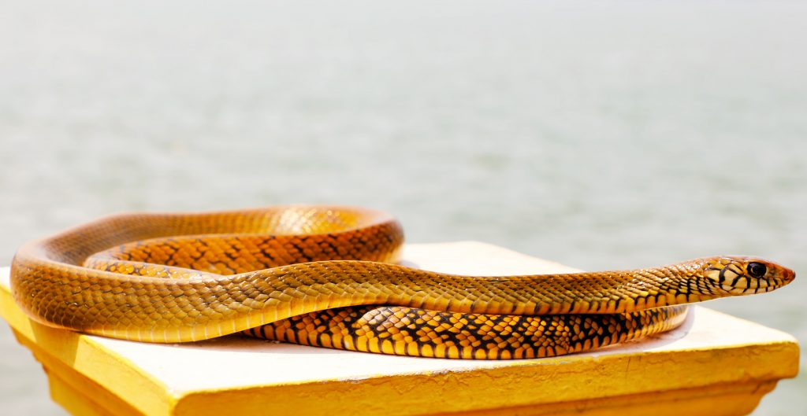
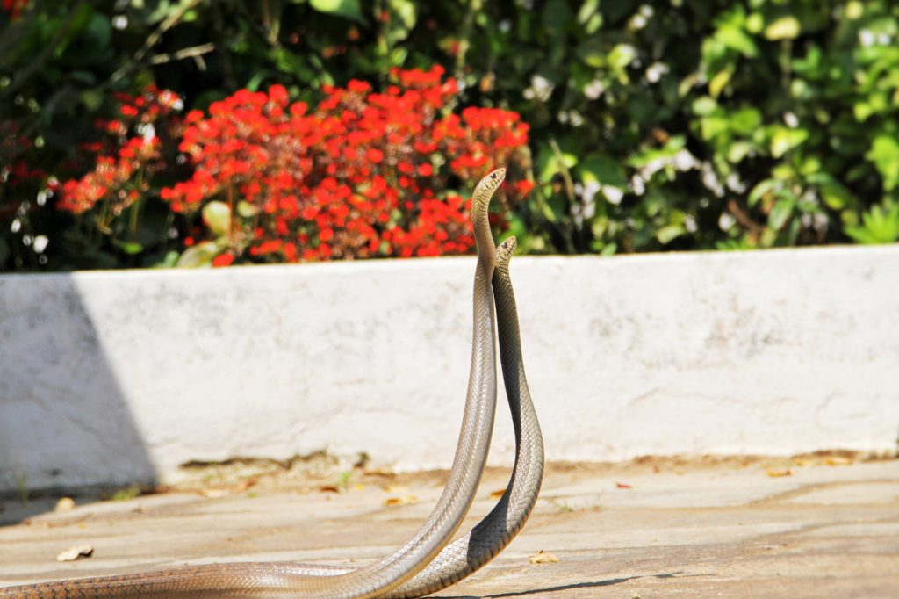
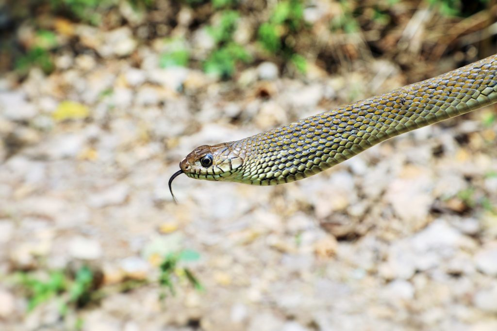
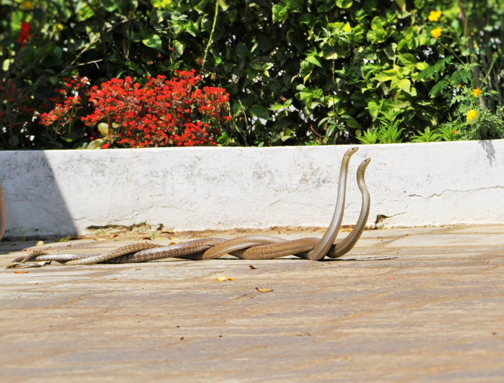

The Indian rat snake (Ptyas mucosa), Varies in color from pale brown to nearly black with a light-hued underside, depending on the elevation and seasons. Our earlier articles has provided scientific information on the range and morphological features concerning rat snakes. Rat snakes are largely diurnal and glide through low trees with remarkable ease.

The entire breeding process of snakes remains something of a mystery to most people. When it comes to the reproductive behavior of snakes though, there are still many mysteries to be solved. Part of the issue is that snakes are so secretive, which means only a few species have been observed in the wild.

But from what we can tell, the mating habits of snakes are rather similar to those of spiders. In both groups, the females are larger than the males, there is a lot of complex competition among males to fertilize the females, while the females find ways to control who mates with them – and unwary males sometimes risk being eaten by their mates.

We have made it a point to write this article on mating in rat snakes for two main reasons. First, Rat snakes are relentlessly persecuted thinking that they are venomous and their bite is lethal to humans. Often mistaken as the fatally poisonous Indian Cobra, rat snakes are frequently killed unnecessarily by people because of this. Second, a majority of people are of the opinion that rat snakes mate with other venomous species and hatch eggs with venomous offspring’s. Our article clearly throws light on scientific facts about mating and dispel fears that are, the main reason for rat snakes, being killed.

Contrary to the popular misconception, the rat snake doesn’t mate with the venomous cobra but only within its own species. The behavior is sometime misread by observers as a mating dance between opposite sex individuals. This is due to the fact that the skin coloration of the rat snake and that of the cobra looks similar to the naked eye.

As snakes emerge from hibernation, mating – not eating – is usually their first priority, depending on the species. Snake sex can occur right after spring or continue throughout the summer into late fall, depending on the species. Males tend to wait for the females to pass through their territory. They communicate using pheromones. During mating the male and female rat snakes intertwine their bodies and commence their mating dance that can last a few hours. At times the male may rub his chin all over the female’s body to excite her or he may vibrate his body against hers when they are parallel. A lot of snakes will also tongue flick, which is a different motion than the normal smelling motion. In tropical Countries, reproduction may take place year round.

### Snake Reproduction

Scientific literature states that Snake evolution may have driven females’ snakes to grow larger. Size is linked to increased fertility and bigger offspring, which are more likely to survive. Males seem to be drawn to these reproductive benefits, they prefer to quote larger females.

genitalia is not on the exterior of their bodies as it hides inside a pocket near the base of the tail called the cloaca, which also houses their liquid and solid waste system. The male’s genitalia – hemipenes – consists of two joined penises, with each penis affiliated with a single testicle, giving it a forked appearance. Male and female snakes become entangled during sex, wrapping around each other during the act. Once the snakes finish coitus, they go their separate ways. To mate, snakes need only to align the base of their tails at the cloaca, an opening serving both reproductive and excretory systems. The male extends his hemipenes, the two-pronged sex organ stored in his tail, and with each half deposits sperm into the female’s cloaca.

The female snake has two pockets each are specialized for delayed or immediate reproduction. The female can mate with several males, she can chose which sperm she wants to fertilize her and can have a litter of babies all from different fathers. Also the fact that they can store the sperm means they don’t have to have sex to reproduce. Snake sex can last a whole day, but usually takes an hour. Female snakes reproduce once or twice a year and depending on the species either give birth to live snakes or lay eggs. In case of rat snakes, the females’ lays eggs in a safe place, preferably close to water bodies.

### Puffing

When rat snakes are threatened, the adult members of this species emit a growling sound and inflate their necks. This puffing behaviour is often mistake to be that of a venomous snake, when in fact, the non-venomous rat snake is only trying to ward off danger by trying to intimidate its enemy.

### Territory

Rat snakes prefer to establish their own territories using a ritualized test of strength in which they intertwine their bodies. They tend to defend their territory aggressively, attempting to startle or strike at passing objects.

Where do rat snakes lay their eggs?

Like most snakes, rat snakes are egg layers. Approximately 5 weeks later the female will lay anywhere between eight and 25 eggs, these eggs are often laid in areas such as mulched flower beds, playground sandy areas, around hollow trees and abandoned burrows that other animals have made. The rat snake, incidentally, is oviparous: the female produces between 6-15 eggs per clutch which it guards and incubates over a period of 60-80 days.

The hatching of common rat snakes are vigorous eaters and will double their size rather quickly. If conditions are good, females will sometimes produce two clutches of eggs a year.

### Do snakes mate for life?

The mating habits of the majority of snake species are relatively straight forward. There’s a mating season, when the male will seek out any female.

### References

Anand T Pereira and Geeta N Pereira. 2009. Shade Grown Ecofriendly Indian Coffee. Volume-1.

Bopanna, P.T. 2011.The Romance of Indian Coffee. Prism Books ltd.

[Eastern Rat Snake](http://animaldiversity.org/accounts/Pantherophis_obsoletus/)

[IndianSnakes](https://www.facebook.com/Indiansnakes.org/)

[Rat snake](https://en.wikipedia.org/wiki/Rat_snake)

[Rat Snake Facts](https://www.livescience.com/53855-rat-snake.html)

[oriental ratsnake](https://en.wikipedia.org/wiki/Ptyas_mucosa)

[Kids’ Inquiry of Diverse Species](http://www.biokids.umich.edu/critters/Pantherophis_obsoletus/)

[What Comes Before Snake Sex?](https://www.nationalgeographic.com/news/2015/03/150318-sex-animals-mating-science-snakes-basic-instincts/)

[How Do Snakes Mate?](https://sciencing.com/snakes-mate-4568663.html)

[Animal Sex: How Snakes Do It](https://www.livescience.com/48212-animal-sex-snakes.html)

[How do snakes mate?](https://metro.co.uk/2017/06/29/how-do-snakes-mate-the-world-of-snake-sex-explained-6741379/)

[male snakes](http://www.bbc.com/earth/story/20170608-snake-sex-is-every-bit-as-peculiar-as-you-would-expect)

[snakes for pets](https://www.snakesforpets.com/how-snakes-reproduce/)