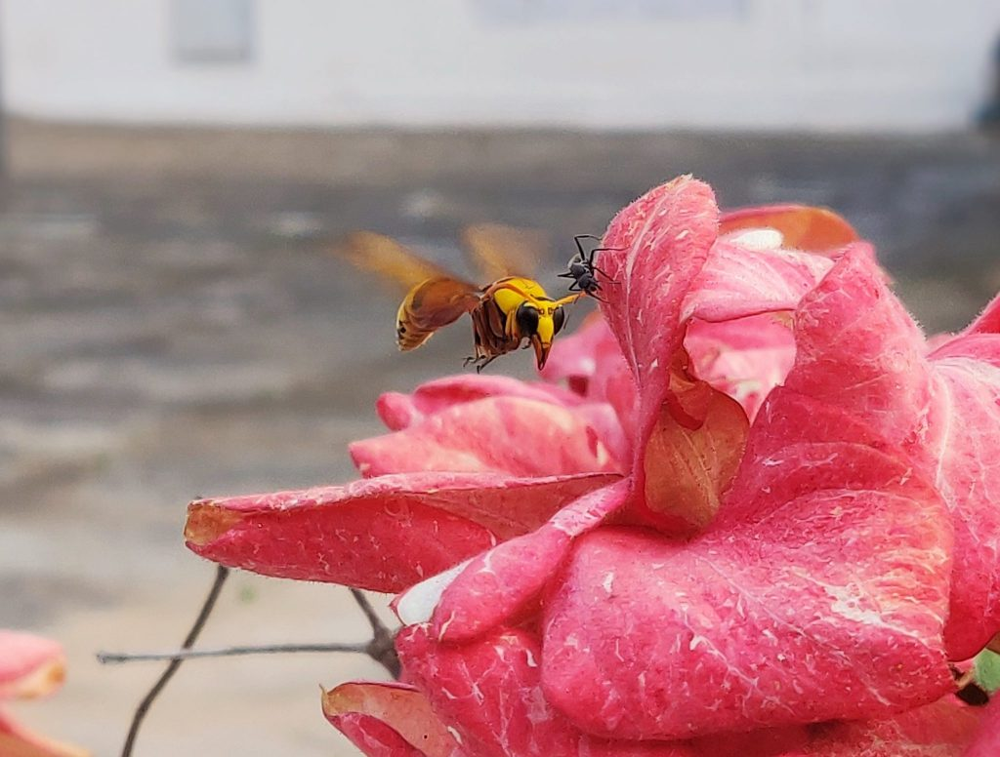
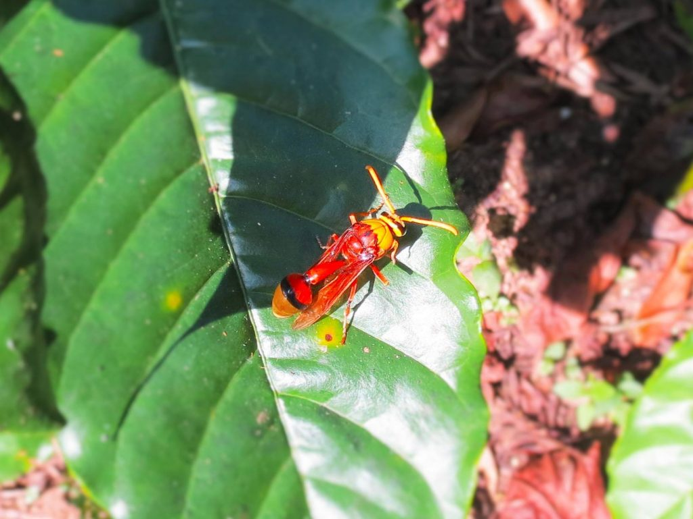
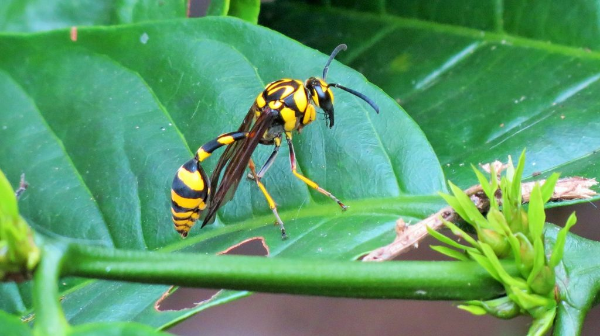
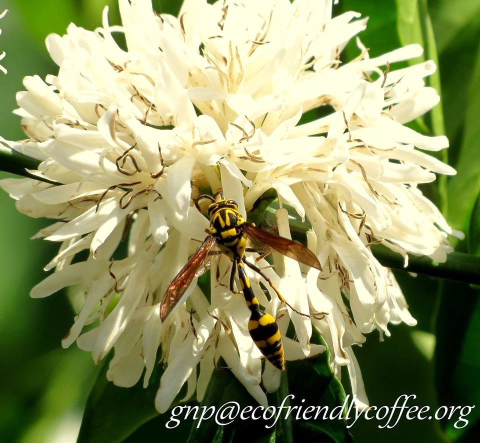
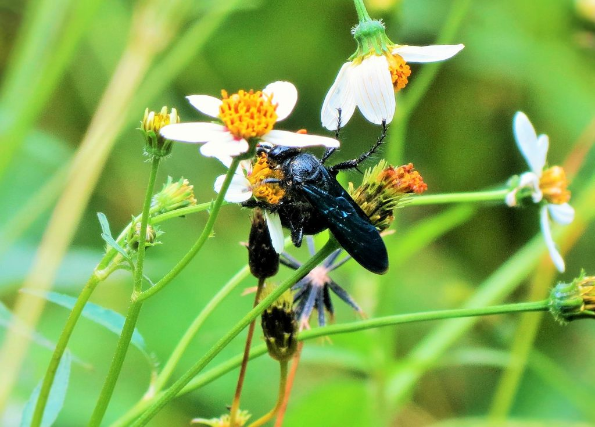

Bees, Wasps, Butterflies, you name the agent, you will find it in Eco-friendly Indian shade coffee working in tandem with the Planter. So many different biological agents involved in Coffee Pollination. That’s why Indian Coffee tastes heavenly. However, this once upon a time; live and let live culture; is giving way to open sun shade coffee heavily influenced by other Countries growing sun loving coffee. We need to stop this before it is too late.

Our earlier articles on Insect biodiversity inside coffee forests has revealed the importance of various species of insects which play an important ecological role and  act as agents of pollination for a host of multiple crops as well as forest and fruit trees. When we speak of pollination, the first image that crosses the mind are the honey bees and butterflies. However, we have come across a number of species of insects, other than bees or butterflies, which either play a direct or indirect role in pollination and are just as important to the environment as bees.

This paper throws light on Wasps and their mostly positive impact in influencing the ecology of agro forestry inside shade coffee. Wasps are very important pollinators. As per the article on wasps in Wikipedia, Wasps play many ecological roles. Some are predators or pollinators, whether to feed themselves or to provision their nests. Yellow jacket wasps feed their young liquefied insects, with caterpillars, flies and spiders comprising the largest food groups during most of the summer. The effect: Adios, garden pests!

Many notably the cuckoo wasps are kleptoparasites, laying eggs in the nests of other wasps. Many of the solitary wasps are parasitoidal , meaning they lay eggs on or in other insects (any life stage from egg to adult) and often provision their own nests with such hosts. Unlike true parasites, the wasp larvae eventually kill their hosts. Solitary wasps parasitize almost every pest insect , making wasps valuable in horticulture for biological pest control of species such as whitefly in tomatoes and other crops.

### What exactly is a Wasp?

A wasp is any insect of the order Hymenoptera and sub order Apocrita that is neither a bee or an ant. The most commonly known wasps, such as yellow jackets and hornets as , are in the family Vespidae and are eusocial , living together in a nest with an egg-laying queen and non-reproducing workers.

### Few facts about Wasp’s

Wasps are basically predators and eat insect pests that cause economic damage to crop plants.

Not all wasps live in colonies. The Social wasps live in colonies and solitary wasps live alone.

Most wasps make nests from cellulose and hemicellulose or bark of wood there by aiding in the recycling of nutrients.

Contrary to belief, wasps can sting more than once

Queen Wasps start a new colony in the spring and has the potential to grow a colony as large as 50,000 wasps in one summer. Their strength in numbers make them a formidable force in bio control of pests.

Wasps are not normally aggressive to humans, but as a result of overcrowding and temperature in the nest, they can become so.  
The internal temperature of a wasp’s nest is 5 – 10 º C above the outside temperature. When outside temperatures reach 25 ‘s 30 º C the temperature inside a wasp nest can be very high indeed.

### **Diversity**

Scientific literature points out to an very interesting fact.Wasps are a diverse group, estimated at over a hundred thousand described species  around the world, and a great many more as yet undescribed For example, there are over 800 species of fig treesof , mostly in the tropics, and almost all of these has its own specific fig wasp specific  to effect pollination.

### **Pollination**

Quite a few species of wasps can effectively transport pollen and pollinate several plant species. Since wasps generally do not have a fur-like covering of soft hairs and a special body part for pollen storage , as some bees do, pollen does not stick to them well. However it has been shown that even without hairs, several wasp species are able to effectively transport pollen, therefore contributing for potential pollination of several plant species.

Pollen wasps in the subfamily Masarinae, gather nectar and pollen in a crop inside their bodies, rather than on body hairs like bees, and pollinate flowers of Penstemon and the water leaf family, Hydrophyllaceae..

### **Wasps inside Coffee Plantations and Fig trees**

When the British cultivated coffee inside virgin forests, fig trees were an essential component of the landscape. These fig trees would produce fruits three times a year and play a significant role in enhancing the organic matter content of the soil. According to the United States Department of Agriculture, in the tropics, minute fig wasps are abundant. Figs are keystone species in many tropical ecosystems. Fig wasps are responsible for pollinating almost 1,000 species of figs. Figs are unusual fruits as the flowers are actually inside the immature fruit. Fig wasps enter through a tiny pore to mate, lay eggs, and pollinate the tiny flowers.

However, in the past few decades, fig trees are replaced by silver oak and other quick growing species which act as commercial generator of timber, there by robbing the soil of organic matter and nutrients. In fact in many good coffee growing regions, the soil acidity has increased and soils are becoming sick to a point where they cannot support any crops.

### **Wasps as Biological Control Agents**

Scientific literature points out that some species of parasitic wasp, especially in the Trichogrammatidae, are exploited commercially to provide biological control of insect pests. For example, in Brazil, farmers control sugarcane borers with the parasitic wasp Trichogramma galloi. One of the first species to be used was Encarsia formosa , a parasitoid of a range of species of whitefly. It entered commercial use in the 1920s in Europe, was overtaken by chemical pesticides in the 1940s, and again received interest from the 1970s. *Encarsia* is used especially in greenhouses to control whitefly pests of tomato and cucumber and to a lesser extent of aubergine (egg plant), flowers such as marigold and strawberry. Several species of parasitic wasp are natural predators of aphids and can help to control them. For instance, Aphidius matricariae is used to control the peach-potato aphid.

### **Decline in Wasp population inside coffee forests**

The first and most important reason for decline in wasp population is that there is no proper research carried out on the beneficial role of wasps inside coffee forests. Wasps have been projected as dangerous and a threat to workers due to their powerful stings.

Insecticide spray to eliminate Bena Gud

Since many species of wasps have a strong sting, during coffee picking, the workers fear that any small disturbance will result in workers being stung. Hence as a precautionary measure, at night time, the workers torch the entire wasp nest with kerosene or insecticides, there by wiping out the entire population of wasps. This practice has direct consequences in terms of upsetting the equilibrium between predator and pests and loss of pollination in coffee and allied crops.

### **Conclusion**

The future of coffee forests depends more than ever on the varied species of insects, particularly those which have a underpinning role in pollination and bio control of various pests. However, coffee planters are facing a daunting challenge to conserve the local flora and fauna because insecticides and other chemicals have made in roads as a easy way out in eliminating anything that is undesirable.Dr Seirian Sumner, of University College London, is of the view thats that wasps have had a bad press.

The public are unaware of all the good things they do so they are regarded as nuisances rather than an important ecological asset.

Sumner, has come out with some very interesting facts regarding wasp research. She analysed scientific research papers and conference presentations for bees and wasps over the last 37 years and 16 years respectively.

Of 908 papers sampled, only 2.4% wasp publications were found since 1980, compared to 97.6% (886 papers) bee publications. Of the 2,543 conference abstracts on bees or wasps from the last twenty years, 81.3% were on bees.

This lack of research is stalling efforts to develop conservation strategies for wasps, whose numbers are declining because of loss of habitat and climate change according to Dr Alessandro Cini of the University of Florence, who collaborated on the study.

### References

Anand T Pereira and Geeta N Pereira. 2009. Shade Grown Ecofriendly Indian Coffee. Volume-1.

Bopanna, P.T. 2011.The Romance of Indian Coffee. Prism Books ltd.

[Lesson from wasps](https://www.deccanherald.com/lesson-wasps-dominance-sans-704669.html)

[What Good Are Wasps?](https://www.thoughtco.com/what-good-are-wasps-1968081)

[What’s really the point of wasps?](https://www.bbc.com/news/science-environment-41042948)

[Why do we hate wasps and love bees?](https://www.bbc.com/news/science-environment-45566304)

[Wasp Pollination](https://web.archive.org/web/20220802132136/https://www.fs.fed.us/wildflowers/pollinators/animals/wasps.shtml)