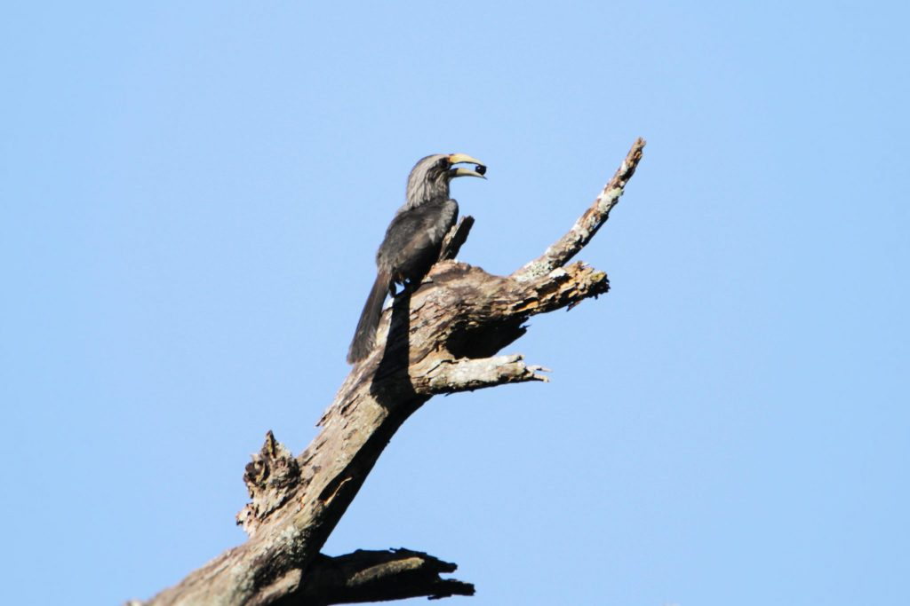
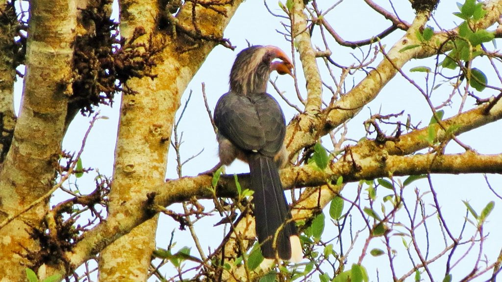
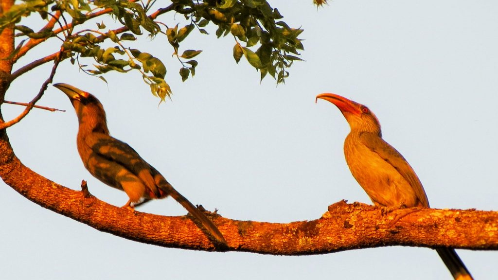

Indian shade grown coffee plantations harbor a number of trees both introduced and native. Beneath the canopy of these forests one can find a wide array of birds. The most noticeable, is the Malabar Grey Horn bill which is an endemic species of the Western Ghats. Their loud distinctive alarming calls at the break of dawn in search of berries and at dusk, when returning to their nests, makes easy identification of these birds. Horn bills need large, dense forests to survive. In simple words they are indicators of a healthy forest ecosystem.

Horn bills are often referred to as the “Farmers of the Forest “. Their diet mainly includes fruits. Since these birds are known to fly distant places in search of food, they also help in seed dispersal of many heterogeneous specie’s of trees. A very important aspect of seed dispersal is that it consumes the seeds of many native species of forest trees and throw them out through the mouth after the digestive enzymes act on the outer coat of the seed inside the stomach. The acids and digestive juices helps the tough outer coating of the seed to soften and aids in germination during monsoon period. Hence Horn bills in particular are guardians of nature and help in plant reproduction of forest trees which otherwise would be difficult to propagate in commercial nurseries which only deal with a few variety of commercial trees. In almost all cases, that we have noticed, Horn bills are choosy and picky, when it comes to its diet. They only eat fully ripe fruits and in case they have picked up a semi ripe fruit, they will spit it out. The fruit selected will be swallowed whole.

### Seed Dispersal Agents

At Joe’s Sustainable Coffee Farm, we have observed the behavior of Malabar Grey Horn bills for over 2 decades. The best time to spot these horn bills is at around 6.30 am when they leave their nests and fly out in search of food. Also at dusk, preferably at 5.00 pm on wards they return to their nest. The best place to spot these birds is the Fig trees and Erythrina trees. Apart from these trees, they can also be spotted in other fruit trees like guavas, Eugelina jamboolona and jack. But their diet is not complete without beetles, lizards, crabs and other crustaceans and small snakes. We have also noticed that Horn bills are long distance flyers and always on the lookout for food. Once they locate the fruiting trees they feast on the fruits and these seeds are spat out several hours later in different locations along their flight path. This seems to be an effective way of seed dispersal.

### Unique nesting behavior

Horn bills pair for life and also share parenting responsibility equally. The nesting period is quite risky for the female and spans for three to four months.

Importance of Fig Trees as Keystone species

Figs are considered a “keystone” species because they are so important to the animals of the rainforest. This is so because figs bear fruit several times a year.

Darren Naish (2015) an expert on Horn bills in his research publication, The ecology and conservation of Horn bills: Farmers of the Forest has this to say. To quote “Horn bills are specialized frugivores, able both to ingest huge quantities of fruit in a short period of time and (almost certainly) to successfully capture and metabolize the very low protein concentrations present in many of the fruits they eat. Fruits are so crucial to horn bills that Kinnaird and O’Brien (2007) discuss fruit diversity and biology, and the importance to horn bills of the species concerned, at length. In keeping with other studies on tropical ecology, figs are emphasized as a keystone resource, searched for and utilized by frugivores even when other fruits are available (it should be noted that figs contain over 750 species, over 500 of which occur within the Asian horn bill realm). Despite their efficiency as processors and digesters of fruit, horn bills still need to consume 60 – 600 g of them per day, quantities equivalent to 20– 33% of their body weight (Kinnaird and O’Brien 2007)”.

### Decline in Population

In recent years the increase in horn bill population inside coffee forests has been solely due to the proactive conservation measures initiated by the Planting community. However, in the early ’70 s and 80‘s as a consequence of intense habitat destruction, fragmentation and conversion of Arabica plantations into Robusta Plantations, the horn bill population has significantly declined.

### Consequences

A significant decline in the population of Horn bills will proportionately impact the germination of many native or indigenous species of trees, the seeds of which only germinate after passing through the digestive tract of horn bills.

### Conclusion

In recent years the coffee landscape is changing. Tall evergreen trees are replaced by exotic trees which bear no fruit but yield timber because of their quick growth. As a matter of fact, fruit bearing trees are replaced for timber producing trees. A few decades back, many Planter’s chopped down the fig trees in order to accommodate white cedar, red cedar and silver oak. The only reason being, lack of timber value. This resulted in a significant decline in the endemic Malabar grey horn bill population. The present generation of Coffee Planters has understood the value of an integrated ecosystem that benefits both man and animals. Another important aspect that is gaining importance is the certifications like Rain-forest Alliance, Woods certification which pay a reasonable premium to coffee’s that are grown under the canopy of trees. Carbon credits by way of safeguarding forest trees is also gaining momentum. Hence, the future of Horn bill conservation is in the safe hands of the Planting community.

### References

Anand T Pereira and Geeta N Pereira. 2009. Shade Grown Eco friendly Indian Coffee. Volume-1.

Bopanna, P.T. 2011.The Romance of Indian Coffee. Prism Books ltd.

The Ecology and Conservation of Asian Hornbills – Farmers of the Forest Hardcover – 2008 by Margaret F Kinnaird (Author), Timothy G O′brein (Author).

Darren Naish (2015) The ecology and conservation of Asian hornbills: farmers of the forest, Historical Biology: An International Journal of Paleobiology, 27:7, 954-956, DOI: 10.1080/08912963.2014.919757

[The ecology and conservation of Asian hornbills](http://dx.doi.org/10.1080/08912963.2014.919757)

[Hornbills: Connecting environment](http://www.conservationleadershipprogramme.org/project/hornbills-in-bhutan/)

[Hornbills farmers of our forests](http://www.thehindu.com/todays-paper/tp-in-school/hornbills-farmers-of-our-forests/article3278676.ece)

[Hornbills: Connecting environment, economy](http://www.conservationleadershipprogramme.org/project/hornbills-in-bhutan/)

[Farmers](https://www.deccanherald.com/content/656544/farmers-forest.html)

[Farmers of the forests](http://www.thehindu.com/sci-tech/energy-and-environment/farmers-of-the-forests/article4348200.ece)

[India has more environmental conflicts](http://www.thehindu.com/sci-tech/energy-and-environment/india-has-more-environmental-conflicts-than-any-other-country-in-the-world/article24066709.ece)

[Hornbills:- the Bucerotiformes](https://www.earthlife.net/birds/bucerotiformes.html#1)

[Strangler Figs](http://www.blueplanetbiomes.org/strangler_figs.htm)

[Malabar grey hornbill](https://en.wikipedia.org/wiki/Malabar_grey_hornbill)