We have often tried to stimulate the imagination of both the Planting Community as well as the Scientific Community by writing a series of articles on various topics which includes Biodiversity, Plant health and Nutrition, Ecosystem conservation, Mechanization, Composting, Soil health and Water conservation that has a direct bearing on Eco-friendly Shade Coffee.

[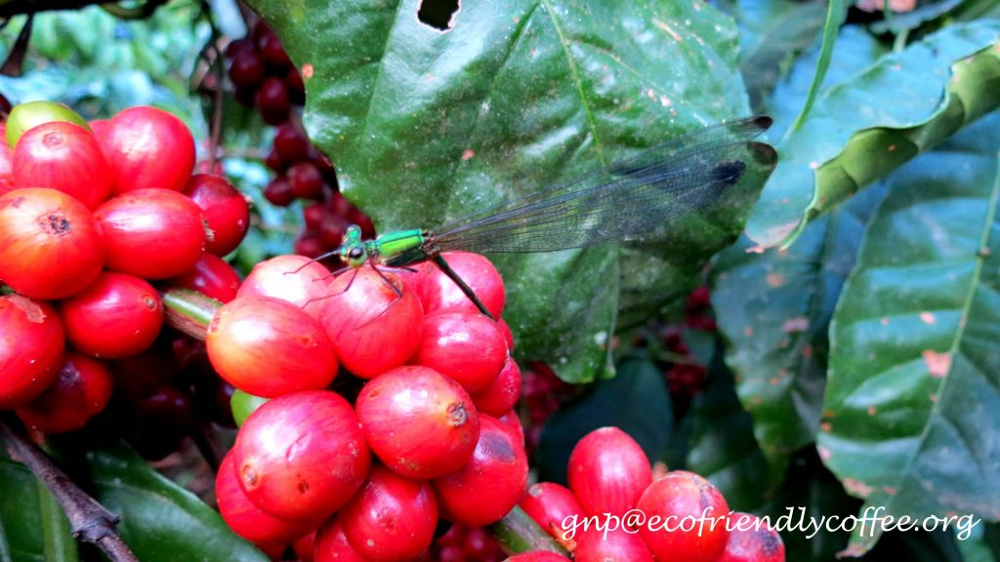](http://ecofriendlycoffee.org/?attachment_id=3049)

This particular article on Damselflies is very different in the sense, it helps the Coffee Community and researchers to unlock the mysteries associated with Damselflies and use them as a tool in accessing the ecological integrity of the Coffee Ecosystem. They are helpful to detect levels of heavy metals such as mercury. They are also considered model organisms to assess the effects of global climate change.

When one goes deep into the subject, it is easy to understand that Damselflies occupy an important place in the ecosystem, as do all the forms of life. The damsel fly are small insects and come in a variety of species.

[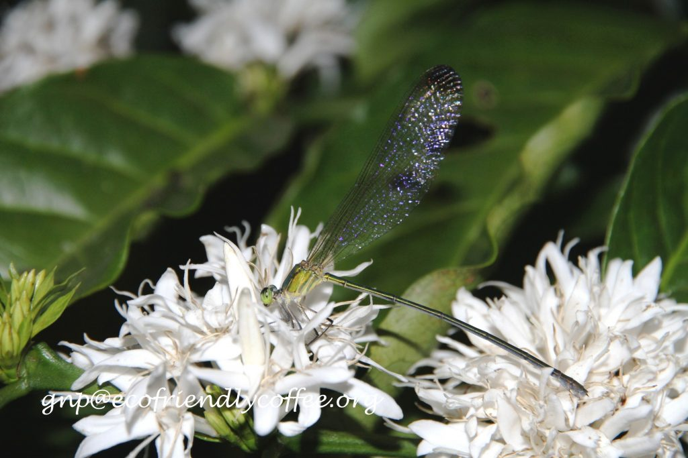](http://ecofriendlycoffee.org/?attachment_id=3050)

The larvae of Damselflies live and develop in water and are ferocious predators of midge larvae and small invertebrates. Some species take up to 4 years to develop before climbing up waterside vegetation to metamorphosise into adults. The adults have beautiful delicate wings and fly short distances.

Many Developed Countries use Damselflies routinely for monitoring water quality because their presence and diversity can be valuable indicators of the health of the aquatic environment.

[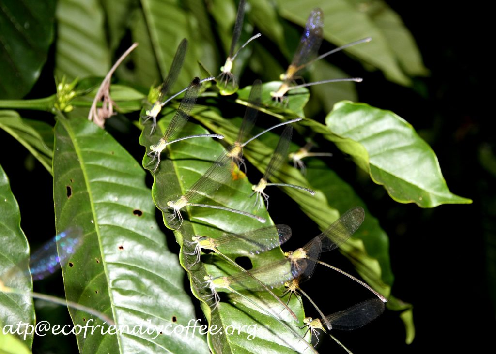](http://ecofriendlycoffee.org/?attachment_id=3051)

To begin with, the Coffee Planters need to understand that Damselflies have been around for more than 200 million years. Review of literature states that Damselflies also mean Good luck, and Prosperity.  The adult Damselflies are insects with wings commonly observed in all Agro climatic regions where coffee is cultivated. The immature stage of Damselflies is commonly referred to as the nymph stage.

Once the female has laid her eggs in the water they will generally hatch after 2-5 weeks. Sometimes though, when they have laid there eggs in the late summer the eggs will go into a diapause (which is when the growth period is suspended over the winter month’s then hatch in the spring because it is too cold in the winter time. If that does happen the larva will remain a larva for around 1 to 4 years. When the larva is finally ready it will come out of the water, usually on a long strand of grass or a reed, and moult off the old skin and become an adult.

[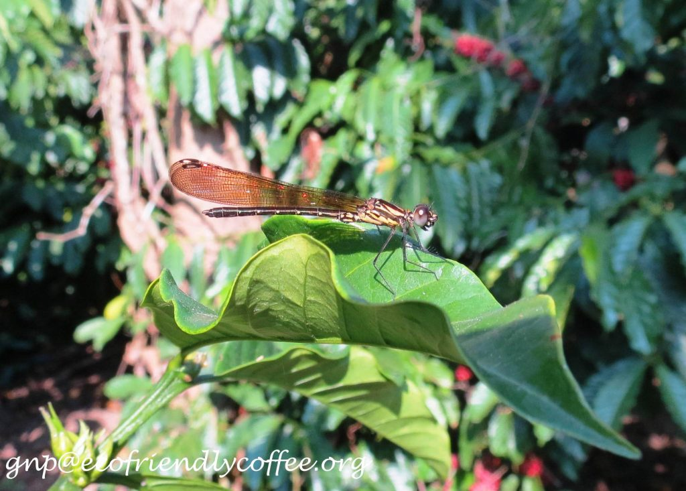](http://ecofriendlycoffee.org/?attachment_id=3052)

These nymphs prefer to live in unpolluted fresh water habitats, especially in streams, and rivers where there is a good amount of flowing water. They can only live in clean water and good habitats free of pollution. All damselflies are known to lay their eggs inside plant tissues; those that lay eggs underwater may submerge themselves for 30 minutes at a time, climbing along the stems of aquatic plants and laying eggs at intervals.

[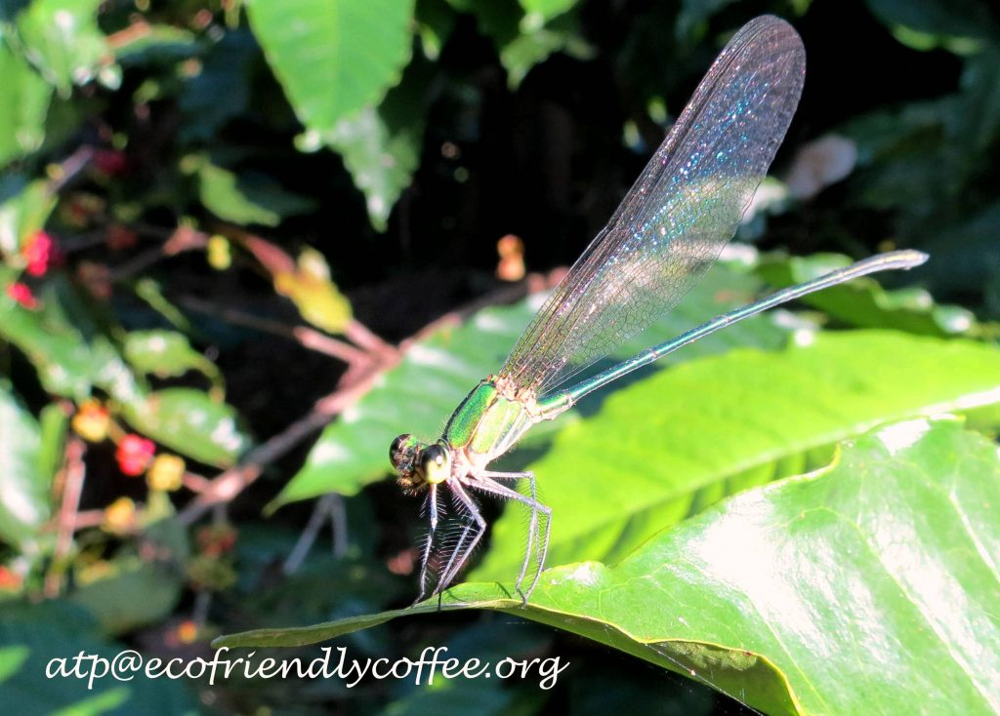](http://ecofriendlycoffee.org/?attachment_id=3053)

[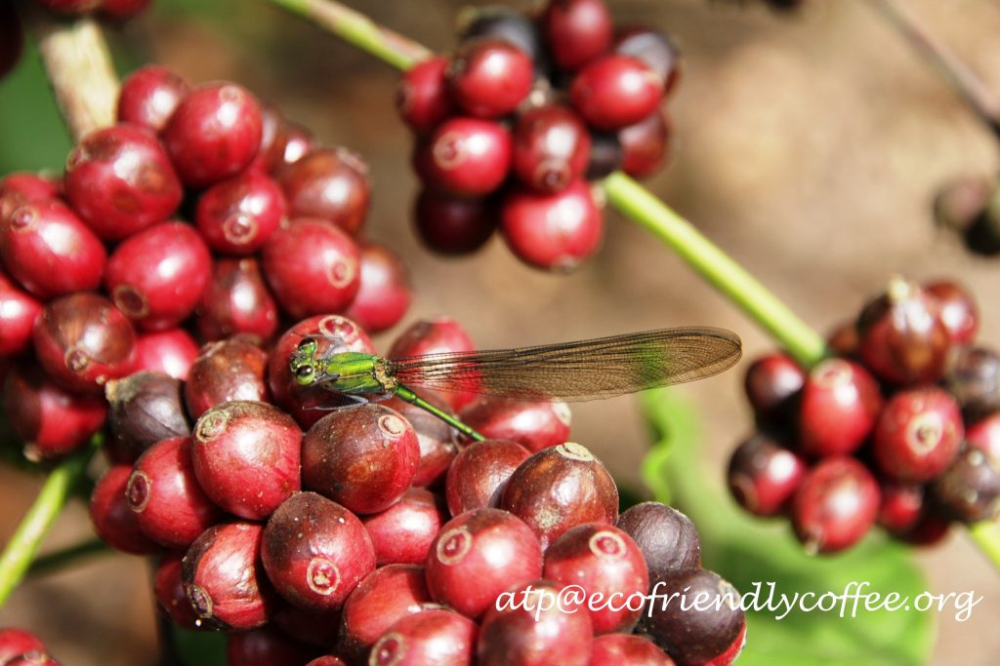](http://ecofriendlycoffee.org/?attachment_id=3054)

### **Easy way of Understanding Damsel fly**

Kingdom

Animalia

Phylum

Arthropoda

Class

Insecta

Order

Odonata

Common Name

Damsel fly

Scientific Name

Zygoptera

Found

Worldwide

Diet

Omnivore

Size

1.8-4.5cm (0.75-1.6in)

Number of Species

5300

Average Lifespan

Few weeks

Conservation Status

 Not Threatened

Colour

Green, Brown, Tan, Grey, Black, Yellow

Skin Type

Shell

Favourite Food

Small insects

Habitat

Forest and woodland close to water

Average Litter Size

1,000

Main Prey

Small invertebrates, Larvae, Tadpoles,Beetles

Predators

Birds, Rodents, Reptiles

Special Features

Elongated  body and large wings

Ecofriendly Shade Coffee

Ideal habitat conditions

Excellent Indicators

Water Pollution

Threat to Coffee

No

Advantages

Plays a critical role in the Food Chain

[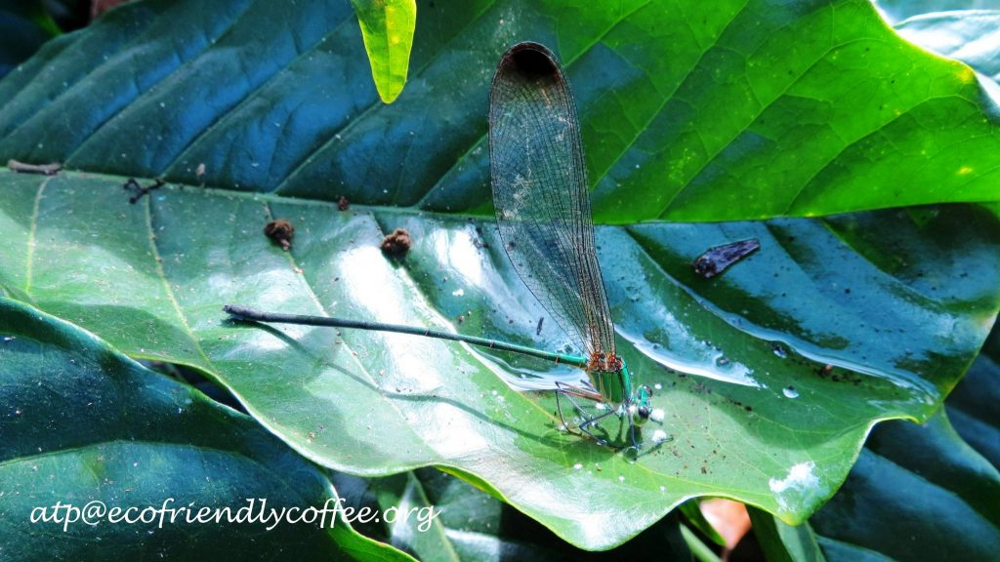](http://ecofriendlycoffee.org/?attachment_id=3055)

### Implications

The Shade grown three tiered Coffee ecosystem in India is undergoing tremendous transformations. Many experiments are under way to open up shade, remove the lower canopy and in some cases knocking out shade altogether. The idea is to shift from traditional shade Coffee and go in for high density planting and provide adequate water requirements through drip irrigation and fertigation. There is no doubt that this monoculture sun loving coffee will require high doses of synthetic fertilizers and various other chemicals, which will ultimately percolate to water bodies like ponds, streams, rivulets and lakes running through the coffee plantations. This will have a profound impact on human health as well as environmental impacts associated with expanded use of inorganic chemicals.

[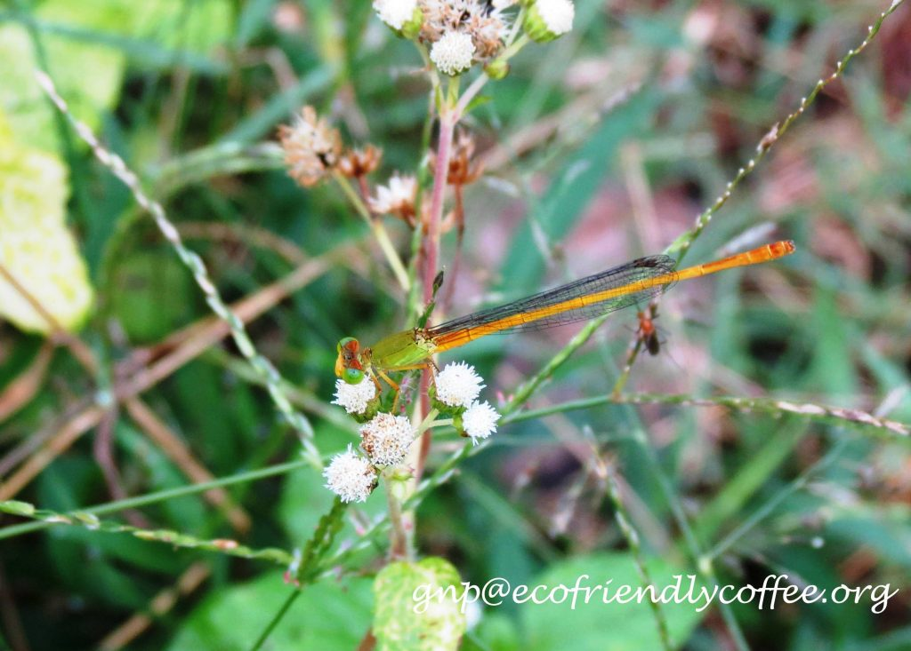](http://ecofriendlycoffee.org/?attachment_id=3056)

Developing simple yet highly reliable bio indicator kits with the help of nymphs of mayflies to understand the water quality will go a long way in monitoring the pollution levels and the quality of water to meet the various requirements of coffee.

### Lifespan

Adult Damselflies are short lived, from a few weeks to a several days, depending on the species.

[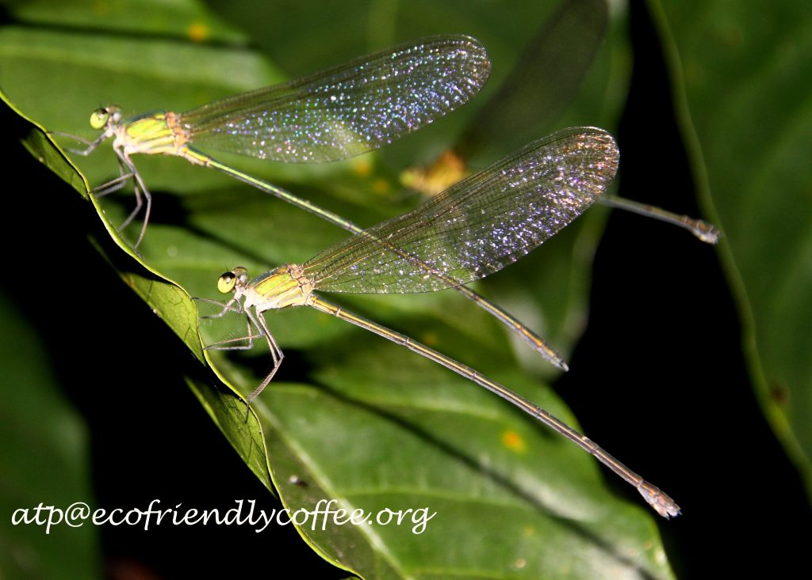](http://ecofriendlycoffee.org/?attachment_id=3057)

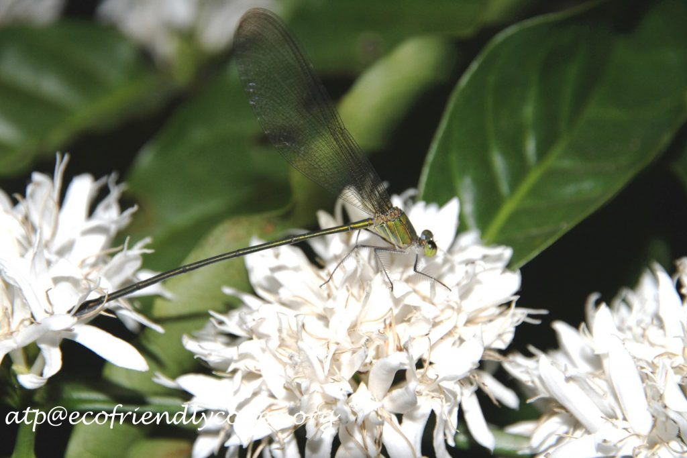

[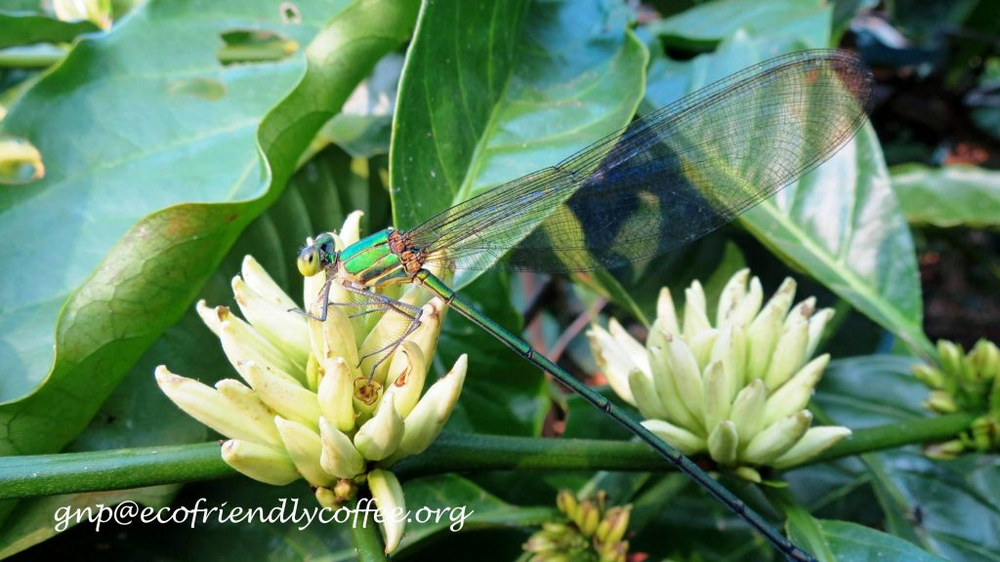](http://ecofriendlycoffee.org/?attachment_id=3059)

###  Economic Importance

-   They are important for the food web.
-   Help in understanding Change in micro habitat and land use
-   They serve as a source of protein for many other creatures.
-   They are excellent indicators of pollution.
-   They help in the break down and recycling of organic matter that enters water bodies through external sources.
-   Important components of nutrient and energy pathways.
-   Help in water purification by filtering large amounts of particulate nutrients from water.

### Conservation

Over 5300 species of damsel fly are known worldwide, grouped into over 309 genera. In the Western Ghats, 174 odonate species have been reported out of which 107 belong to the dragonflies and 67 are damselflies. As per the review of literature, very little work has been carried out with respect to the monitoring of Damselflies inside shade coffee. The immediate research that needs to be carried out pertains to the diversity, distribution and ecology of Damselflies in different Coffee Agro Climatic conditions.

[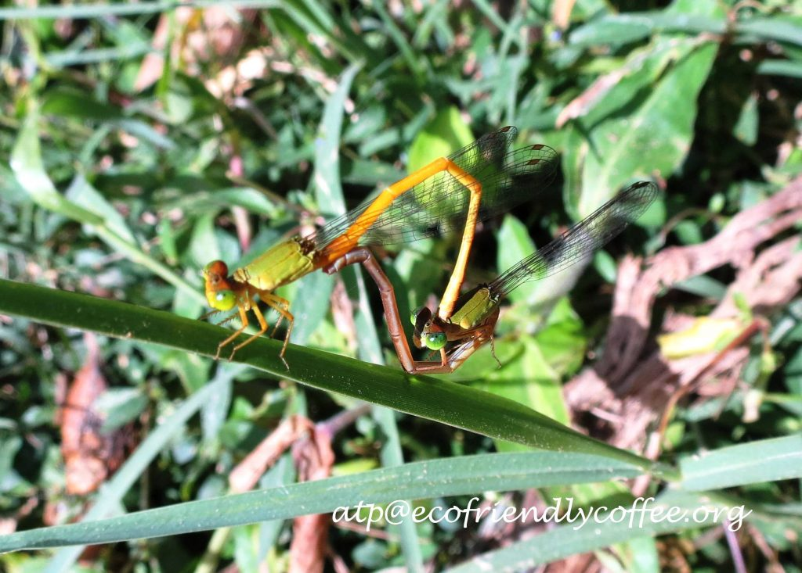](http://ecofriendlycoffee.org/?attachment_id=3061)

### Conclusion

Many advanced Countries make use of the Nymph of Damselflies in water sampling used for bio monitoring procedures. Damsel fly taxa are widely accepted as bio indicators for water quality .We request the Scientists at the Coffee Research station to formulate protocols so that the Planting Community will be benefitted in using Damselflies as indicators of water quality. After all water quality is of paramount importance to the Coffee Planters because water is used every day either for spray, sprinkling, drinking or for pulping apart from human and livestock needs.

[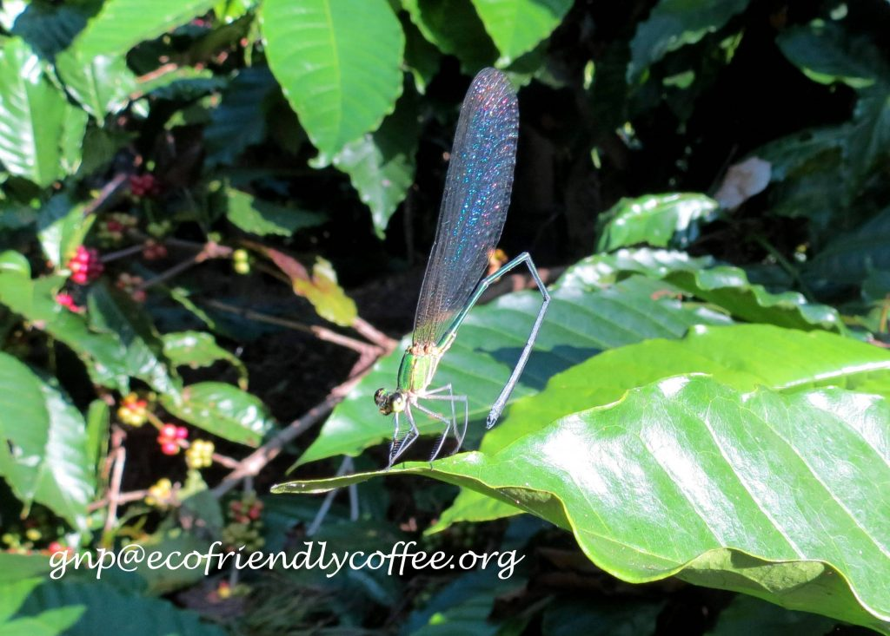](http://ecofriendlycoffee.org/?attachment_id=3062)

### References

Anand T Pereira and Geeta N Pereira. 2009. Shade Grown Ecofriendly Indian Coffee. Volume-1.

Bopanna, P.T. 2011.The Romance of Indian Coffee. Prism Books ltd.

[Animals](https://a-z-animals.com/)

[Damselflies](http://www.encyclopedia.com/topic/Damselflies.aspx)

[Damselfly](https://en.wikipedia.org/wiki/Damsel fly) – Wikipedia

[Interesting facts on dragonflies and damselflies](https://web.archive.org/web/20180726190717/https://dragonfliesanddamselflies.wikispaces.com/Interesting+facts+on+dragonflies+and+damselflies)

[Ecology and Conservation of Dragonflies and Damselflies](https://web.archive.org/web/20190413023702/http://xerces.org/ecology-and-conservation-of-dragonflies-and-damselflies/)

[Damselfly](http://www.newworldencyclopedia.org/entry/Damselfly) – New World Encyclopedia