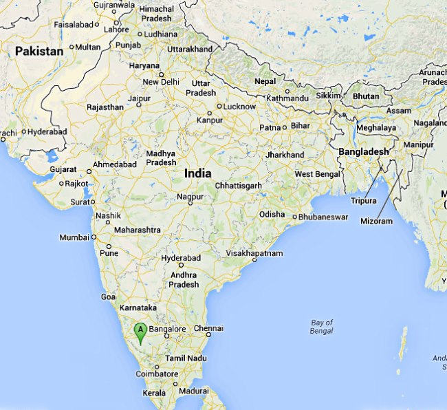
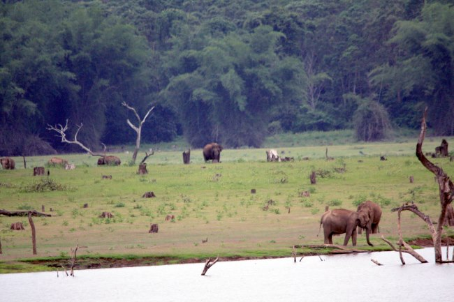
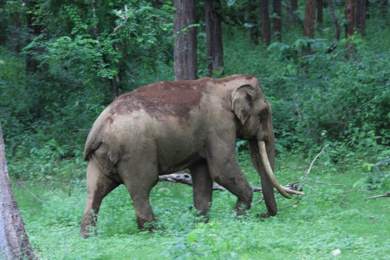
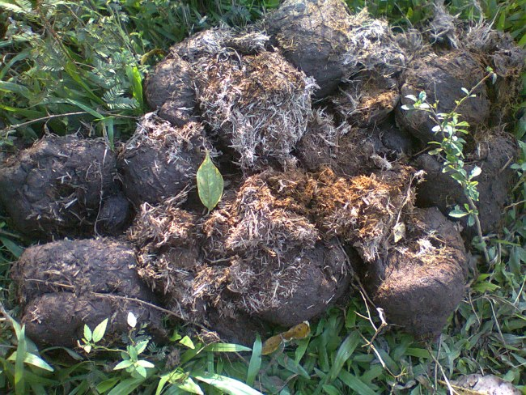
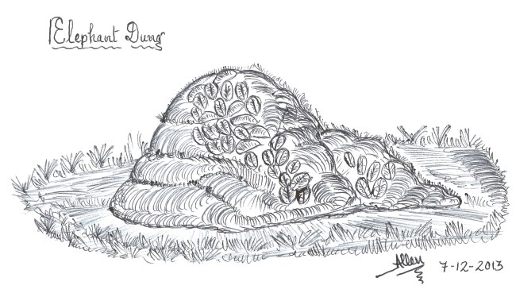
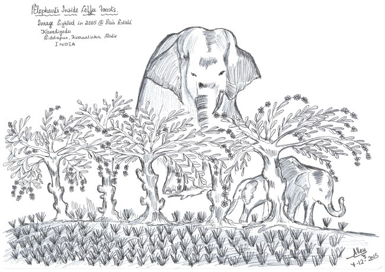
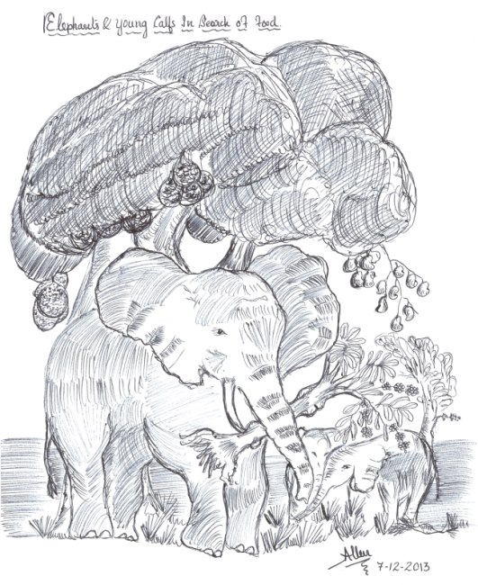
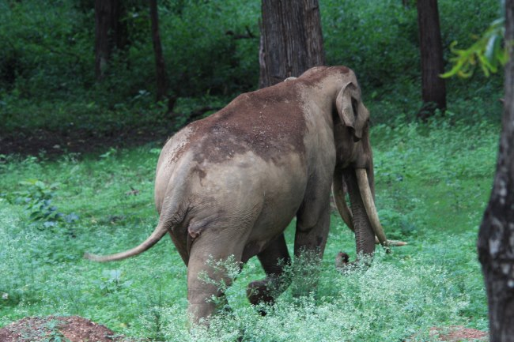
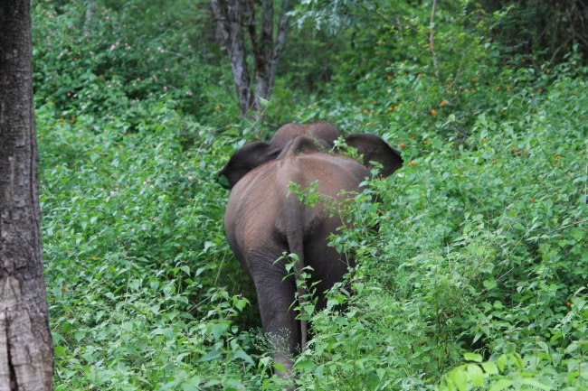

We own a small coffee forest in the foothills of the Western Ghats in a tiny Hamlet of Siddapur, Coorg, also called Kodagu by the locals. Our coffee Plantation, commonly referred to as Providence estate (PAIS-Estate) is unique for a number of reasons. The main highlight of the plantation is that it acts as a migratory corridor for a number of different species of wildlife, particularly the Asian Elephant. It is no surprise to locate a dozen or so wild elephants either taking shelter within the confines of the coffee forest or lazily spending an afternoon playing in the irrigation pond.

We have been so very used to the wild elephants that we often call each by name and are proud that our Plantation is providing a safe sanctuary to these gentle giants. For over a number of years we have tracked the behavior of these elephants and other wildlife and have come to a few startling conclusions.

First and foremost, the small herd of elephants that make use of the right of passage through the plantation, actually do not destroy the Plantation but cause minor damage to the coffee bush. However, if the Plantation consists of multi crops like areca nut, tapioca, banana, fruits and vegetables, then the damage is significant. Especially, this is true during the times of drought.

It is our view point that the presence of elephants within the confines of the coffee forest and their behavior of chewing the ripe and semi ripe coffee beans which in turn passes through their digestive tract should be exploited for the mutual benefit of both the coffee grower as well as in conserving the elephant habitat.

It is a good idea, to extract the coffee seeds from elephant dung coffee beans and analyze the cupping quality and certify the same to enable the Planter to receive some sort of premium for the beans he grows, so that in the long term both the planter and the elephant benefit. A proactive approach will enable an coexisting ecosystem to survive for the mutual benefit of all.

In times of drought Asian Elephants are attracted to Coffee plantations as many of them are well irrigated and the Elephants are drawn towards the various available fruits, Coffee beans are easily available in Robusta or Arabica plants as they are larger in number with less effort in relation to the plant height.

Coffee growers/farmers have a very big responsibility to keep the Elephants away from the plantation and seldom it’s a very expensive affair, Coffee growth and production value then do not match the anticipated profit margin. Coffee farmers annually go through a period of loss in relation to maintaining the plants.

These beans along with the Plant leaves are consumed by the Elephants and they expel out the pulped half-digested beans through the form of dung, in some parts of Asia these coffee beans that come out in the form of dung are processed and [sold](http://abcnews.go.com/Business/elephant-dung-coffee-smooth-rich-expensive/story?id=18730668) with a branded name.

The Indian elephant follows strict migration routes that are determined seasonally. The eldest elephant of the Indian elephant herd is responsible for remembering the migration route of its herd. This Indian elephant migration generally takes place between the wet and dry seasons and trouble arises when farms dot the migratory routes of the Indian elephant herds, as the Indian elephants causes a great deal of destruction to the newly planted farmland and existing land.

The Indian elephants are herbivorous animals, they only eat plants and plant matter in order to gain all of the nutrients that they need to survive. Indian elephants eat a wide variety of vegetation including grasses, leaves, shoots, barks, fruits, nuts and seeds, they are very fond of cultivated crops like sugar cane, banana, and routs. Indian elephants often use their long trunk/tusks to assist them in gathering food.

An elephant calf born at a particular Coffee farm will remember the location of birth throughout its lifetime and will ensure it will visit the location seasonally, and these indication are seen and experienced. The Elephants follow the same route pattern as a daily routine to find their food, unfortunately the route lies inside a coffee farm and that is where a coffee farmer has no option but to let the Elephants continue their routine process, at the same time accept the losses as part of a Coffee farming process. The entire process of the Elephant finding food through its normal route ends with the Coffee farmer losing annual crop.

I dedicate this article to the Company I previously worked Weatherford Drilling International Pty. Ltd (Australia), My dear Friend Dr. Anand Titus Pereira & Errol Pais Please refer to the below articles that reflect similar thought.

[ecofriendlycoffee.org/coffee-forests-a-gateway-to-wildlife/](http://ecofriendlycoffee.org/coffee-forests-a-gateway-to-wildlife/)

[ecofriendlycoffee.org/coffee-forest-symbiosis/](http://ecofriendlycoffee.org/coffee-forest-symbiosis/)

[ecofriendlycoffee.org/coffee-hotspots-an-inventory-of-biodiversity/](http://ecofriendlycoffee.org/coffee-hotspots-an-inventory-of-biodiversity/)

[ecofriendlycoffee.org/human-elephant-conflict-inside-coffee-forests/](http://ecofriendlycoffee.org/human-elephant-conflict-inside-coffee-forests/)

[ecofriendlycoffee.org/monkey-chewed-coffee-beans/](http://ecofriendlycoffee.org/monkey-chewed-coffee-beans/)

[ecofriendlycoffee.org/toddy-cat-coffee-beans/](http://ecofriendlycoffee.org/toddy-cat-coffee-beans/)

[ecofriendlycoffee.org/coffee-forests-and-wildlife-credits/](http://ecofriendlycoffee.org/coffee-forests-and-wildlife-credits/)

[ecofriendlycoffee.org/coffee-forests-and-green-national-accounts/](http://ecofriendlycoffee.org/coffee-forests-and-green-national-accounts/)

Anand T Pereira and Geeta N Pereira. 2009. Shade Grown Ecofriendly Indian Coffee. Volume 0ne.

Bopanna, P.T. 2011. The Romance of Indian Coffee. Prism Books ltd.