Coffee Plantations are uniquely positioned in the fragile Western Ghats. These lush and verdant biodiverse mountains are filled with surprises. They have only revealed a part of the mystery and today scientist’s world over are trying to unlock the hidden secrets associated with the coffee mountains.

Evolution has deliberately created a fundamental niche which makes up the character of the coffee mountain, where in one species does not compete for food and space with the other. In fact all the biotic partners participate in creating a healthy coffee forest. Each plantation is distinct from the other in terms of flora and fauna. Coffee plantations are a tropical paradise with abundant sunlight.

Millions of plant cells with the photosynthetic pigment, chlorophyll act as factories converting solar energy into chemical energy. This is one of the key drivers in the sustaining power of planet earth. Somehow, over the years we have had an uneasy relationship with the coffee forest; Technology has been the driving force behind modern day plantations.

The present day coffee farmers are aggressively turning towards chemical inputs in the hope of maximizing returns in a short span of time. Trapped by economic necessity, coffee farmers are ready to abandon traditional wisdom and pump in pesticide and poisons to get better yields.

Pollution is spilling into the forest floor. This relationship cannot last forever. In the long run there is more damage caused to the ecology of the region and it not only affects the coffee plantation, but the flora and fauna of the region in a number of ways. If this trend continues into the future, it is bound to leave permanent scars in this delicate landscape.

Ultimately, the stability of the relationship between coffee and forests is an accurate health barometer for all other biotic communities inside the coffee mountain. Luckily, MYCORRHIZAE has the capacity towards a gentle interaction with several plant species in providing the necessary stability and nutrient uptake.

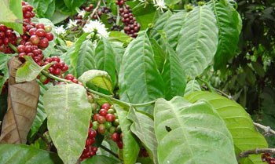

### Role of Phosphorus

Phosphorus is a key element in the establishment of new plantations and in the productivity of established plantations. However, in tropical countries where coffee is cultivated, phosphorus is often the limiting nutrient. The scientific truth is that the coffee soils contain abundant phosphorus, but most of it is fixed and unavailable to the plant.

However, the coffee mountain is blessed with MYCORRHIZAE which provides a host of benefits to the surrounding biotic community in the uptake of soil phosphorus and other nutrients. There are two main kinds of mycorrhizae, namely ecto and endomycorrhizae. The general term for all mycorrhizae types where the fungus grows within cortical cells of plants is termed ENDOMYCORRHIZAE. This article throws light on only the endomycorrhizae { endotrophic } .

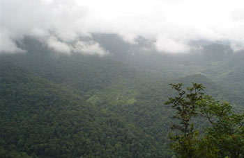

### Mycorrhizae

Mycorrhiza literally means plant roots infected with fungus (FUNGUS ROOTS). It is derived from a Greek word: MYKES-meaning fungus or mushroom and RHIZA -meaning root. This natural relationship was first observed by the German scientist A.B. Frank in 1885. It involves a mutualistic relationship between two partners, namely the fungus and roots of plants.

The plant supplies the nutritional requirement of the fungus like amino acids, carbon and vitamins and the fungus in turns aids the plant in the nutrient uptake. This unique association has a tremendous bearing on coffee forests and the amazing biodiversity. In fact researchers are of the opinion that more than 90 % of all plant species in the world have one or the other mycorrhizal association. Hence, it is easy to name a few species of plants which lack the fungal association. At times the plant species involved is called the host and the fungal partner, the microsymbiont.

The mycorrhizal association is of a very highly specialized nature where both the partners derive benefit from one another. One important point that has to be borne in mind is that mycorrhizae are not soil microorganisms, but one which are associated with the roots of plants.

This complex behavior has been little understood, but the benefits, already exploited in commercial agriculture. The endomycorrhizae fungus establishes itself intracellularly with the mycelium linking the cells of the coffee root and the surrounding soil. The fungus initially grows only between cortical cells and over a small period of time penetrates the host cell wall, but the most important point to bear in mind is that neither the plant cell wall or fungal cell wall are breached.

Infact, the host cell wall invites the fungal mycelium and accommodates it by forming an invagination inside the cell and then envelopes it. A new compartment is formed inside the host cell where efficient nutrient transfer takes place between the fungus and plant cell.

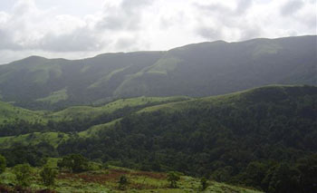

Endomycorrhizae are found in species of the family of angiosperms and certain pteridophytes and bryophytes. The fungi involved in endomycorrhizae belong either to Phycomycetes or to Basidiomycetes. Arbuscular mycorrhizae have well defined specialized structures known as ARBUSCULES which aid in the transfer of nutrients from the soil complex to the root, through a direct linkage. Arbuscules are commonly referred to as little trees because of their highly branched structures.

Vesicles are also produced which help in storage of nutrients. They can also serve as reproductive propagules for the fungus. Arbuscules are short lived, not more than fifteen days and makes it that much difficult for collection in the field. The criteria to differentiate arbuscular mycorrhizae are based on spore characteristics. Five genera namely, Glomus, Gigaspora, Acaulospora, Sclerocystis and Endogone have been recognized.

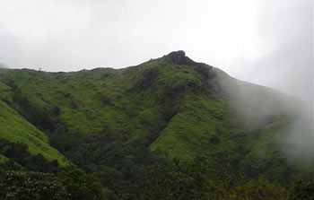

### Characteristic Features of Vesicular Arbuscular Mycorrhizae

1.  Presence of vesicles and arbuscules in the root cortex.
2.  Presence of inter and intracellular hyphae in root cortex.
3.  Fungal mycelium found both inside the root and the surrounding soil.
4.  Presence of resting spores.
5.  Presence of large number of bacterial endosymbionts associated with fungal spores.

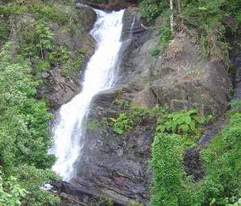

The key element for the establishment of coffee plantations has been the availability of phosphorus in the available form. However, the characteristic feature of tropical coffee plantation soils is phosphorus deficiency. To augment this limitation the governments import synthetic fertilizers like super phosphate and diammonium phosphate which are not only very expensive but also highly sensitive to high temperatures.

A significant amount of these fertilizers is lost at the time of application either by volatilization or by leaching into ground water or by fixation. Secondly, Coffee Plantation regions in India are characterized by heavy rainfall resulting in fertilizer runoff. This transport of synthetic fertilizers along with precious soil to river beds is catastrophic leading to pollution.

Soil erosion is a destabilizing factor in all agro ecosystems. Hence, the establishment of both old and new plantations is based on the accumulation of organic matter, humus and leaf litter on the floor of the coffee forest.

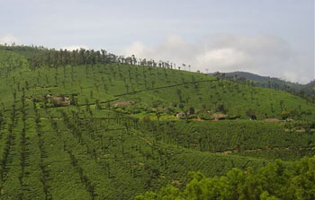

### Significance of Shade Grown Coffee

In the Indian context, SHADE GROWN COFFEE makes all the difference to the microbial ecology of the entire coffee zone. It literally provides a hotbed for the proliferation of billions of beneficial microorganisms. This is due to the fact that the floor of the coffee farm is littered with thousands of tons of BIOMASS in the form of leaf litter, organic wastes, humus, which are acted upon by mycorrhizae and converted into energy rich compounds required for maintaining the sustainability of the farm.

Mycorrhizal roots are known to break down lignin and cellulose and constantly supply nutrients to the coffee plants as well as to the surrounding biotic community. Mycorrhizal roots are known to assimilate phosphate more readily than in the roots not having the fungus. Without the crucial role played by microorganisms, the entire coffee belt would be a desert of the future.

The starting point of any healthy ecosystem is the abundant availability of either raw material or biomass. Luckily the coffee plantations have huge reserves of both due to the fact that any Arabica plantation has a standing tree population of approximately 200 trees per acre and in Robusta , around 50 to 75 trees. These trees belong to different species and on an average the diversity of species is approximately 50 different types.

In addition these tree species shed their leaves during different times of the year thereby providing a constant supply of leaf litter for microbial degradation. Death and decay of the trees also adds to the organic matter content of the soil, which in turn is recycled. Most importantly, the biodiversity of the region with thousands of species of shrubs, herbs, climbers with short lifespan are again a rich source of nutrients for microorganisms which improve water and nutrient uptake.

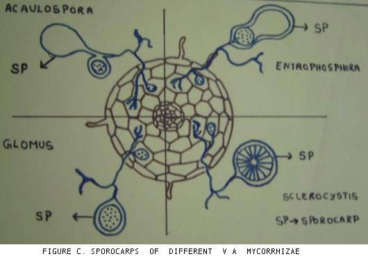

### Mycorrhizae and Joe’s Sustainable Farm

Experiments carried out at Kirehully Joe’s Sustainable farm have shown mixed results with field application of mycorrhizae. Mycorrhizae applied to coffee, pepper, and citrus nurseries show better establishment and survival rate compared to the uninoculated nurseries. However, mycorrhizae applied to 25 to 30 year old coffee plants show no significant increase in yield when compared to uninoculated plots.

These results may throw light on the establishment of native mycorrhizae which has a high survival rate compared to the introduced species. Also, the native species have had the chance to acclimatize themselves to the hardships of nature and accordingly adapted to the coffee farm conditions. This observation has a tremendous bearing on how coffee farmers run their farms. They need to isolate microorganism’s right from their farm and mass multiply it with appropriate technical know-how from agriculture Universities or biotech industries.

The second observation is that commercially available mycorrhizae can be applied to nurseries, because the density of the inoculum per square inch of soil is extremely high, there by enabling the microsymbiont to rapidly establish and multiply itself under favorable weather conditions. Hence, nurseries generally respond favorably to mycorrhizal application.

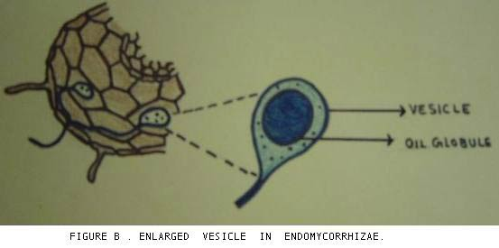

### Benefits of Mycorrhizae

1.  Plants infected with mycorrhizal fungi have the increased capacity to take up nutrients From deficient soils, often essential for plant growth and development.
2.  Induces drought tolerance and enhanced uptake of water.
3.  Resistance to pest and disease incidence.
4.  Aid in the uptake of immobile nutrients like phosphates, calcium, sulphur, zinc and Micronutrients.
5.  Stimulates branching of roots and thereby increased surface absorption of roots.
6.  Protects plants from high soil temperature shock.
7.  Plants are protected from chemical poisoning, soil toxins, metal toxicity and extremes Of pH.
8.  In areas where roots cannot penetrate, the fungal mycelium derives nutrients from Inaccessible areas and transfers it to the plants.
9.  Quick establishment of young plants in soils having low phosphorus availability.
10.  Mycorrhizae inoculated nurseries have increased germination percentage and better Survival rate.
11.  Aid in recolonizing soils that are barren of vegetation.
12.  Plays a key role in organic matter decomposition and formation of soil aggregates.
13.  Transfer of nutrients which is bidirectional is very efficiently done without loss of Leaching or competition from other soil microorganisms.
14.  Mycorrhizal establishment is more pronounced in soils low in nitrogen and Phosphorus.
15.  Production of extracellular enzymes and beneficial plant hormonal effects.
16.  Stimulate beneficial microorganisms like nitrogen fixing rhizobium, Azotobacter and Phosphate solubilizers in the rhizosphere region.
17.  Tripartite symbiosis in nitrogen fixing plants.

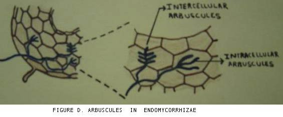

### Mycorrhizae and High Temperatures

Even though tons of biomass is available inside the plantation, due to high summer temperatures, the rapid biodegradation results in poor quantities of organic matter and humus on the floor bed. This poses further problems for the coffee bush, because in summer the plant requires the maximum amount of nutrient supply for growth and development. In such situations mycorrhizae come to the rescue of the coffee bush by not only conserving nutrients but also supplying the nutrients in the available form.

We are of the opinion that the greatest contribution of mycorrhizae is not in the conservation of nutrients or making the availability of phosphorus in P deficient soils, but by its unique mechanism of supplying the plant directly the nutrients, without getting into the soil system. Evolution has a large role to play in this sophisticated mechanism. However, for some reason if the pathway of transfer of nutrients was from the soil system, then most of the nutrients would be lost by way of leaching or fixation.

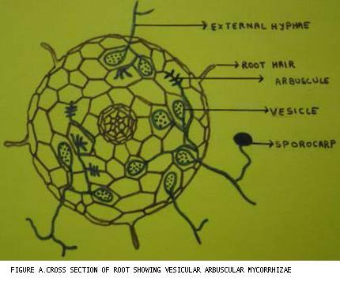

Modern day coffee farmers employ the slash and burn method of cultivation. This method spells disaster for the future, because the high temperatures during burning kill most of the beneficial microorganisms. In such situations the coffee farmer completely relies on the synthetic fertilizers for the rapid establishment of the plantation. Such areas can be reclaimed by the artificial inoculation of mycorrhizae.

### Mycorrhizae and Synthetic Fertilizers

It is true that the pen is mightier than the sword. What took millions of years to evolve can be nullified by the stroke of the pen. We are simply stating that in the present competitive world of farming the watchword is exploitation towards maximizing returns. Further this builds pressure on the scarce natural resources and the mind easily gives way for chemical inputs which reduce the population of beneficial microbes.

Research data from all over the world has clearly indicated that with increased application of synthetic fertilizers, the mycorrhizal activity is reduced and the plant ceases to derive benefit from the mycorrhizae. In absence or presence of low levels of fertilizer, the benefits of the mycorrhizal association are maximum.

### Constraints

The vesicular arbuscular mycorrhizae have so far not been cultured in the laboratory as a pure culture. These fungi are obligate symbionts. Hence mass multiplication of the fungus in pure culture forms is ruled out. The only way out for the mass multiplication of the inoculum for field application is by growing the fungus with suitable hosts like Sudan grass, Rhodes grass or guinea grass. This root soil mixture can be easily applied to nurseries but production of bulk quantities required for field applications is difficult.

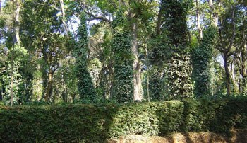

### Conclusion

The world is witnessing an exponential growth of human population in the DEVELOPING countries. A time will soon come when the population will be unmanageable and insupportable. The chilling specter of Food security itself is at threat and acts as a weapon for Governments both at the local and International level. Production of food grains and plantation crops has increased many folds putting undue pressure on the land and natural resources.

At the same time we need to deeply understand that the earth’s resources are a SINGLE RESERVOIR for all kinds of life. Man has from the very beginning of civilization tried to dominate nature. It is this one sided domination in part which has over the years, resulted in poor judgment in taking care of the precious natural resources. We need to be aware that evolution does not tolerate second best and the damage caused to both forests and coffee, due to human intervention will be irreversible.

We have to have a new approach in relearning nature’s simple ways. It is easy to combine the best of nature as well as the best of farming as long as we do not cross the sacred line of intimidating nature’s resources. In fact, in spite of three consecutive years of drought, the coffee mountain has found the resources to sustain itself. This in itself is a testimony to the resilience of nature. In the 21st century there is indeed place for time tested ancient traditions.

Solutions for a better world are found hidden in the sacred coffee mountains. Every farmer should be convinced that it is in his interest that the mountain needs to get an upper hand so as to balance nature’s resources. Mycorrhizal associations give nature a unique chance to recover. Ultimately, the solutions come from the land itself. As time is running out to save the coffee parks we are desperately trying to bring our ideas into life with ecofriendly measures that support biodiversity and habitat restoration.

The authors wish to express their profound gratitude to:

-   Anil D’souza , coffee planter , St. Antony’s Estate , Coove post , Mudigere taluk , Chikmagalur District for sending in the digital pictures of the Western Ghats and coffee habitat.
-   Dr. Smitha Hegde. Ph.D. Assistant Professor, Post Graduate Department of Biotechnology, St. Aloysius College, Mangalore-575003 for providing valuable inputs.
-   Madhumathi. M . MSc Microbiology. Lecturer ,Post Graduate Department of Biotechnology , St. Aloysius College , Mangalore- 575003 for the detailed drawings.

### References

[Bio-fertilizers for Coffee Plantations](http://ecofriendlycoffee.org/bio-fertilizers-for-coffee-plantations/)

[Organic Matter Decomposition In Coffee Plantations](http://ecofriendlycoffee.org/organic-matter-decomposition-in-coffee-plantations/)

Rangaswami . G and Bagyaraj, D. J. 2001. Agricultural Microbiology. Second edition. Prentice-Hall of India Private Limited. New Delhi.

Subba Rao. N.S. 2002. Soil Microbiology (fourth edition of soil microorganisms and plant growth) Oxford and IBH Publishing CO. PVT. LTD. New Delhi.

Paul. E.A. and Clark. F. E. 1996. Soil Microbiology and Biochemistry. Academic Press.

Eugene. W. Nester , Evans. C. Roberts and Martha . T . Nester. 1995. Microbiology- a human perspective. WM.C. Brown Publishers.

Allen. M. F. 1991. The ecology of mycorrhizae. Cambridge studies in ecology. Cambridge, U.K.

Atlas, R.M. and R. Bartha. 1993. Microbial Ecology : Fundamentals and application. Third edition. Benjamin/Cummings Pub. Co. New York.

David. M. Sylvia. 2002. Mycorrhizal Symbioses ( chapter 18 ). In Principles and applications of soil microbiology. Edited by David M Sylvia, J.J. Fuhrmann, Peter G Hartel and David A Zuberer. Prentice Hall. Upper Saddle River, NJ 07458

Miller, R.M . and J.D. Jastrow. 1992. The role of mycorrhizal fungi in soil conservation. In Mycorrhizae in sustainable agriculture. Edited by Bethlenfalvay .G.J and R.G. Linderman. ASA special publication number 54. American Society of Agronomy. Madison,Wis.

Johnson. N. C. 1993. Can fertilization of soil select less mutualistic mycorrhizae. Ecol. Appl. 3 : 749-757.