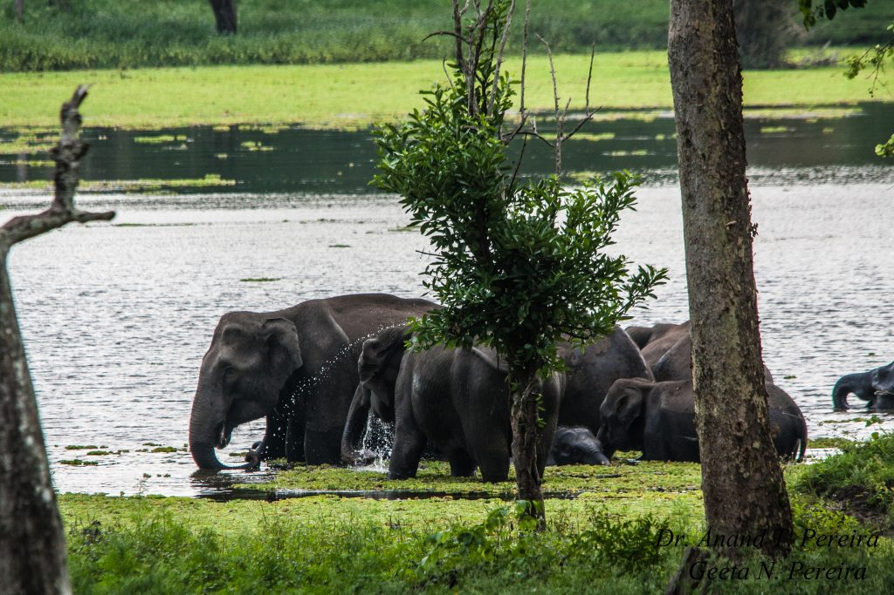
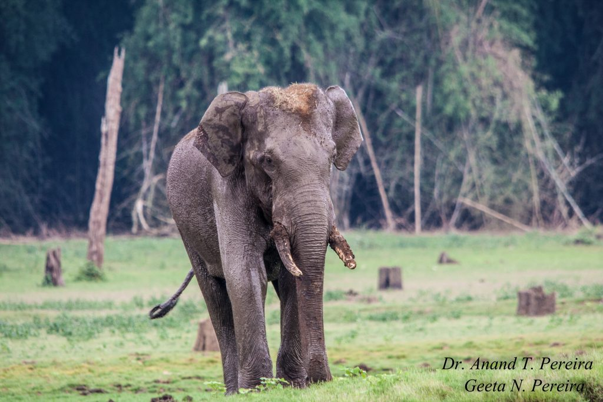

The Western Ghats, one of the eight HOTTEST HOT SPOTS of biodiversity is one of the largest unbroken pieces of forest. These magnificent chains of mountains and forests are the last few places on the planet where one can watch nature express itself. These forest ranges are home to wildlife sanctuaries and biodiversity coffee plantations. The western ghat range acts as a key breeding landscape for elephants, and other megafauna. Indian coffee is a proud partner of this biosphere reserve and plays a pivotal role in providing **unrestricted migratory corridors** to elephants.

 This article highlights the conflict between Coffee Planters and the Gentle Giants, in the confines of the coffee gardens of Kodagu, Hassan and Chikmagalur Districts.

It is important to understand that the home of the elephants is the tropical evergreen forests (**NOT COFFEE FORESTS**). We need to comprehend that Elephant populations cannot sustain themselves in a fragmented and discontinuous forest range within the evergreen forests.

### **Elephant Migration**

Unlike most other mammals, elephant migration consists of a series of migrations in the quest for food. This migratory map is passed on by the matriarch to subsequent generations through the trials of life.

### **Elephant Diet**

Elephants are known to spend about three-quarters of their time, day and night, selecting, picking, preparing and eating food. An adult elephant in the wild will eat in the region of 100 to 200 Kg (220 to 440 lb.) of vegetation per day depending on the habitat and the size of the elephant. The number of plant species eaten by anyone elephant may vary but it is likely to be more than fifty.

### **Why are Elephants Shifting Base To Eco-friendly Shade Coffee Plantations?**

Wild elephants are increasingly shifting base from the floor of the forest and taking sanctuary inside shade grown eco-friendly coffee plantations because their Forest habitat is being continuously depleted. The forest department has absolutely no vision and foresight in preparing a road map for the survival of these endangered Gentle giants. Without proper research and scientific temperament the forest department went on a spree of planting exotic tree species of Mangium, Acacia and Mesopsis which do not produce edible fruits, but on the contrary, release alkaloids into the soil that is detrimental to the ecological integrity of the forest soil. The leaves of these exotic species, release alkaloids, that are not easily biodegradable and do not allow grass to grow under the canopy of the forest trees. Because of this irresponsible decision, vast tracts of our pristine evergreen forests of the Western Ghats have become Acacia and Mangium deserts, driving away, Elephants out of their home. In the end analysis, the endless search for food is the beginning of the conflict. The best way out would have been for the forest department to plant bamboo, and indigenous fruit trees, such that the forest provides, elephants for nourishment, all year through.

### **ECO-FRIENDLY COFFEE**

The fact of the matter is that Monocropping is the exception in Indian coffee Plantations. The rule is a range of simultaneously growing crops like cardamom, Areca nut, Ginger, Orange, Citrus, Vanilla, cocoa, tapioca, and a few other spices are grown as multiple crops inside the Coffee Plantations. Jack fruit trees are native to coffee.

Rice and bananas are commercially grown in the valleys. Most of these crops are not only ideal food for the elephants but more important, **crops with higher nutritive content and palatability.**

These multiple crops act as powerful magnets attracting herds of wild elephants into eco-friendly coffee farms. This leads to negative interactions between humans and elephants, commonly referred to as the **“HUMAN ELEPHANT CONFLICT”.** While 17 of the 40 elephants in Sakleshpur were shifted following a court order, some seven years ago, there are 65 jumbos in the region now. The perennial problem, spanning more than a decade, has alarmingly increased due to the pandemic, where elephants freely crisscross plantations in the absence of vehicular traffic.

Twenty Five human deaths per year are caused by elephant attacks in Sakleshpur, Coorg and Chikmagalur, coffee Plantations, making it a human-elephant conflict hotspot. Loss of human life and crop damage is a burning issue in as many as 300 villages in these coffee-growing Districts. Unfortunately, this conflict rages throughout the year because plenty of food is available on the plantation due to the cultivation of multiple crops.

As we are writing this article, the gentle giants, dime a dozen have visited our coffee Plantation and have raised 22 yielding coconut trees to the ground. All in, just one night.  It took us 20 years to nurture these trees because coconut trees in the Malnad is very slow-growing and take 15 years to produce economic yield. Yet, we don’t blame the gentle giants. Our respect and concern, far outweigh the losses.

Another heartbreaking news is that our good Planter Friend, A Coorgi, who owns a Plantation a few kilometres from ours, was trampled to death, right in front of his own house. Analysis of past cases also shows that most of these fatal encounters took place between 6 a.m. to 10 a.m. and 4 p.m. to 8 p.m. ‘Peak hours’ for movement are the same for humans and elephants: elephants enter the plantations in the evening and hurry to safe hideouts in the morning, often seeking cover in coffee bushes. Once inside the first row of coffee, they stand like statues without batting an eyelid. Anyone passing by is lifted by the trunk and tossed like a football.

### **Why!**

Mistakes have been done in the past both by the Forest Department and Planters. Planting of exotic no fruit yielding trees, Forests cut down, when they had to be protected, Homestays built, squarely in Elephant corridors. Construction of unscientific dams and hydel projects, submerging crucial feeder zones rich in grass and bamboo.

### **Direct Impact of Human-Elephant Conflict on Coffee Planters**

The Forest Department and the Coffee Planters were caught off guard when elephants started establishing a permanent base inside shade coffee. Due to the elephant menace, Resident Coffee Planters bear the brunt of the impact due to the economic loss of multiple crops. Local communities and the rural poor bear much of the costs because it results in eliminating the livelihoods of the unskilled workers. Added to this, the impact leaves a permanent scar in terms of negative effects on human, social, economic and cultural life among all stakeholders.

### **Solutions** **help mitigate human-elephant conflict**

Radio Collaring the Matriarch and sending SMS Alerts to coffee Planters on herd movement.

Solar fencing by the Forest Department and not by Planters

Relocation of Matriarch’s in forests with the low elephant population

Advocating the use of Bee boxes in hot spot areas (Elephants are afraid of bees)

Exploring the setting up of more elephant migratory corridors on a scientific principle and not based on political outlook.

Setting up Elephant camps such as the Dubare Elephant Camp in Coorg. Captured elephants can be sent to such camps.

Trenching has been extensively carried out but we are not in favor of the same, because it does not serve the purpose.

Periodical lectures on Wildlife and area-specific wildlife conflict, so as to educate the Planters on the behaviour of wildlife. (Elephants can communicate with another herd 5 miles apart by simply tapping their feet on the ground)

Instead of compensation, the government gives ex gratia which is highly unscientific. While the amount shall be processed under Sakala, the ex gratia payment is subject to the availability of funds. Until this date, close to about Rs 1 crore is pending.

### **The Elephant Whisperer**

After reading a few books and research articles on Elephant behavior, we have adopted a new strategy, taken from the South African Elephant Whisperer. Lawrence Anthony, an internationally acclaimed elephant conservationist, tried to communicate with the matriarch Elephant with his tone and gestures, which eventually calmed them. Over a small time frame, he started to bond with them and take care of them. This made people refer to Anthony as the ‘Elephant Whisperer.

Today at Joe’s Eco-friendly Coffee Plantation, we try to replicate the strategy adopted by Lawrence Antony.

Today at Joe’s Eco-friendly Coffee Plantation, we have not only kept a few gates permanently open, exclusively for the safe passage of elephants, but we also, wake up each morning and whisper out loud saying…..Gentle Giants, you are most welcome to our plantation. We will provide safe passage but please take care of our safety and the safety of our workers. Eat fruits but do not uproot the trees. Well, is this strategy working….Only the passage of time will reveal.

### **Elephants & Communication**

Most elephant communication is through touch, visual signals, and sub-sonic rumbles that can travel over the ground faster than sound through air.

### **Elephants & Water**

Elephants love water and cool off during the summer, half-submerged in pools of water. They also love to swim as it gives their joints a break with the buoyancy they get from water. However, most coffee Planters are puzzled as to why the Elephants damage pump sets installed near lakes and ponds. Our observation and understanding of elephant behavior point out the fact that these incredibly intelligent mammals, understand that their precious source of water during the peak summer season is under threat because planters pump out the water to irrigate their coffee. Hence to safeguard their water supply they destroy the pump sets.

### **Conclusion**

We have witnessed widespread conflicts between elephants and humans inside eco-friendly coffee Plantations. These conflicts are often very complex and poorly understood.

Our observations ( 20 years) point out to the fact that the conflict is getting out of hand resulting in the destruction of crops on one side and the death and decline of these magnificent gentle giants on the other. Human-elephant conflict remains prevalent as the majority of existing prevention strategies are driven by site-specific factors that only offer short-term solutions. We need to ensure that efforts to manage human-wildlife conflicts are pursued through well-informed, holistic and collaborative processes that take into account underlying social, cultural, and economic contexts.

### **References**

Anand T Pereira and Geeta N Pereira. 2009. Shade Grown Ecofriendly Indian Coffee. Volume-1.

[What is forest degradation](https://www.worldwildlife.org/stories/what-is-forest-degradation-and-why-is-it-bad-for-people-and-wildlife)

#### Deforestation in India: Consequences

[Human-Elephant Conflict](https://www.frontiersin.org/articles/10.3389/fevo.2018.00235/full)

[Assessing impacts of human-elephant conflict](https://journals.plos.org/plosone/article?id=10.1371/journal.pone.0239545)

[A quantitative assessment](https://journals.plos.org/plosone/article?id=10.1371/journal.pone.0253784)

[Human-elephant conflict: Jumbo](https://www.thenewsminute.com/article/human-elephant-conflict-jumbo-suspected-be-poisoned-death-karnataka-144560#:~:text=CRYPTO-,Human%2Delephant%20conflict%3A%20Jumbo%20suspected%20to%20be,poisoned%20to%20death%20in%20Karnataka&text=However%2C%20the%20necropsy%20results%20seem,the%20female%20elephant%20in%20Januaryhttps://www.conservationindia.org/articles/man-elephant-conflict-and-its-mitigation-a-qa-with-sanjay-gubbi)

[The social dimensions of human-elephant conflict](https://www.iucn.org/sites/dev/files/import/downloads/hecugcarev.pdf)

[Human–Elephant Conflict in Sri Lanka](https://www.mdpi.com/2071-1050/13/15/8625)

[Assessment of human–elephant conflicts in multifunctional landscapes](https://www.sciencedirect.com/science/article/pii/S2351989420309239)

[Human-Elephant Confict around North and South Forest Divisions of Nilambur, Kerala](https://www.asesg.org/PDFfiles/2016/Gajah%2045/45-20-Rohini.pdf)

[Human-elephant conflict: Jumbo suspected to be poisoned to death in Karnataka](https://www.thenewsminute.com/article/human-elephant-conflict-jumbo-suspected-be-poisoned-death-karnataka-144560#:~:text=CRYPTO-,Human%2Delephant%20conflict%3A%20Jumbo%20suspected%20to%20be,poisoned%20to%20death%20in%20Karnataka&text=However%2C%20the%20necropsy%20results%20seem,the%20female%20elephant%20in%20January)

[Human-Elephant Conflict and its Mitigation](https://www.conservationindia.org/articles/man-elephant-conflict-and-its-mitigation-a-qa-with-sanjay-gubbi)

[Kodagu persistent Human-Elephant conflict, Karnataka, India](https://ejatlas.org/conflict/kodagu)

[With human-elephant conflict taking more lives](https://economictimes.indiatimes.com/news/politics-and-nation/with-human-elephant-conflict-taking-more-lives-on-both-sides-stakeholders-are-split-over-a-sustainable-solution/articleshow/68337524.cms) 

[Karnataka: ‘Fence of honeybees’ around village curbs elephant-human conflict](https://indianexpress.com/article/india/karnataka-fence-of-honeybees-around-village-curbs-elephant-human-conflict-to-be-replicated-in-other-states-7265013/)

[How a Karnataka town used SMS alerts to reduce human-elephant conflicts](https://scroll.in/article/915480/how-a-karnataka-town-used-sms-alerts-to-reduce-human-elephant-conflicts)