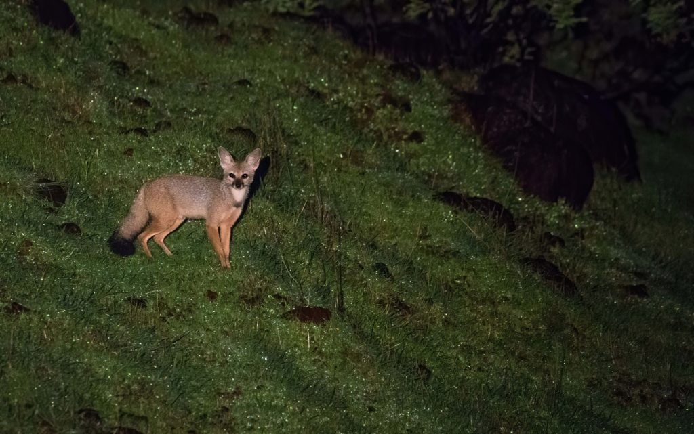

We often stress the importance of biodiversity conservation, irrespective of the diversity of habitats. May it be evergreen forests or grasslands, each ecosystem is unique and essential for the wellbeing of Planet Earth. Their use by wildlife will depend on the vegetation, height, density, and floral diversity. More importantly, Grasslands are not just important wildlife habitats but are also reservoirs of crop genes and the backbone of the livelihood of indigenous communities. This gene pool acts as germplasm, which can be used for developing new climate-resistant crop varieties.

Some may question our intention. And may ponder as to why we are focussing our attention on grasslands, shrublands, and open pastures. The answer lies in the problems of species and habitat declines, which biologists have noted over the last five decades. In fact, our observations point out to the fact that wildlife species are dramatically declining throughout the region. The question that we need to ask ourselves is, whether these declines occur due to evolution, natural events, global warming, or ones that have been influenced by human impact. We are open to admitting, that the coffee Planters are part of the problem because, today, In India, coffee Plantation expansion is encroaching into grasslands in a significant manner jeopardizing the native flora and fauna of these sensitive grassland ecosystems. Two things are important to note here. First, the change in the landscape because of the dominance of people in terms of housing pressure, special economic zones, and the Government vision of roads, airports, and rail networks. The second being the conversion of grasslands into coffee plantations.

This article throws light on a unique ecosystem, namely grasslands, tropical scrub forest, and stunted semi-evergreen forests, which are facing multiple threats due to land-use change by humans. These forest types are often termed wastelands and are neglected by both policymakers and public citizens, which makes them vulnerable to pressure, from human populations. However, new scientific studies throw light on these forest types as crucial links for people and wildlife to live in harmony.  
Grasslands support a variety of wildlife species. There can be up to 350 species or more comprising of mammals and birds, depending on the type of vegetation. One can spot the Indian grey wolf, the Bengal fox, Wild Cats, Rabbits, Indian Pangolin, Porcupine, wild boar, leopard, and many other species, yet to be discovered. A dynamic balance exists in wildlife species, in these borderline forests, depending on the season of the year.

These precious grasslands and scrub forests provide habitat for wildlife, in addition to carbon and water storage and watershed protection in improving the water table. (The earth’s land area covered by grasslands vary between 20 and 40 percent, yet, only a small percentage, less than 10 % is protected due to political and economic reasons.) Threats to natural grasslands, as well as the wildlife, include unsustainable agricultural practices, farming, grazing, and invasive species, illegal hunting, poaching, and climate change.  
The shared spaces between human beings and wildlife in such a delicately balanced ecosystem imply that the conservation of all species of wildlife in these sensitive areas has to be socially inclusive. Easier said than done, but strategies need to be worked out, without any bias, such that there’s a high degree of coexistence between Man and wildlife. As you browse through this article, you can understand that this harmonious relationship, indeed works and coexistence is a reality. Thanks to the wisdom of the locals and their deep understanding of wildlife.

Areas in and around Grasslands, coffee Plantations, and shrub forests are today making way for Special Economic Zone (SEZ) promoted by the Karnataka Industrial Development Corporation. (KIDC). It has since evolved into a major industrial hub.  
One interesting fact concerning the area in and around Hassan and Chikmagalur, the major coffee-producing Districts of Karnataka, is that in recent times the forest types are affected by the landscape change due to semi urbanization and agriculture. Human imprint is clearly visible due to the accelerated or unbridled development in terms of habitat loss due to expanding human activities. The land use is changing to housing, Industry, and agriculture. Tens of thousands of acres of grasslands and the scrub forest is giving way to rice and maize cultivation due to canal irrigation. Industry and housing are literally encroaching on wildlife habitats. The Government has no doubt earmarked thousands of acres towards housing, Industry, and airports are trying to find a balance between sustaining both human development and biodiversity.

The Coffee Belts in India, those situated in the state of Karnataka, is a classic example of a case study, involving a harmonious relationship between beast and man. The topography generally involves scrub forests, grasslands, low lying hills, valleys, rivulets, ponds, dams, and agriculture. The region receives moderate to high rainfall and the landscape is dotted with low lying hills and mountain ranges.  
How to address Human-Animal Conflict

From what we have observed over the years, the habitat around coffee zones is subjected to both high human impact zones where the industry is located and low impact zones where villagers border the wilderness zone and grassland habitats. In the past two decades due to housing all along the banks of rivers, thickets that were the favorite haunt of the lesser-known mammals have resulted in the disappearance of the jungle cat. As more and more land is transformed into commercial crops, it has impacted the carrying capacity of the ecosystem and has resulted in habitat degradation and disturbance of wildlife.

One time tested method accepted to address this problem, is to conserve separate areas as a Reserve for wildlife and develop other areas for human habitation and Industrialization. Yet another model, involves the merger of the two areas by developing small pockets of conducive habitats for wildlife within the newly developed zone. However, this model has been a total disaster because its implementation is not scientifically done. The success of this model rests heavily on first understanding the ecological behavior of wildlife.  
Farmers to the rescue of wildlife.

Farmers living in these borderline areas, make it a point to leave behind on purpose, their old livestock like bullocks/buffalos/sheep to graze in the transitional or fringe areas of the forest. This has been an age-old practice in the surrounding villages. This old livestock provides prey for leopards and other mammals. The understanding has gone a long way in mitigating human-wildlife conflict because leopards and other carnivores do not come and steal healthy livestock from farmers.

### Conclusion

In recent years, a number of scientific studies have revealed that grasslands and scrub forests contain multitudes of wildlife species that are uniquely adapted to live in; only such specialized habitats. Any man-made change can result in the disappearance of many of these species. The development comes at a huge cost. However, in certain instances it is inevitable, nor are we against development, but it needs to be properly planned and sustainable. The bigger threat is the indirect impact of urbanization on those landscapes. A proper scientific study will help wildlife, coexist with man, and conserve the unique grassland ecology.

### References

[Grasslands, explained](https://www.nationalgeographic.com/environment/habitats/grasslands/)

[Anyone Thinking About Planting Grasslands](https://www.kqed.org/science/1927097/to-fight-climate-change-grasslands-may-be-a-safer-bet-than-forests#:~:text=A%20new%20study%20from%20researchers,losses%20from%20fire%20or%20drought.)

[Grasslands and Climate Change](https://www.fs.usda.gov/ccrc/topics/grasslands-and-climate-change)

[Grassland Carbon Management](https://www.fs.usda.gov/ccrc/topics/grassland-carbon-management)

[Grasslands More Reliable Carbon Sink Than Trees](https://climatechange.ucdavis.edu/news/grasslands-more-reliable-carbon-sink-than-trees/#:~:text=A%20study%20from%20the%20University,forests%20in%2021st%20century%20California.&text=%E2%80%9CThis%20doesn't%20even%20include,increase%20carbon%20stocks%20in%20rangelands.%E2%80%9D)

[Can Grasslands, The Ecosystem Underdog](https://blog.nature.org/science/2017/01/17/can-grasslands-ecosystem-underdog-play-underground-role-climate-solutions/?src=e.nature.loc_b&lu=4096790&autologin=true)

[Grasslands among the best landscapes](https://uwmadscience.news.wisc.edu/ecology/grasslands-among-the-best-landscapes-to-curb-climate-change/)

[Can Grasslands](https://blog.nature.org/science/2017/01/17/can-grasslands-ecosystem-underdog-play-underground-role-climate-solutions/?src=e.nature.loc_b&lu=4096790&autologin=true)

[A Climate Change Solution](https://climatechange.ucdavis.edu/news/climate-change-solution-beneath-feet/)