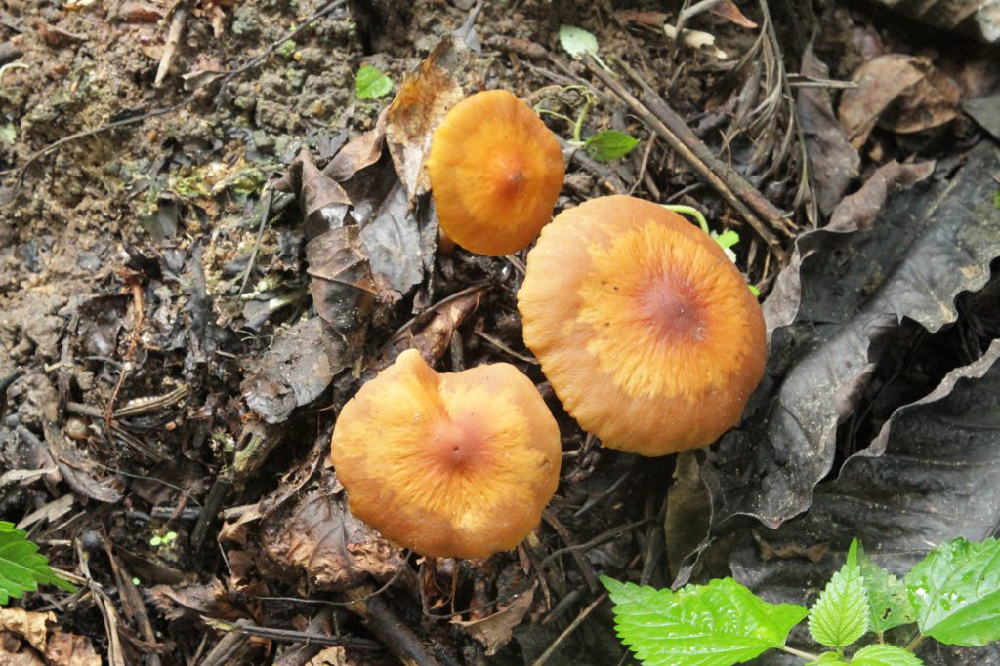
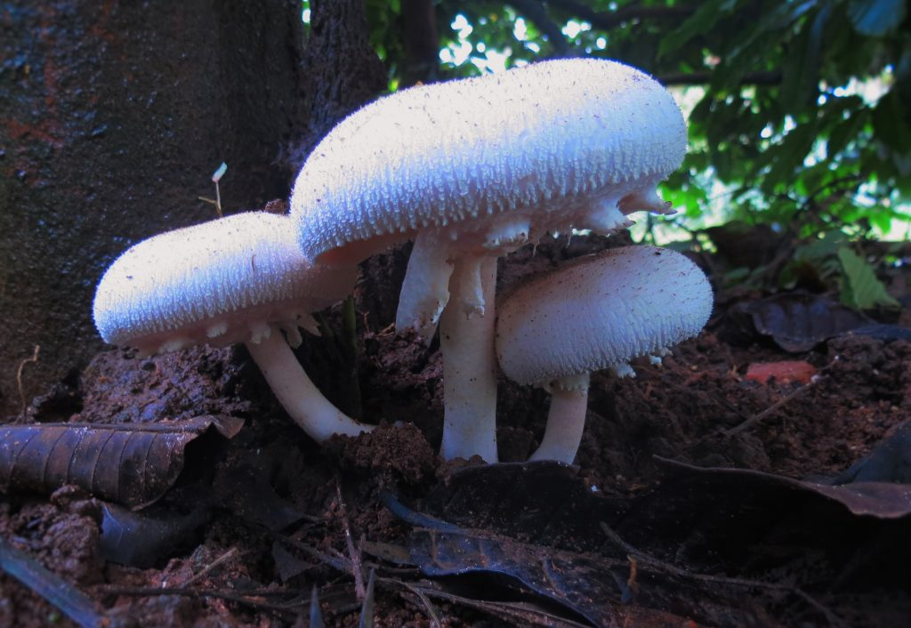

The bio-diverse Western Ghats forests, home to eco-friendly shade coffee are a treasure trove of mushroom biodiversity. Our research for the past three decades has clearly indicated that only a select few wild mushrooms have been identified and hordes of new species are yet to be discovered and classified. Shade-grown eco-friendly coffee plantations is known to harbour a wide population of heterogeneous trees consisting of semi-hardwood and hardwood species. Throughout the year, the shedding of leaves, both from trees as well as coffee bushes aids in the accumulation of biomass on the floor of the coffee forest. In addition, complex substrates, which are generated annually in huge quantities, are agricultural, and forest waste products and the introduction of compost. The high amount of rainfall precipitation spread over 8 months in a year helps in the germination of fungal spores. Luckily, for the coffee farmer, the thick cover of leaf biomass favours the growth and proliferation of fungi. Because of their large diameter and underground network of filaments, they contribute significant amounts of total microbial protoplasm, to the coffee soil economy.r  
Our knowledge of the physiological role underlying the variation in biomass inside coffee plantations is poorly understood, but we need to start with an understanding of the diversity of microbes that facilitate organic matter decomposition. The biomass accumulation at any given time is considered to be a strong driver of the capacity of the plantation to build a favourable environment for the growth and distribution of mushrooms. In this article, we are trying to highlight the proliferation of wild and native mushrooms inside coffee plantations and the harmful effects of consuming poisonous mushrooms.  
Mushrooms (fungi) are heterotrophic eukaryotic, mostly immotile organisms, which form their own kingdom alongside the animals and plants in the biological classification of life. They colonize dead or living organic substrata as saprotrophs, parasites, or mutualistic symbionts.  
Mushrooms are a special group of fungi. Fungi lack chlorophyll and consequently cannot use solar energy to manufacture their own food as do green plants. However, mushrooms do produce a wide range of enzymes that degrade complex substrates, following which they absorb the soluble substances so formed for their own nutrition. There are many types of mushrooms and usually cannot be differentiated from each other. The Mushrooms species are clearly influenced by altitude, type of vegetation, type of coffee forests (Robusta’s or Arabica), prevailing temperature, relative humidity, type of soil and amount of organic matter in the soil. Some of the dominant species of mushrooms collected belonged to the Boletaceae and Tricholomataceae families. Most of the wild mushrooms were associated with forest tree roots. Among the total number of mushrooms reported from India, only a very small percentage is poisonous or hallucinogenic.  
Although mushrooms were long appreciated because of their flavour and texture, and some for medicinal or tonic attributes, the recognition that they are nutritionally a very good food is much more recent. However, in nature, both poisonous and non-poisonous species of mushrooms exist in the world. The toxins involved in mushroom poisoning are metabolites produced naturally by the fungi themselves which differ from one species to the other.  
The worldwide diversity of mushroom species roughly accounted for 0.14 million. Of these, 14,000 are known and 7,000 are considered to have varying levels of edibility. More than 2,000 species are safe and 700 are documented to have considerable pharmacological properties. Depending on the type of mushroom, adverse effects range from mild gastrointestinal (GI) symptoms to major cytotoxic effects resulting in organ failure and death.

### TOXIC MUSHROOMS

Mushrooms are known to contain toxic substances. Many species produce secondary metabolites that are toxic in nature.

### PSILOCYBIN MUSHROOMS

These mushrooms are also referred to as magic mushrooms. They possess psychedelic properties. The cultivation of these mushrooms is governed by strict laws.

### Side Effects of Mushroom

Mushrooms can cause skin allergies. This can lead to skin rashes and skin irritation.  
Certain species of mushrooms known as Psilocybin mushrooms can induce a state of hallucination.(Psychoactive and hallucinogenic compound)  
A few species of mushrooms can result in loss of memory and can cause absentmindedness.  
After consuming mushrooms some people feel drowsy, tired and sleepy.  
Some people experienced such headaches for more than a day, after consuming mushrooms  
It is a known fact that mushrooms do not agree with all. It can cause stomach problems (Diarrhoea, nausea and vomiting.)  
The other stomach problems, which one might experience, are vomiting and cramping.  
Mushrooms also cause anxiety in certain people, which ranges from mild to extreme levels.  
Another common side effect of eating mushrooms is nausea.  
Some also experience nose bleeding, dry nose, dry throat, and other problems when they are taken in excess amounts.  
Many people experience unexplained feelings of euphoria in terms of a tingling sensation in their whole body. After some time people also experience being excited or depressed.  
Mental illness is the most serious side effect caused by mushrooms in certain people. Mental disorders, such as immense fear, panic attacks are experienced after taking mushrooms.  
It is generally recommended to avoid eating mushrooms during pregnancy.  
Mushrooms may make one feel hungry after intake. They contain tryptamines. These are chemicals that act like amphetamines (an addictive drug) and may stimulate one’s appetite. Mushrooms also contain ergot alkaloids.  
Certain species of mushrooms result in weight gain.  
Identification & care to be taken while picking and consuming wild mushrooms:  
During our treks, we collected various mushroom species and sent them to laboratories for identification. Mushrooms are present in all environments but their numbers are dwindling in rainforests. Throughout the world, over 38,000 varieties of mushrooms have been discovered, only about 3,000 are edible, about 700 have known medicinal properties, less than one per cent are recognized as poisonous, and only a select few are commercially grown on farms.

### Common poisonous mushroom species

Common poisonous mushroom species identified from Hills in South India are Omphalotus olivascens, Mycena pura and Chlorophyllum molybdites but human poisonings are uncommon as ethnic tribes are experienced in identifying poisonous from non-poisonous mushrooms. Worldwide, some of the poisonous mushrooms are amanita pantherina, entoloma and chlorophyllum molybdites.

### Conclusion

The risk involved in collecting and eating poisonous mushrooms is life-threatening. Hence it is imperative that a proper scientific understanding of mushroom ecology is a must. People with expertise in mycology should attempt to collect mushrooms from the wild since some varieties are toxic. A simple identification mistake can lead to symptoms of sweating, cramps, diarrhoea, confusion, and convulsions and potentially result in liver damage with a mortality rate of 60 per cent or higher. There are four types of mushrooms: saprotrophic, mycorrhizal, parasitic, and endophytic. While there are many different types of mushrooms within these categories, not all of them are edible. Secondly, we need to establish a database of all species of mushrooms found in all coffee agroclimatic regions of India and categorize them under different heads, like Beneficial, Medicinal, Harmful, etc.  The conservation of mushroom germplasm as a part of the conservation of the world’s biological diversity will also aid in finding better drugs to cure future diseases.

### References

Anand T Pereira and Geeta N Pereira. 2009. Shade Grown Ecofriendly Indian Coffee. Volume-1.

[Mushrooms: The velvety poison](https://www.researchgate.net/publication/283526941_Mushrooms_The_velvety_poison)

[Mushroom allergy](https://pubmed.ncbi.nlm.nih.gov/3278649/)

[\[Hallucinogenic mushrooms\]](https://pubmed.ncbi.nlm.nih.gov/16401965/)

[Mycobiology](https://www.ncbi.nlm.nih.gov/pmc/articles/PMC4206786/)

[Health Benefits Of Mushroom](https://www.lybrate.com/topic/benefits-of-mushroom-and-its-side-effects)

[https://www.betterhealth.vic.gov.au/health/healthyliving/fungi-poisoning](https://www.betterhealth.vic.gov.au/health/healthyliving/fungi-poisoning)

[MUSHROOMS: TRENDS IN PRODUCTION](https://open.unido.org/api/documents/4990567/download/MUSHROOMS%20-%20TRENDS%20IN%20PRODUCTION%20AND%20TECHNOLOGICAL%20DEVELOPMENT%20%2819581.en%29)

[Side Effects](https://www.lybrate.com/topic/benefits-of-mushroom-and-its-side-effects)

[10 Serious Side Effects](https://www.stylecraze.com/articles/serious-side-effects-of-mushrooms-on-your-health/)

[Mushroom Poisoning with Symptoms](https://www.researchgate.net/publication/303979941_Mushroom_Poisoning_with_Symptoms_of_Pantherina_Syndrome_A_Case_Report)

[Laetiporus sulphureus causing visual hallucinations](https://www.researchgate.net/publication/19773375_Laetiporus_sulphureus_causing_visual_hallucinations_and_ataxia_in_a_child)

[Mushroom allergy](https://pubmed.ncbi.nlm.nih.gov/3278649/)

[Psilocybin dose-](https://www.ncbi.nlm.nih.gov/labs/pmc/articles/PMC3345296/)

[Toxicological Profiles of Poisonous, Edible, and Medicinal Mushrooms](https://www.ncbi.nlm.nih.gov/labs/pmc/articles/PMC4206786/)