The Western Ghats, one of the eight HOTTEST HOT SPOTS of biodiversity is one of the largest unbroken pieces of forest. These magnificent chain of mountains and forests are the last few places on the planet where one can watch nature express itself. The kind of wild beauty in it; is something astounding to the eye. True wilderness still exists.

The exciting news is that these evergreen tropical forests are likely to be included in the list of world heritage sites (2009) by the United Nations. To date there are six natural heritage sites in India which include the Valley of flowers and Nanda Devi Biosphere reserve, Kaziranga National Park, Manas Wildlife Sanctuary, Sunderban and Keoladeo National Park.

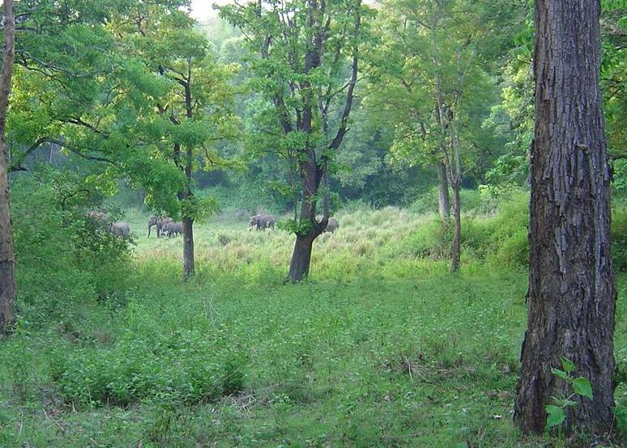

The western Ghat forest ranges are home to wildlife sanctuaries, National parks, Tiger reserves, and biodiversity coffee plantations. This range acts as a key breeding landscape for tigers, elephants, sambars, and other mega fauna. These spectacular Ghats comprising of mountain ranges, steep valleys, rivers, rivulets and pristine forests cover an area of about 160,000 square kilometers.

Indian coffee is a proud partner of this biosphere reserve and plays a pivotal role in providing unrestricted migratory routes for many migratory animals and supports their need for forage, food, shade and water during dry spells and act as a refuge for residential and endangered species.

The coffee forests in particular act as migratory corridors for the movement of elephant herds from one region to the other.

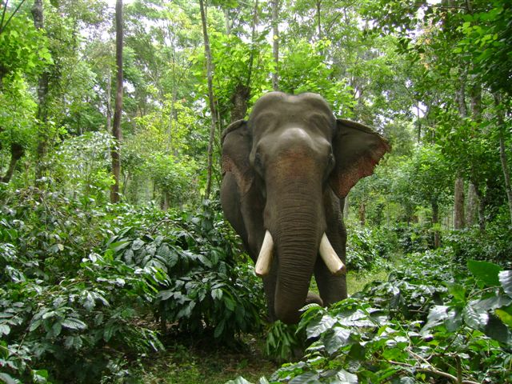

### CRITICAL PERIOD

In recent years there is a growing threat of human intervention resulting in the Western Ghats suffering an annual deforestation rate of 1.16 per cent despite 15 per cent of their land area being protected as wild life sanctuaries. Due to timber logging and rampant poaching for ivory, the forest itself is in trouble. The elephant range has become more and more fragmented. Elephants are no longer safe because there is a prize on the elephants head. Ivory is big business. All that remains are fragments of a once pristine wildlife habitat.

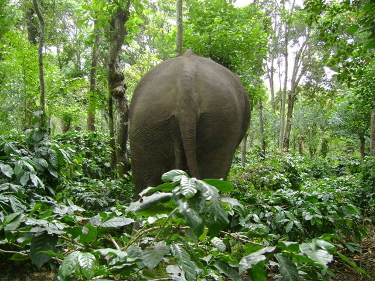

Wild elephants are increasingly shifting base from the floor of the forest and taking sanctuary inside shade grown ecofriendly coffee plantations because their habitat is being continuously depleted. The Indian elephant is facing increasing pressure from a variety of threats like lack of food, shelter and territory. In the end analysis the endless search for food is the beginning of conflict.

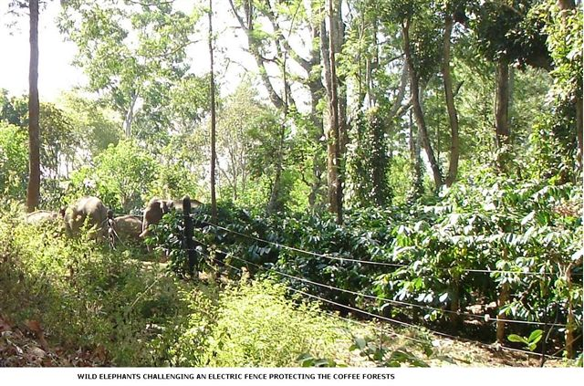

### ECO-FRIENDLY COFFEE

The fact of the matter is that Monocropping is the exception in Indian coffee Plantations. The rule is a range of simultaneously growing crops. No other Plantations in the world has the range of diversity as that seen in Indian Coffee plantations. The difference is the polyculture, mixed cropping systems. Pepper vines are grown on shade trees, ; cardamom, Areca nut, Ginger, orange, Citrus, Vanilla and a few other spices are grown as multiple crops inside the Coffee Plantations.

Rice and bananas are commercially grown in the valleys. Most of these crops are not only ideal food for the elephants but more importantly crops with higher nutritive content and palatability. These multiple crops act as powerful magnets attracting herds of wild elephants into ecofriendly coffee farms. This leads to negative interactions between humans and elephants, commonly referred to as the “HUMAN ELEPHANT CONFLICT”.

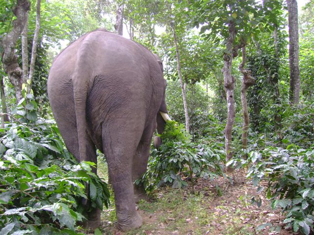

Primary conflict includes crop raiding, competition between humans and elephants for vegetation. Elephants are known to spend about three-quarters of their time, day and night, selecting, picking, preparing and eating food. An adult elephant in the wild will eat in the region of 100 to 200 Kg (220 to 440 lb.) of vegetation per day depending on the habitat and the size of the elephant.

The number of plant species eaten by any one elephant may vary but it is likely to be more than fifty.

In fact competition has defined the eating habits of elephants. Each herd needs its own territory to survive. Elephants are not territorial, but they habit a particular area if food supply is in abundance. They also make use of the existing migratory corridors to go from one forest range to the other.

Unlike most other mammals, elephant migration consists of a series of migrations in the quest for food. This migratory map is passed on by the matriarch to subsequent generations through the trials of life. Research also indicates that elephant home ranges vary from population to population and habitat to habitat. Individual home ranges vary from 15 to 3700 square kilometers.

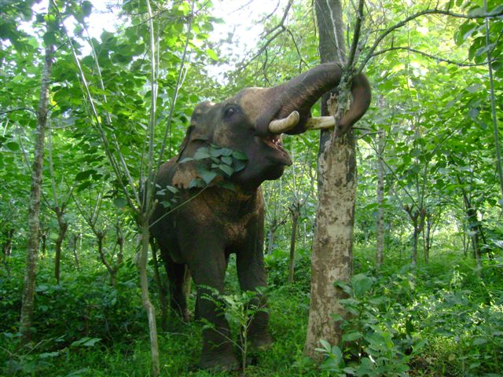

In the early 1960’s Elephant numbers were pretty stable because of the better protection and the availability of plenty of food within the confines of the evergreen forests. However, with the advent of modern technology (Timber cranes, Electric Chain saws, JCB, Poclains) the forest landscape has changed for the worse. A good net work of roads leads to the heart of the forests making it that much easier for the poachers. All these factors have a direct impact on the sustainability of the elephant population.

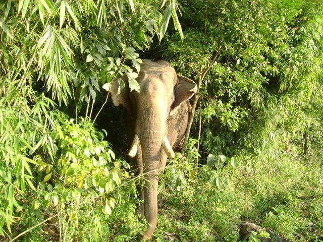

We have witnessed widespread conflicts between elephants and humans inside eco-friendly coffee farms. Our observations ( 20 years) point out to the fact that the conflict is getting out of hand resulting in the destruction of crops on one side and the death and decline of these magnificent gentle giants on the other . Something needs to be done on a war footing to conserve these endangered elephants and alleviate the sufferings of the subsistence farmers.

### WHY THE NEED TO CONSERVE?

Coffee forests provide key breeding landscapes for UMBRELLA species like tigers and elephants. Umbrella species need large areas to live in. Protection of these species results in the protection of other smaller species both at the macro and micro level. Each species is indispensable for the survival of the other. This has a direct impact on the sustainability and biodiversity of the coffee mountain. The conservation of the Indian elephant also has many indirect and direct benefits.

Since elephants are vegetarians in their dietary habits, it is clear that the wilderness set for the elephants also provides the local farmers sustenance in terms of protection of biodiversity. In spite of their size, elephants never overgraze and scientific evidence points out that elephant corridors are rich in biodiversity. Areas rich in biodiversity in turn aid in the establishment of a healthier ecosystem.

### CONSERVATION EFFORTS AT JOE’S SUSTAINABLE FARM

Adults and Children in particular are enlightened on different aspects of elephant behavior. They are also taught to feel and feed the elephants with the help of an experienced trainer.

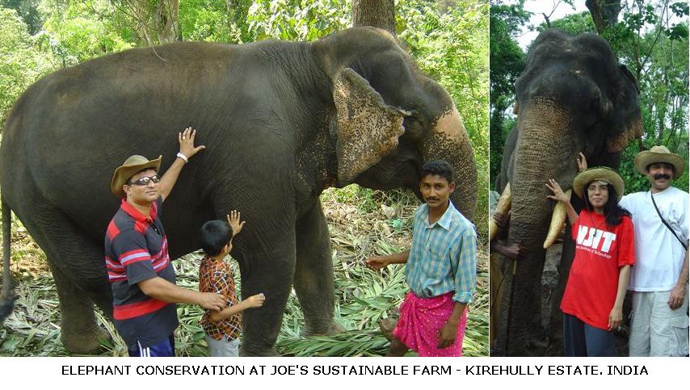

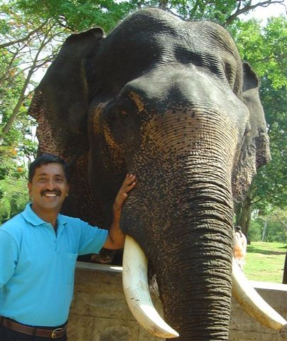

### INDIGENOUS DEVICES TO PROTECT WILD ELEPHANTS

Shimanta Kumar Goswami, a nature lover from Assam has developed an simple innovative and cost effective early warning system that not only alerts farmers of straying jumbos, but also drives them back into the forest. The early warning system uses strong, two plus nylon ropes, a few poles and an alarm bell. The rope is tied to the poles, at a height of about 6 feet and the poles are fixed to the ground at a gap of 200 meters. This network connects to an electric bell on a watch tower. As the elephant comes in contact against the nylon rope, the hair on its head gets caught between the plies of the rope and the resultant tension pulls the hair out. Instinctively, the elephant turns away and simultaneously, the alarm bells too are triggered warning the villagers.

The cost to cover a kilometer with this device is around 50 US $, whereas devices using electric fencing costs approximately 3000 US $.

### HOW TO GO ABOUT CONSERVATION?

Conservation efforts should address the following core areas.

Ban ivory trade

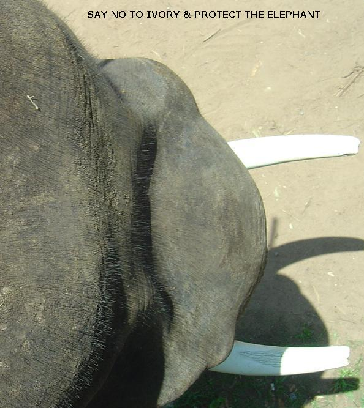

Adequate measures should be put in place to halt forest fragmentation.

Elephant corridors should be identified and elephants provided a safe haven during migration periods.

Insurance schemes to adequately cover loss of property and crop damage

Coffee farms bordering elephant forests should avoid growing tuber crops like tapioca which is the favorite food of elephants.

Trenching all along the border so that elephants do not encroach into villages.

Electric fencing all round sensitive spots to deter the elephants from crossing into vulnerable territory.

### INDIAN ELEPHANT

STATUS: Endangered.

South India houses a population of around 8000 and North India around 7000. In all there are 25,600 to 32,750 Asian elephants (in 13 range Countries) left in the wild with an additional 15,000 in captivity.

International demand for Ivory and Organized crime inside the game sanctuaries is threatening the wild elephant population. Elephants are in real peril. Unlike the African elephant only the males of the Indian elephants have tusks, and a part of the genetic population called MAKHNAS do not have it at all. The tusk size denotes rank and position among the herd. Young and females form herds and Males tend to disperse.

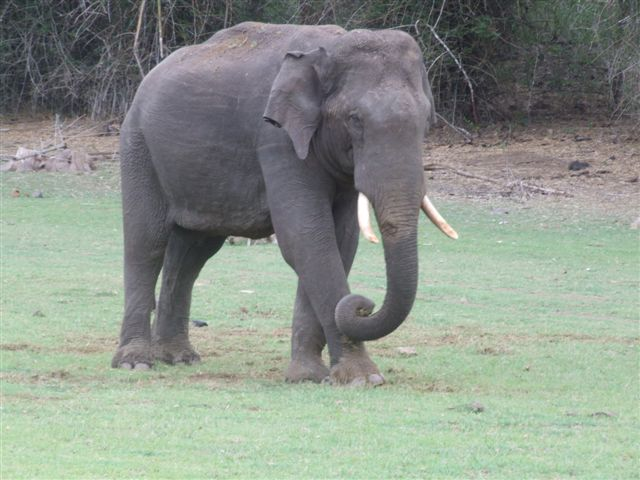

Elephants are the largest living land animals and are highly intelligent. According to WWF reports, Asian elephants grow up to 21 feet long, stand up to 10 feet tall, and weigh up to 11,000 pounds. They have a matriarchal society (Female is the ruler of the herd) and a herd comprises of a nucleus of 2 to 3 mature cows. It is very important to understand that domestic elephants can never survive in the wild.

TUSKS: A male elephant’s most prized possession is the ivory tusks. The tusks are used in decorative arts, game pieces and musical instruments.

BREEEDING: Elephants that are 12-15 years old are sexually active. In the presence of several old bulls, they get a chance to mate only after the age of 25 years. The chances of successful mating increases with the size and age of the bull. The gestation period varies from 20 to 22 months and females will produce a calf every four to five years. An Asian elephant calf is about 260 pounds at birth. The reproductive rate in elephants is rather low. Asian elephants can live to be 60.

### CONCLUSION

Forests account for nearly a third of the planet’s land surface, yet our sacred forests are shrinking, right in front of our very own eyes. Tropical deforestation and land use change have significantly altered the very life support system of the elephants. We need to have a perfect balance with nature. We must admit to the fact that it has been a one way road as far as our relationship with the planet has been. Unmindful of limited resources, humankind continues to plunder the environment for selfish gains.

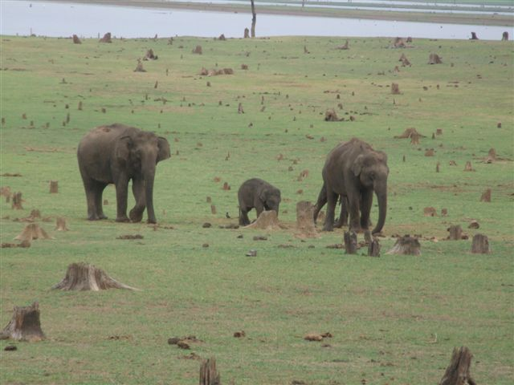

The home of the elephants is the forests. We need to understand that Elephant populations cannot sustain themselves in a fragmented and discontinuous range. Their survival in turn depends on the health of the forest ecosystem in terms of biodiversity and biomass production. Our observations also point out that domesticated elephants when released into the wild have a very poor rate of survival.

Two choices have to be made regarding the survival of the endangered elephant species. We need to encompass development with the inclusion of environment within it. Development and environment are not two separate issues but are two sides of the same coin. No development should be undertaken at the cost of environment.

We need to have a bold vision where common citizens accept elephants as a part of the natural order.

### REFERENCES

[ecofriendlycoffee.org/eco-friendly-indian-coffee-a-profile/](http://ecofriendlycoffee.org/eco-friendly-indian-coffee-a-profile/)

[ecofriendlycoffee.org/coffee-forest-symbiosis/](http://ecofriendlycoffee.org/coffee-forest-symbiosis/)

[www.biodiversityhotspots.org](http://www.biodiversityhotspots.org/)

[www.worldwildlife.org](http://www.worldwildlife.org/)

[www.indiawildliferesorts.com](http://www.indiawildliferesorts.com/)

[Summary Statistics for Globally Threatened Species](http://web.archive.org/web/20080914173052/http://www.iucnredlist.org:80/info/stats)

https://www.iucn.org/

IUCN – The World Conservation & the World Wide Fund for Nature (1993) Elephant Fact Sheet. Gland: IUCN

Kangwana, K. (1996) Studying Elephants. Nairobi: African Wildlife Foundation

Redmond, I. (1993) Elephant. Eyewitness Guides. London: Dorling Kindersley

Barnes, R.F.W, G.C.Craig, H.T. Dublin, G. Overton, W. Simons & C.R. Thouless, (1999) African Elephant Database 1998. Gland: IUCN

Deccan Herald. Spectrum. 2008. Page four. ( Amarjyoti Borah. Down to Earth Service).