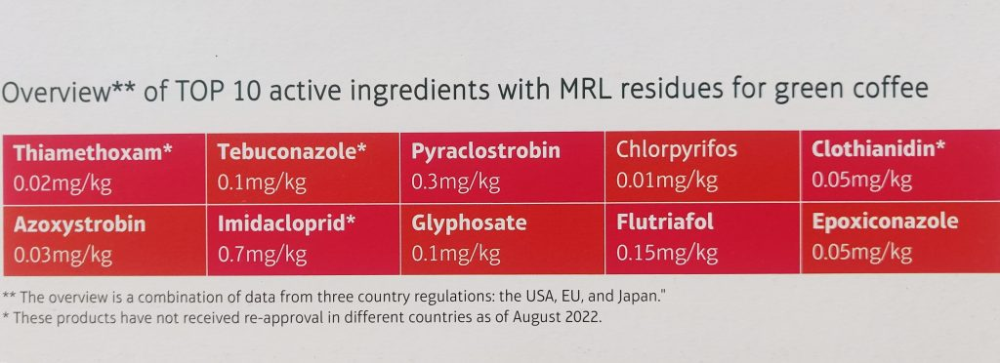
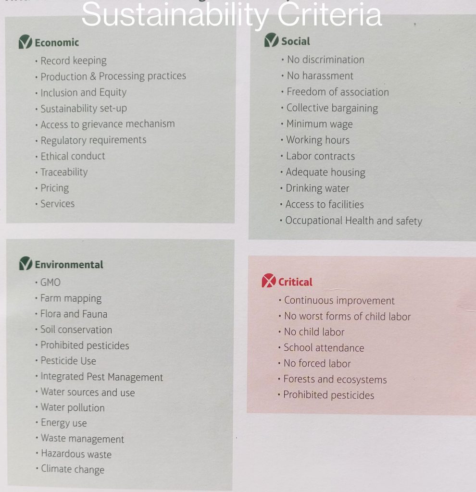

Coffee is one of the most consumed beverages worldwide, with millions of people relying on it for their daily caffeine fix. However, the cultivation of coffee often involves the use of pesticides to protect the plants from pests and diseases. The journey from coffee bean to cup is fraught with challenges, especially for coffee Planters who face stringent regulations on pesticide and chemical residues imposed by global coffee associations. The Coffee Board of India in recent years has expressed concern over the high use of pesticides such as lindane (Gamma BHC) and Chlorpyriphos to combat white stem borer and berry borer. Coffee-importing countries, have already begun scrutinising the coffee originating from India. Since 70 per cent of the Indian coffee is exported, we need to apply our mind as to what the market wants than what we offer to the market.  
Pesticide residue in Indian coffee is a matter of concern that requires attention from various stakeholders, including Planters, policymakers, consumers, and regulatory bodies. India is one of the world’s major coffee producers, and the presence of pesticide residues in Indian coffee can have significant implications for human health, environmental sustainability, and the reputation of the coffee industry.  
On October 6, 2023, India published the Insecticides (Prohibition) Order, 2023, which bans four highly hazardous pesticides: Monocrotophos, Dicofol, Dinocap, and Methomyl. Despite the ban, most of these chemicals are available with fertilizer dealers as well as Agri Clinics.

### What pesticides are used in coffee plantations?

Insecticides are mainly used in coffee crops. Insecticides include organophosphates (OP), pyrethroids, and carbamates.  
Other pesticides restricted for use in India include:  
Aluminium Phosphide, DDT, Lindane, Methyl Bromide, Methyl Parathion, Sodium Cyanide, Methoxy Ethyl Mercuric Chloride (MEMC), Endosulfan, Fenitrothion, Diazinon, Fenthion, and Dazomet.  
In addition, the government has restricted the use of glyphosate and its formulations across India, considering health hazards and risk to human and animal health.

### Causes of Pesticide Residue in Indian Coffee.

1\. Pest Pressure: Coffee plants in India, like elsewhere, are susceptible to pests and diseases that can significantly affect yield and quality. To combat these challenges, many coffee farmers resort to the use of synthetic pesticides to protect their crops from damage.  
2\. Limited Awareness: In some regions, there may be limited awareness among coffee farmers about the potential risks associated with pesticide use, as well as alternatives such as integrated pest management (IPM) practices or organic farming methods.  
3\. Market Demands: The demand for high-quality coffee, both domestically and internationally, can create pressure on farmers to maximize yields and minimize crop losses. In pursuit of higher productivity, some farmers may resort to the indiscriminate use of pesticides without proper training or adherence to safety guidelines.  
4\. Regulatory Challenges: While India has regulations governing the use of pesticides in agriculture, enforcement and compliance can vary, leading to gaps in oversight. Weak regulatory frameworks, limited monitoring infrastructure, and resource constraints can contribute to challenges in ensuring compliance with safety standards.  
5\. Supply Chain Complexity: The global coffee supply chain is complex, involving multiple intermediaries, transportation, and storage facilities. During processing, storage, and transportation, coffee beans may come into contact with surfaces or containers contaminated with pesticide residues, further contributing to the problem.

### Implications of Pesticide Residue in Indian Coffee

1\. Health Risks: Pesticide residues in Indian coffee pose potential health risks to consumers, including acute poisoning, chronic exposure, and the development of pesticide-related health conditions. Certain pesticides have been associated with adverse health effects such as cancer, neurological disorders, and reproductive problems.  
2\. Environmental Impact: The use of pesticides in coffee cultivation can have detrimental effects on soil health, water quality, and biodiversity. Pesticide runoff from coffee farms can contaminate water bodies, harm non-target organisms, and disrupt ecological balance in sensitive ecosystems.  
3\. Quality and Reputation: Pesticide residues can compromise the quality, flavor, and safety of Indian coffee, affecting its market value and reputation both domestically and internationally. Consumer preferences are increasingly shifting towards organic or sustainably produced coffee, prompting greater scrutiny of pesticide use in coffee production.  
4\. Economic Consequences: The presence of pesticide residues in Indian coffee can have economic consequences for coffee farmers, exporters, and the broader industry. Contamination incidents or negative publicity related to pesticide residues can lead to market rejection, loss of consumer trust, and decreased competitiveness in the global coffee market.  
5\. Social and Economic Equity: Small-scale coffee farmers, particularly in developing countries, may face economic challenges in adopting alternative pest management practices or transitioning to organic production methods. Limited access to resources, technical assistance, and market opportunities can exacerbate inequalities within the coffee industry, perpetuating dependency on conventional farming practices.

### Mitigation Strategies

1\. Integrated Pest Management (IPM): Encouraging the adoption of IPM practices, such as biological control, crop rotation, and the use of pest-resistant coffee varieties, can help reduce reliance on synthetic pesticides and minimize pesticide residues in coffee.

2\. Capacity Building: Providing training and technical assistance to coffee farmers on integrated pest management (IPM) practices, organic farming methods, and safe pesticide use can help reduce reliance on synthetic pesticides and minimize pesticide residues in Indian coffee.  
3\. Regulatory Enforcement: Strengthening regulatory enforcement mechanisms, monitoring systems, and compliance with pesticide safety standards can help ensure that coffee production in India adheres to established safety guidelines and maximum residue limits (MRLs).  
4\. Certification and Traceability: Promoting certification programs such as organic certification, Fair Trade, or Rainforest Alliance certification can incentivize coffee producers to adopt sustainable and environmentally friendly farming practices while providing consumers with assurance of product quality and safety.  
5\. Consumer Education: Raising awareness among consumers about the health, environmental, and social implications of pesticide residues in Indian coffee can empower them to make informed purchasing decisions and support sustainable and responsible coffee production practices.

### Conclusion

Pesticide and chemical residues in coffee have become a significant concern due to their potential impact on human health, environmental sustainability, and the reputation of the coffee industry.  
In conclusion, pesticide residues in coffee are a multifaceted issue with far-reaching implications for human health, environmental sustainability, and social equity.  
Addressing the issue of pesticide residue in Indian coffee requires a concerted effort from all stakeholders, including farmers, government agencies, industry associations, and consumers. By promoting sustainable and environmentally friendly coffee production practices, enhancing regulatory oversight, and fostering greater transparency and accountability throughout the coffee supply chain, India can ensure the safety, quality, and sustainability of its coffee industry for the benefit of present and future generations.

### **References**

Anand T Pereira and Geeta N Pereira. 2009. Shade Grown Ecofriendly Indian Coffee. Volume-1.

Bopanna, P.T. 2011.The Romance of Indian Coffee. Prism Books ltd.

Alexander M. 1977. Introduction to soil microbiology (2nd ed.). NewYork: John Wiley,

Anand Titus Pereira & Gowda. T.K.S. 1991. Occurrence and distribution of hydrogen dependent chemolithotrophic nitrogen fixing bacteria in the endorhizosphere of wetland rice varieties grown under different Agro climatic Regions of Karnataka. (Eds. Dutta. S. K. and Charles Sloger. U.S.A.) In Biological Nitrogen Fixation Associated with Rice production. Oxford and I.B.H. Publishing. Co. Pvt. Ltd. India.

[A review on the pesticides in coffee](https://www.ncbi.nlm.nih.gov/pmc/articles/PMC9681499/#:~:text=Insecticides%20are%20mainly%20used%20in,humans%20due%20to%20their%20toxicity).

[Pesticide Residues](https://www.sciencedirect.com/science/article/abs/pii/B9780124095175000267)

[A review on the pesticides](https://www.frontiersin.org/journals/public-health/articles/10.3389/fpubh.2022.1004570/full)