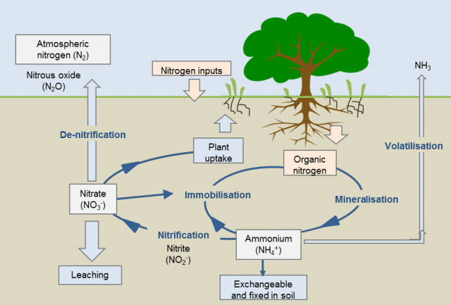

The nitrogen cycle is one of the most important and complex of the biogeochemical cycles. Nitrogen gas (N2) is an inert gas composed of two atoms of nitrogen linked by a very strong triple bond. Although 78 percent by volume of the atmosphere is nitrogen gas, this abundant reservoir exists in a form unusable by most plants or organisms, unless it is converted into nitrogen compounds.

Nitrogen exists in many forms, different physical states as well as both organic and inorganic compounds, transformations between these forms make the N-cycle. Through a series of transformations, Nitrogen gas can be fixed in three ways.

### **Atmospheric fixation.** 

A small amount of nitrogen (5–8%) can be fixed when lightning provides the energy needed for N2 to react with oxygen, producing nitrogen oxide, NO, and nitrogen dioxide, NO2.

### Industrial fixation.

Nitrogen can also be fixed through the industrial process that creates fertilizer. This form of fixing occurs under high heat and pressure, during which atmospheric nitrogen and hydrogen are combined to form ammonia (NH3), which may then be processed further, to produce ammonium nitrate (NH4NO3), a form of nitrogen that can be added to soils and used by plants.

### Biological fixation.

Nitrogen-fixing bacteria fix 60% of nitrogen gas in the atmosphere. The reduction of nitrogen gas to ammonia is energy-intensive. It requires 16 molecules of ATP and a complex set of enzymes to break the bonds so that the nitrogen can combine with hydrogen.  N2 + 3H2→ 2NH3. Nitrogen-fixing bacteria play a crucial role in fixing atmospheric nitrogen into nitrogen compounds that can be used by plants. Free-living nitrogen-fixing bacteria can transform atmospheric nitrogen into inorganic nitrogen forms that plants can access. Plants will use inorganic nitrogen to make amino acids.

Symbiotic nitrogen-fixing bacteria such as Rhizobium, live in plant nodes and acquire carbohydrates from the plant. In turn, they provide amino acids to the plant.

### **Nitrogen**

Nitrogen constitutes many cellular components of proteins and nucleic acids and is essential in many biological processes. Plants need nitrogen as this element is an important component of chlorophyll. Consequently, chlorophyll is vital for the process of photosynthesis.The plants absorb the usable nitrogen compounds from the soil through their roots. Then, these nitrogen compounds are used for the production of proteins and other compounds in the plant cell. During the final stages of the nitrogen cycle, bacteria and fungi help decompose organic matter, where the nitrogenous compounds get dissolved into the soil which is again used by the plants.

Some bacteria then convert these nitrogenous compounds in the soil and turn it into nitrogen gas. Eventually, it goes back to the atmosphere.

These sets of processes repeat continuously and thus maintain the percentage of nitrogen in the atmosphere. So lack of nitrogen can cause deficiency disorders such as stunted growth and other abnormalities

Figrue 1 Soil nitrogen (N) cycle. The cycling of N through different forms in the soil determines the quantity of N that is made available for plant uptake. Source: [https://www.agric.wa.gov.au/soil-carbon/immobilisation-soil-nitrogen-heavy-stubble-loads](https://www.agric.wa.gov.au/soil-carbon/immobilisation-soil-nitrogen-heavy-stubble-loads).

The nitrogen Cycle is a biogeochemical process through which nitrogen is converted into many forms, consecutively passing from the atmosphere to the soil to organisms and back into the atmosphere. It involves several processes such as nitrogen fixation, nitrification, denitrification, decay, and putrefaction.

Nitrogen fixation, in which nitrogen gas is converted into inorganic nitrogen compounds, is mostly (90 percent) accomplished by certain bacteria, and blue-green algae. A much smaller amount of free nitrogen is fixed by abiotic means (e.g., lightning, ultraviolet radiation, electrical equipment) and by conversion to ammonia through the Haber Bosh Process.

### **Importance of Nitrogen Cycle**

The nitrogen cycle is of particular interest to ecologists because nitrogen availability can affect the rate of key ecosystem processes, including primary production and decomposition.

Nitrogen, Creates structures such as DNA and RNA nucleotides, and the amino acids from which proteins are built. Without nitrogen, these molecules would not be able to exist.

Helps plants to synthesize chlorophyll from nitrogen compounds.

Helps in converting inert nitrogen gas into a usable form for plants through the biochemical process.

In the process of ammonification, the bacteria help in decomposing the animal and plant matter, which indirectly helps to clean up the environment.

Nitrates and nitrites are released into the soil, which helps in enriching the soil with the necessary nutrients required for cultivation.

Nitrogen is an integral component of the cell and it forms many crucial compounds and important biomolecules.

### **Processes in the Nitrogen Cycle**

### **Fixation**

Fixation is the first step in the process of making nitrogen usable by plants. Here bacteria change nitrogen into ammonium.

### **Nitrification**

Nitrification is a two-step oxidation reaction process converting ammonium ions into nitrate ions by bacteria. Nitrates are what the plants can then absorb.

### **Assimilation**

Assimilation occurs when plants and animals use nitrate ions and ammonia to make amino acids and proteins. Nitrate ions and ammonia are formed by nitrogen fixation and nitrification. This is how plants get nitrogen. They absorb nitrates from the soil into their roots. Then the nitrogen gets used in amino acids, nucleic acids, and chlorophyll.

### **Ammonification**

This is part of the decaying process. When a plant or animal dies, decomposers like fungi and bacteria turn the nitrogen back into ammonium so it can renter the nitrogen cycle. Ammonification involves the conversion of organic nitrogen (nitrogen found in the cells of living organisms) into ammonia. Saprobiotic organisms (decomposers) are the key players in this process as they feed on organic matter, break it down and release ammonia.

### **Denitrification**

Denitrification is the process of converting the nitrate back into molecular nitrogen by anaerobic bacteria such as *Pseudomonas, Thiobacillus, Bacillus subtilis,* etc. This process can only happen in anaerobic conditions

### **Consequences of excess nitrogen**

Nitrogen is also cycled by human activities such as the combustion of fuels and the use of nitrogen fertilizers. These processes increase the levels of nitrogen-containing compounds in the atmosphere.

Nitrous oxide is a greenhouse gas. Too much of it can also cause acid rain. These actions affect air quality, resulting in smog.

Excess nitrogen in coffee soils can play havoc with the physiological functions of the coffee bush as well as that of multiple crops. The bush gets into a vegetative phase with an excess leaf-to-shoot ratio, and the distance between nodes increases, resulting in fewer clusters of berries.

Weed growth increases especially in grasses that are deep-rooted.

The fertilizers containing nitrogen are washed away in lakes, and rivers and result in eutrophication.

### **Harmful Effects**

### **Eutrophication**

Due to excessive amounts of nitrates in aquatic systems, Harmful algal blooms, dead zones, and fish kills are the results of a process called eutrophication — which occurs when the environment becomes enriched with nitrogen compounds. Algae feed on the nutrients, growing, spreading, and turning the water green. Algae blooms can smell bad, block sunlight, and even release toxins in some cases.

### **Conclusion**

Indiscriminate use of nitrogenous fertilizers has dramatically upset the coffee ecosystem balance. Yields have significantly come down and irrigation ponds, are contaminated with algal blooms. With no nitrogen monitoring mechanism in place, the ecosystem can be irreversibly damaged.

The need of the hour is to educate the coffee Planters on the judicious use of nitrogenous fertilizers. In short, we need to be mindful of our Nitrogen Footprint inside eco-friendly coffee Plantations.

### **References**

Anand T Pereira and Geeta N Pereira. 2009. Shade Grown Ecofriendly Indian Coffee. Volume-1.

Anand Titus Pereira & Gowda. T.K.S. 1991. Occurrence and distribution of hydrogen-dependent chemolithotrophic nitrogen-fixing bacteria in the endo rhizosphere of wetland rice varieties grown under different Agro-climatic Regions of Karnataka. (Eds. Dutta. S. K. and Charles Sloger. U.S.A.) In Biological Nitrogen Fixation Associated with Rice production. Oxford and I.B.H. Publishing. Co. Pvt. Ltd. India.  
Subba Rao. N. S. 1998. Soil Microorganisms And Plant Growth. Oxford and IBH Publishing Co.

Bopanna, P.T. 2011.The Romance of Indian Coffee. Prism Books ltd.

Brady, N., and Weil, R. 2010. “Nutrient cycles and soil fertility,” in *Elements of the Nature and Properties of Soils, 3rd Edn*, ed V. R. Anthony (Upper Saddle River, NJ: Pearson Education Inc.), 396–420.

Brady, N., and Weil, R. 2010. “Nutrient cycles and soil fertility,” in *Elements of the Nature and Properties of Soils, 3rd Edn*, ed V. R. Anthony (Upper Saddle River, NJ: Pearson Education Inc.), 396–420.

Aczel M (2019) What Is the Nitrogen Cycle and Why Is It Key to Life?. Front. Young Minds. 7:41. doi: 10.3389/frym.2019.00041

[Nitrogen Fertilization](https://www.intechopen.com/chapters/67454)

[Excessive use of nitrogenous](https://pubmed.ncbi.nlm.nih.gov/29139074/#:~:text=Consumption%20of%20diets%20having%20high,fetus%20development\)%2C%20and%20diabetes).

[Is Too Much Fertilizer a Problem?](https://kids.frontiersin.org/articles/10.3389/frym.2020.00063)

[What Is the Nitrogen Cycle](https://kids.frontiersin.org/articles/10.3389/frym.2019.00041)

[Immobilisation of soil nitrogen](https://www.agric.wa.gov.au/soil-carbon/immobilisation-soil-nitrogen-heavy-stubble-loads).

[What Is the Nitrogen](https://kids.frontiersin.org/articles/10.3389/frym.2019.00041)

[The Role of Nitrogen in Crop Production](https://kochagronomicservices.com/knowledge-center/The-Role-of-Nitrogen-in-Crop-Production-and-How-to-Protect-It_2288.aspx#:~:text=Nitrogen%20is%20also%20a%20component,needs%20it%20to%20optimize%20yield) .

[Nitrogen Cycle Definition](https://byjus.com/biology/nitrogen-cycle/#:~:text=Nitrogen%20Cycle%20is%20a%20biogeochemical%20process%20through%20which%20nitrogen%20is,%2C%20denitrification%2C%20decay%20and%20putrefaction).

[nitrogen cycle biochemistry](https://www.britannica.com/science/nitrogen-cycle)

[Understanding the Nitrogen Cycle](https://letstalkscience.ca/educational-resources/stem-in-context/understanding-nitrogen-cycle)

[Nitrogen cycle](https://en.wikipedia.org/wiki/Nitrogen_cycle)

[Ecosystem](https://www.ducksters.com/science/ecosystems/nitrogen_cycle.php)

[SCHOOLZONE](https://microbiologysociety.org/resource_library/knowledge-search/schoolzone-the-nitrogen-cycle.html#:~:text=Micro%2Dorganisms%20\(the%20decomposers\),part%20of%20the%20nitrogen%20cycle).

[Nitrogen](https://www.studysmarter.co.uk/explanations/biology/energy-transfers/nitrogen-cycle/)