It is a well-established fact that in all terrestrial ecosystems, insects are one of the most important and diverse components but are often neglected, despite the fact that they possess an amazing diversity in size, form and behaviour. Insects range in size from less than a millimetre to over 18 centimetres in length.

[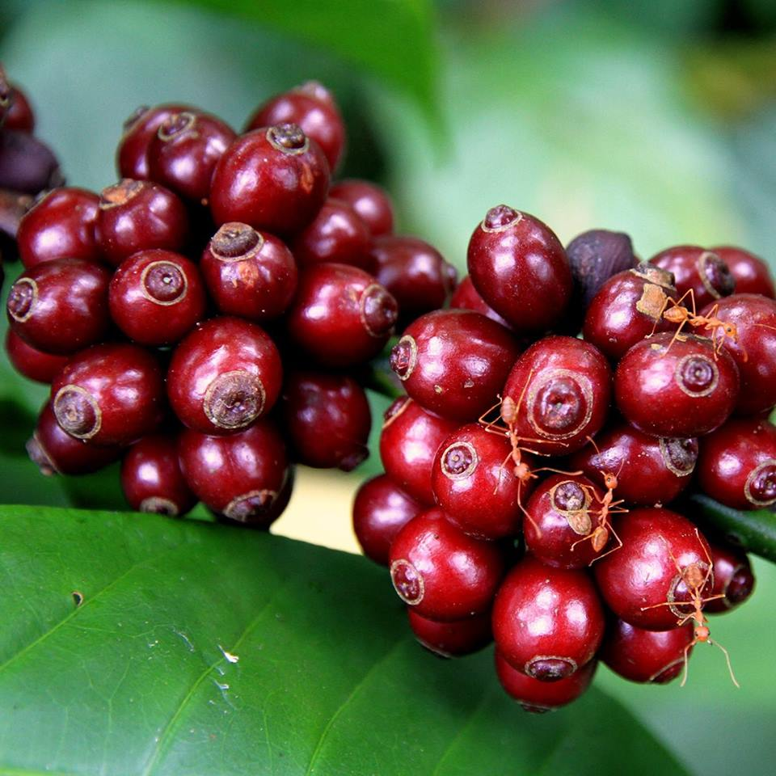](http://ecofriendlycoffee.org/insect-diversity-inside-shade-coffee/2016-insect-diversity-ecoorg-1/)

Before understanding the importance of insect diversity inside eco-friendly shade coffee, it is important to understand the role of insect diversity on Planet Earth. Other than microorganisms, insects make up most of the world’s biodiversity. Of the 1.7 million total species described, approximately 45,000 are vertebrates, 250,000 are plants and 950,000 (56%) are insects. The vast majority of terrestrial species are arthropods and most of them are believed to live in tropical forests. But the real truth is that there may be as many as ten times that many yet to be identified.

Insects play many roles in the Coffee ecosystem. They play a pivotal role in the breakdown of plant and animal material and constitute a major food source for many other animals. Many potential coffee pests and diseases are controlled by natural enemies, mainly insects. These naturally occurring biological agents ward off danger and more importantly keep the pest population within the economic threshold.

The Planting Community has a dual advantage. Number one. Biological agents do not allow the pest population to cause economic damage beyond the threshold level and second, reduces the need for large scale Chemical control which prevents soils from turning sick.

[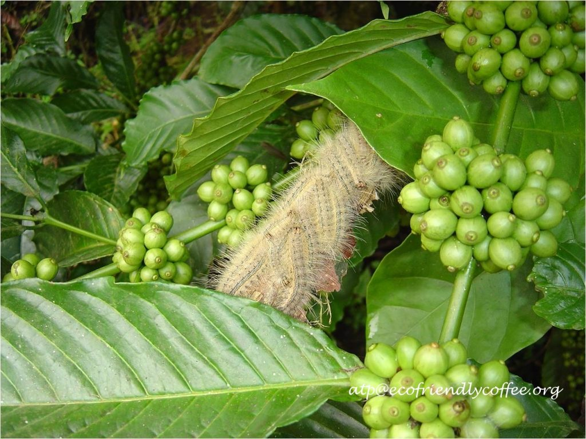](http://ecofriendlycoffee.org/insect-diversity-inside-shade-coffee/2016-insect-diversity-ecoorg-2fa/)

Coffee forests with its varied landscape and topography is gifted with diverse climate and productive ecosystems, giving way to a very rich diversity of insects. All these years we have tried to map the bird and mammal biodiversity of Coffee Forests and thought it wise to also record the insect diversity inside shade coffee.

When one thinks of insect diversity, it is advisable to look at it in three distinct angles.

Genetic diversity

Species diversity

Ecosystem diversity

Ecosystem diversity is highlighted in this article for the important reason that in today’s world of chemicals and more chemicals this concept is rapidly becoming associated with sustainable development and ecosystem health as it integrates aspects related to coffee ecology, the economics of growing sustainable coffee, environmental considerations and the Planting community, thus combining the various components of the ecosystem and sustainable development.

Scientific literature clearly brings out the significant role played by insects in Ecosystem Services.

-   Nutrient recycling
-   Biological pest control
-   Insect Pollination
-   Waste Disposal and detoxification of hazardous chemicals.
-   Healthy soils
-   Maintaining ecological niches and micro climate

Insects are a crucial constituent of the coffee ecosystem. They affect the life of the Planting community in more than one way. Unfortunately, most of us associate insects as pests. This is not true. While some are referred to as Pests, a vast majority of the species are beneficial to mankind, especially the Coffee Planting Community. A better understanding of how insects grow and develop will greatly help in keeping their population under check. Insects are cold blooded. Higher temperatures due to global warming speed up the generation process.

[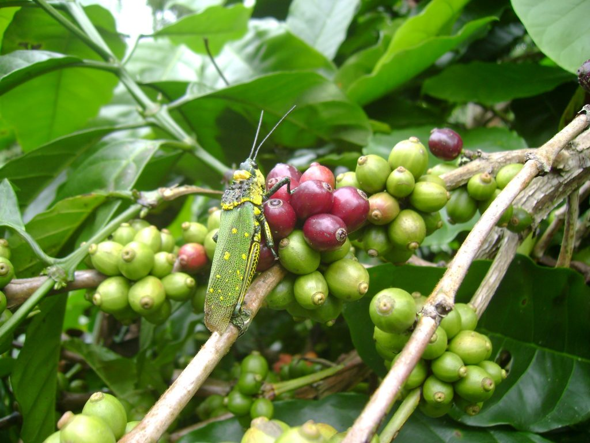](http://ecofriendlycoffee.org/insect-diversity-inside-shade-coffee/2016-insect-diversity-ecoorg-3/)

[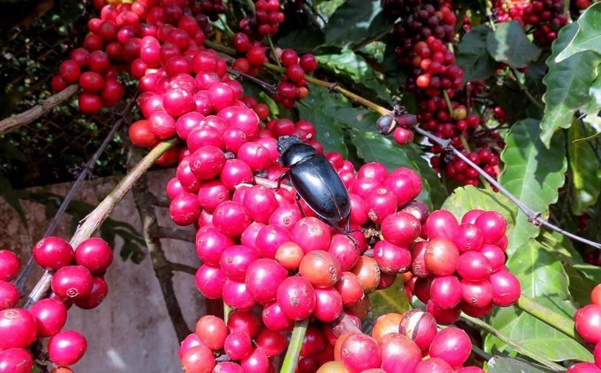](http://ecofriendlycoffee.org/insect-diversity-inside-shade-coffee/2016-insect-diversity-ecoorg-4/)

Climate change affects all types of flora and fauna, especially prone are the insects. This global phenomenon called Global warming significantly affects the insect distribution range, survival and reproductive performance. Scientific evidence also points out to the fact that there are other effects, less obvious, but relevant for population viability like the effects on sex ratio.

We have noticed that a small degree rise in summer temperature above 30 degree centigrade results in the multiplication of the major coffee borer pest in geometrical proportions.

[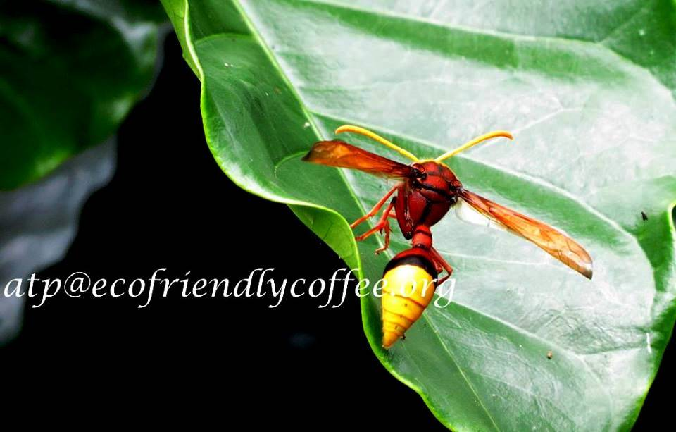](http://ecofriendlycoffee.org/insect-diversity-inside-shade-coffee/2016-insect-diversity-ecoorg-5/)

[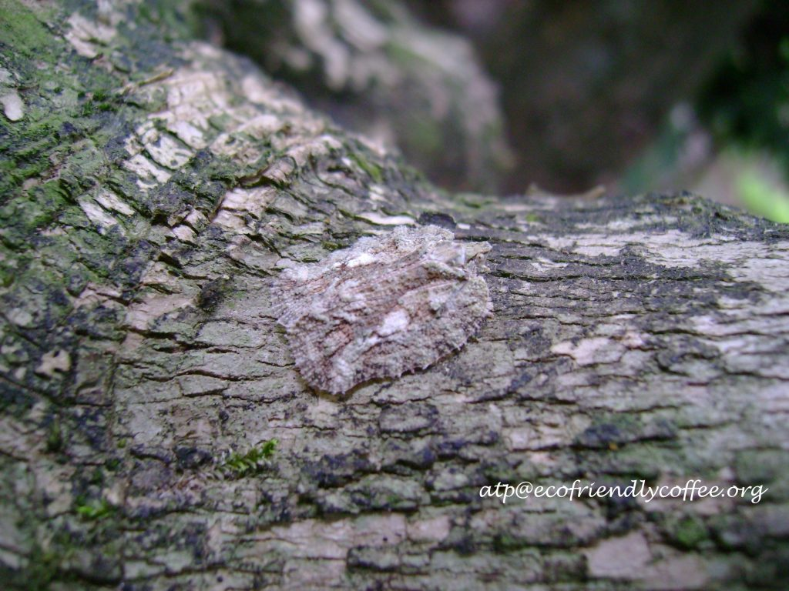](http://ecofriendlycoffee.org/insect-diversity-inside-shade-coffee/2016-insect-diversity-ecoorg-6fa/)

[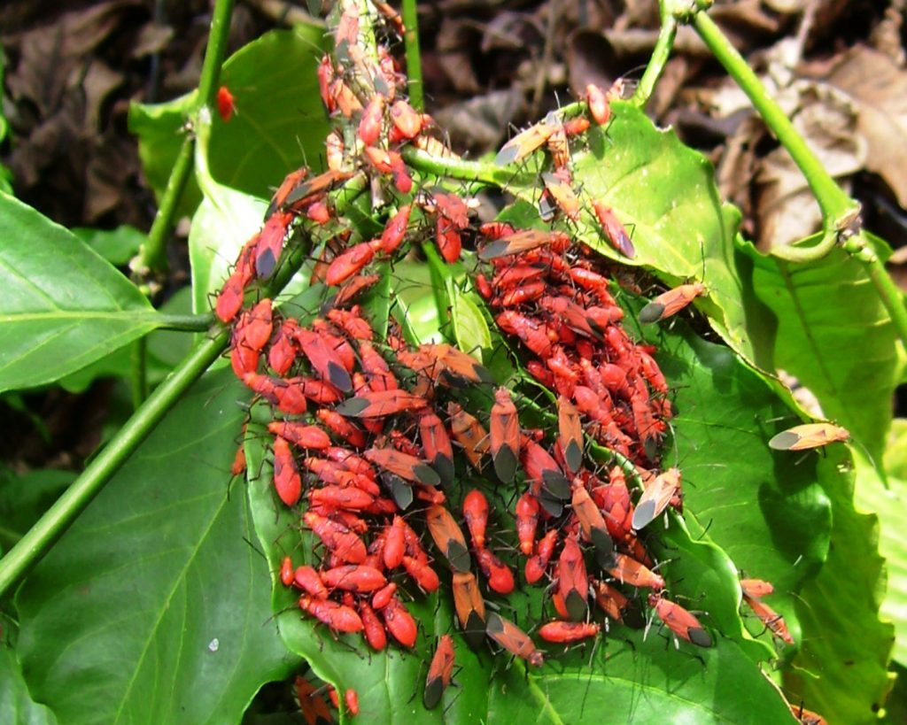](http://ecofriendlycoffee.org/insect-diversity-inside-shade-coffee/2016-insect-diversity-ecoorg-7/)

Regarding the beneficial aspect, apart from playing the role of pollinators, they also serve as an important agent in biological control of economically important pests saving millions of rupees spent in chemical warfare and also keeping the balance of nature in check and a healthy ecology.

### **Importance of Insects**

Insects are extraordinarily adaptable creatures to any changing environment.

Their protective shell or exoskeleton helps them overcome harsh environmental conditions and natural enemies.

Their strength in numbers makes them a formidable force to reckon with.

They also possess considerable genetic diversity.

Insects have the capacity to build up resistant to new age chemicals and varieties of crops which are genetically modified, thereby causing serious economic loss to the Planting community.

[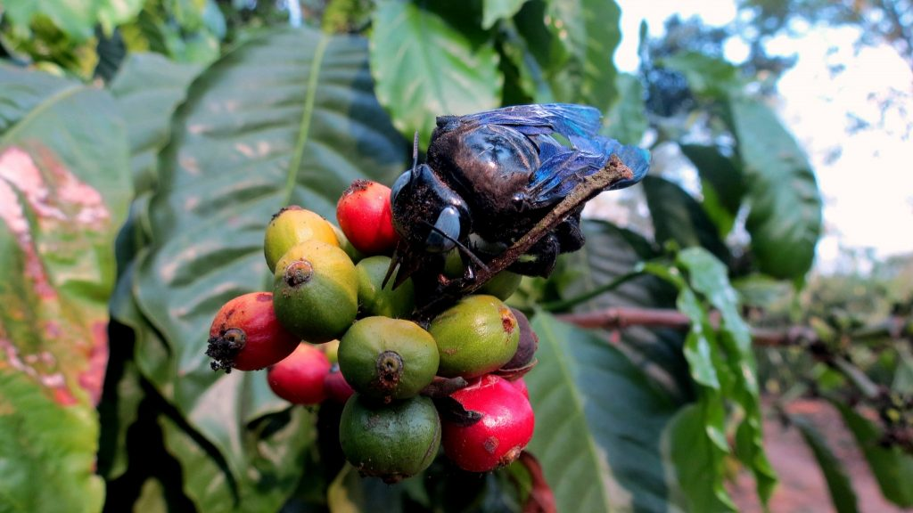](http://ecofriendlycoffee.org/insect-diversity-inside-shade-coffee/img_0389-insect-diversity-original-edited/)

They are directly beneficial to humans by producing honey, silk, wax and many other intermediary products.

Indirect benefits include pollination, Biological control of pests and food for other organisms. Some play an important predatory and parasitic role that regulate pest populations.

Insects are responsible for major out breaks of pests and diseases, destruction of food by plant pests, toxic residues from pesticides.

Direct economic return. Silkworm and bees

Chemicals production for medicinal use

Some constitute an important source of protein in the diet of rural people

[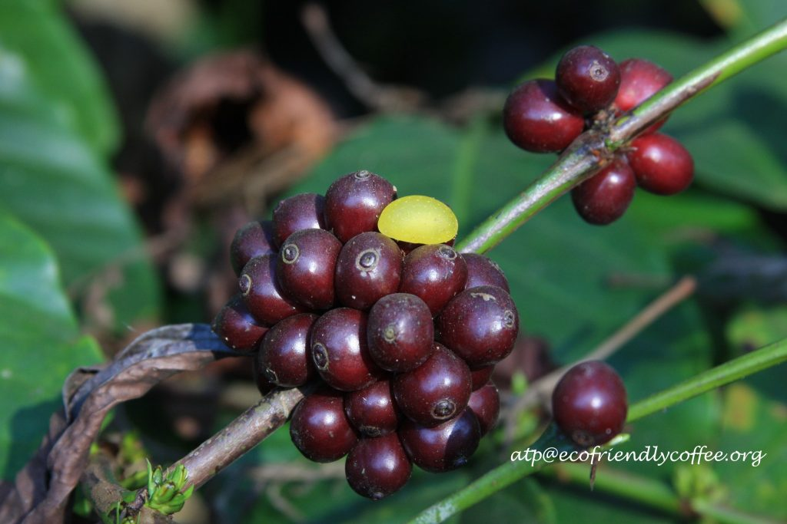](http://ecofriendlycoffee.org/insect-diversity-inside-shade-coffee/2016-insect-diversity-ecoorg-8fa-2/)

In recent years, Global warming is favouring Pests and no chemical measures are sufficient to bring about an effective control of the white stem borer and the berry borer beetle. Coffee Planters are fighting the menace of white stem borer and berry borer through chemical means which also affects many beneficial insects. Chemical control has not effectively controlled the pest population. A good alternative would include biological control methods to keep the pest control below the economic threshold. Biological control methods help in the penetration of the target organisms in areas where it is not possible for chemicals to act.

A new class of insecticides called insect growth regulators (IGR) is developing, which is selective in the insects they affect. These insect growth regulators with the help of computer simulators will accurately predict when insects will be most abundant during the growing season and consequently when crops are at more risk.

[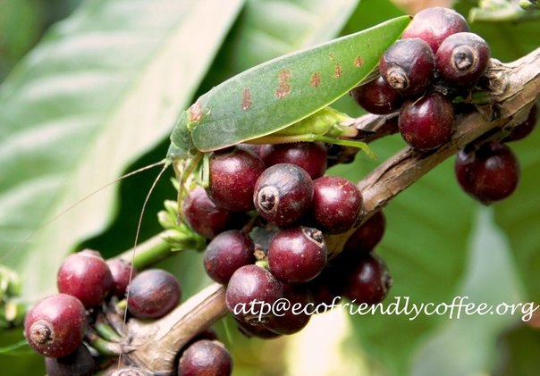](http://ecofriendlycoffee.org/insect-diversity-inside-shade-coffee/atpecofriendlycoffee-org/)

### Conclusion

Many desirable and undesirable transformations are taking place inside shade coffee. The entire focus of the planting community is on productivity and not sustainability. This results in the deterioration of the coffee landscape in terms of habitat degradation, species dwindling at an alarming rate, and a significant decline in the population of natural enemies of harmful insects.

In order to safeguard insect species and use them as a biological tool in increasing productivity of Agriculture ecosystems, we need to put in place strategies at the National level so that the problem is not looked at in isolation.

[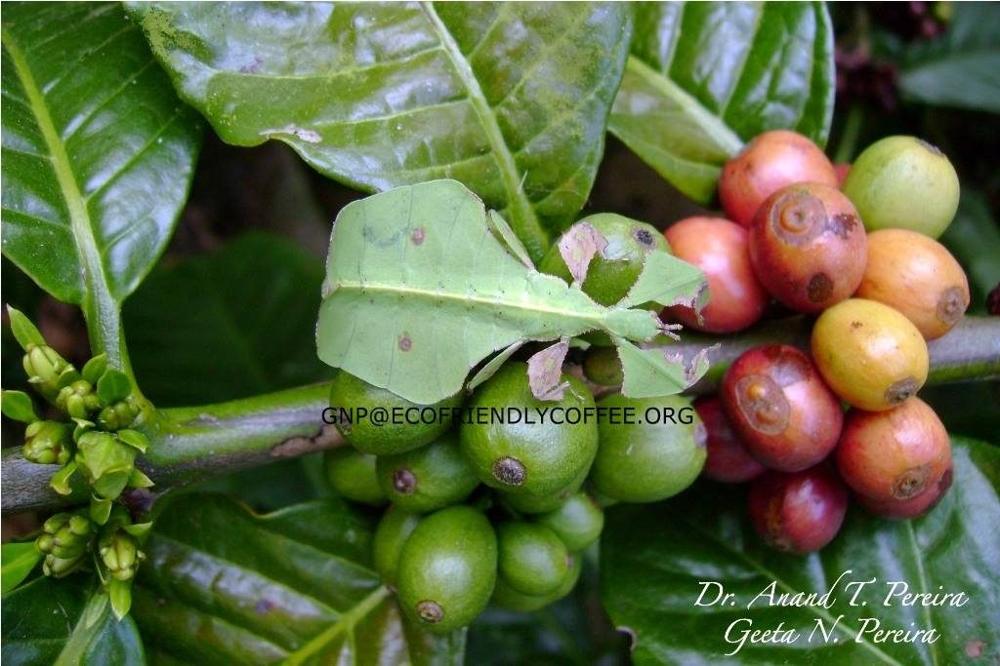](http://ecofriendlycoffee.org/insect-diversity-inside-shade-coffee/2016-insect-diversity-ecoorg-10/)

To achieve success, we need to have an inventory of all Insect species inside the Coffee Ecosystem, understand their hosts, life cycle, distribution, density, age, birth and death rates. This will enable us to manage both pests and predators in a more efficient way.

One good approach to the conservation of insects and biodiversity is by setting aside small portions of land using wilderness preservation as the motive. Unfortunately a vast majority of the Coffee Farmers in India own land less than 10 hectares which does not allow them to allocate land for this purpose.

### References

Anand T Pereira and Geeta N Pereira. 2009. Shade Grown Ecofriendly Indian Coffee. Volume-1.

Bopanna, P.T. 2011.The Romance of Indian Coffee. Prism Books ltd.

[Insect biodiversity](https://en.wikipedia.org/wiki/Insect_biodiversity)

[Sampling insect diversity in space and time](https://elearning.unipd.it/scuolaamv/pluginfile.php/12958/mod_resource/content/1/1%20Biodiversity.pdf)

[Cornell Insect Diversity](https://biocontrol.entomology.cornell.edu/bio.php)

[Royal Entomological Society](https://www.royensoc.co.uk/entomology/orders/dragonflies-and-damselflies-0)

[Practical importance for conservation of insect diversity](http://link.springer.com/article/10.1007%2Fs10531-004-3922-7#/page-2)

[Insect Diversity](https://biocontrol.entomology.cornell.edu/bio.php)

[Insect](http://www.newworldencyclopedia.org/entry/Insect)

[Insect Biology Cornel University](https://biocontrol.entomology.cornell.edu/bio.php)