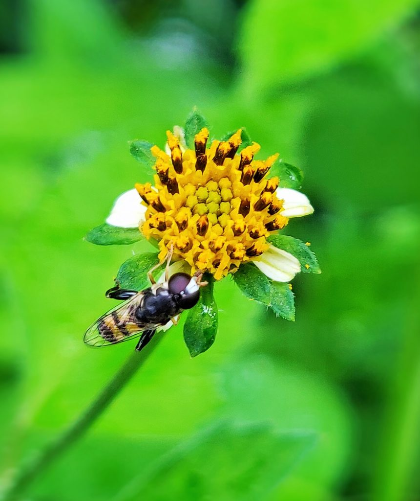

Coffee forests are home to not only shade-grown coffee cultivated under the canopy of a three-tiered shade system but the Agroforestry ecosystem accommodates multiple crops which grow luxuriantly along with coffee. Globalization has changed the coffee landscape with the introduction of many new exotic species of plants and fruit trees into the coffee ecosystem from different continents. In some cases, the introduced plant or animal species thrive in its new environment and is able to successfully reproduce and spread throughout its new habitat. This is because invasive species may also be able to exploit a resource that native species cannot use, which allows them to take hold in the new environment. Some species also alter the environment in a manner that makes it more favorable for them, but less favorable for natives, which is called ecological facilitation. When this happens, the introduced species can wreak destruction on the established coffee ecosystem and become an invasive species. An exotic or alien species does not necessarily have negative consequences, it could symbiotically exist along with native or indigenous species. Invasive plants now occur on every continent on earth, including the remote and hostile ecosystems of Antarctica.

In recent years, the impact of climate change has significantly altered the delicate balance of the coffee ecosystem and the stable relationship between native species and introduced species. Invasive species have devastating impacts on native biota. Coffee Planters are under constant threat with an explosion of new invasive species which are threatening both the ecological integrity of the ecosystem both qualitative and quantitative terms. Worldwide, approximately 42 percent of threatened or endangered species are at risk due to invasive species.

We would like to highlight the threat of invasive species that are a leading threat not only to coffee but to native wildlife species. Invasive species can harm both the natural resources in the coffee ecosystem as well as threaten coffee planters, use of these resources.

Invasive species, also called introduced species, alien species, or exotic species, are any non-native species that significantly modifies or disrupts the ecosystems it colonizes. They include animals, plants, fungi and microorganisms entered and established in the environment from outside of their natural habitat.

### How are Invasive species introduced?

Species are often introduced through various means like ornamental, floricultural, agricultural uses,  fish farming, pet trade, horticulture, biocontrol; or unintentionally, through such means as land and water transportation, travel, and scientific research.

### **Consequences of Invasive Species**

Invasive species compete with native flora and fauna for limited resources, thereby having a number of negative impacts on the coffee ecosystem.

Coffee Planters at times have to use indiscriminate use of hazardous chemicals to control invasive species, which in turn has a direct bearing on the health of the soil ecosystem.

Air and water quality gets significantly affected.

Due to the excessive spread of the invasive species, local resources get exhausted at a rate quicker than their regeneration, bringing about the scarcity of food for indigenous fauna.

The health of Plantation owners and workers is at risk due to excessive pollen in the atmosphere.

Invasive species are capable of causing extinctions of indigenous flora and fauna. They have a tremendous impact on the health of plants, animals, and even humans—threatening lives and affecting food security and ecosystem health

Invasive species reproduce rapidly, out-compete native species for food, water, and space, and are one of the main causes of global biodiversity loss.

Invasive species alter the existing habitat, physically or destroy the habitat, causing huge economic loss by destroying endemic species.

Invasive alien species can transform the structure and species composition of ecosystems by dominating the ecosystems and repressing or excluding native species

Their negative impact on the economy costs countries billions of dollars in losses to agricultural production and some trillion dollars of environmental cost worldwide annually.

Threats to native wildlife through new pests, and diseases

Threats to native microflora

Invasive species can alter any given ecosystem

Change in food chains and food webs.

### **Introduction of Invasive Species**

Lantana Kamara, African Giant snail, coffee berry borer, water hyacinth, Parthenium weed.***PARTHENIUM HYSTEROPHORUS*** **L.** 

The tropical American shrub lantana (*Lantana camara*) for instance was introduced in India in the early 19th century as an ornamental plant; it now invades diverse terrestrial habitats including scrublands and forests.

Infestation of giant African land snails that have caused massive losses to some 40-45 plantations spread over 300 acres of land in northern parts of Kodagu.

Invasive species have better chances to adapt, to new environments and overcome indigenous flora because they tend to grow faster, have shorter lifecycles, produce more seeds or suckers, better dispersal and are gifted with quick germination.

### **Control measures**

Cutting, burning, and uprooting.

Mechanical removal

Biological control

More importantly, awareness among agriculturists, Horticulturists,

### **Conclusion**

The spread of invasive species is on the rise in eco-friendly Indian shade coffee plantations. One way to curb the spread of invasive species is to stop the introduction of exotic species and plant native species. Modifying the environment or opening shade can alter the microclimate and favor the spread of invasive species.

In the end, we need to ask ourselves, if Coffee itself in India is an invasive species as it was introduced to India from other African Countries. Coffee is native to Africa, but of course, is widely planted in tropical regions worldwide. Both varieties of coffee, *Coffea arabica* and *C. canephora* (commonly called robusta) are grown in India.

### **References**

Anand T Pereira and Geeta N Pereira. 2009. Shade Grown Ecofriendly Indian Coffee. Volume-1.

Hiremath 2018. The Case of Exploding Lantana and the Lessons it Can Teach Us. Resonance, 23 (3).

[Invasive Species](https://www.environmentalscience.org/invasive-species)

[Invasive Alien Species](https://www.cbd.int/undb/media/factsheets/undb-factsheet-ias-en.pdf)

[INVASIVE ALIEN SPECIES OF INDIA](http://nbaindia.org/uploaded/pdf/Iaslist.pdf)

[What are invasive plants?](https://india.mongabay.com/2019/06/what-are-invasive-plants/)

[Invasive](https://www.nwf.org/Educational-Resources/Wildlife-Guide/Threats-to-Wildlife/Invasive-Species)

[ENCYCLOPEDIC ENTRY Invasive Species](https://www.nationalgeographic.org/encyclopedia/invasive-species/)

[What is an invasive](https://oceanservice.noaa.gov/facts/invasive.html)

[n invasive species is an introduced](https://en.wikipedia.org/wiki/Invasive_species)

[Kodagu coffee](https://india.mongabay.com/2019/08/kodagu-coffee-planters-take-on-giant-snail-invasion/)

[Coffee as an invasive plant](https://www.coffeehabitat.com/2009/05/research-coffee-as-an-invasive-plant-species-in-india/#:~:text=Further%2C%20there%20was%20a%20negative,Anamalais%2C%20Tamil%20Nadu%2C%20India.&text=The%20authors%20concluded%20robusta%20may,than%20arabica%20in%20this%20region).