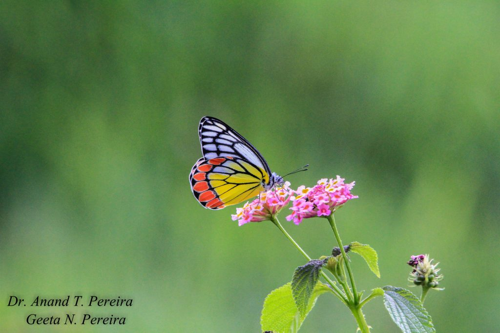

The Western Ghats, home to shade grown ecofriendly Indian Coffee is a biodiverse hotspot of butterflies. The surrounding coffee plantations with the three-canopy shade system provides ideal micro climate for the proliferation of various butterfly species. As such coffee forests are home to hundreds of species of rare, endemic and exotic species of colorful butterflies; some of them extremely rare. Some species are so rare that they are found nowhere else in the world. The region boasts of approximately 350 species of butterflies. They come in a variety of sizes with two pairs of large wings. The color pattern varies from species to species and has a definite role to play in the protection of the species. If one were to closely observe the wings, they are covered with overlapping rows of tiny scales.

In this article we highlight the importance of the Indian Jezebel Butterfly also is known as a common Jezebel. Its scientific name is Delias Eucharis. Common Jezebel, is observed throughout the year at lower elevations. The butterfly can be found at altitudes between sea level and at least 1500 m.

### Taxonomy

Kingdom  Animalia

Division    Arthropoda

Class        Insecta

Order       Lepidoptera

Family      Pieridae

Genus      Delias

Species    D. eucharis

### **What is the size of a common Jezebel?**

The wingspan of both males and females ranges from 6.5 to 8.5 cm. Most species are gaudily patterned in red, yellow, black and white – the colour’s serving to advertise their unpalatable nature to would-be predators. The Common Jezebel can be distinguished by the shape of the orange red spots on the hind wing.

### **Habitat**

One of the common habitats, of these butterflies, is the fringe areas in coffee zones near lowlands, and rice fields, where there is an abundance of lantana camara.  The butterfly is found in tree canopies, flying high among the trees and visiting flowers. It is commonly seen during coffee flowering. The females can be seen flying amongst the trees in search of its food, while the males are more frequently observed visiting flowers for nectar or mud-puddling.

### **Pollination**

Despite the fact that, Bees do most of the work of cross-pollination, the contribution of butterflies can’t be underestimated. In fact, scientists were  surprised by how much butterflies contributed to the pollination of multiple crops in the Coffee Agroforestry model.

### **What is the life cycle of a common Jezebel butterfly?**

Like all other lepidopterans, the Painted Jezebel is holometabolous, meaning that they go through a complete metamorphosis through four stages in their life cycle: egg, larva, pupa and the adult. Throughout their lives, most butterflies form a close association with the plant community.

### **Reproduction**

The Jezebel breeds all year round. Eggs are laid in batches of about 10 or 20 in number although larger batch sizes are not unheard of. These are laid on the underside of a leaf of its food plant. The caterpillars are gregarious in the first few instars. Caterpillars are yellow brown with a black head and have white tubercles from which long white hair arise. The larval food plant is mistletoe – Loranthus

### **How it wards of Danger**

It has bright coloration to indicate the fact that it is unpalatable due to toxins accumulated by the larvae from the host-plants.

### **Camouflage**

It has evolved a dull upper side and a brilliant underside so that birds below it recognises it immediately while in flight and at rest. It rests with its wings closed exhibiting the brilliantly coloured underside.

### **What are the host plants of common Jezebel butterfly?**

Butea monosperma (Fabaceae), Dendrophthoe falcata, Dendrophthoe glabrescens, Loranthus cordifolius, Helicanthes elasticus, Loranthus longiflorus, Scurrula parasitica, Taxillus vestitus (Loranthaceae).

Each species is reliant on specific plants or plant families as hosts for their eggs and caterpillars.

### **Threats (Direct And Indirect)**

Global Warming may eliminate or reduce the availability of host plants.

Their relationship with host plants may be disrupted as the world warms.

Butterflies may have to Adapt to intensifying storms, sudden down pours or extended period of drought which may impact their population in a significant way.

Agri chemicals, sprays, weedicides, Pesticides harm species like butterflies even though they are not the target, and overuse of these chemicals destroys important habitats.

Intensification of farming practices, resulting in fragmented forests and destruction of habitat is an added threat to the very survival of butterflies.

Invasive species is on the rise thereby reducing the growth of native favorable indigenous host plants

### **Difference between Common Jezebel And the Painted Sawtooth**

Like other unpalatable butterflies the Common Jezebel is mimicked by ”Prioneris sita”, the Painted Sawtooth. The Common Jezebel can be distinguished by the shape of the orange red spots on the hind wing. In the Painted Sawtooth these spots are very squarish whereas in the Common Jezebel they are more arrow head shaped. The Painted Sawtooth also flies faster and will also mudpuddle.

### **Conclusion**

The ecological function of butterflies inside coffee ecosystem is poorly understood. Despite the fact that they are central pollinators to many agricultural crops, they play different roles inside coffee Agroforestry. They also act as food source to predators like birds, spiders, lizards and other animals. The larvae feed on many weed plants and could be investigated as biological control agents in minimizing weeds.

### **References**

Anand T Pereira and Geeta N Pereira. 2009. Shade Grown Ecofriendly Indian Coffee. Volume-1.

Bopanna, P.T. 2011. The Romance of Indian Coffee. Prism Books ltd.

 [Butterflies](https://defenders.org/wildlife/butterflies)

[Lepidoptera](https://www.ifoundbutterflies.org/delias-eucharis#:~:text=Butea%20monosperma%20\(Fabaceae\)%2C%20Dendrophthoe,%2C%20Taxillus%20vestitus%20\(Loranthaceae\)).

[Delias eucharis](https://en.wikipedia.org/wiki/Delias_eucharis)

[Delicate with technicoloured wings](https://www.thehindu.com/features/metroplus/delicate-with-technicoloured-wings/article8041731.ece)

[Common Jezebel](https://www.jungledragon.com/specie/2908/common_jezebel.html)

[The Science of Pollination](https://fwbg.org/newsletter-2/the-science-of-pollination-and-the-role-of-butterflies/)