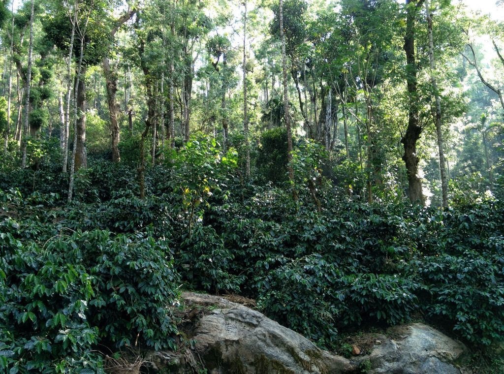
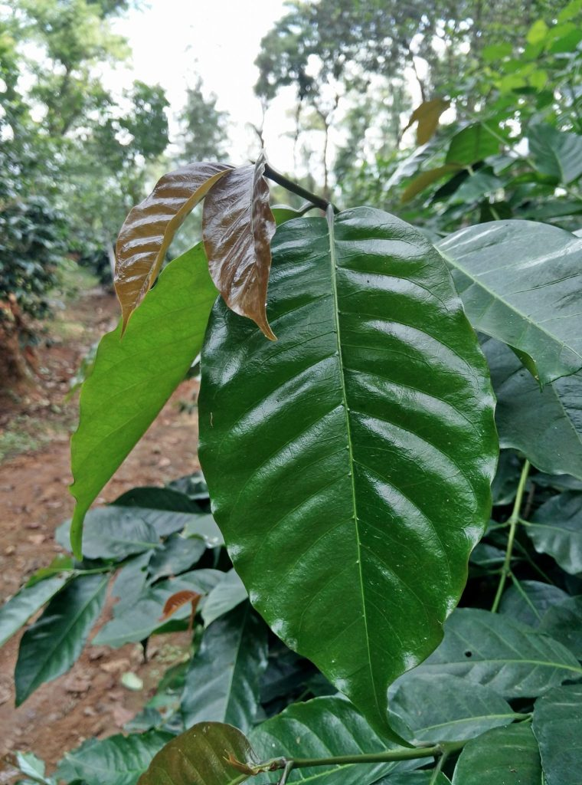
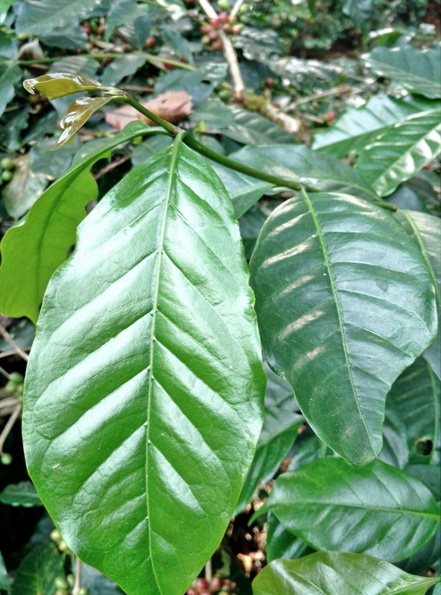
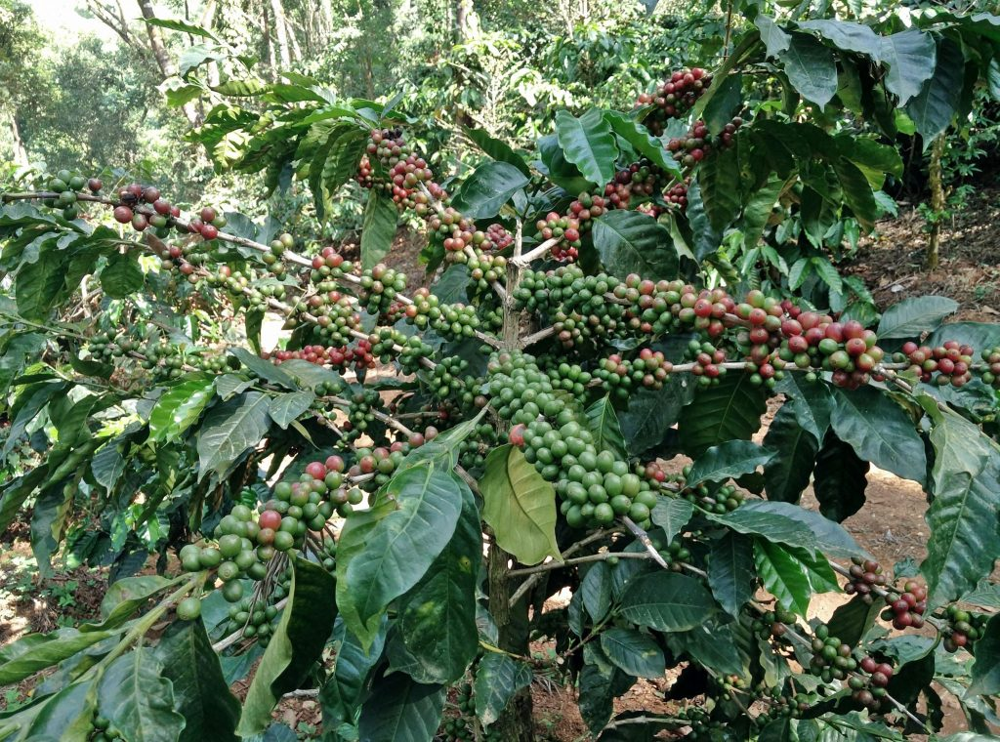
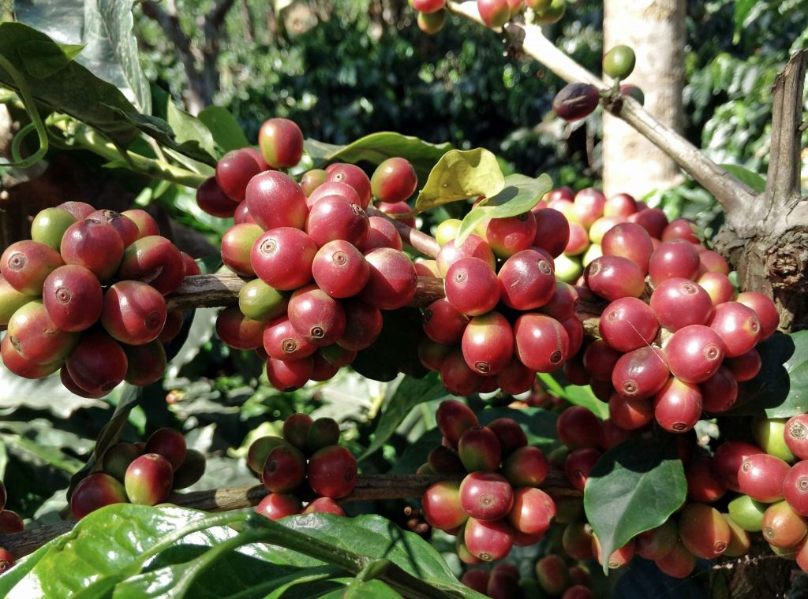
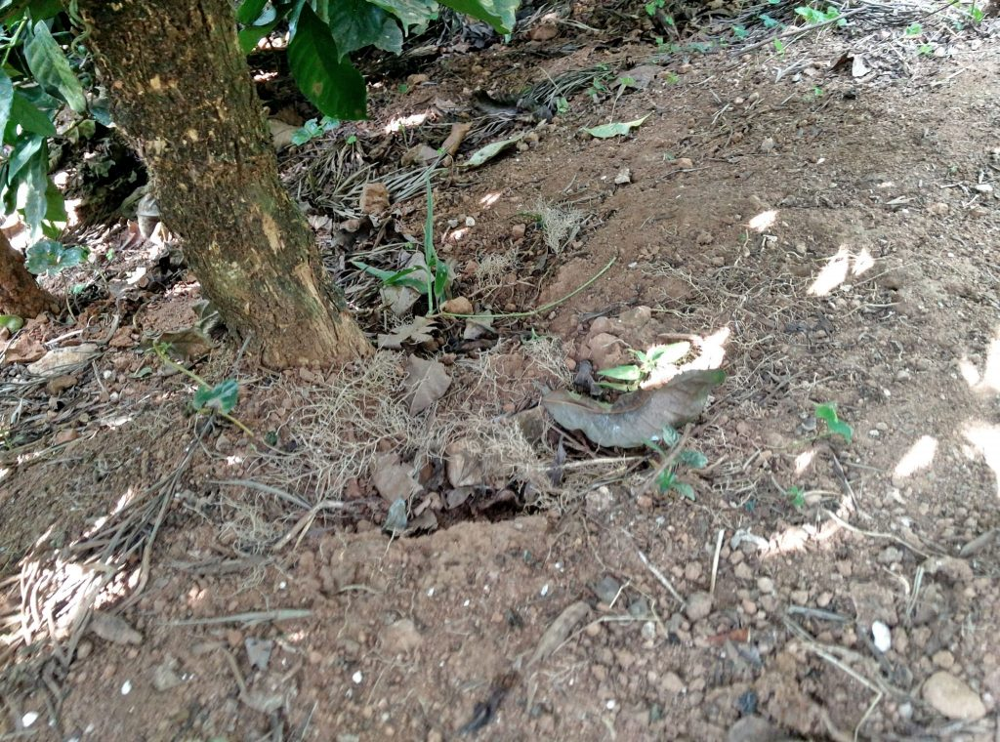
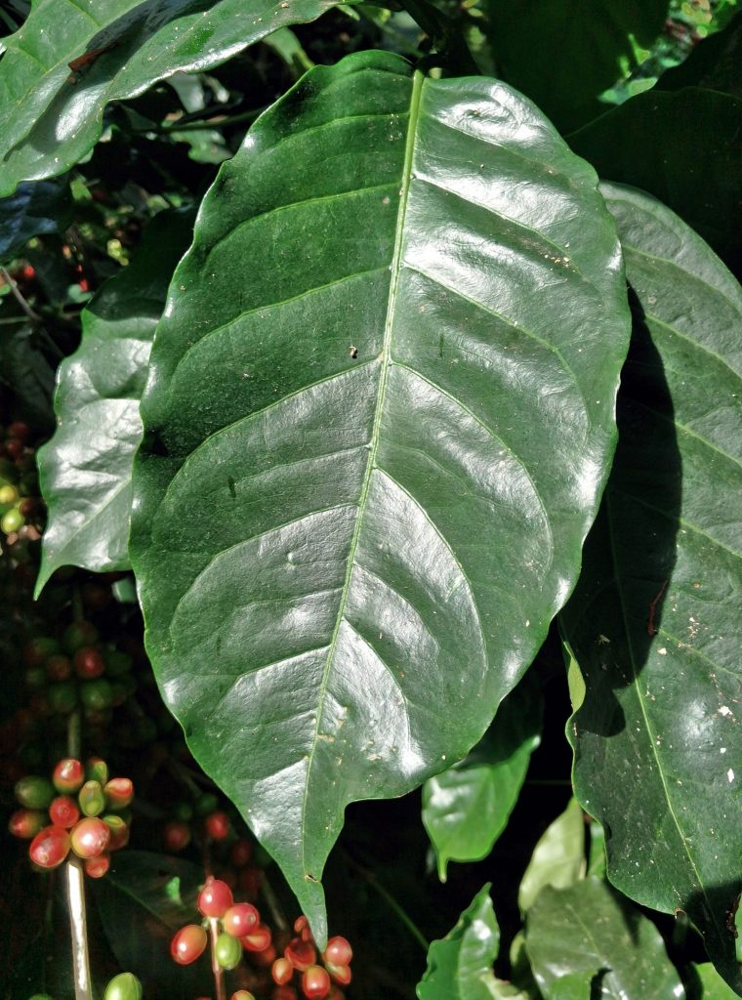
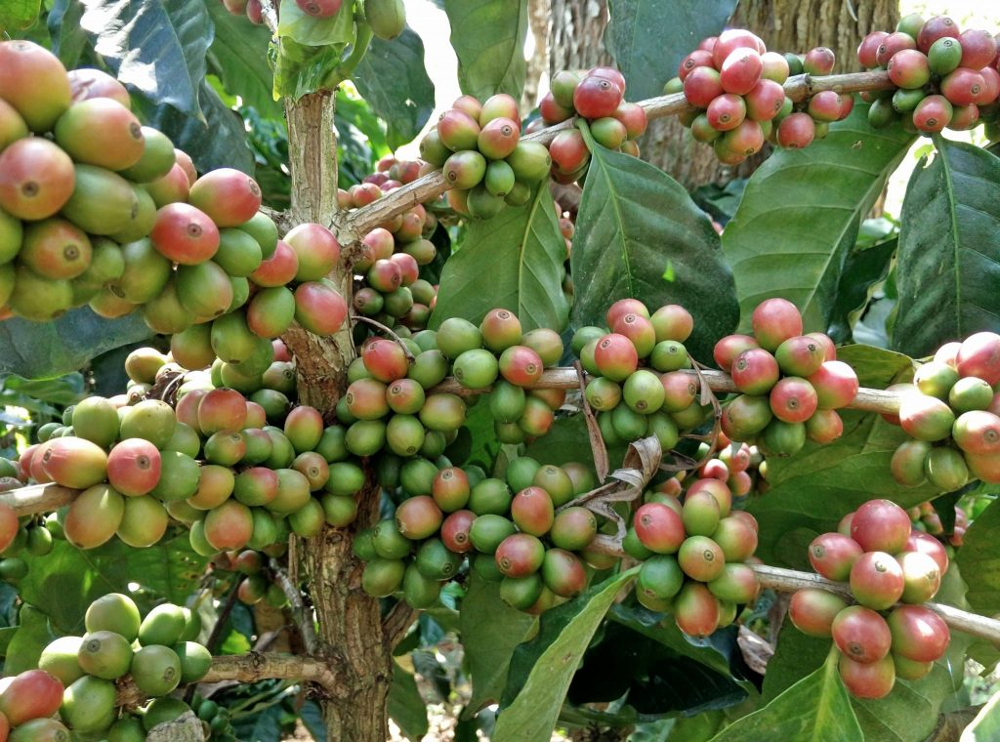
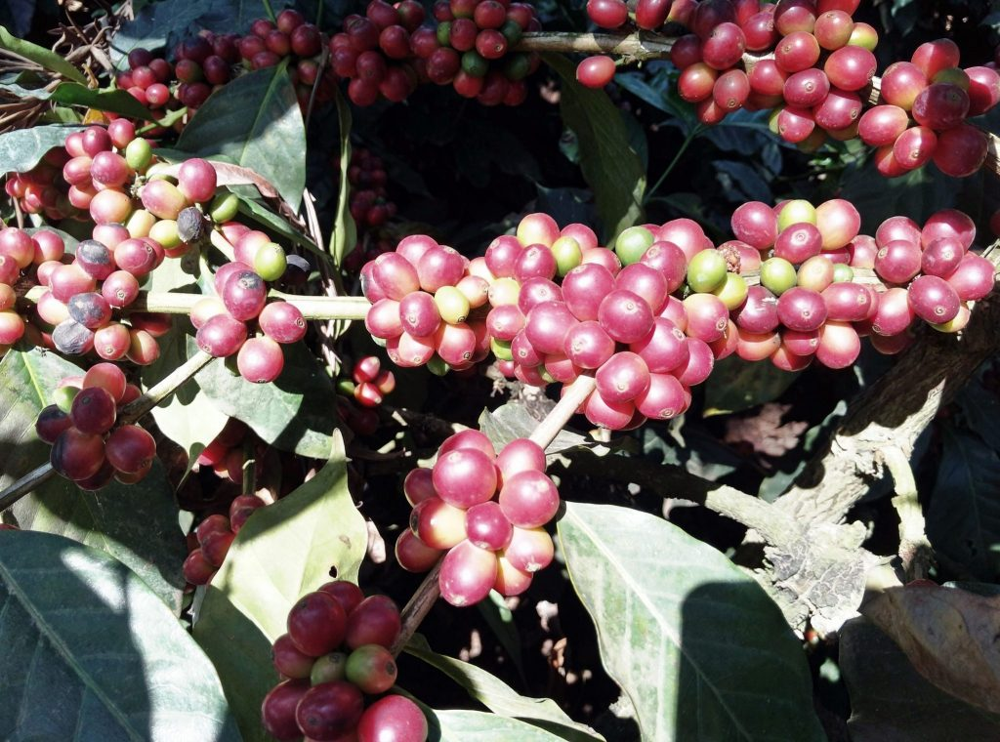
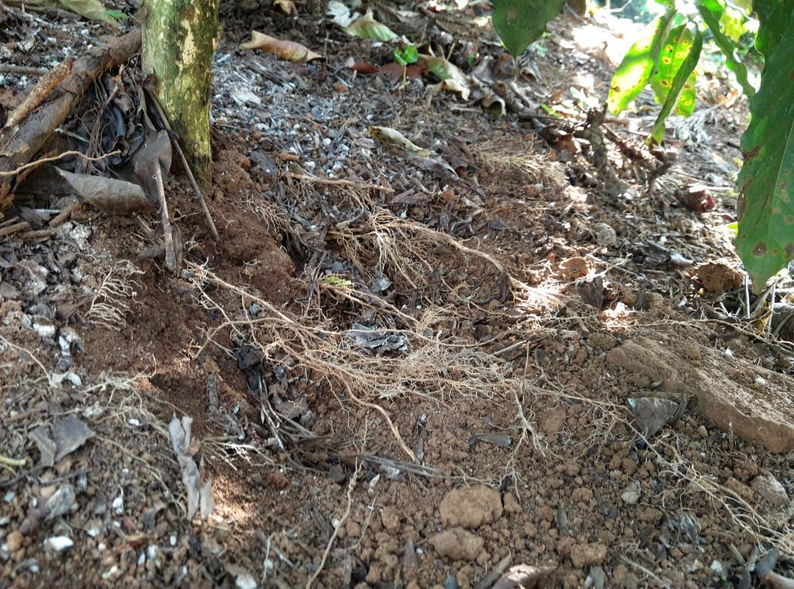

Humatesis the purest form of natural organic matter formed as a result of decomposed prehistoric plant and animal matter. Humates contain fulvic, humic, Ulmicacid and lignin. Leonnoditeis the most commonly occurring humateore which is yellow to dark brown in color.

### Benefits of humates

Humate is one of the most powerful natural antioxidants and free radical scavengers. Residual pesticides, herbicides and fertilizers are bound to compounds like lignin. This is then broken down by the beneficial microbes present in the rhizosphere to be taken up by the plants.

Major portion of humic acid is in carboxylic acid functional groups which endows these molecules with the ability to chelate (bind) positively charged multivalent ions like Ca++,Mg++,Fe++ and other trace elements. Thereby making the nutrients available in the soil to the plant roots by breaking down into absorbable forms

Humate is a complex energy source of acids and oxygen vital for stimulating microbial activity.

### Positive Role of Humic Acid

Increased leaf chlorophyll index and luster of the leaves.

Increased leaf area compared to the preceding leaf.

Increased feeder roots at the root zone which help in better absorption of nutrients.

All the above factors help in increased food production which in turn helps in better health condition of the plants.

### Field Experiments At Melkodige Plantations

A field trial was conducted at Melkodige group of Estates , located in South India, to observe the benefits of humic acid on coffee Arabica. Humic acid was applied twice a year. The first application of 12% humic acid solution was sprayed on to the urea and DAP granules and raked to ensure uniform coating and applied at the rate of one litre per acre.

The second application of 12% humic acid was done post monsoon (sept-oct) along with foliar, micronutrients and fungicide spray at the rate of 200 ml per barrel.

A control plot was also maintained with regular two rounds of basal dose of fertilizers and two rounds of fungicide sprays without the application of humic acid.

### Results

To illustrate the potential of humic acid, best yielding plants were randomly selected in the experimental as well as control blocks and observed for the following parameters leaf area, leaf lustre, number of bearing nodes in a primary, number of berries in a bunch and weight of berries.

A fortnight after the application of humic acid there was a marked increase in leaf chlorophyll index, the leaves turned dark lustrous green. There was a significant increase in the leaf area of emerging leaves in all varieties compared to the previous leaves in treated plants as well as control plants.

Table-1 Leaf Area in humic acid treated blocks

VARIETY

SLN 795

SLN 9

SACHIMORE

CATTIMORE

157.25

180

198

105

157.5

136

236.5

90

185.25

161.5

199.5

105

170

144

241.5

91

190

152

264

122.5

153

180.5

264

94.25

170

153

280.5

104

AVERAGE

169

158.1428571

240.5714286

101.6785714

Table 2 Leaf Area in Control Blocks

VARIETY

SLN 795

SLN 9

SACHIMORE

CATTIMORE

79.25

142.5

144.5

82.5

81

128

171

74.25

112.5

136

189

71.5

94.25

112

144

100.5

105

127.5

160

91

AVERAGE

94.4

129.2

161.7

83.95

The highest mean leaf area of 240.57 Sq. cms was recorded in humic acid applied sachimore variety. The lowest mean leaf area of 83.95 was recorded in control block of cattimore variety. Sachimore variety also had the highest mean leaf area difference of 201.13Sqcms compared to the control plants. The difference between control and humic acid treated blocks was 50.03 Sqcms across all varieties.

The number of nodes on a randomly selected primary was also recorded. The highest number of nodes on a primary was observed in humic acid applied blocks of sachimore variety 11.6 closely followed by cattimore 11.4.

Table-3 Number of Nodes in Primaries treated with Humic Acid

VARIETY

SLN 795

SLN 9

SACHIMORE

CATTIMORE

9

8

12

11

11

10

11

12

11

10

11

10

8

7

10

9

9

14

14

15

TOTAL

9.6

9.8

11.6

11.4

Table-4 Number of Nodes in Primary in Control Blocks

VARIETY

SLN 795

SLN 9

SACHIMORE

CATTIMORE

9

10

6

7

8

6

9

6

7

8

7

8

8

6

9

8

9

8

10

10

AVERAGE

8.2

7.6

8.2

7.8

The highest mean difference between treated and control block was found in sachimore variety 9.9 nodes. The mean difference between treated and control block was 2.65.

The third bunch from the apical end was used to record the number of berries. The highest number of berries 18.4 was observed in SLN 9 in the treated Block closely followed by sachimore variety.

Table-5 Number of berries in a Node/Bunch in Humic Acid treated Blocks.

VARIETY

SLN 795

SLN 9

SACHIMORE

CATTIMORE

15

30

23

20

15

20

15

18

21

28

21

20

20

18

24

22

17

15

18

23

AVERAGE

17.6

22.2

20.2

20.6

Table-6 Number of berries in a Node/Bunch in Control Blocks.

VARIETY

SLN 795

SLN 9

SACHIMORE

CATTIMORE

12

13

16

13

10

15

17

16

16

16

15

11

10

16

12

13

11

13

16

16

AVERAGE

11.8

14.6

15.2

13.8

The lowest number of berries 11.8 were observed in Un treated Block of S 795. The lowest mean average of 14.7 between the treatments was also recorded in S795 were a high of 18.4 was recorded in SLN9. The mean difference6.3 berries per bunch was observed across all varieties between the treatments.

Hundred berries of each variety from both treated as well as control blocks was harvested and weighed. The berry weight was highest in Sachimore variety closely followed by SLN 9 in treated blocks. However the lowest berry weight was observed in cultivar SLN 795

### Root growth and development

Visual observations of root growth and development among and between cultivars was also looked into though not analysed statistically. Humic acid application had a strong desired effect in terms of root hair growth and development in the surface feeder root zone of all the cultivars treated with humic acid compared to control.

### Discussion

Humic acid treatment among all the five cultivars chosen for the study showed significant difference in terms of leaf enhancement when compared to the control.

Table-11 Data Analysis pertaining to Leaf Analysis.

LEAF AREA

Varieties

Treatments

Control

Humic Acid

Mean

SLN 795

94.40

169.00

131.70

SLN 9

129.20

158.14

143.67

SACHIMORE

161.70

240.57

201.14

CATTIMORE

83.95

101.67

92.81

Mean

117.31

167.35

The study revealed that variety Sachimore responded the best and the significant difference in enhancement of leaf area was 42.6%. Review of literature indicates that humic acid application has increased left area in vegetable crops like bell pepper and tomato but there are no studies to indicate the effect of humic acid on coffee. Perhaps this is the first systematic study were the authors have tried to probe the role of humic acid application and its effect on coffee as a Plantation crop. (Erlanger yildirim, 2002;FabrizioAdani,  1998) .

Sachimore variety showed significant promise and the percentage increase in terms of increase in number of nodes was to the extent of 33.3%.

Table-8 Number of Nodes

TREATMENTS

VARIETIES

CONTROL

HUMIC ACID

MEAN

SLN 795

8.2

9.6

8.9

SLN 9

7.6

9.8

8.7

SACHIMORE

8.2

11.6

9.9

CATTIMORE

7.8

11.4

9.6

MEAN

7.95

10.6

The other cultivars showed promise with SLN 9 coming very close to Sachimore. (J. A. Fagbenro and A. A. Agboola, 2008; these authors observed increased plant height growth and nutrient uptake in humus rich and non humus Soils in teak plants. However no review is available for coffee arabica).

Another important parameter With respect to number of berries in a bunch was also evaluated towards to the varietal response of humic acid application.

Table-9 Number of Berries in a Bunch

TREATMENTS

VARIETIES

CONTROL

HUMIC ACID

MEAN

SLN 795

11.8

17.6

14.7

SLN 9

14.6

22.2

18.4

SACHIMORE

15.2

20.2

17.7

CATTIMORE

13.8

20.6

17.2

MEAN

13.85

20.15

The study revealed that a significant increase to the extent of 45.4% was observed in variety Sachimore with respect to control. All other varieties also showed a remarkable incremental value when compare to the control.

Response of humic acid application on weight of berries among the five different arabica varieties involved in this study,  revealed that variety SLN 9  showed a significant increase to the extent of 16.33% followed by the variety Sachimore.

Table-10 Weight of Coffee Berries

VARITIES

TREATED

CONTROL

MEAN

SLN 795

174.49

155.71

165.1

SLN 9

210.86

181.26

196.06

SACHIMORE

216.99

202.92

209.955

CATTIMORE

183.68

163.33

173.505

MEAN

196.505

175.805

186.155

Our observations point out to the fact that apart from humic acid application, the genotype may also play a role in the inherent weight of a particular cultivar. However it was clearly evident in our study that humic acid application increased the weight of the berries uproar to 11.7% in comparison to control. (YasarKarakurt.  Et. AL, 22.  The authors observed an increased chlorophyll and mean fruit weight in bell pepper due to the influence of foliar and soil fertilization of humic acid).

Our study also indicated that there was an increase in root development and stimulation of root hairs in feeder roots of coffee which is essentially restricted to the top two inches layer of soil even though this aspect of the study was not qualitatively assessed, humic acid has a important role to play in root stimulation and development. (Fabrizioadani, et;al 1998. These authors also observed an increased root growth and nutrient uptake due to the effect of commercial humic acid on tomato plant growth).

### Conclusion

Melkodige estate has to its credit a number of eco-certifications in terms of sustainability. The present study, perhaps the first of its kind in relation to coffee has shown tremendous response in significantly bringing about a positive change in all the parameters studied. Humic acid application will not only contribute in maintaining the humus content but in the long run will significantly bring about a qualitative and quantitative change in the coffee eco – system.

### References

Anand T Pereira and Geeta N Pereira. 2009. Shade Grown Ecofriendly Indian Coffee. Volume-1.

[Humic Acid](http://www.xsyagri.com/portfolio/humic-acid/?gclid=CI2l9IvP59ECFVWhaAodD4YIYQ)

[What are some agricultural uses of humic acid?](https://web.archive.org/web/20180513183646/https://www.reference.com/business-finance/agricultural-uses-humic-acid-ab282d3389c1cac9)

[Humic acid From Wikipedia](https://en.wikipedia.org/wiki/Humic_acid)

[MORE THAN TWO CENTURIES OF HUMIC ACID RESEARCH](https://humicacid.wordpress.com/a-history-of-humic-acid-research/)