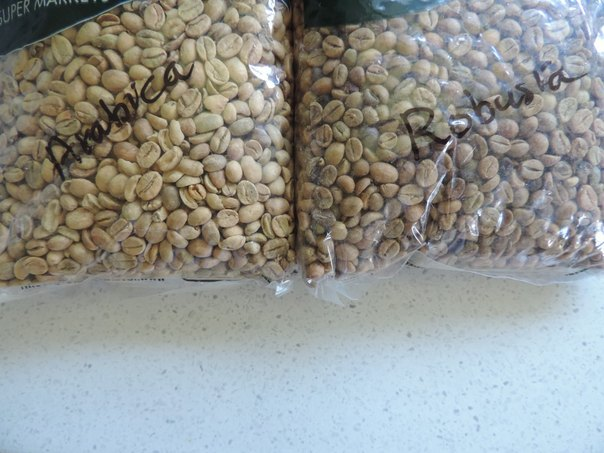
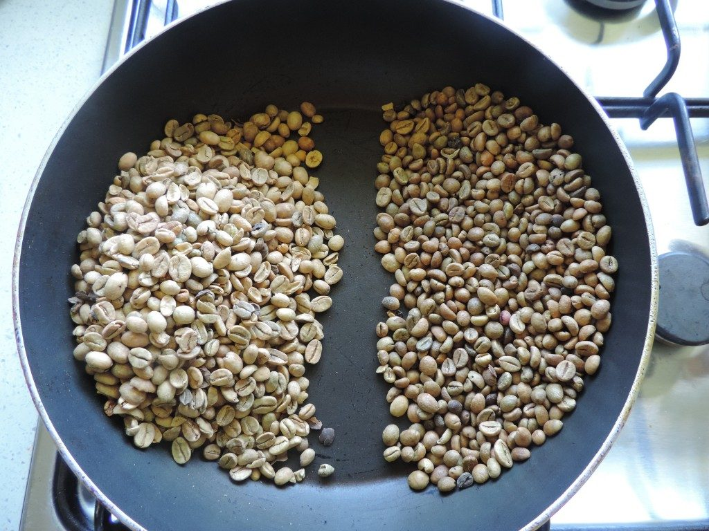
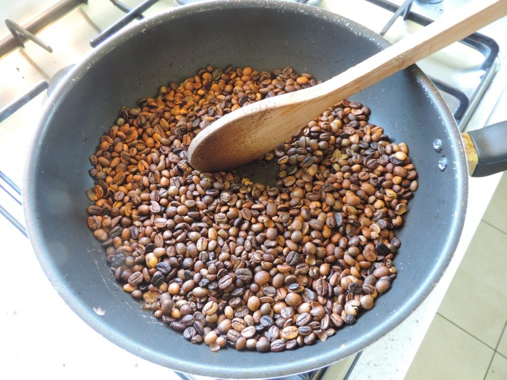
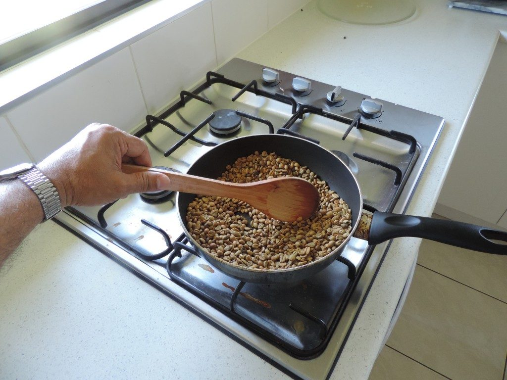
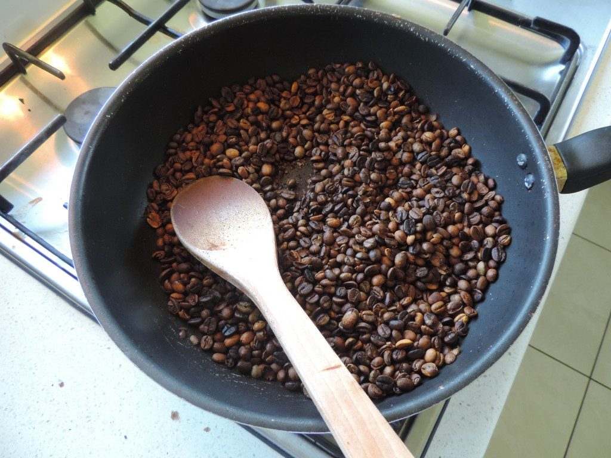
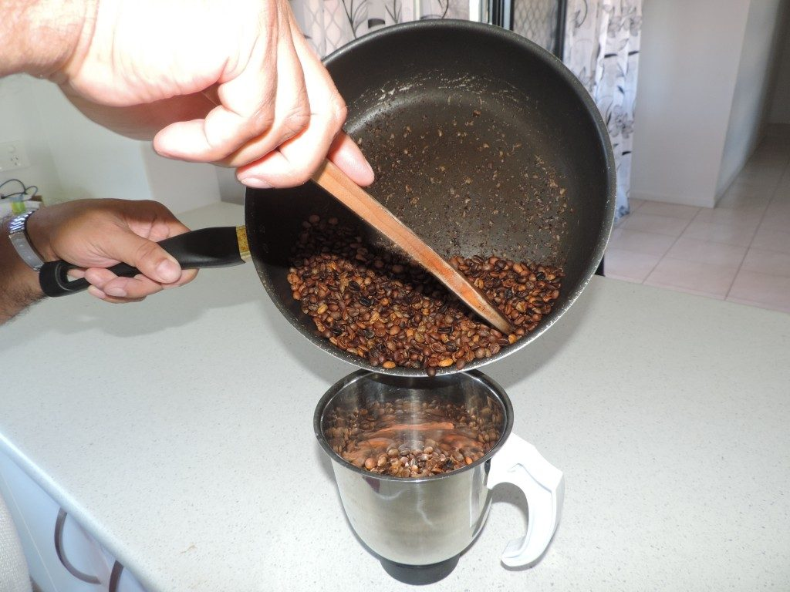
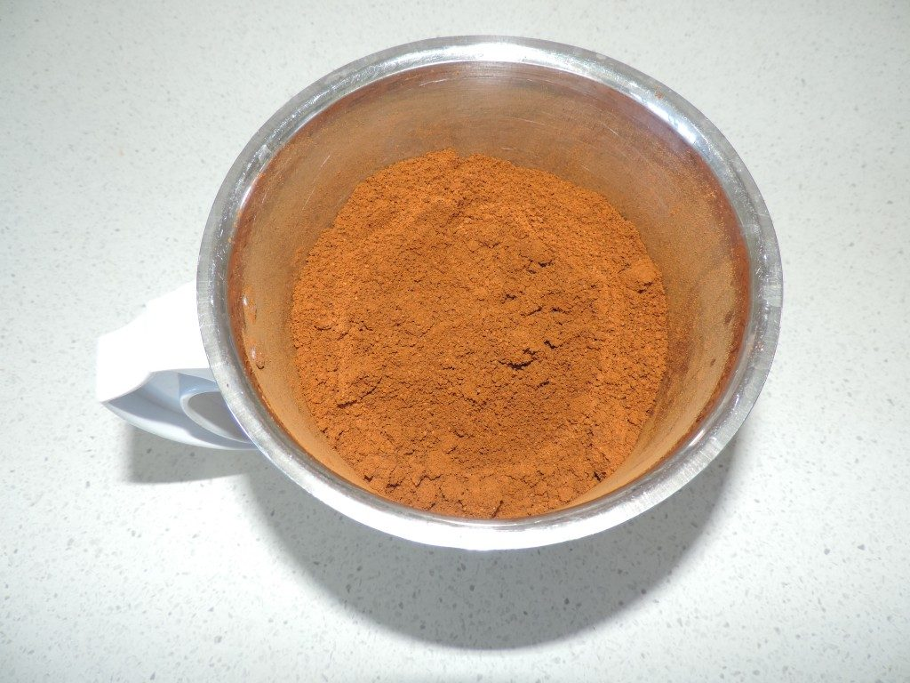
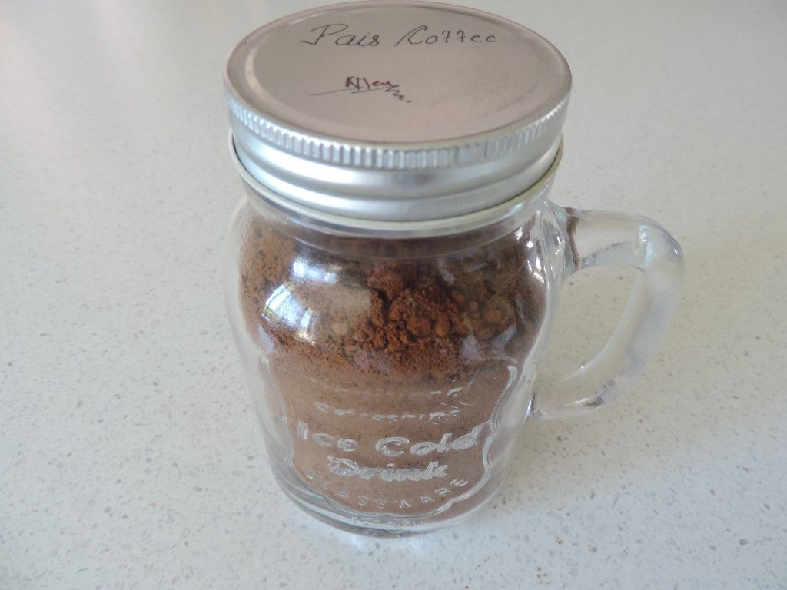

Buying a cup of coffee at a well-known branded outlet is no longer an affordable purchase. A 16 ounce coffee can cost between $2-$5 USD/AUD. It is sometimes alarming that the person who purchases the coffee is unaware what goes into making that coffee. I understand that not everyone is aware of the coffee process, but when one spends $2 to $5 dollars 3 to 4 times a day, I would expect it is very important to know more about coffee.

In this article, I will show you how I saved money by purchasing, blending and roasting my own coffee.

### Why would you want to create your own coffee?

Whenever you have guest visiting your home, you spend a lot of time in deciding the dishes and the variety of food you want to prepare that has a delightful taste. Use the same method when you prepare your own coffee. Create your own signature blend to your own liking. Imagine enjoying a cup of coffee that can be had exclusively at your home with friends and relatives, filling the house with the rich aroma of the finest roasted beans. Don’t let the idea intimidate you because, in an instant, you can be a barista in your own home.

### The Main Two Types Of Coffee Beans:

#### #1 Arabica

The Arabica coffee plant is grown almost all over the world and its beans compose 70% of the Coffee beverages, it is very highly favourable and contains less caffeine, the soil, altitude where the plant grows, manure play a key role in the flavour of the coffee bean. The bean is larger than a Robusta Bean and the flat side of the Arabica bean have a crack in the shape of an “S”. Arabica is an older type of plant, it is more aromatic, less bitter in taste. Its share on the world market amounts to around 70% and is self-fertilizing.

#### #2 Robusta

The Robusta coffee plant is found worldwide, but is mostly cultivated in Asia. The Robusta bean contains more caffeine, The plant life of a Robusta plant is much longer than an Arabica plant. The Robusta Coffee bean has a crack that is almost in a straight line. Robusta is more resistant against heat, diseases and parasites. Robusta share on the world market amounts to around 30%. Robusta depends on cross pollination.

### How was I motivated to Roast and Make my own Coffee?

Being born in the coffee farming community, I always wanted to find ways to drink coffee in a simpler and cost effective way. I refuse to pay for a coffee for 5 times more than what it costs me to make myself.

Some years back I was talking to a Priest who is related to us, Rev Fr John Texeira, who also comes from a coffee growing region Virajpet in Coorg INDIA. Whenever we had a discussion on coffee he would always say use 50% of Robusta and 50% of Arabica beans and then roast together in a hot pan. Then powder it in a mixer or manual grinding stone.

That is real coffee. There would not be a coffee better than that. The very next month I tried out his method and it worked fine for me. From then on we made coffee the 50% way for our daily use.

#### Robusta 50% and Arabica 50% Method of Roasting Coffee for 500 Grams of Coffee Powder:

These instructions will yield 50 cups of 16 ounce coffee. Roasting and making your coffee can reduce your coffee expenses by 80% or more.

**Ingredients:**

-   250 Grams Robusta Beans.
-   250 Grams Arabica Beans.
-   Milk as required.
-   Sugar as required.
-   Water

**Cooking Energy:**

-   Energy/heat as required.

**Method:**

-   Roast 50% of Arabica and 50% of Robusta on a hot pan with medium flame, constantly keep stirring the beans as they may get burnt if left unattended.
-   Depending on your taste, roast it to either dark brown or light brown.
-   Once the colour has been achieved to your taste, let the beans cool down, test a few beans by powdering them with a manual grinding stone to ensure they are brittle enough, to move to the process of powdering.
-   When the beans are cool enough, transfer all the beans into a coffee mixer or a manual grinding stone.
-   Powder/mix well until you have finely ground them to your necessity.

### Brewing Coffee Powder

Finely ground coffee powder may not process through the coffee machine. You may have to coarsely grind to use a coffee machine, or use the traditional method of boiling coffee.

-   Once the powder is ready let it cool down.
-   Use one table spoon for I cup of coffee and add sufficient water into a sauce pan, heat well until the coffee starts to over flow from the pan, wait for a few minutes for the coffee to settle down and pour into a cup, use a strainer if necessary.
-   Add milk and sugar to your taste.
-   Now you can drink your own coffee that is cost effective and making your own coffee blend allows you to have your own cup profile at reduced costs.

### ACKNOWLEDGEMENT

We wish to thank Rev Fr John Texeira, Parish Priest, Najangud Mysore & Rev Fr Aloysius Menezes, KRS Mysore. INDIA