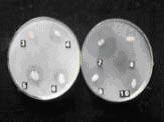

Our deep understanding of microbes, at the cellular level, coupled with our expertise in isolating nitrogen fixers and phosphate solubilizers, (PhD Thesis) has resulted in the creation of a pool of beneficial microbes. These microorganisms are involved in various transformations, releasing locked up energy and organic nutrients and making it available to coffee and allied crops. The dual effects of phosphorus mobilizing fungi and specific nitrogen-fixing bacteria can cater to the partial needs of the current coffee plantation sector.

Thus, soil microorganisms provide precious life to soil systems catering to plant growth. These microorganisms work incognito to maintain the ecological balance by active participation in carbon, nitrogen, sulfur and phosphorous cycles in nature. Soil microorganisms play a pivotal role both in the evolution of agriculturally useful soil conditions and in stimulating plant growth. They also participate in the cycles of the essential macro and micro-elements, thereby making it available at various stages of growth.

This article is especially written for the benefit of the Coffee Planters, in understanding the pivotal role played by microorganisms, in various beneficial transformations, especially in the release of locked up phosphorus for the growth and development of coffee and multiple crops inside coffee agroforestry. The reason for this is that crops often remove as little as 10 % of the applied phosphorus, the rest becoming rapidly “fixed” by chemical reactions with mineral oxides and other soil components. It is a fact that all Planter’s should understand, that the dynamics of phosphorus and other elements in soil is closely related to the dynamics of the biological cycle in which microorganisms play a cardinal role.

**Type of Microorganisms**

A number of microbes are responsible in the decomposition of organic and inorganic phosphorus compounds in various types of soils like clay, sandy loam, laterite and iron rich soils. The commonly reported genera include Achromobacter, Aereobacter, Agrobacterium, Bacillus, Burkholderia, Erwinia, Flavobacterium Microccocus, Rhizobium and Pseudomonas.

The microbial fungi that function similarly include strains of Achrothcium, Alternaria, Arthrobotrys, Aspergillus, Cephalosporium, Cladosporium, Curvularia, Cunninghamella, Chaetomium, Fusarium, Glomus, Helminthosporium, Micromonospora, Mortierella, Myrothecium, Oidiodendron, Paecilomyces, Penicillium, Phoma, Pichia fermentans, Populospora, Pythium, Rhizoctonia, Rhizopus, Saccharomyces, Schizosaccharomyces, Schwanniomyces, Sclerotium, Torula, Trichoderma, and Yarrowia .

In addition, approximately 20% of actinomycetes could solubilize P, including those in the genera *Actinomyces, Micromonospora*, and *Streptomyces*. Algae such as cyanobacteria have also been reported to show P solubilization activity .

However, the most efficient phosphate-solubilising microorganisms (PSM) belong to the bacterial genera Bacillus and Pseudomonas and the fungal genera Aspergillus and Penicillium.

**Shade and Coffee**

The Coffee ecosystem is blessed with heterogeneous trees with permanent and temporary shade. Some of these trees are known to shed their leaves on a regular basis along with fruits which enriches the soil organic matter content.

Also, in case of Robusta Plantations, shade is regulated by pruning excessive growth either once a year or every alternative year. This adds significant amounts of biomass to the coffee ecosystem.

The package of practices inside shade coffee results in many soil loosening practices which involves scuffle digging, trenching for water conservation or deep scuffling to loosen the soil and root mat.

All these practices help in aeration and moisture conservation of soils, which in turn aid in the multiplication of beneficial soil microbes.

**Role of Microorganisms**

These soil microorganisms play a major role in the decomposition of plant residues, creation of humus and maintenance of stable soil structure. Microorganisms directly affect the amount of phosphorus accessible to plants by means of mineralization of organic phosphorus compounds, immobilization of fixed phosphorus and solubilisation of insoluble phosphorus locked in minerals like hydroxyl apatite and tri calcium phosphate. Sad but true, most of the phosphorus available in coffee soil is in the unavailable form. Organic phosphorus compounds in coffee soil are an important supply of this plant nutrient, which in turn is available only after they have been mineralized. Mineralization is catalysed by microbial enzymes called phosphatases.

**Phosphate Solubilizing Microbes:**

Phosphorus is an important nutrient for plants. There are several microorganisms which can solubilize the cheaper sources of insoluble inorganic phosphorus, such as rock phosphate, tricalcium phosphate, dicalcium phosphate and hydroxyapatite. Bacteria like Pseudomonas striata, and Bacillus megaterium are also important phosphorus solubilizing soil microorganisms. Many fungi like Aspergillus and Penicillium are potential solubilizers of bound phosphates. They solubilise the bound phosphorus and make it available to the plant, resulting in improved growth and yield of crops. Overall, bacteria are more effective in phosphorus solubilisation than fungi.

Many Scientific reports show evidence of phosphate solubilizers  playing an important role in plant growth promotion through production of Indole Acetic Acid (IAA), ACC deaminase siderophore, phytohormones and 1-amino-cyclopropane-1-carboxylate deaminase activity, antibiotics, Hydrogen Cyanide (HCN) and exopolysaccarides. Many Phosphate Solubilizing Bacteria (PSB) including species of Pseudomonas, Azospirillum, Azotobacter, Klebsiella, Enterobacter, Alcaligenes, Arthrobacter, Burkholderia, Bacillus, Rhizobium and Serratia have been reported to enhance plant growth in many commercially important crops.

Besides solubilizing P, some PSM also demonstrate potential as biocontrol agents against some plant pathogens. PSM inhibit plant pathogens by producing antifungal compounds.

Soil phosphates are rendered available to plants by soil microorganisms through secretion of organic acids. Among them gluconic acid seems to be the most frequent agent of mineral phosphate solubilisation. Another organic acid that may be responsible in phosphate solubilisation is 2 ketogluconic acid. Therefore, phosphate dissolving soil microorganisms play some part in correcting phosphorus deficiency in plantation soils. They may also release soluble inorganic phosphate into soil through decomposition of phosphate rich organic compounds. These microbial inoculants can substitute almost 20 to 25% of the phosphorus requirement of plants.

**Coffee Husk**

Phosphate solubilising microbes can also be inoculated to coffee husk along with rock phosphate while preparing compost to enrich the compost with available phosphorus.

**Conclusion**

The need of the hour, is to protect the health of Coffee soils from irresponsible and indiscriminate use of chemical or synthetic fertilizers. The mechanism of phosphate mineralization is exceedingly understood along with the pathways. As such, we need a change in mind-set in embracing new technologies which are sustainable and cause no harm to the coffee ecosystem.

**References**

Anand T Pereira and Geeta N Pereira. 2009. Shade Grown Ecofriendly Indian Coffee. Volume-1.

Bopanna, P.T. 2011.The Romance of Indian Coffee. Prism Books ltd.

Alexander M. 1977. Introduction to soil microbiology (2nd ed.). NewYork: John Wiley,

p 337

Anand Titus Pereira & Gowda. T.K.S. 1991. Occurrence and distribution of hydrogen dependent chemolithotrophic nitrogen fixing bacteria in the endorhizosphere of wetland rice varieties grown under different Agro climatic Regions of Karnataka. (Eds. Dutta. S. K. and Charles Sloger. U.S.A.) In Biological Nitrogen Fixation Associated with Rice production. Oxford and I.B.H. Publishing. Co. Pvt. Ltd. India.

Booker, Karen. 2000. Fertilizers and Soil Amendments: It’s Tricky Business. Erosion Control Feature Article, September/October.

Martin Alexander. 1978. Introduction to soil microbiology. Second edition. Wiley Easter Limited. New Delhi.

Wright, S. F. 2003. The importance of soil microorganisms in aggregate stability. Proc. North Central Extension-Industry Soil Fertility Conference. 19:93-98.

> [Role of Bacteria in Coffee Plantation Ecology](https://ecofriendlycoffee.org/role-of-bacteria-in-coffee-plantation-ecology/)

[Role of Fungi](http://ecofriendlycoffee.org/role-of-fungi-in-coffee-plantation-ecology/)

[http://ecofriendlycoffee.org/endomycorrhizae/](http://ecofriendlycoffee.org/endomycorrhizae/)

> [Farm Coffee Organic Manures](https://ecofriendlycoffee.org/farm-coffee-organic-manures/)

> [Endomycorrhizae](https://ecofriendlycoffee.org/endomycorrhizae/)

[Phosphate solubilizing bacteria](https://en.wikipedia.org/wiki/Phosphate_solubilizing_bacteria)

[Essential Role of Phosphorus](https://www.cropnutrition.com/efu-phosphorus)

[Microbiological transformations](https://www.researchgate.net/publication/275681213_Microbiological_transformations_of_phosphorus_and_sulphur_compounds_in_acid_soils)

[Microbial Phosphorus](https://www.ncbi.nlm.nih.gov/pmc/articles/PMC5454063/)

[Phosphate Solubilization](https://www.ncbi.nlm.nih.gov/pmc/articles/PMC5027377/)