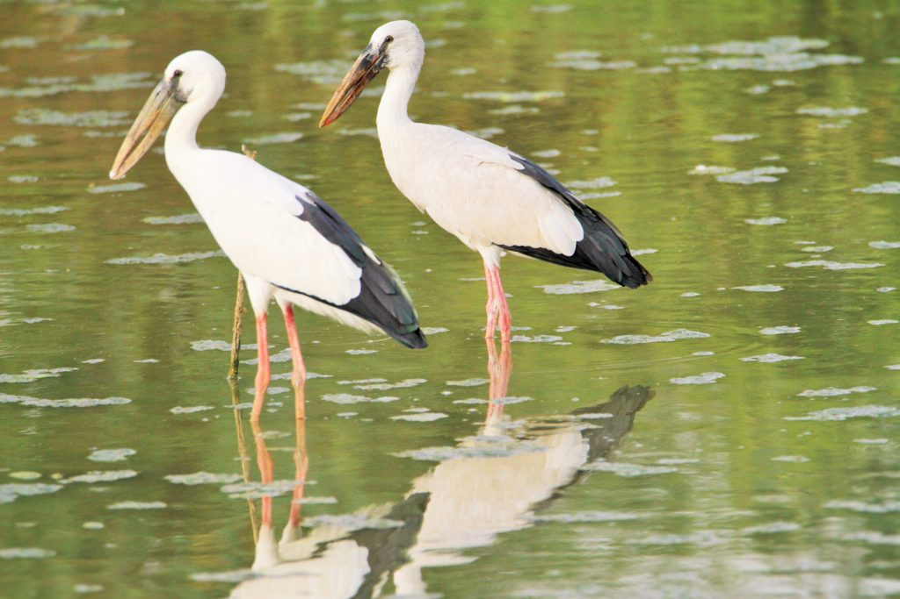
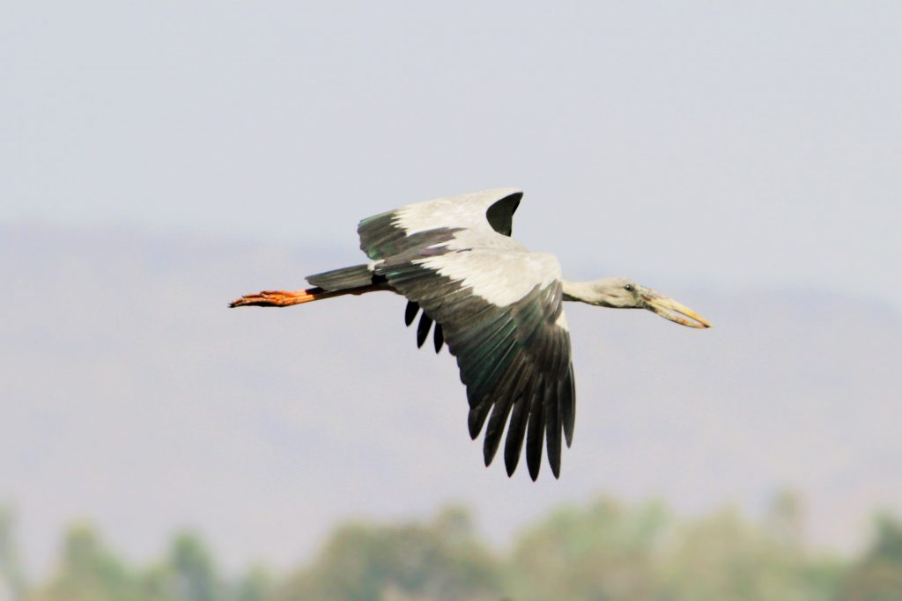

### Introduction

The Coffee Forests are safe havens for many species of migratory birds. Often the coffee Planters fail to realize the importance of migratory birds as vital links in biodiversity conservation. Not only do migratory birds help in seed dispersal but several duck species transport fish eggs in their guts to new water bodies. This article pertains to the Asian openbill stork.

The Asian open-billed stork is also called Indian open-billed stork, oriental open-billed stork, or the open bill stork.

Scientific Classification

Kingdom: Animalia

Phylum:   Chordata

Class:      Aves

Order:      Ciconiiformes

Family:    Ciconiidae

Genus:     Anastomus

Species:   A.oscitans

Binomial name Anastomus oscitans

### **Description**

Asian open bills storks are medium-sized birds. They are on average, 81cm long with a wingspan ranging from 147 to 149 cm. The bird has greyish or pale white with glossy black wings and a forked black tail. Their legs are red and their bills are a dull, yellow-gray color. The bird has a gray plumage in the non-breeding season and a white-black plumage during its breeding season. During, the non-breeding season, the bird lacks glossy black wings and green-purple sheen.

Males and females are sexually monomorphic and are usually distinguished by position during copulation rather than by physical appearance.

### Behavior

Asian open bill storks are diurnal. They are highly social and feed along with herons and other storks.

### Bill

Adult birds have a gap between the arched upper mandible and recurved lower mandible. Juvenile birds do not have such gaps in their beaks.

### Distribution/Range

Asian openbill is found in the Indian subcontinent and Southeast Asia. However, they are winter visitors to bird-friendly shade coffee and spend about two to three months before migrating to other places.

Range

Although residents are within their range, they make long-distance movements in response to weather and food availability.

### **Communication and Perception**

Asian open bills resort to bill-clattering as their primary method for various forms of communication. Bill-clattering also serves as an important form of communication during the breeding season. Asian open bills rely heavily on sight and touch to perceive their environment. Asian open bills, like other storks, are largely mute due to the absence of syrinx muscles, hence vocalization is minimal.

### Courtship

The male bird shows its skills by the display of nest-building behavior. Males lure the female by showing potential nesting sites and manipulating materials for nest construction. Females choose good nest-builders so they can save energy and maintain a good physique to meet the costs of reproduction.

### Breeding/Nesting

The breeding season in South India is from November to March. They may skip breeding in drought years. The birds breed colonially, building a rough platform using leaves, grasses, branches, twigs, and sticks, often half-submerged typically laying two to four eggs. Males may sometimes form polygynous associations, typically with two females who may lay their eggs in the same nest.

Nesting is either shared with those of egrets, cormorants, or darters. Both parents take equal responsibility in hatching, fledging, and protection. They take turns in incubation, the eggs hatching after about 25 days. The chicks emerge with cream color and are shaded by the loosely outspread and drooped wings of a parent.

The nestlings are completely dependent on the parents through fledging at 35 to 36 days and continue to remain dependent until reaching sexual maturity at 60 days.

### Diet/Feeding

Asian open bills diet primarily consists of aquatic invertebrates such as Molluscs, lizards, crustaceans, fish, insects, reptiles, and amphibians.

### Habitat

These birds arrive in flocks of two to three dozens and occupy wetlands or semi-aquatic habitats. They do not like to swim in deep ponds or lakes. They prefer shallow aquatic habitats.

### Flight

The Asian openbill is a broad-winged soaring bird, which relies on moving between thermals of hot air for sustained flight. Like all storks, it flies with its neck outstretched in the air.

### Threats

The species is threatened by the loss of wetland habitat. Overfishing and the erection of dams in sensitive breeding sites have resulted in population decline. The eggs and nestlings of Asian openbills, are commonly preyed upon by crows and *spotted eagles*, and monitor lizards.

### Conservation Status

Least Concern (IUCN

### Personal Observations

Due to the influx of a large number of migratory birds during the winter months, the Asian open bills do not find adequate feeding grounds. Hence they prefer to share the same feeding grounds with Ibises, Herons, Egrets, and other storks.

### Ecosystem Roles

These birds are excellent ecosystem indicators. They are vital components of wetland ecosystems and are responsible for establishing significant links in food webs and nutrient cycles.

Their droppings are rich in nitrogen and phosphorus thereby fertilizing rice fields.

They feed on snails which is a major rice pest

### **Lifespan/Longevity**

The longest lifespan of Asian open bills in captivity is 18 years.

Commensal/ParasiticSpecies  
trematode (*Chaunocephalus ferox*)

trematode (*Echinoparyphium oscitansi*)

### Conclusion

We do hope every nature lover will take a keen interest in learning about birds and inculcate ways and means of protecting them. Our idea to post appropriate write-ups; is to promote, educate and inspire the young to have a greater interest in the Planet’s living riches. One area of concern is the loss of wetland habitat which is increasingly being converted to oil palm plantations and areca gardens. This practice literally cuts off the food supply during the refueling stops of all migratory birds. Indiscriminate use of pesticides can significantly increase mortality. The use of plastics in agriculture is also responsible for the decline in the numbers of these beautiful birds because they often get choked when ingesting food along with microplastics.

Conservation of intact ecosystems will greatly enhance the survival of the Asian open bill.

### References

Anand T Pereira and Geeta N Pereira. 2009. Shade Grown Ecofriendly Indian Coffee. Volume-1.

Bopanna, P.T. 2011.The Romance of Indian Coffee. Prism Books ltd.

[Anastomus oscitans](https://animaldiversity.org/accounts/Anastomus_oscitans/)

[EXTERNAL LINKS](http://www.conservationindia.org)

[Asian openbill](https://en.wikipedia.org/wiki/Asian_openbill)

[Asian Openbill Stork](https://thewebsiteofeverything.com/animals/birds/Ciconiiformes/Ciconiidae/Anastomus-oscitans)