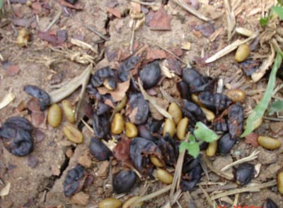
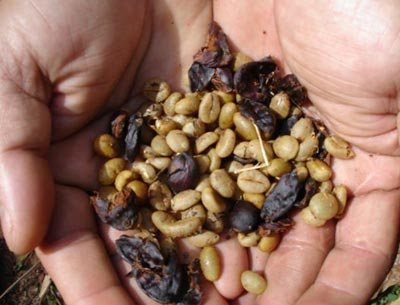
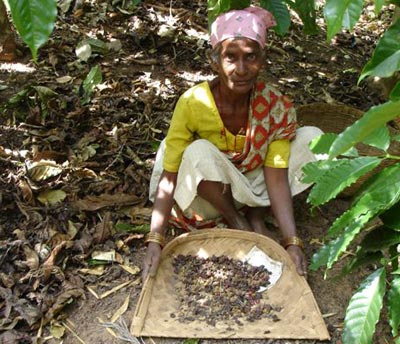
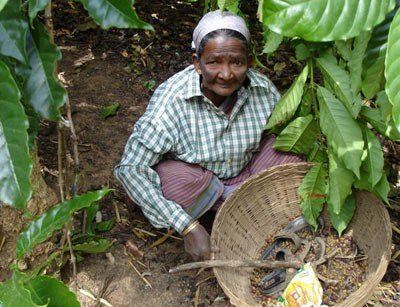

For almost 44 years we have been located in an area which is opposite to the Dhubare forest. It has been a common practice for monkeys over the years to come into the coffee farm and relish their taste buds by chewing coffee beans when they are ripe.

I was impressed recently when I read in an article that these kind of products do fetch a prize in the international market. In the past these beans used to lay on the ground and were rarely picked.We have now decided to pick these chewed beans and present it to the international market. On collection of the beans we were impressed to note the quantity worked out to a 50 kilo sack.

The Monkeys normally chew the beans which are at the forest boundary and safely move away when there are passers at the boundry, normally during the picking season employees do not spend time picking at the boundary since the beans have been already chewed and thrown on the ground, a perfect pulping technique. The monkey chews the bean so well that it does not distroy the bean.

I wish to express my profound gratitude to Errol James Pais *Providence Estate* Siddapur,Kodagu INDIA for being a part of this project.

### Resources

[Roasting and Brewing Toddy Cat Coffee](https://ineedcoffee.com/roasting-brewing-toddy-cat-coffee/) – Making coffee from Toddy Cat coffee.

[Toddy Cat Coffee Beans](http://ecofriendlycoffee.org/toddy-cat-coffee-beans/) – Primer on Toddy Cat coffee beans.

[Toddy Cat Coffee Bean Process](http://ecofriendlycoffee.org/toddy-cat-coffee-bean-process/) – Civet coffee process.