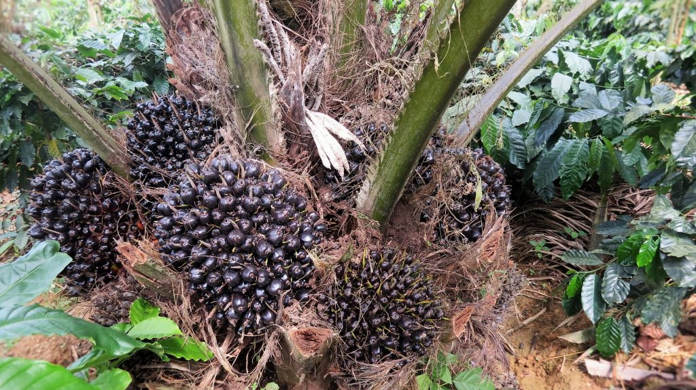
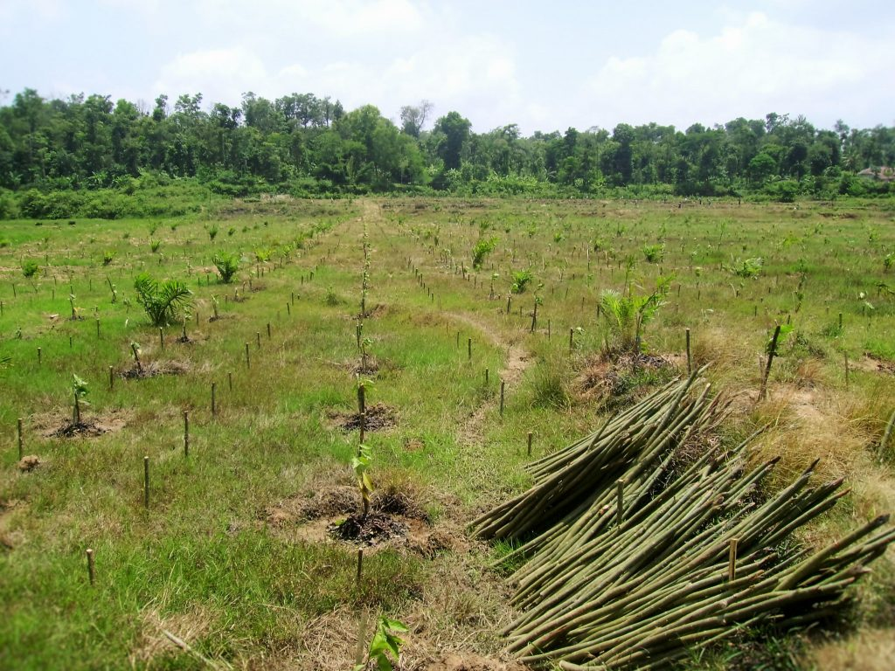
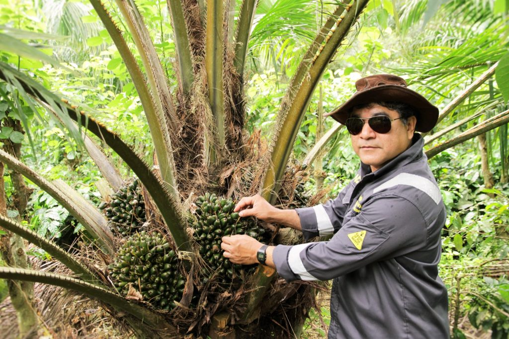
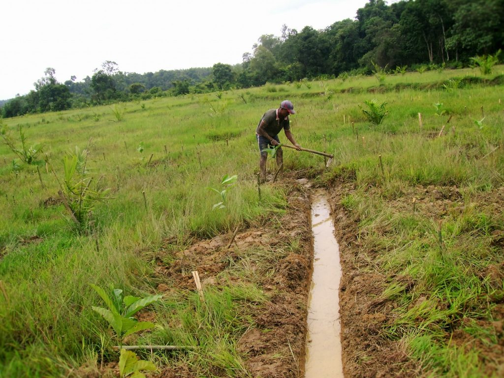
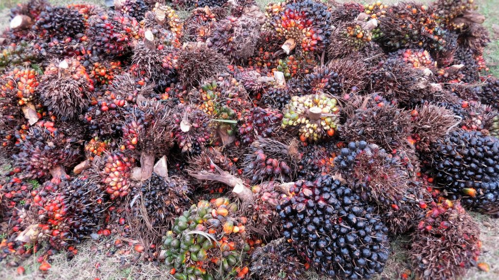
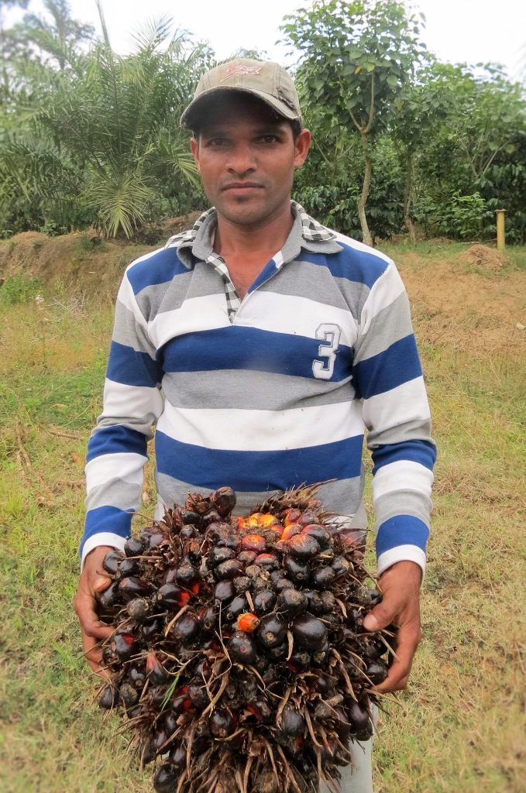
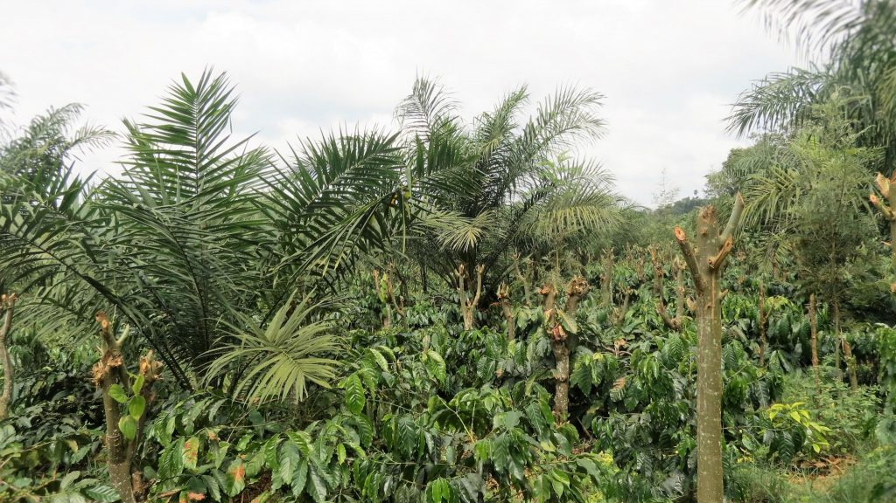
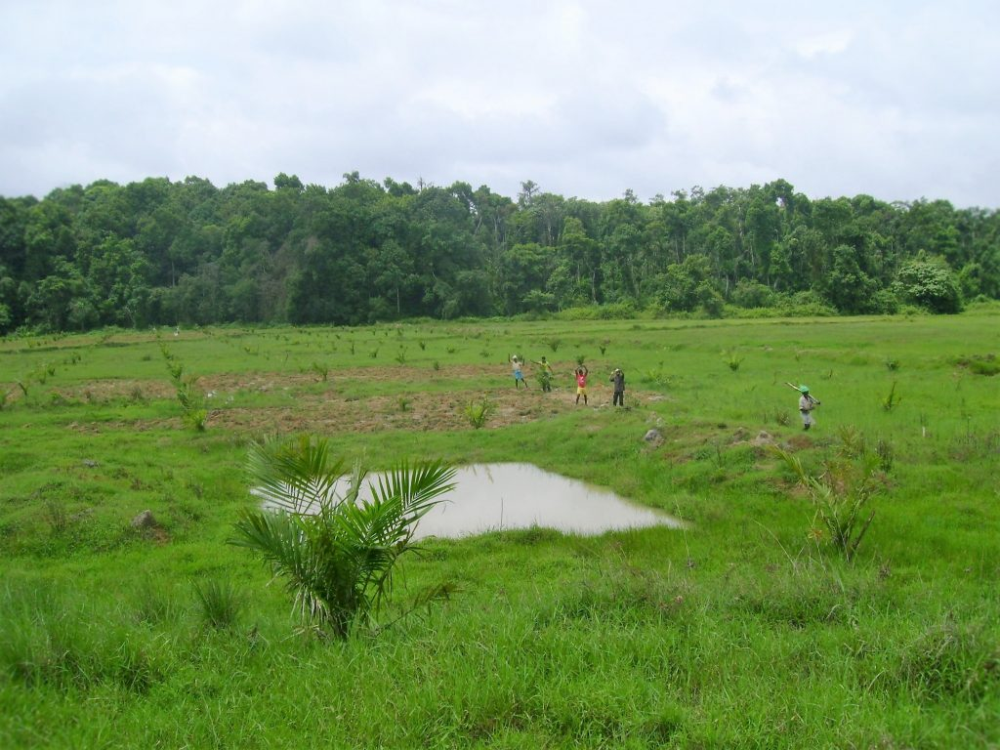
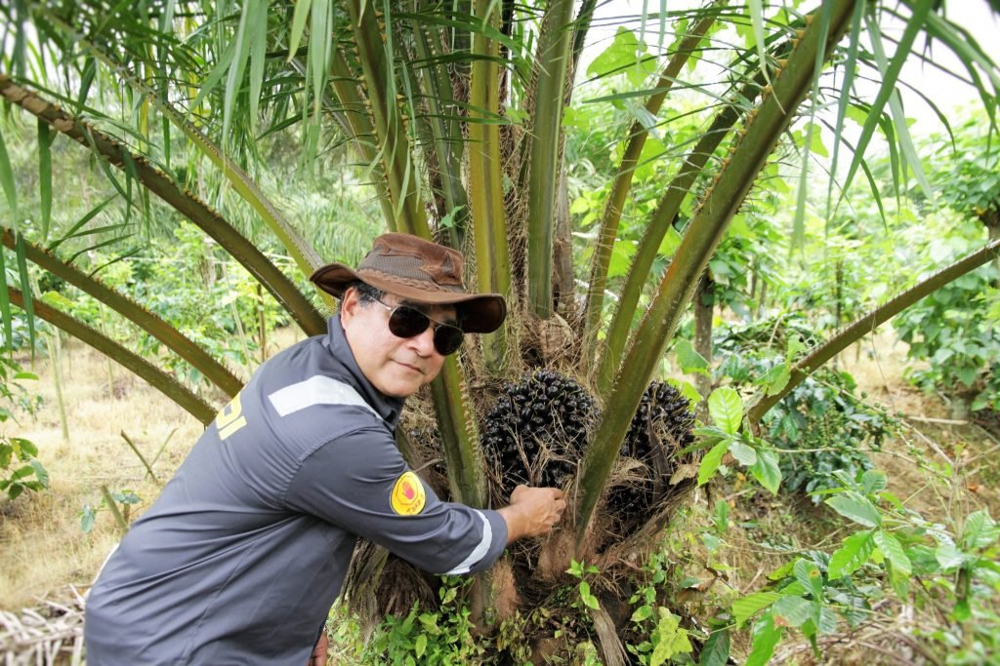
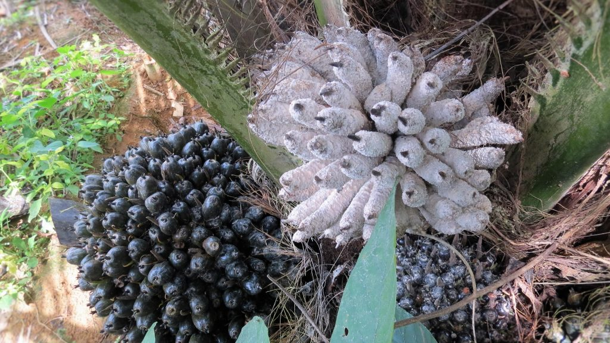

Palm oil is a type of edible vegetable oil that is derived from the palm fruit, grown on the African oil palm tree. Oil palms are originally from Western Africa. These plantations grow luxuriantly in tropical places with abundant sunshine and rain. Today, palm oil is grown throughout Africa, Asia, North America, and South America, with 85% of all palm oil globally produced and exported from Indonesia and Malaysia. Many scientific reports state that oil palm cultivation is cultivated without using sustainable measures.

Fuelled by the growing demand for palm oil for cooking, cosmetics, and biofuel, especially in China, India, and the Middle East, government and industry leaders are seeking to expand production to an additional 1.4 million hectares of new plantations by 2010. Malaysian Oil Palm has recently been introduced in India and it’s cultivation in Coffee zones is supported by the concerned State Governments by way of inputs and subsidies. The State Government through the Department of Agriculture and Horticulture, generally provide government-subsidized loans to smallholders to cover seedlings, fertilizer, and other supplies. Oil palm trees take about seven years to bear fruit.

We are trying to give a realistic picture on oil palm cultivation and its implications to the coffee forest ecosystem. We have cultivated oil palm in a small area for the past 10 years as a mixed crop with Robusta, Arabica, Silver Oak and pepper. We would also like to make it clear that the area devoted towards oil palm cultivation was land originally fit for rice cultivation which includes both wetlands and up lands.

Coffee Forests in India are shade grown and are closely associated with wet lands. These wetlands in low lying areas are often waterlogged for over 3 to 4 months in a year and are generally used to cultivate one or two crops of rice. It is important to note that many coffee growing Agro climatic regions do not receive long sun shine hours starting from the month of June, right up to end of December. Hence, Coffee Planters generally grow the long duration “LOCAL “rice variety, commonly known as red rice. This variety of rice though low yielding in comparison to hybrids, is more nutritious and requires only organic manure to grow unlike the heavy input of fertilizers required by High yielding varieties. In addition to the superior quality of rice, these traditional varieties also yield long bales of straw preferred by indigenous cattle.

### **Ecological Implications of converting wetlands into oil palm plantations**

Wetlands act as sponges and are instrumental in recharging the groundwater. Drastic reduction in water table because of the conversions.

Wetlands act as a stopover sites for migratory birds for rest and refueling during their onward journey. The conversion of marsh and aquatic habitats has serious implications on the amount of protein available for both resident and migratory fauna.

Wetlands act as grazing land for indigenous cattle because they remain fallow for 6 months in a year.

### **Why Coffee Planters are converting Wetlands to Oil Palm Plantations?**

The cost of traditional rice varieties even though slighter higher than the high yielding varieties, the cost-benefit ratio is in the negative because of low yields.

Since the topography of wetlands is like a terrace, the use of Agriculture machinery for transplanting and harvesting is ruled out.

The fields have also been subdivided and fragmented from one generation to the next , hence hindering rice cultivation.

Paddy operations are very labor intensive and Due to acute shortage of labour, a vast majority of the Planters kept their lands fallow.

The introduction of canal irrigation in neighbouring Taluk’s and Districts, make it possible for the large scale introduction of photosensitive, sun loving high yielding rice varieties of short duration, thereby enabling the farmers to cultivate two crops in a year which is highly remunerative in comparison to the long duration low yielding traditional rice varieties.

### **Problems Associated With Oil Palm**

Among the many problems associated with these oil palm plantations, the drainage prepared to help the growth of oil palm and mixed crops, significantly affects the water table of the entire coffee zone.

Mono culture oil palm plantations are miners of the soil. They only deplete the nutrients and do not give back anything in return to the soil.

Biodiversity loss in terms of flora and fauna.

### **Future Concerns**

In the race to be more self-reliant in edible oil production, the Government may hastily open up new areas exclusively devoted for oil palm cultivation. This, in turn, may lead to large scale loss of forest cover and habitat degradation. This, in turn, will have a ripple effect which will push many species to extinction.

### **Conflict Oil Palm**

Looking back at the history of oil palm plantation, credible reports suggest that, Conflict Palm Oil has become ubiquitous in our everyday lives. Conflict Palm Oil production is now one of the world’s leading causes of rainforest destruction. Oil Palm Plantation expansion is pushing deep into the heart of some of the world’s most culturally and biologically diverse ecosystems. It has also resulted in an irreplaceable loss of biodiversity and megafauna. World over, clearing of rainforests and carbon-rich peat lands for new plantations is releasing globally significant carbon pollution, making Conflict Palm Oil a major driver of human-induced climate change.

The increase in palm oil demand will lead to the accelerated seizure of indigenous peoples’ land, further dismantling local communities and cultures.

### **How to Overcome This Crisis**

The Government should mandate the protection of wetlands across the coffee forests and pay a handsome compensation to the growers to maintain the wetland ecology.

Ban the introduction of oil palm in Coffee Plantations which are rich in organic and humus material.

Introduce oil palm only in marginal areas and areas unfit for coffee and multiple crops.

Experiment with multi crops together with oil palm

Introduce nitrogen-fixing cover crops to enrich the soil

Introduce indigenous trees on the fence line and part of the area.

Earmark a part of the land for rainwater harvesting.

Introduce dadaps as temporary shade till the establishment of the multiple crops

Application of lime and compost every alternative year to maintain a favourable hydrogen ion concentration.

Encourage regrowth of native species in border areas.

Work with the soil in terms of scuffle digging and deep digging every alternate year to aerate the soil.

Apply heavy doses of compost every alternate year.

### **Conclusion**

Coffee forests in India are known to nurture one of the most biologically diverse ecosystems in South Asia. On the other hand, oil palm Plantations are linked to major issues such as deforestation, habitat degradation, climate change, animal cruelty and indigenous rights abuses in the countries where it is produced, as the land and forests must be cleared for the development of the oil palm plantations. According to the World Wildlife Fund, an area the equivalent size of 300 football fields of rainforest is cleared each hour to make way for palm oil production. This large-scale deforestation is pushing many species to extinction. World over, oil palms grow in low lying wet tropical areas, where the rain forests grow. We cannot let this happen inside coffee forests.

The basic rule that the coffee Planters need to follow in cultivating oil palm plantations, is to safeguard the environmental or social impact to the Coffee Ecosystem. Care to be taken to see that no oil palm cultivation takes place in lands which were originally used to grow coffee. Coffee lands are gifted with fertile soils and due to the mixed cropping associated with heterogeneous trees, there is a constant recycling of nutrients, maintaining the soil fertility for future generations and an incredible amount of biodiversity in terms of flora and fauna.

Instead, oil palm cultivation should be restricted towards marginal lands or denuded lands unfit for cultivation of any plantation crops.

### **References**

Anand T Pereira and Geeta N Pereira. 2009. Shade Grown Ecofriendly Indian Coffee. Volume-1.

Bopanna, P.T. 2011.The Romance of Indian Coffee. Prism Books ltd.

Oil palm ecology

[CONFLICT PALM OIL](http://www.ran.org/palm_oil?gclid=CPDI1-Gz1M4CFc4SaAodYUUNrQ)

[PALM OIL](https://web.archive.org/web/20180713005623/http://www.saynotopalmoil.com:80/Whats_the_issue.php)

[PROTECTING OUR CLIMATE](http://www.ran.org/palm_oil)

[Oil Palm Industry Takes Land](https://web.archive.org/web/20190117155121/http://www.worldwatch.org/node/6075)

[U.K. Biofuels Sources](https://web.archive.org/web/20171205161035/http://www.worldwatch.org:80/node/5861)