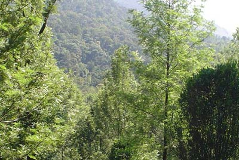
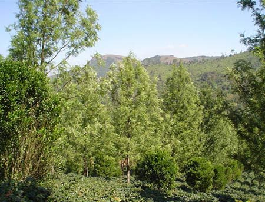
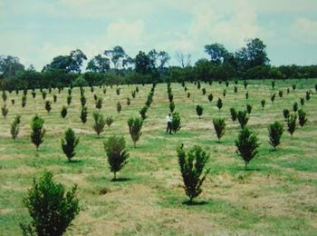
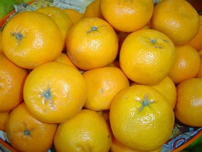
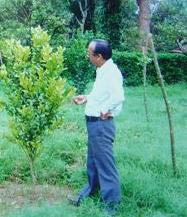
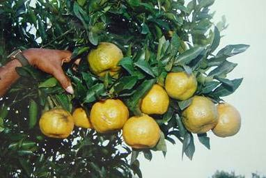
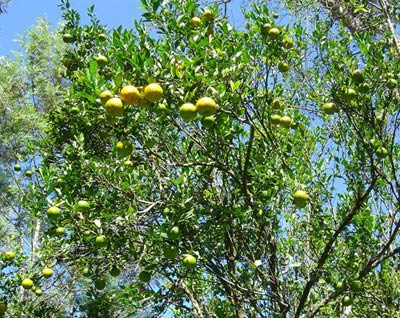
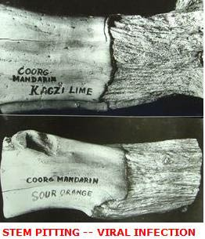
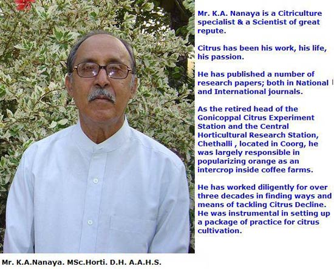

Shade grown Indian coffee forests are recognized world over as one of the most diverse forests on planet earth. These biodiverse rich parks are a symbol of wilderness, harboring a wide variety of herbs, shrubs and multiple crops. Literally, it is an embarrassment of riches.

Scale and distance takes a new meaning inside the coffee forests. In fact, the scientific community has much to learn from the associative symbiosis among and between various biotic partners inside the coffee mountain. Indeed, Indian coffee forests are models for studying conservation biology because they provide for wonderful genetic variations and preservation of a high degree of biodiversity in the growing environment.

Coffee, pepper, oranges, vanilla, cardamom and arecanut grow in wild abundance. Due to the fact that India’s coffee ecosystems comprise of various multi crops, these eco friendly coffee farms have a reputation as being polyculture in nature.

The dense proliferation of trees with miles of coffee forests associated with multicrops, play a very important positive role in shaping the coffee habitat. These multi crops not only live in close harmony with the coffee forest but are largely responsible in significantly altering the micro climate of the coffee bush. In spite of the significant reduction in coffee yields due to a number of factors like competition for nutrients, excess shade, etc, multicrops offers distinct advantages in enhancing the intrinsic value of Indian coffee by giving it a unique taste of “nature “in the cup.

Not so long ago, Orange cultivation occupied a pride of place as an intercrop inside coffee plantations. This crop played an important role in insulating the coffee farmers from the volatile coffee prices and at times rescued the farmers in times of coffee crop failure.

A few coffee farmers have also cultivated citrus as a mono crop under irrigated conditions.

The citrus fruit comprises of oranges, lemons and grape fruit.

### EARLY HISTORY

The country of origin of citrus is a debatable question but early historians say that the Southern regions of China and South Vietnam are commonly regarded as the native Countries of various citrus species and cultivation in these regions, probably dates back as far as 2400 B.C. Other historians are of the opinion that Southern Arabia is the region of origin of citrus species.

India is considered to be the home of several citrus species. The number of citrus species growing wild in India is very large, but in general the following four groups are predominant.

1.  Pummelos and their hybrids.
2.  Citrons and citron lemons.
3.  Rough lemons of various types.
4.  Mandarin oranges.

Citrus species which are undoubtedly indigenous to India include:

-   Citrus indica
-   Citrus latipes
-   Citrus megaloxycarpa
-   Citrus karna
-   Citrus jambhiri
-   Citrus aurantifolia
-   Citrus aurantinum
-   Citrus medica
-   Citrus sinensis
-   Citrus madurensis
-   Citrus limonia

Mandarin is the most important citrus fruit cultivated in India. The important cultivars are the Nagpur santra, Sohniamtara of Assam and the Coorg orange. The mandarin oranges cultivated in different regions have gained enough commercial importance and popularity, although there are certain differences in fruit qualities among these eco types.

The origin of Coorg oranges is not clearly known, although it is believed to be introduced from Central India about 300 years ago. Coorg orange is classed under mandarin group (Citrus reticulata ) and also popularly known as Santras in India. They are also referred as loose jacket orange. Coorg orange, Nagpur orange, Khasi orange, Rangtra, Kamala, Sikkim orange, Yemmedoddi orange are all strains of mandarin and each of them are known for their juciness, taste and quality.

### THE ORANGE-COFFEE CONNECTION

Dr. Burns, Agriculture Commissioner (Government of India) visited Coorg (South India) in the year 1941 and met a few representatives of orange growers at the Inspection Bungalow, Polibetta. Mr. Ivor Bull, Managing Director of Consolidated Coffee Estates Limited ( C.C.E. Ltd ), presented the actual position and the plight of orange growers to Dr. Burns, who in turn asked the Indian Council of Agricultural Research to study in detail the setting up of a research station to initiate scientific work on orange cultivation. Subsequently, towards research a small plot of land in Chenankote estate of the C.C. E. Ltd. was taken on lease and the orange research station was started. As the area under orange cultivation increased, the research station was shifted to two centers, namely Gonicoppal and Chethalli in Coorg District.

### MULTIPLE USES OF ORANGES

-   Rich source of vitamins and minerals
-   Used in the preparation of juice, squash concentrated juice and juice powder.
-   Citrus oil and peel oil can also be extracted.
-   Highly nutritious and delicious
-   Good medicinal value

### CLIMATIC REQUIREMENTS

Oranges can be grown in a wide variety of climatic conditions. In India it is grown as a rain fed crop but responds very well to irrigation. Orange cultivation requires slightly higher elevations ranging from 1500 feet to 5000 feet from the main sea level. The ideal temperatures for successful orange cultivation ranges from 25 to 30 degree centigrade. The annual rainfall can range from 40 inches to 200 inches, but the important fact is the requirement for well distributed rainfall between March and November. The relative humidity can range from 85% to 100%. A terrain with a gentle slope towards the East or North is ideal.

### PLANTING MATERIAL

Budded plants from certified nurseries should be selected. The planting material selected should have the following characteristics.

1.  Free from diseases and pests
2.  Uniform size
3.  True to mother plant in terms of yield quality & Quantity

### PLANTING

The size of the pit should be 2 1/2 feet X 2 1/2 feet X 2 1/2 feet with spacing of 30 feet. Once the pit is dug open, the soil in the pit is opened out and exposed to the summer weather. During the on set of monsoon, the pits are filled up with compost and top soil. Planting can be commenced during pre monsoon. Planting should be totally avoided during heavy monsoon period. However, planting can be resumed during post-monsoon period (September-October).

The seedling should be placed at the centre of the pit and the soil around it compacted. The bud joint should be placed about 6 inches above the ground. The seedlings should be secured firm from wind beat by staking with two sticks cross wise. After planting, the base around the plant is mulched with dry leaves.

### SOIL CHARACTERISTICS

Oranges adapt well to a wide range of soil conditions. However, well drained red loamy or light soils are the most preferred. Acidic or alkaline soils are unfit for growing oranges. Hence, the Ph range should be in the region 6 to 6.5.

### AFTER CARE

All vegetative growth, suckers and stock sprouts arising from the stem below the bud joints and above up to two feet from ground level should be removed from time to time. It is important to maintain a single stem rather than multiple stems. The top of the tree should ideally be within 6 feet to facilitate harvesting.

### CULTURAL OPERATIONS

The soil around the plant should be scuffled for plants up to two years of age. After two years of plant establishment, the soil around the root should not be disturbed, since it leads to root injuries to the surface feeder roots. Incidentally, the feeder roots are present at a depth of just 3 inches from the top soil. If the need for soil scuffling arises, it should be restricted to within 3 inches from the top soil. Mulching the tree basins with dried coffee leaves is ideal, since it conserves moisture. Yearly pruning should be done, immediately after harvest.

### MANURES and FERTILIZERS

The citrus plants require both the major elements (nitrogen, phosphorus, potash, magnesium, calcium) and minor nutrients (zinc, manganese, copper, iron, boron, cobalt, molybdenum) for realizing better yields. Manures and fertilizer application should be carried out in three split applications.

1.  PRE-MONSOON (May-June)
2.  POST MONSOON (September-October
3.  During Blossom showers (March-April)

Application should be carried out when there is sufficient moisture in the soil. Sulphate of Ammonia and urea application are not advisable, since it increases soil acidity and favors Phytophthora root rot.

Organic manures and compost play an important role in establishment of young plants. Organic manures also aids in the improvement of soil structure and results in the better utilization of applied chemical fertilizers.

Research data proves that young citrus trees (pre-bearing) require a higher proportion of nitrogenous fertilizers for proper development of vegetative growth. During the bearing stage, balanced fertilization of nitrogen, phosphorus and potash should be applied. Balanced fertilization builds up hardiness towards pest and disease attack.

Nitrogen is essential for vegetative growth, phosphorus for root and flower development and potash in improving the size and quality of fruit.

Lime or dolomite application can be carried out once in three years.

### PEST and DISEASE INCIDENCE

### DISEASES

1.  PARASITIC ORGANISMS: Nematodes, insects, birds, fungi, bacteria.
2.  Viruses : Tristeza, Psorosis, infectious mottling,Xyloporosis, Satsuma dwarf,Exocortis,
3.  Malnutrition, salt injury

LEAF FALL AND FRUIT ROT

Phytophthora palmivora

MILDEW

Oidium tingitaninum

PINK DISEASE

Pelliculria solmonicolor

BROWN ROT GUMMOSIS

Phytophthora parasitica,  
Phytophthora palmivora  
Phytophthora citrophthora

ROOT ROT

Phytophthora sp,  
Rosellinia sp,  
Glomerella sp.

DRY ROOT ROT

Fusarium sp,  
Macrophomina phaseoli

DIPLODIA GAMMOSIS

Diplodia sp

ARMILLARIA ROOT ROT

Armillaria mellea

GANODERMA ROOT ROT

Ganoderma sp

WITHERTIP

Colletotrichum gloeospriodes

FELT FUNGUS

Septobasidium sp

SOOTY MOULD

Capnodium citri

CITRUS CANKER

Xanthomonas citri

CITRUS SCAB

Spaceloma fawcetti

CITRUS SPREAD DECLINE

Radopholus similes

DIE BACK

Tylechulus semipenetrans

CITRUS YELLOWING

Pratylenchus pratensis

GUMMOSIS

Diplodia natalensis

FELT DISEASE

Septobacidium sp

### PESTS

STEM BORER

Chelidonium cinctum.,  
Chelidonium argentatum.,  
Chelidonium alcheme.,  
Arbela tetraonis.

TOP SHOOT BORER

Oberia sp.

ORANGE DOGS

Papilio demoleus,  
Papilio polytes

MITES, SCALES, THRIPS, FRUIT SUCKING MOTHS, MEALY BUGS, BUD MITES, FRUIT FLY, APHIDS

### MAIN FRUIT CHARACTERS OF COORG ORANGE

COLOR

GOLDEN RED OR SUNKISS

FRUIT SIZE

MEDIUM

SHAPE

OBLATE TO GLOBOSE

JUICE PER CENT

40-45.

TOTAL SOLUBLE SOLIDS

10-12 %

ACIDITY

0.525-0.576%

ASCORBIC ACID

35-40%

T.S.S./ACID RATIO

12.68-14.55

Coorg orange and other mandarin oranges that are grown in various coffee zones are prized in the market because of the following characteristics, namely attractive golden tinge, easiness to peel, high palatability, less seediness, perfect blend of acid and sweetness.

### PROBLEMS ASSOCIATED WITH ORANGE CULTIVATION

For the past three decades the citrus industry in coffee growing regions has been facing a state of decline with loss in vigor, widespread intervenial chlorosis, mottling, die-back of young shoots, general chlorosis, unfruitfulness and pre mature death of of the plants. These symptoms today are popularly termed as FRENCHING, DIE BACK and CITRUS DECLINE.

### CITRUS DIE-BACK

The citrus die back disease is the symptomic expression of the tree that is caused due to various factors, namely, bad selection of site, bad plant materials, malnutrition, wrong cultural practices, continued attack of pests and diseases and also lack of sufficient information on citriculture. The disease reduces the vigor of the tree, reducing the yield potential.

The citrus experiment station located at Gonicoppal and the Chetthali Research Station ( Central Horticultural Experiment Station ) have done commendable research for over 4 decades on citrus die back and their investigations have revealed that the malady is due to the interaction of many factors, namely, malnutrition of orange trees, attack of various pests and diseases, particularly stem borer and phytophthora leaf fall disease, powdery mildew and root rot. Other important factors contributing to the spread of the disease is due to improper planting material and lack of sufficient scientific know how on citriculture among the coffee farmers.

### WAYS AND MEANS OF TACKLING CITRUS DIE BACK

1.  Selection of proper, genuine, disease free, healthy plants from certified nurseries.
2.  Orange planting should be restricted to coffee blocks which have well aerated soils and free from water logging. Low lying and swampy areas and soils with hard and gravelly substratum with shallow depths should be avoided.
3.  Budded plants are ideal for planting. However, coffee farmers should take care to see that the orange plants are budded on suitable root stocks like Rangpur lime, Poncirus trifoliate, Kodakithuli, Cleopatra mandarin, trifoliates and Rough lemon.
4.  Plants having multiple tap roots, bent or forked roots should be rejected.
5.  Oranges are sun loving plants and grow well in Robusta plantations where the tree population of native trees is considerably less than Arabica plantations.
6.  Deep digging around the tree trunk should be avoided since it causes root injuries and root rot.
7.  Apart from nitrogen, phosphorus and potassium fertilizers, orange trees need to be supplemented with calcium, zinc, magnesium, and copper.
8.  Pruning of dried twigs, symptomic twigs and shoots.

### IMPORTANCE OF ROOT STOCKS

The citrus plant is prone to a number of viral diseases. Selection of proper root stocks will go a long way in effectively controlling both pest and disease incidence. Root stocks exert profound influence on the vigor, precocity, productivity, quality and longevity of scion varieties grafted on them. Root stocks exert a strong influence on resistance to bacterial fungal, viral and nematode diseases too. One other characteristic feature of root stocks is in helping the plants establish themselves in adverse soil conditions.

Cleopatra mandarin is a popular root stock material used in certified nurseries.

### ROBUSTA PLANTATIONS and ORANGE CULTIVATION

At Joe’s Sustainable farm we have successfully grown oranges with coffee in a few blocks receiving high amounts of organics and in a few blocks receiving chemical fertilizers. One interesting point that we have observed is ; application of chemical fertilizers significantly increases the onset of citrus dieback compared to the organic blocks.

The microbial load of both nitrogen fixers and phosphorus solubilizers was pretty high in blocks receiving compost and organic residues. These beneficial microbes not only enrich the organic matter content of the soil but improve soil texture and significantly improve drought tolerance to coffee. We have also observed a number of beneficial bird and insect species in such blocks.

Our second observation points out that diversity of plant or tree species gives a broad heterogeneity in rooting structures. Not all plant species feed from the same depth in the soil. Some plants go deeper than others. This enables the slow uptake of various elements from different depths maintaining the nutrient status of the soils. More importantly, the soils do not get mined of a particular nutrient element. Depending on the root depth, nutrients from deeper soil layers are mineralized and returned to the top soil.

### CONCLUSION

For the past three decades, orange cultivation inside coffee plantations has taken a back seat due to a malady known as CITRUS DIEBACK, CITRUS DECLINE OR FRENCHING. To make a clear analysis of the problem is next to impossible. It could be attributed to multiple reasons such as environmental, entomological, pathological, nutritional, physiological, and viral or nematoden in nature.

We need to progress beyond the past and explore the usefulness of cultivars which grow vigorously, without showing signs of citrus decline. One way of tackling this problem is by way of increasing the degree of diversity within the environs of the coffee mountain. This will enable the farm to build up sufficient bio reserves in the form of predators, parasites, and beneficial insects, together with a large organic nutrient pool, there by limiting the build up of the pathogen population.

Since, the citrus roots are shallow rooted, they are highly susceptible to damage during scuffle digging, which is a common practice inside coffee farms. Coffee farmers need to minimize this damage by carefully tilling the soil.

The coffee mountains teeming with microorganisms gives it a unique character. However, this harmony is shattered when man’s interference , surfaces due to the application of high levels of chemicals. Orange cultivation is also very sensitive to extreme climate changes and undesirable levels of chemicals in the soil. Excessive application of chemicals on the coffee farm can significantly alter the micro flora associated with citrus. Hence, urgent attention needs to be paid to protect the coffee eco system from the strain of chemicals and pesticides.

Our past experience points out that nature has a unique chance to recover, if only humans allow it. Nature has in built secrets to withstand stress. Nature is our true source of healing energy. Coming into proper balance with the earth’s energies will go a long way in bringing the health of the coffee mountain back to its pristine glory.

### REFERENCES

[Global Warming in Coffee Plantations](http://ecofriendlycoffee.org/global-warming-in-coffee-plantations/)

[Coffee Forest Symbiosis](http://ecofriendlycoffee.org/coffee-forest-symbiosis/)

[Eco-Friendly Indian Coffee: A Profile](http://ecofriendlycoffee.org/eco-friendly-indian-coffee-a-profile/)

[Invisible Communications in Coffee Plantations](http://ecofriendlycoffee.org/invisible-communications-in-coffee-plantations/)

[Coffee Plantations A Multidisciplinary Approach](http://ecofriendlycoffee.org/coffee-plantations-a-multidisciplinary-approach/)

[Soil Water Conservation in Coffee Plantations](http://ecofriendlycoffee.org/soil-water-conservation-in-coffee-plantations/)

[The Ecodynamic Coffee Cube 3](http://ecofriendlycoffee.org/the-ecodynamic-coffee-cube-3/)

[Microbial Communities](http://ecofriendlycoffee.org/microbial-communities/)

[Physiology of Coffee Flowering](http://ecofriendlycoffee.org/physiology-of-coffee-flowering/)

[Biodiversity In Relation To Coffee Plantations](http://ecofriendlycoffee.org/biodiversity-in-relation-to-coffee-plantations/)

K.A. Nanaya. K.C. Srivastava. & D. Leela.1975. Chemical weed control in citrus. Geobios 2: 140-142.

K.A. Nanaya. & K.C. Srivastava.1972. A note on coorg oranges and its growing. Coorg Junior Chamber Souvenir.

K.A. Nanaya, K. Anjaneyulu & S.C. Kotur. 1985. Effect of foliar applied Zn, Mn, Cu & Mg on growth parameters, chlorosis and interrelationships of micronutrients in leaf tissue of coorg mandarin. Prog. Hort. 17 (4): 309-314.

K.C. Srivastava, K.M. Bojappa and K.A. Nanaya. 1966. Culture of Coorg orange (Citrus reticulate). The Coorg orange growers’ co-operative. Silver Jubilee Souvenir.

A.K. Srivastava and Shyam Singh.2002. Citrus: Climate and Soil. International Book Distributing Co., Lucknow.India.

Larry.K Jackson & Frederick S. Davies.2002. Citrus growing in Florida. 4TH Edition.

Shyam Singh, V.J. Shivankar, A.K. Srivastava and I.P. Singh. (Editors). 2004. Advances in Citriculture. Jagmander Book Agency,New Delhi.

S.P. Singh. (Ed) 1999. Advances in Horticulture and Forestry, Volume 7. Jodhpur, Scientific, India.

V.K. Sharma. (Ed). 2004. Advances in Horticulture: Strategies, Production, Plant Protection and Value Addition. Deep and Deep, New Delhi.

A.K. Srivastava and Shyam Singh. 2003, Citrus Nutrition. International Book Distributing Co., Lucknow.India.

Shyam Singh and S.A.M.H. Naqvi. 2001, Citrus. International Book Distributing Co., Lucknow.India.

Shyam Singh, V.J. Shivankar and A.K. Srivastava. (Ed) 2000, Citrus: World Bibliography.

L W Timmer and Larry W Duncan (Ed) 1999. APS Press.

Wolfgang Delfs-Fritz.1970. Citrus. Cultivation and Fertilization. Series of Monographs on tropical and sub tropical crops.