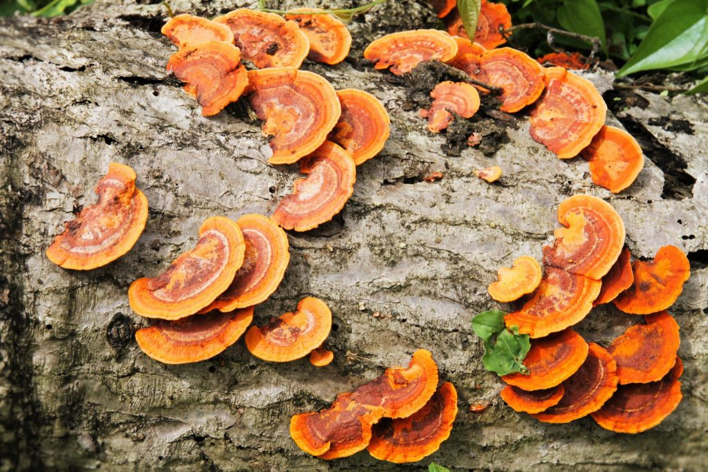
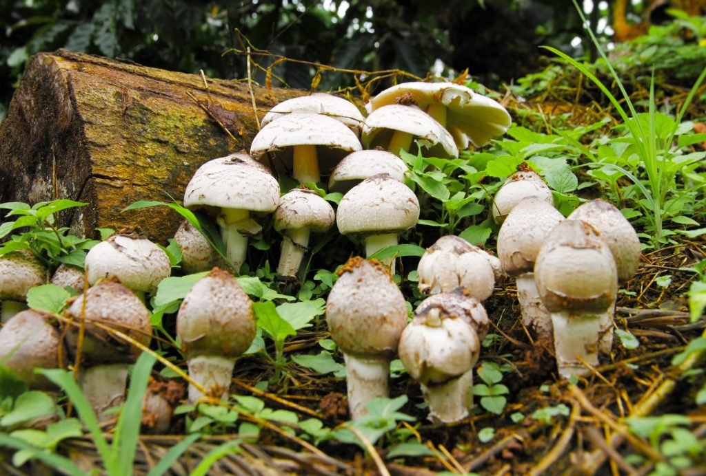
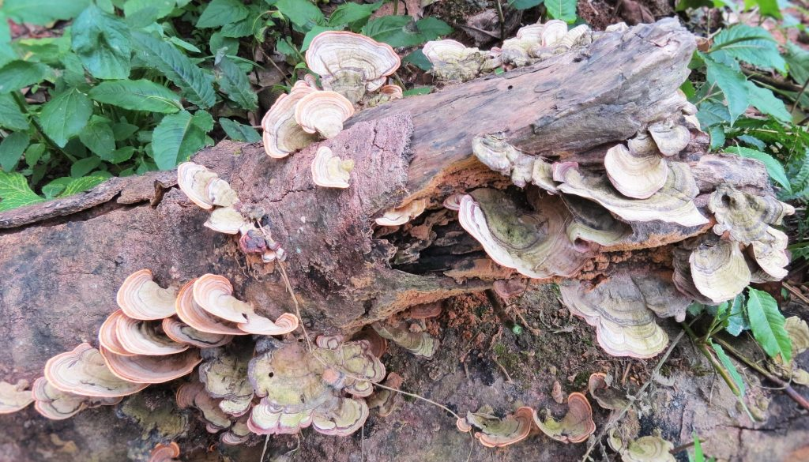
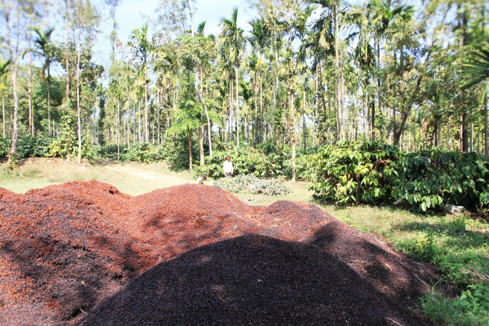
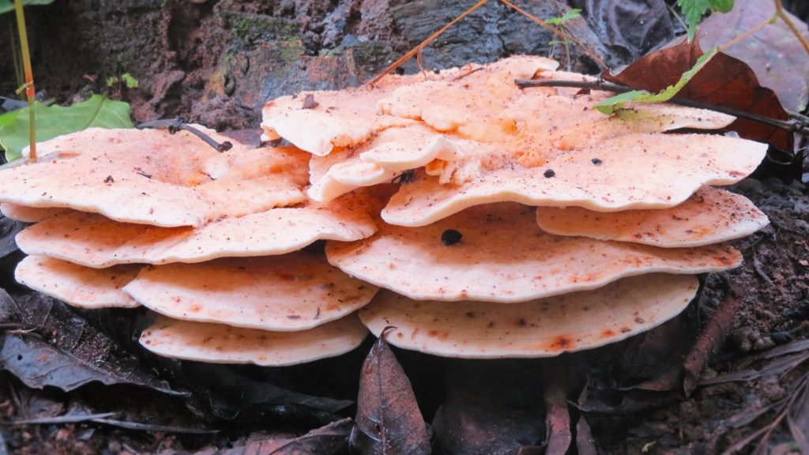
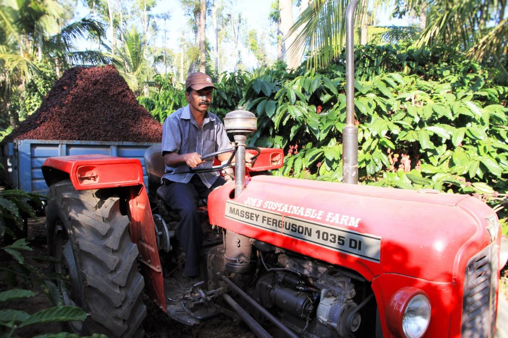

Coffee Forests in India are recognized world over as forests having the most diverse flora and fauna accommodating coffee and multiple crops. The significance of these forests, in terms of its symbiotic association with various biotic components is often overlooked. Our research and publication of papers for the last three decades enumerating the role of various associative microbial associations influencing the ecology of Coffee forests has helped Coffee Planters world-wide understand the importance of microorganisms in maintaining the health of the coffee ecosystem. In general our work related to Agriculture microbiology has unravelled the role of various microorganisms and their intimate relevance to agriculture.

As Microbiologists and Horticulturists, our strategy, therefore has been to rely increasingly on renewable resources on the coffee plantation through microbiological processes rather than non-renewable hydrocarbons, to supplement synthetic fertilizer requirements with organic substrates so as to improve the overall health of the coffee ecosystem. This paper highlights the role of mushrooms in organic matter decomposition. From organic matter decomposition to the recycling of essential nutrients, mushrooms play a crucial role in the availability of nutrients required for the growth and development of coffee.

Coffee forests have an abundance of trees and the package of practice stipulates that for optimum growth and development of Coffee and multiple crops, shade regulation is a must. Hence, shade is periodically opened, preferably once a year by a simple operation called tree pruning to allow the sunlight to reach the lower canopy for maximizing photosynthesis. The bulk of the woody material from tree pruning consists of cellulose and lignin and are degraded by both bacteria and fungi. However the role of fungi, especially the Basidiomycetes play a major role in degrading this lingo cellulose complex to different degrees. We have observed that different mushroom species act on this complex and release the locked in energy which benefits the coffee ecology.

This paper in particular dwells on the role of mushrooms as agents of organic matter decomposition. The mind set of most Planters is that decomposition and decay are viewed quite negatively, but it is important to learn and understand that they are key processes in nature, playing a vital role in the energy transfer and balance of nutrients in the coffee ecosystem. The fallen down twigs, branches, leaves and in a few instances dead trees make up for the bulk of the biomass on the floor of the coffee forest.

An area of main concern over the years has been regarding the insoluble complex of soil organic matter. This complex consists of cellulose, hemicelluloses, lignin proteins, starch, gum, mucilage, fats and pectic substances. Mushrooms are capable of breaking down lignin and cellulose which is a complex carbon based molecule into smaller units which in turn is acted upon by other microorganisms.

Microorganisms, especially Bacteria and Fungi in soil are the engines of the process of decomposition. Fungi are heterotrophic in nutrition and neither sunlight nor the oxidation of inorganic substances provides these microbes with the energy needed for growth. Fungal distribution is consequently determined by the availability of oxidisable carbonaceous substrates. In a general sense, the number of filamentous fungi in soil vary directly with the content of utilizable organic matter. The characteristic feature of mushrooms is that, they lack chlorophyll. Hence they cannot synthesize their own food. Mushrooms therefore had to develop special methods of living: symbiosis, saprophytism and parasitism.

### Mechanisms Involved

The primary decomposers of most dead plant material are a group of microorganisms called Fungi. Fungi are known to form a wide network of hyphae which forms a mycelial mat on the floor of the coffee forest. The fruiting bodies of the fungus emerge out as mushrooms. The hyphae is capable of breaking down complex organic molecules locked in woody material and other forms of biomass and converting them into simpler forms which can either be broken down further by other microbes or assimilated by plants, herbs and shrubs. Mushrooms are propagated by spores which are released from the underside of each mushroom cap. The spores are carried distances by air and water currents and germinate when they come in contact with dead wood or organic matter. The spores then sprout to form an underground network of minute thread like filaments, called a mycelium.

Some other species colonize trees both living and dead. Many species are quite host specific in their attachment and will not target other species of trees. Others play an important role in breaking down lignin, cellulose and hemicelluloses and convert them into readily available energy rich compounds easily assimilated by plants. In short, all mushroom species play a crucial role in recycling essential nutrients. Some fungi obtain their food by breaking down dead plant or animal matter, referred to as saprophytes or saprobes; others grow parasitically on living herbs, plants or animals. Many species form a close association with the roots of trees and colonize the endorhizosphere, histosphere or rhizosphere region forming a mycorrhizal association. In this mutually satisfying, symbiotic relationship, the fungus receives nutrients for its growth and development from the tree and in turn enables the tree roots to absorb different unavailable minerals from the soil.

### Coffee Agro climatic Influence

The abundance and microbial activity of the fungus has a lot to do with the agro climatic zones of coffee. It is imperative to realize that the same species of fungus behaves differently in different agro climatic regions. In fact, the biochemical activities of each species vary considerably undergoing appreciable fluctuation with time at any single site. Also the efficiency in OMD is determined by the surrounding environment. Just to highlight a few external influences, soil organic matter status, ph. levels, organic and inorganic fertilizers, moisture, duration and intensity of rainfall, pesticide and weedicide effect, chemical sprays involving heavy metals like copper play a crucial role in determining the efficiency of the organic substrate conversion. The Mushrooms species are clearly influenced by altitude, type of vegetation, type of coffee forests (Robusta’s or Arabica), prevailing temperature, relative humidity, type of soil and amount of organic matter in the soil. Some of the dominant species of mushrooms collected belonged to the Boletaceae, and Tricholomataceae family. Most of the wild mushrooms were associated with forest tree roots.

### Influence of Compost

Composting is an integral package of practice for any Coffee Planter. Two decades back the Planters used to compost their organic waste either by the pit method or heap method and only then apply it to the farm. Today due to shortage of labour, the basic raw material like cattle dung, poultry manure and other wastes are directly applied to the plantation. In such cases the role of fungi, especially mushrooms is of paramount importance to break down the complex organic substrate to simpler nutrients.

### Influence of Coffee Pulp / Husk

Most of the coffee farmers own pulper machines which aid in removing the mucilaginous outer cover of the fruit. This outer cover is often referred to as coffee pulp. If dry coffee is processed, then the outer layer is referred to as husk. Both pulp and husk have high amounts of nutrients. Husk contains 1.5% nitrogen, 0.5% phosphorus and 2.2% potash.

For every ton of clean coffee produced, one ton of dry matter is obtained either as cherry husk or fruit pulp. 7000 kg of fruits results in a net gain of 15 kg nitrogen, 3kg phosphorus and 35kg potash. Pulp or husk has to be composted and only then applied to the field. Undecomposed or fresh husk may lead to production of acids and thus bring down the ph of the soil. In such cases the appropriate strain of mushroom will help in the breakdown of the cellulose a, hemicellulose and pectin content of the coffee husk or pulp.

### A few examples of Mushrooms involved in organic matter decomposition

Boletus species: The mushroom is quite common during monsoon season. The brown cap is more than 4 inches wide and 4 to 5 inches tall. The underside of the cap has tube openings instead of gills. Neem seed application to soils triggers the growth and development of Boletus.

Chanterelle species: These mushrooms are quite hardy and are uncommon in coffee forests. Whenever they are present, they are found under hardwood tree species. Some species are edible.

Coprinus species: Another common mushroom commonly observed on the floor of the coffee forest.

Saprophytes

Finally, some mushrooms are parasites. There are several kinds of parasitism, ranging from the species which attacks a healthy host (tree, plant or insect) and lives on it without killing it, to the kind which attacks only unhealthy hosts, thereby hastening their death. The parasitic species are generally microscopic mushrooms.

### Advantages

-   Mushrooms thrive under varied ecological conditions, from moist to dry.
-   Mushrooms have an ecologically significant role to play in the utilization of dead organic debris, rotten logs, or rotting woody material or substrate found on the floor of the forest.
-   Mushrooms act on waste material and aid in the recycling of essential nutrients.
-   They grow in a wide variety of habitats.
-   Most mushrooms have an important and beneficial role to play in food chains and food webs.

### Conclusion

We have observed many different species of mushrooms responsible for organic matter decomposition inside coffee forests. Mushrooms have an ecologically significant role to play in the utilization of dead organic debris, rotten logs, or rotting woody material or substrate found on the floor of the forest. Mushrooms act on waste material and aid in the recycling of essential nutrients. They grow in a wide variety of habitats. Most mushrooms have an important and beneficial role to play in food chains and food webs. Despite our Microbiology background, we have not been able to identify many of these fungi because mycology in itself is a vast subject.

We call upon the Coffee Planting community to take note of the importance of mushrooms in organic matter decomposition, by understanding their specific physiology in nutrient cycling. This in turn will help develop pure cultures which can be inoculated into the farm for rapid conversion of lingo cellulolytic waste into energy rich compounds by digesting the organic matter and at the same time return the nutrients to the soil, which in turn can easily be assimilated by crop plants.

### References

Anand T Pereira and Geeta N Pereira. 2009. Shade Grown Ecofriendly Indian Coffee. Volume-1.

Bopanna, P.T. 2011.The Romance of Indian Coffee. Prism Books ltd.

Boberg, J., 2009. Litter decomposing fungi in boreal forests. Swedish University of Agricultural Sciences, Uppsala, Sweden.

[The role of mushrooms](http://espacepourlavie.ca/en/role-mushrooms-nature)

[Waste Not, Want Not: Fungi & Mushrooms](http://www.gmushrooms.com/MushroomInformation/Composting.htm)

[Where do fungi get their energy?](https://www.quora.com/Where-do-fungi-get-their-energy)