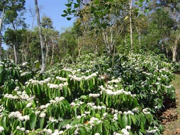
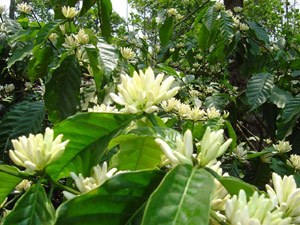
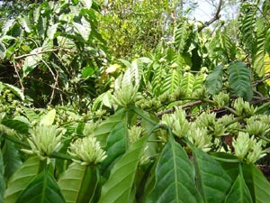
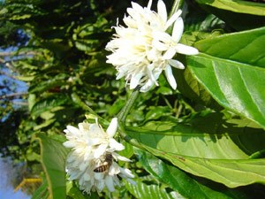
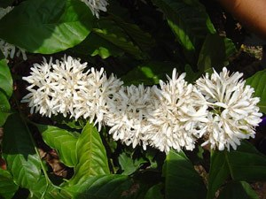
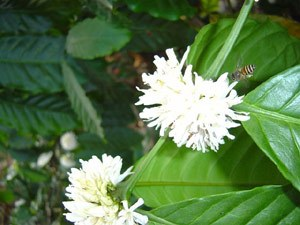
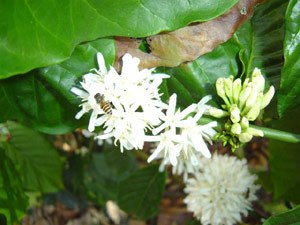

Indian coffee plantations are positioned inside the Western Ghats on hills and misty mountains ranging from an elevation of 800 meters to 1600 meters main sea level. Not many places in the world can boast of such a wide variety of biodiversity within the coffee habitat: forests, herbs, shrubs, flora and fauna contributing to a magnificent paradise.

The climate is largely tropical in summer and cool in winter. Hence nature has bestowed all coffee farmers with the best of both worlds. Flowering in coffee is a spectacle to be experienced. During coffee blossom one can witness thousands of acres bedecked with white flowers, emanating a beautiful scent with the dancing of honeybees and butterflies. The entire flora in the region assumes a white hue as the coffee flowers overpower every other color. It is like the jewel in the crown of coffee planters. Flowering presents a unique image of the coffee plantation. It is a treat for ones eyes.

Many foreigners visit India during the blossom time and are simply overwhelmed seeing the mystic beauty and delicate fragrance. In short this experience is bewitching, captivating, enchanting and magical. It is an experience that is best when it is felt. The elevated tall mountains depict the timeless magic locked within.

In this article, efforts have been made to elucidate the events unfolding the magic of flowering. A time tested effort has gone into this article to simplify the transformation of the vegetative phase to the reproductive phase, ultimately resulting in coffee fruit set.

### Early History

The Physiology of flowering was better understood in 1920, when two Plant physiologists, Garner and Allard, from the U.S. Department of Agriculture, Beltsville, Maryland discovered that plants can be separated into different groups like short day, long day and day neutral plants based on their response to day length. Coffee falls into the category of a short day plant. This indicates that 8 to 11 hours of day light induces flower initiation.

### Physiology

The coffee bush is governed by two set of factors, namely, phenotypic and genotypic in its advancement from flower to seed. The phenotype refers to the external factors and genotype to the internal factors or the genetic constituents of the plant. The ultimate expression of the bush is due to the resultant interaction of both these factors. The genotypic characters play a vital role in the internal behavior of the plant based on the nucleic acids like deoxyribonucleic and ribonucleic acids.

Flowering in coffee is one of the most important mechanisms in the evolutionary ladder, bringing about continuity of genetic material for future generations. Shade grown Indian Plantations have a 50: 50 balance of Arabica and Robusta. As a matter of rule blossom showers are generally induced in only Robusta plantations by means of artificial rains called sprinkling.

Early botanists classified flowering plants, broadly into two groups namely the DICOTYLEDONS and MONOCOTYLEDONS, based on the number of cotyledons possessed by the embryo plant. Coffee has two seeds within the capsule; hence it belongs to the dicot family. The advantages of a dicot plant is that it has inbuilt specialized structures, like vascular tissue in the stem and secondary wall thickening. The coffee bush has fairly well differentiated pollen and embryonic sac.

Flowering is influenced by a variety of factors both internal and external and both are dependent on each other.

Planters are made to believe that overhead sprinkler irrigation is the key to induce good blossom. However, in reality the truth is that large number of sprinklers spread over a wide area brings about a SUDDEN DROP IN TEMPERATURE and that CRITICAL change in micro climate induces good blossom.

### Biochemistry of the Bush

The coffee bush is a biological factory, programmed to perform different functions at various stages of growth and development. Nature has provided the Coffee bush with a biological clock which senses the moods of the weather. Basically, to survive the hardships, the coffee plant has to express a profound degree of adjustability.

The biological clock performs various functions; one interesting function is the tuning in to the day length prevailing during various seasons. A change from vegetative phase to flower initiation involves changes in the metabolic patterns inside the plant. The plant programmes itself to critically make use of its internal resources with an efficient distribution of regulators and promoters to achieve balanced and maximum flowering.

When it comes to flowering, the coffee bush is stimulated to produce various hormones which bring about the development of the flower bud into the reproductive phase. Scientists worldwide are still not able to exactly pinpoint a particular hormone responsible for induction of flowering but have narrowed down to a compound known as phytochrome which is light mediated. Phytochrome cannot induce flowering in isolation, it requires the association of other substances like growth regulators, growth promoters and so on {auxins, iodole acetic acid, gibberellic acid}. Leaves are the agents believed to capture this photoperiod and is subsequently transferred to the shoot apex. The chemical stimulus involved in flowering is a group of complex compounds known as FLORIGEN.

ENVIRONMENTAL STIMULUS also plays an important role in coffee flowering.

Unlike other plantation crops the coffee bush is very sensitive towards flowering. Artificial flowering cannot be induced at any time. A lot of effort goes into preparing the plant before floral primordia are initiated. Firstly the beans from the plant should all be harvested, followed by a REST PERIOD of fifteen days. During this time interval it is advisable to prune the bush and remove branches which are weak and unproductive. The crown region of the plant is exposed to the sun and care is taken to see that carbohydrates and photosynthates go towards bearing woods.

Summer months are ideal for irrigation. For Robusta, the ideal time is February 20th to March 15th. For Arabica irrigation is generally delayed up to April end. The soil moisture should be minimum. After the 15 day rest period, the plant should undergo a period of STRESS. Stress is clearly visible by the physical appearance of the plant. The leaves start drooping and from a distance it looks as if the whole bush is wilting. This clearly reveals that the bush is ready for receiving blossom showers. Three showers characterize the coffee landscape-Blossom, post blossom and backing showers. Each of these showers has unique properties and triggers a set of responses towards the ultimate success of the blossom.

There are many schools of thought as to the method of irrigation. Some coffee farmers have tried drip irrigation and others hose irrigation. But in our considered opinion the best way to go about this is by overhead sprinkler irrigation. The reason being, the flower bud on the coffee bush is tightly held by an invisible layer of abscisic acid. As the water from above falls on the bud, it facilitates the washing away of the abscisic acid layer and the forward movement of the bud begins. This fascinating, eye catching journey from bud initiation to flower opening takes place in eight days.

### Events Unfolding During Overhead Sprinkler Irrigation

DAY-0 TIGHTLY HELD BUD  
DAY-2 ABSCISIC ACID DISSOLVES; MOVEMENT OF BUD COMMENCES  
DAY-3 SLIGHT ELONGATION OF BUD  
DAY-4 PETALS/SEPALS START OPENING UP.  
DAY-5 GOLDEN YELLOW SPIKES  
DAY-6 MAXIMUM ELONGATION OF SPIKE  
DAY-7 APPEARANCE OF WHITE PETALS  
DAY-8 CARPET OF WHITE FLOWERS

Apart from the irrigation timing, the coffee bush is also very very sensitive to the quantity of water irrigated. A good blossom requires one and a half inches of artificial rain or one inch of natural rain. If the moisture status of the soil is in excess of what is required by the plant then the bud movement ceases and the photosynthates are diverted towards vegetative development, but such a phenomenon rarely occurs in nature.

For some reason the amount of irrigation or amount of rainfall is inadequate, then the flowers wither away and the crop is lost for the coming year. Once the blossom showers are over, the flowering is complete, but for fruit set, backing showers are a must and one should give backing showers after twenty one days from the first shower. If this shower is delayed then the fruit setting drops significantly.

After the first post blossom shower, the bush requires a continuous flow of moisture until the onset of monsoon. The nature of the bush is such that flower buds at various stages of development results in a multiple blossom giving rise to different sized berries on the same node. Though this is a undesirable trait , evolution has to sort it out.

### Varietal Response

Age determines the quantity as well as the quality of flowering. For.Eg. The britishers planted the OLD ROBUSTA variety of coffee (Coffea canephora) which literally grows into a tree if not pruned. The lifespan of this coffee is 100 years and it produces India’s finest ROBUSTA COFFEE which is used as a blend by International roasters and grinders. One has to learn from the behaviour of this particular bush . It is resistant to almost all insects and pests and responds to very little water without upsetting the quantity as well as quality of coffee. On the other hand the selection Robusta variety 274 is heavily dependent on large amounts of irrigation for flowering.

### Age of the Bush

Age is a crucial factor in flower response. In Robusta Plantations, as age increases, the flower bearing and fruit setting also increases. Generally plants above thirty years consistently yield good crops. In young plants, less than six years, the flower buds are nipped because it results in unnecessary stress on the plant.

### Moisture

Excessive moisture results in the imbalance of growth regulators and promoters and a particular hormone responsible for vegetative phase comes into play. This drastically reduces the number of flowers. Under such conditions the bush appears healthy, but the productivity suffers. On the other hand if it rains during the flower opening period, then water gets inside the bud and it starts to balloon up. The flower in such a situation will not set.

### Pollination

Honey bees and butterflies are the primary pollinators. Wind AND MOISTURE also helps to a certain extent. Pollination takes place within five to seven hours after flower opening.

### Fertilization

Is completed within 48 hours after pollination.

### Crop Estimates

Worldwide coffee crop estimates are determined by observing the extent and intensity of blossom. Some countries make use of satellite images to estimate the size of the crop. Flowering is a key tool in estimating production.

### Conclusion

Heterogeneity in nature is the key for unraveling the mysteries of biodiversity. The evolutionary sequences have proved beyond doubt that homogeneity results in self destruction and more importantly magnification of the defective gene pool. In all countries where monocropping is practiced the risk of failure is extremely high. Their fight has been towards increased pest and disease attack. In such farms ,more concentrated and toxic chemicals are waging a war against insect pests and in the bargain the beneficial flora and fauna are affected.

In recent years scientists are turning a blind eye towards evolutionary principles. Instead of applying their energies into unraveling the mysteries of the biodiversity rich plantations, they are in a mad rush to produce genetically modified seeds with the aim of increasing productivity. Man made intervention in the natural genetic pool will surely upset the balance of nature in the coming years.

The first chain reaction will be in the NATIVE germplasm. It is bound to perish, giving way to manmade seeds. Genetically modified seeds or F1 hybrid seeds are programmed in such a way that they respond to high levels of package of practices {increased dosage of fertilizer, chemical sprays, weedicides, and insecticides). They quickly turn the soil into vast deserts over a short period of time. Secondly these seeds cannot be used a second time, because they have an auto self destructive program which does not allow it to germinate.

This is a dangerous situation because the farmer has to go back to the multinationals year after year to buy new seeds. He finally ends up in a debt trap because his soil is rendered unfertile in a short span. If one were to look at global statistics, there is abundant supply of food for every citizen on this planet but today more people go hungry to bed because they lack the purchasing power. It is indeed the paradox of plenty.

Indian SHADE GROWN PLANTATIONS are front runners in the world wide specialty coffee sector, simply because these coffees which are grown inside biodiverse rich plantations have a unique taste of nature in the cup quality. The most probable reason being the interaction of heterogeneous species within the biodiverse park and the intertwining of different root systems which give Indian coffee a rare aroma. Time is running short and we have to protect our native germplasm from extinction.

The native germplasm is an encyclopedia of knowledge and wisdom and if we only know how to decipher the secrets within. the world would be a better place to live in. All need to realize that in the evolutionary ladder there are no short cuts. Finally, it is important to recognize the fact that conservation of the native germplasm, is the only answer in conserving the eroding gene pools.