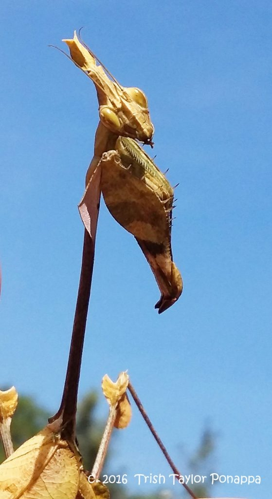
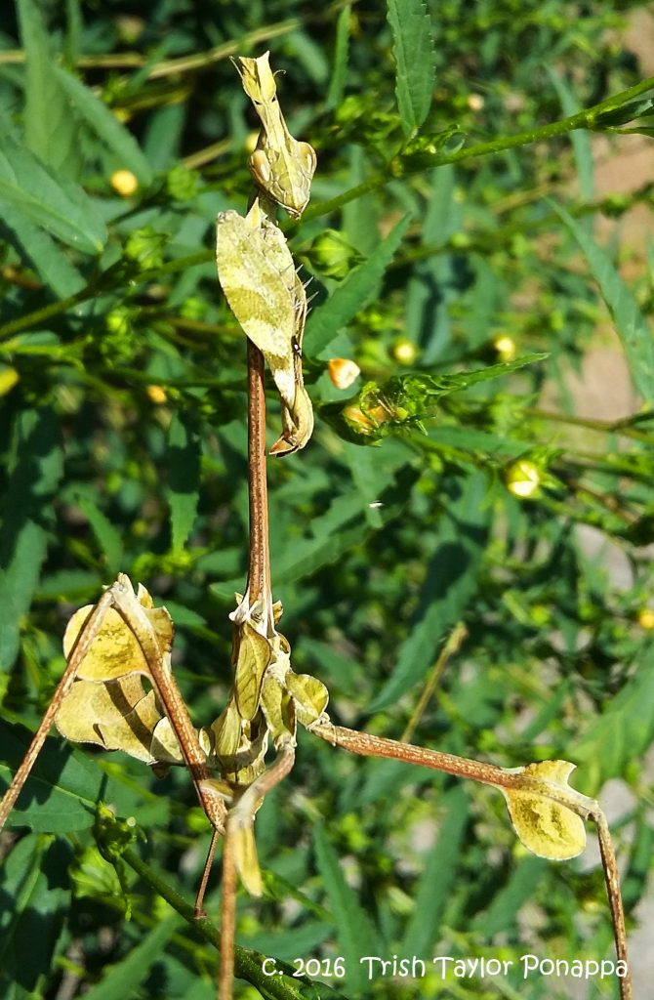
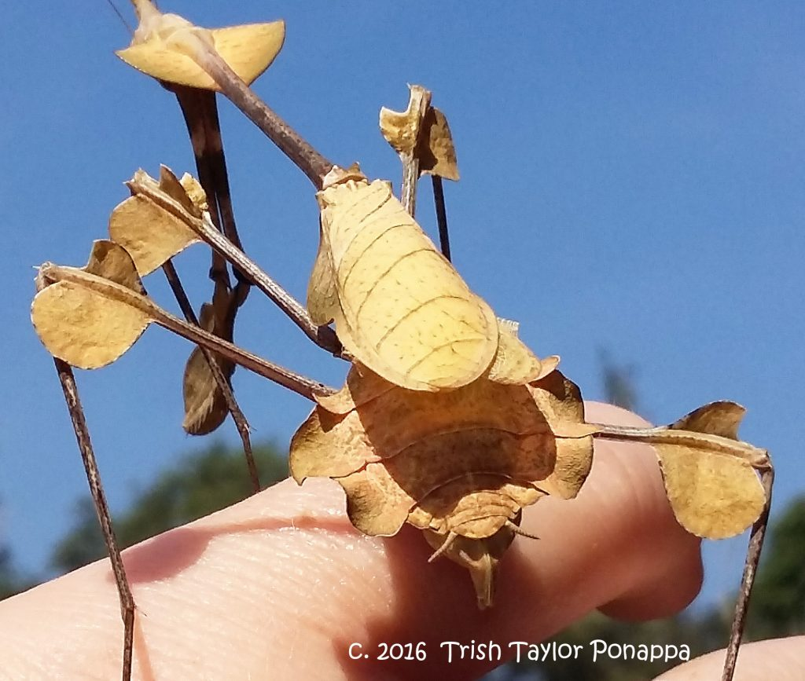
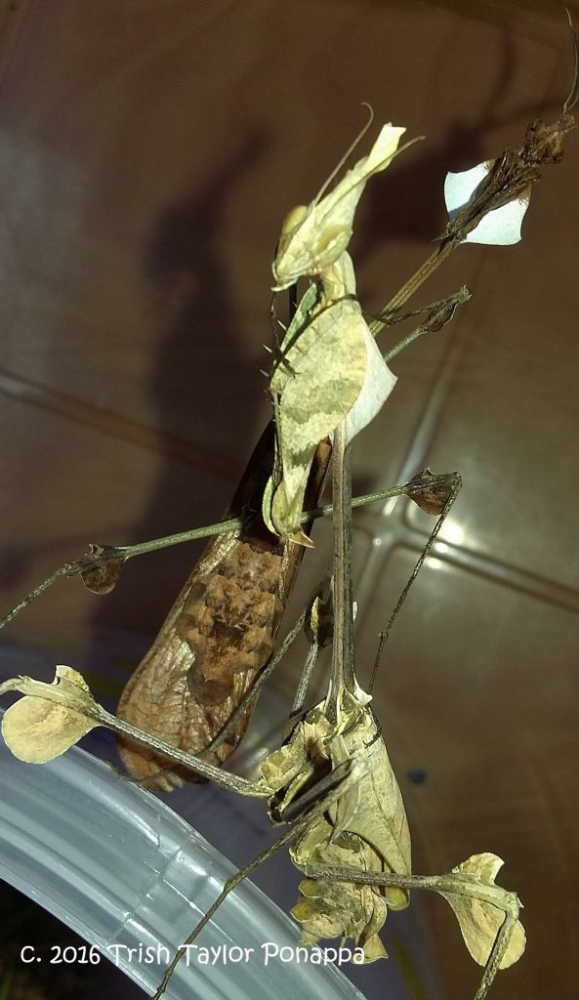
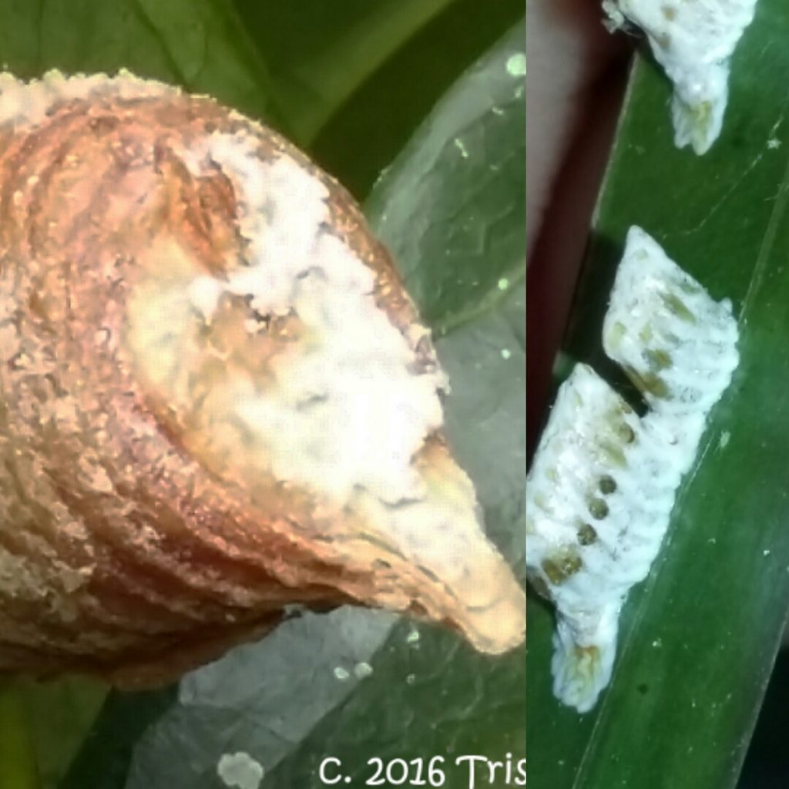
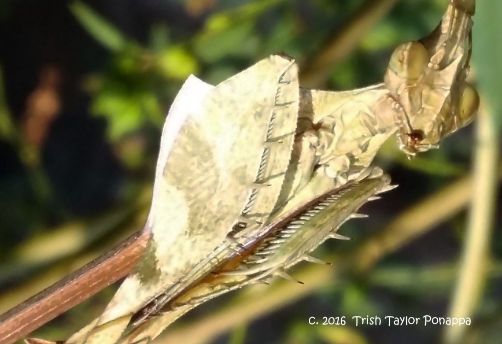
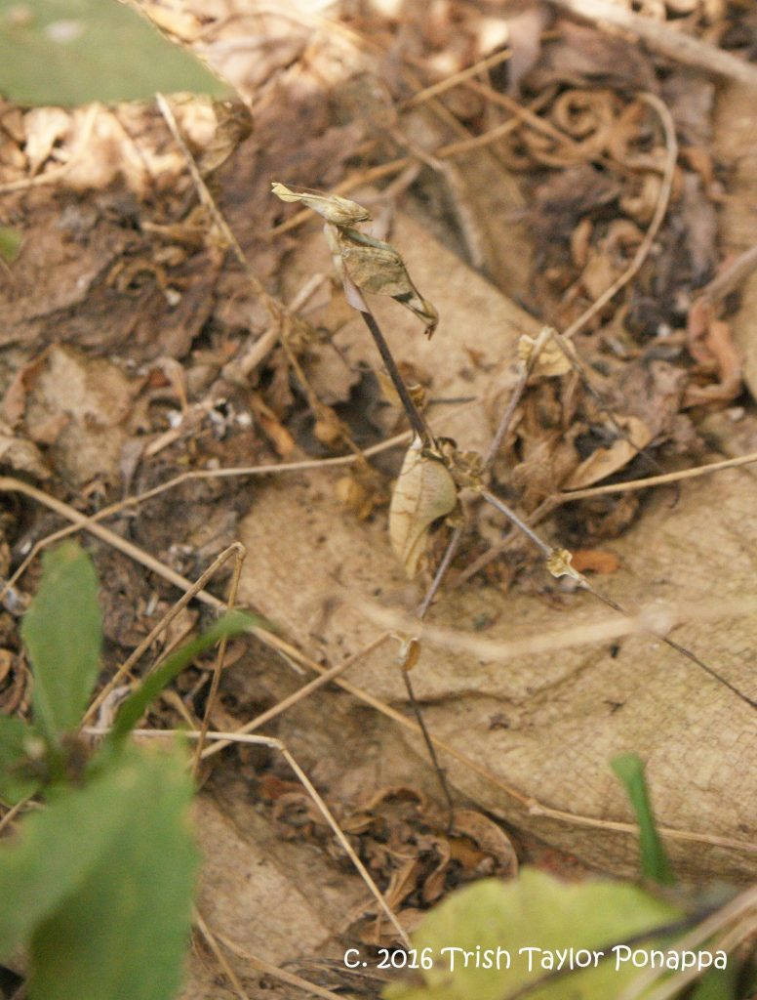
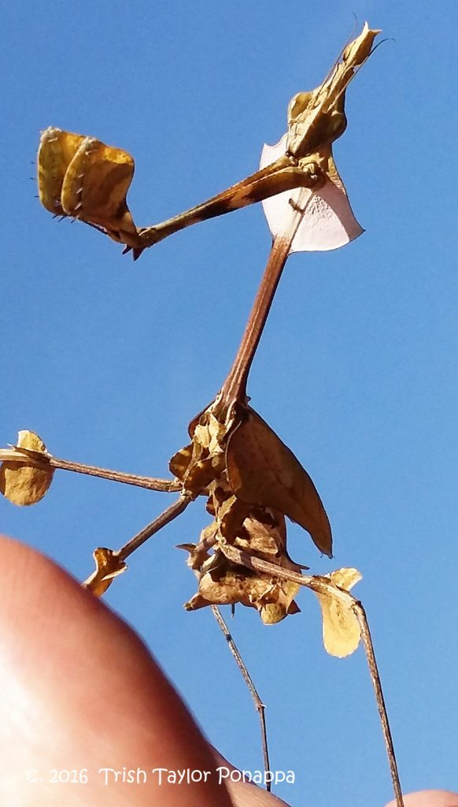
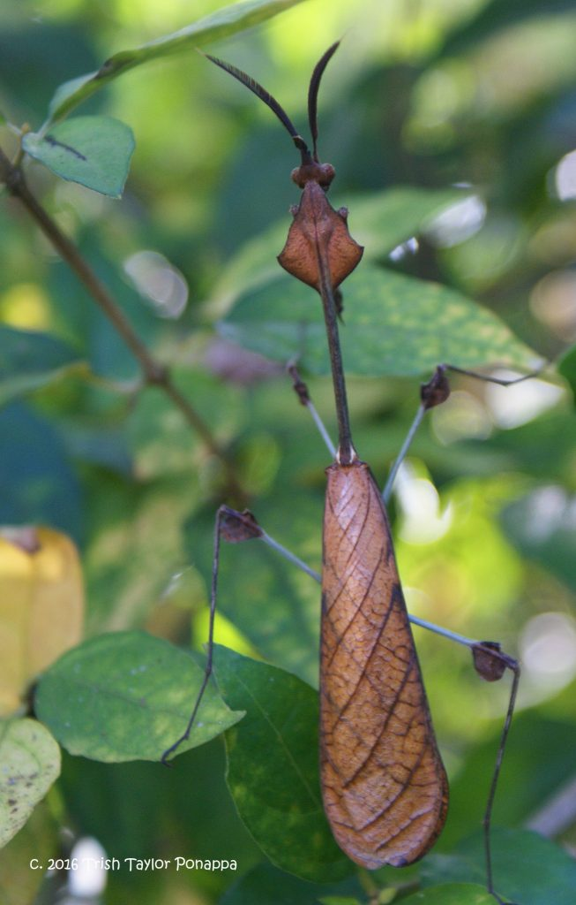
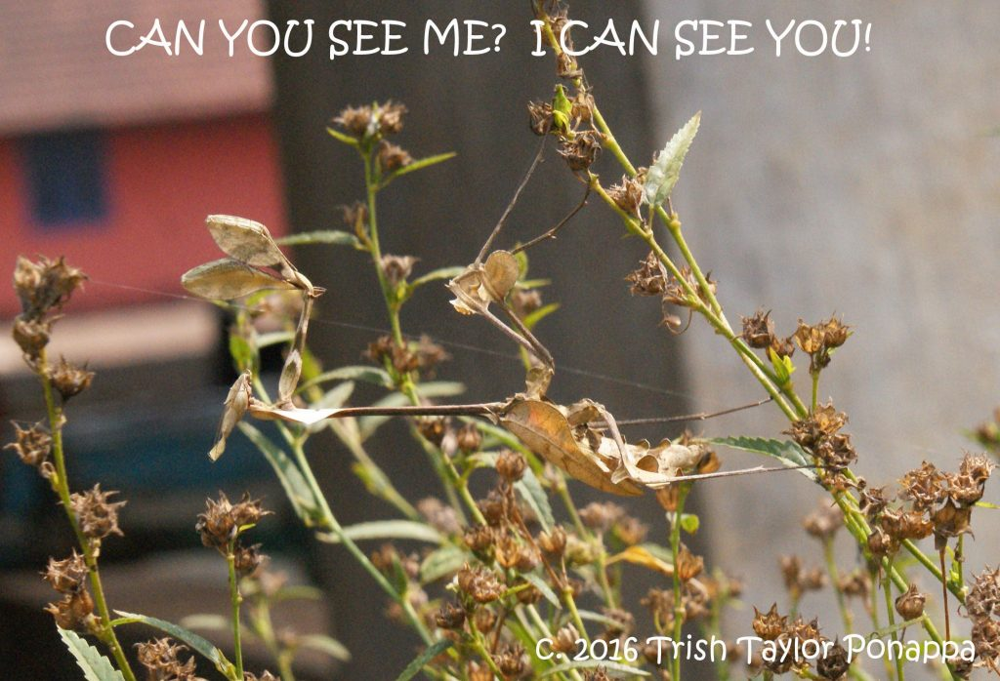

Every day, planters and employees walk among the various coffee bushes, shade trees, and other wild plants that grow within an eco-friendly coffee estate.  Thousands (probably) of small creatures live and exist in all these bushes, trees and plants, and go unnoticed by the average person and large animal every single day.  Behavior and natural camouflage aid these small fauna in remaining undetected so that they can live, hunt, hide and reproduce, in their natural environment.

The **Wandering Violin Mantis** is one of these creatures.   They are endemic to Southern India and Sri Lanka, and are also known as Indian Rose Mantis, Dead Leaf Mantis and Ornate Mantis.  Their scientific name is *Gongylus gongylodes* (Linnaeus, 1758), belonging to the order, Mantodea, and family, Empusidae.  They were thought to resemble a violin with their wide abdomen and long skinny neck.

So well camouflaged, one must consider themselves extremely lucky if they spot a Wandering Violin among the vegetation they blend into.  I found this female (pictured), in a clump of broomstick bushes directly beside the coffee pulping house, and run-off tanks.

As they feed exclusively on flying insects, this mantid tends to reside in places that attract their prey—decomposing coffee pulp is definitely a draw for flies, and therefore, a perfect habitat for them.  They “sit and wait” for something to fly by and, sometimes grab right out of the air;, or they wait for an insect to land near them (not noticing the predator’s camouflage), and snatch them up.  They are easily intimidated, and do not like confrontation–they avoid pursuing insects that are considered too large to be easily abducted.

The females are quite large (as you can see from the photo of her sitting on my hand), and are wingless.  The males are slightly smaller, have wings capable of flight, and feathered antenna.  The males and females find each other by transmitting pheromones, detected in the air by their antenna.  They mate for two weeks, and the females produce compartmentalized egg casings, called **ootheca**, that contain 30-40 eggs in each “ooth”, which develop into nymphs after 4-7 weeks.  The egg casings are bone-coloured, spiked and have a white powdery substance covering the surface.  The nymphs emerge looking very much like miniature versions of the adults.

These mantids are so gentle and non-aggressive that they are often bred as pets in the U.S. and elsewhere, which I discovered after posting pictures of this Violin Mantis on an international *facebook* insect group.  Another reason they make good “pets” is, unlike other mantis species, the males and females can live together in harmony, without the practice of cannibalism.  Because these mantids are accustomed to a very specific climate, it is extremely important for “pet owners” who live in temperate or colder climates to maintain the correct temperature and humidity for them to thrive.

With regards to this particular female Violin Mantis, I first saw her several months ago, and of course I was elated.  It was a windy day, and I noticed that to further imitate the movement of a dead leaf, she actually swayed her body back and forth with the rhythm of the wind gusts.  I periodically check on her, but I don’t always find her.   There is a lot of activity and construction going on in the area where she has made her home, unfortunately.  In addition, the surrounding bushes were being cut and made into broomsticks for use during the upcoming coffee harvest season.  But, she and her clump of bushes have been given sanctuary and protection.  I look forward to another generation of these magnificent creatures—they are South India’s exclusive wonder.

### About the Author

**Trish Taylor Ponappa** is an American residing in Kodagu District for the last 17 years.  She came with her husband, Dr. Tilak Ponappa, who returned to Kodagu to manage his family’s coffee estate.  She is an artist holding a Bachelor of Fine Arts, and has always loved animals of every size.  Trish is currently involved in documenting (and painting) the wide array of arthropods that she sees every day within the coffee estate.

### References

Anand T Pereira and Geeta N Pereira. 2009. Shade Grown Ecofriendly Indian Coffee. Volume-1.

[Wandering Violin Mantis](http://www.keepinginsects.com/praying-mantis/species/wandering-violin-mantis/)

[Indian rose mantis,](https://en.wikipedia.org/wiki/Gongylus_gongylodes)

(Information has been compiled from personal observations, members of *facebook* insect groups, and Wikipedia.)